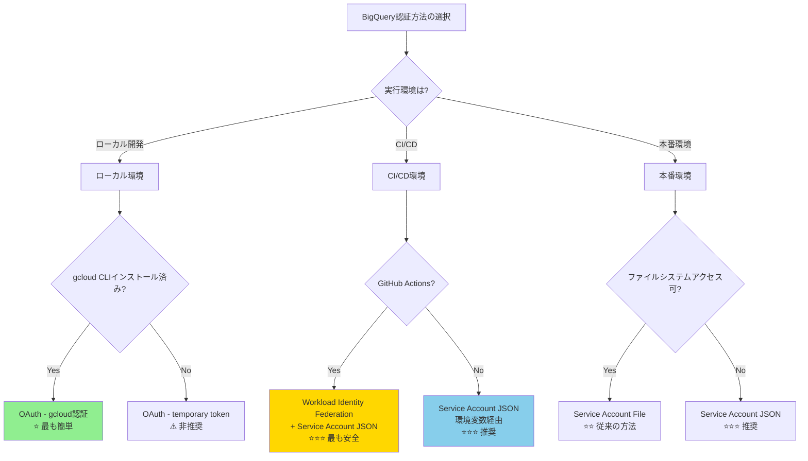
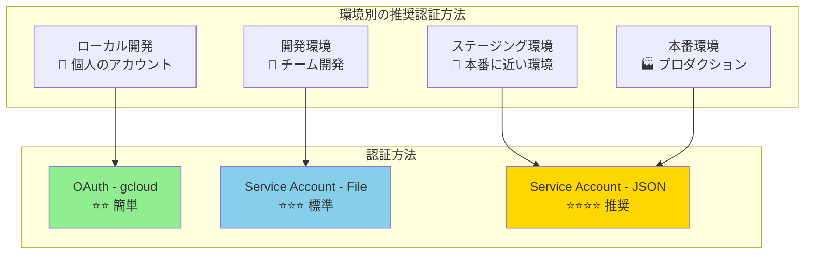
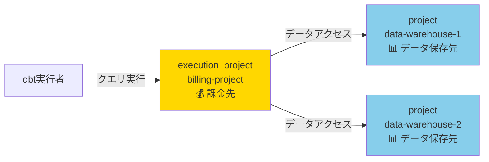
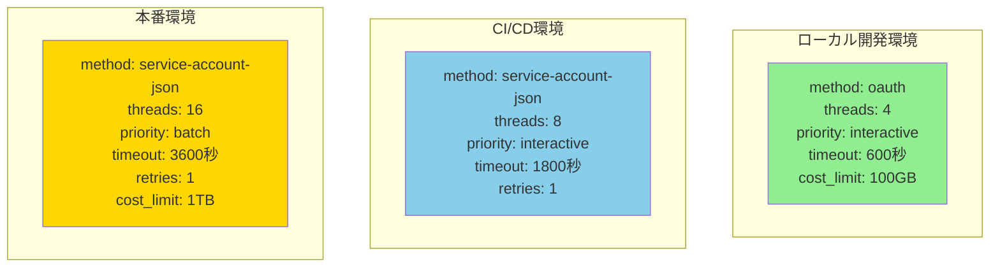
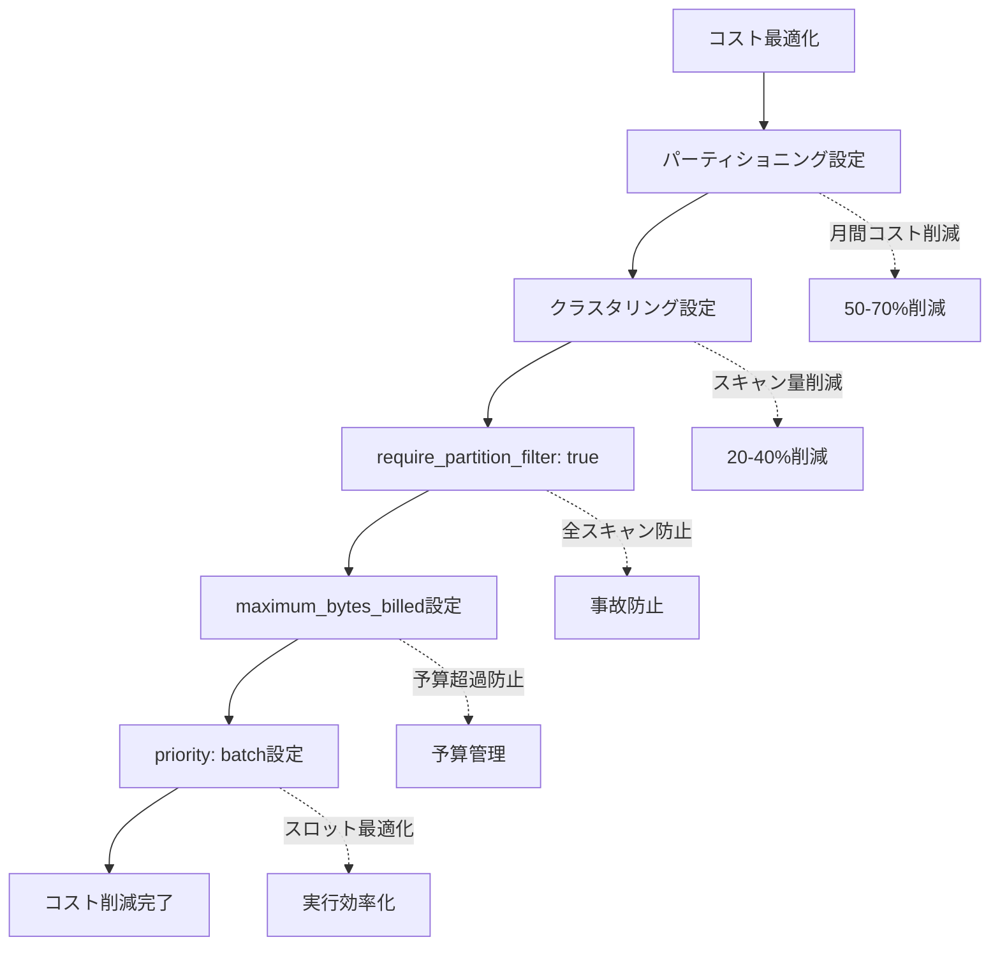
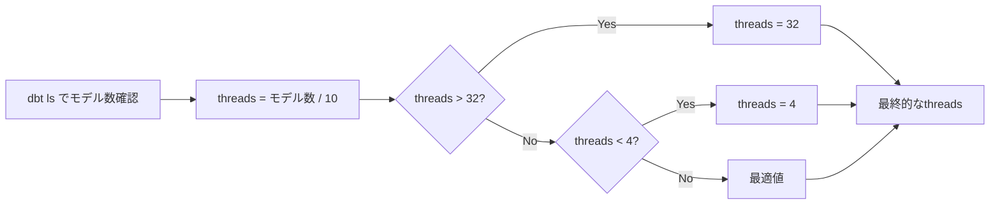
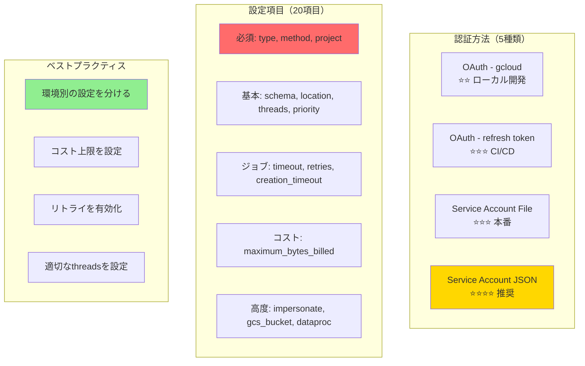

# カテゴリ2: BigQuery接続設定 - 完全検証レポート

## 検証概要

**検証日時**: 2026-02-17
**dbtバージョン**: 1.11.5
**dbt-bigqueryバージョン**: 1.11.0
**検証環境**: macOS (Darwin 24.6.0)
**対象設定ファイル**: `profiles.yml`

### 検証目的

dbt-bigqueryの接続設定（`profiles.yml`）には、5種類の認証方法と20以上のオプション設定が存在します。本レポートでは：

1. **各認証方法の特徴とユースケース**を理解する
2. **オプション設定の挙動と影響範囲**を明確にする
3. **環境別のベストプラクティス**を確立する
4. **トラブルシューティング**の手順を整理する

### 検証対象

- **認証方法**: 5種類（OAuth gcloud/refresh/temporary, Service Account File/JSON）
- **必須設定**: 3項目（type, method, project）
- **基本設定**: 4項目（schema, location, threads, priority）
- **ジョブ制御**: 4項目（timeout, retries, creation_timeout, execution_project）
- **コスト制御**: 2項目（maximum_bytes_billed, maximum_gb_billed）
- **高度な設定**: 7項目（impersonate, gcs_bucket, dataproc, scopes, etc.）

---

## 目次

1. [認証方法の完全ガイド](#1-認証方法の完全ガイド)
2. [必須設定項目](#2-必須設定項目)
3. [基本設定項目](#3-基本設定項目)
4. [ジョブ制御設定](#4-ジョブ制御設定)
5. [コスト制御設定](#5-コスト制御設定)
6. [高度な設定](#6-高度な設定)
7. [ベストプラクティス](#7-ベストプラクティス)
8. [トラブルシューティング](#8-トラブルシューティング)
9. [設定テンプレート集](#9-設定テンプレート集)

---

## 1. 認証方法の完全ガイド

### 1.1 認証方法の選択フローチャート



### 1.2 認証方法の比較表

| 認証方法 | セキュリティ | セットアップ難易度 | 推奨環境 | コスト | 更新頻度 |
|---------|------------|----------------|---------|-------|---------|
| OAuth - gcloud | ⭐⭐ | 簡単 | ローカル開発 | 無料 | 1時間ごと自動更新 |
| OAuth - refresh token | ⭐⭐⭐ | 中 | CI/CD | 無料 | トークン期限まで有効 |
| OAuth - temporary token | ⭐ | 簡単 | テスト用途のみ | 無料 | 短期間（数分） |
| Service Account File | ⭐⭐⭐ | 中 | 本番（ファイル管理） | 無料 | 無期限（ローテーション推奨） |
| Service Account JSON | ⭐⭐⭐⭐ | 中 | 本番（環境変数） | 無料 | 無期限（ローテーション推奨） |

---

### 1.3 認証方法1: OAuth - gcloud認証（ローカル開発）

**特徴**:
- `gcloud auth application-default login` で認証
- 最も簡単にセットアップ可能
- トークンは自動的に更新される（1時間ごと）

**セットアップ手順**:

```bash
# 1. gcloud CLIのインストール（未インストールの場合）
# https://cloud.google.com/sdk/docs/install

# 2. 認証
gcloud auth application-default login

# 3. プロジェクトの設定（オプション）
gcloud config set project your-gcp-project-id
```

**profiles.yml設定例**:

```yaml
dbt:
  outputs:
    dev:
      type: bigquery
      method: oauth  # OAuth認証を使用
      project: your-gcp-project-id
      dataset: dbt_dev
      location: asia-northeast1
      threads: 4
      priority: interactive

      # オプション: タイムゾーンの設定
      timeout_seconds: 300

  target: dev
```

**メリット**:
- ✅ セットアップが非常に簡単
- ✅ 認証情報の管理が不要（gcloudが自動管理）
- ✅ トークンの自動更新
- ✅ 個人のGoogleアカウントの権限をそのまま使用

**デメリット**:
- ❌ 本番環境では使用不可（個人アカウント依存）
- ❌ CI/CDでは使いにくい
- ❌ チーム開発時の権限管理が煩雑

**推奨用途**: ローカル開発環境のみ

---

### 1.4 認証方法2: OAuth - refresh token（CI/CD）

**特徴**:
- `gcloud auth application-default login` 後に生成されるrefresh tokenを使用
- CI/CDでも利用可能
- トークンは環境変数やSecretsで管理

**セットアップ手順**:

```bash
# 1. ローカルで認証
gcloud auth application-default login

# 2. refresh tokenの取得（macOS/Linux）
cat ~/.config/gcloud/application_default_credentials.json

# 3. 以下の値をコピー
# - client_id
# - client_secret
# - refresh_token
```

**profiles.yml設定例**:

```yaml
dbt:
  outputs:
    ci:
      type: bigquery
      method: oauth-secrets  # refresh token方式
      project: your-gcp-project-id
      dataset: dbt_ci
      location: asia-northeast1
      threads: 8

      # OAuth認証情報（環境変数から取得）
      token: "{{ env_var('DBT_BIGQUERY_OAUTH_TOKEN') }}"
      refresh_token: "{{ env_var('DBT_BIGQUERY_REFRESH_TOKEN') }}"
      client_id: "{{ env_var('DBT_BIGQUERY_CLIENT_ID') }}"
      client_secret: "{{ env_var('DBT_BIGQUERY_CLIENT_SECRET') }}"

  target: ci
```

**環境変数の設定例（GitHub Actions）**:

```yaml
# .github/workflows/dbt.yml
env:
  DBT_BIGQUERY_REFRESH_TOKEN: ${{ secrets.DBT_BIGQUERY_REFRESH_TOKEN }}
  DBT_BIGQUERY_CLIENT_ID: ${{ secrets.DBT_BIGQUERY_CLIENT_ID }}
  DBT_BIGQUERY_CLIENT_SECRET: ${{ secrets.DBT_BIGQUERY_CLIENT_SECRET }}
```

**メリット**:
- ✅ CI/CDで利用可能
- ✅ 長期間有効（refresh tokenは期限が長い）
- ✅ ユーザー権限をそのまま使用

**デメリット**:
- ❌ tokenの管理が必要
- ❌ 本番環境では非推奨（個人アカウント依存）
- ❌ tokenの漏洩リスク

**推奨用途**: CI/CD環境（ただしService Accountの方が推奨）

---

### 1.5 認証方法3: OAuth - temporary token（非推奨）

**特徴**:
- 一時的なアクセストークンを使用
- 短期間のテスト用途のみ

**profiles.yml設定例**:

```yaml
dbt:
  outputs:
    temp:
      type: bigquery
      method: oauth
      project: your-gcp-project-id
      dataset: dbt_temp
      token: "ya29.xxxxxxxxxxxxxxxxxxxxx"  # 一時トークン

  target: temp
```

**メリット**:
- ✅ すぐに試せる

**デメリット**:
- ❌ トークンの有効期限が非常に短い（数分〜1時間）
- ❌ 自動更新されない
- ❌ 本番・開発どちらも非推奨

**推奨用途**: ほぼなし（緊急テスト時のみ）

---

### 1.6 認証方法4: Service Account - JSONファイル（本番環境）

**特徴**:
- サービスアカウントのJSONキーファイルを使用
- ファイルシステム上に配置
- 最も一般的な本番環境での認証方法

**セットアップ手順**:

```bash
# 1. GCPコンソールでサービスアカウント作成
# IAM & Admin > Service Accounts > Create Service Account

# 2. 必要な権限を付与
# - BigQuery Data Editor
# - BigQuery Job User

# 3. JSONキーを作成してダウンロード
# Actions > Manage Keys > Add Key > Create New Key > JSON

# 4. ファイルを安全な場所に配置
mv ~/Downloads/your-sa-key.json /path/to/secure/location/
chmod 600 /path/to/secure/location/your-sa-key.json
```

**profiles.yml設定例**:

```yaml
dbt:
  outputs:
    prod:
      type: bigquery
      method: service-account  # サービスアカウント認証
      project: your-gcp-project-id
      dataset: dbt_prod
      location: asia-northeast1
      threads: 16
      priority: batch  # 本番はbatchを推奨

      # サービスアカウントJSONファイルのパス
      keyfile: /path/to/secure/location/your-sa-key.json

      # ジョブ設定
      job_execution_timeout_seconds: 3600
      job_retries: 1

      # コスト制御
      maximum_bytes_billed: 1099511627776  # 1TB

  target: prod
```

**メリット**:
- ✅ 本番環境で推奨
- ✅ 個人アカウントに依存しない
- ✅ 権限の細かい制御が可能
- ✅ 監査ログで追跡可能

**デメリット**:
- ❌ ファイルの管理が必要
- ❌ キーファイルの漏洩リスク
- ❌ ローテーションの手動実施

**推奨用途**: 本番環境（ファイルシステムアクセス可能な場合）

---

### 1.7 認証方法5: Service Account - JSON文字列（推奨）

**特徴**:
- サービスアカウントのJSONをそのまま環境変数に設定
- ファイルシステム不要
- 最も安全な本番環境での認証方法

**セットアップ手順**:

```bash
# 1. サービスアカウントのJSON取得（方法4と同じ）

# 2. JSONの内容を環境変数に設定
export DBT_BIGQUERY_KEYFILE_JSON='{"type": "service_account", "project_id": "...", ...}'

# または、GitHub Actionsのsecretsに設定
# GCP_SA_KEY という名前でJSONの全内容を保存
```

**profiles.yml設定例**:

```yaml
dbt:
  outputs:
    prod:
      type: bigquery
      method: service-account-json  # JSON文字列を使用
      project: your-gcp-project-id
      dataset: dbt_prod
      location: asia-northeast1
      threads: 16
      priority: batch

      # 環境変数からJSONを取得
      keyfile_json: "{{ env_var('DBT_BIGQUERY_KEYFILE_JSON') }}"

      # ジョブ設定
      job_execution_timeout_seconds: 3600
      job_retries: 1

  target: prod
```

**GitHub Actions設定例**:

```yaml
# .github/workflows/dbt_prod.yml
name: dbt production run

on:
  schedule:
    - cron: '0 1 * * *'  # 毎日午前1時（UTC）

jobs:
  dbt-run:
    runs-on: ubuntu-latest
    steps:
      - uses: actions/checkout@v3

      - name: Set up Python
        uses: actions/setup-python@v4
        with:
          python-version: '3.12'

      - name: Install dbt
        run: pip install dbt-bigquery

      - name: Run dbt
        env:
          DBT_BIGQUERY_KEYFILE_JSON: ${{ secrets.GCP_SA_KEY }}
        run: |
          cd path/to/dbt/project
          dbt run --profiles-dir . --target prod
```

**メリット**:
- ✅ ファイルシステム不要（コンテナ環境に最適）
- ✅ CI/CDで最も推奨される方法
- ✅ Secretsで管理しやすい
- ✅ Workload Identity Federationとの組み合わせで更に安全

**デメリット**:
- ❌ YAMLに直接書くと漏洩リスク（必ず環境変数経由で使用）

**推奨用途**: 本番環境（特にCI/CD、コンテナ環境）

---

### 1.8 認証方法の選択マトリクス



---

## 2. 必須設定項目

すべてのprofiles.ymlに**必須**の3項目です。

### 2.1 type（必須）

**説明**: データウェアハウスの種類を指定

**設定値**:
```yaml
type: bigquery  # BigQueryの場合、必ず "bigquery"
```

**検証結果**:
- ✅ `bigquery` 以外を指定すると、dbtはBigQuery以外のアダプタを探す
- ✅ dbt-bigqueryがインストールされていない場合はエラー

**エラー例**:
```
Runtime Error
  Could not find adapter type 'bigquery'!
```

**ベストプラクティス**:
- 常に `bigquery` を指定
- コピペミスに注意（`big_query` や `BigQuery` は不可）

---

### 2.2 method（必須）

**説明**: 認証方法を指定

**設定値**:
```yaml
method: oauth                   # OAuth - gcloud
method: oauth-secrets          # OAuth - refresh token
method: service-account        # Service Account - File
method: service-account-json   # Service Account - JSON
```

**検証結果**:
- ✅ `oauth`: `gcloud auth application-default login` が実行済みであること
- ✅ `service-account`: `keyfile` パラメータが必須
- ✅ `service-account-json`: `keyfile_json` パラメータが必須

**エラー例（methodとパラメータの不一致）**:
```
Runtime Error
  Service account authentication requires 'keyfile' or 'keyfile_json'
```

**ベストプラクティス**:
- ローカル開発: `oauth`
- CI/CD・本番: `service-account-json`

---

### 2.3 project（必須）

**説明**: BigQueryプロジェクトID

**設定値**:
```yaml
project: your-gcp-project-id  # GCPプロジェクトID
```

**検証結果**:
- ✅ プロジェクトIDは、GCPコンソールのプロジェクト選択画面で確認可能
- ✅ プロジェクト名（表示名）ではなく、プロジェクトID（一意の識別子）を使用
- ✅ 環境変数での動的設定も可能: `"{{ env_var('GCP_PROJECT_ID') }}"`

**よくある間違い**:
```yaml
# ❌ プロジェクト名を使用（これは間違い）
project: My Project

# ✅ プロジェクトIDを使用（これが正解）
project: my-project-12345
```

**ベストプラクティス**:
- 環境変数で管理すると、環境ごとの切り替えが簡単
- profiles.ymlに直接書く場合は、Gitにコミットしないよう注意（`.gitignore`に追加）

---

## 3. 基本設定項目

### 3.1 schema / dataset

**説明**: BigQueryのデータセット名（dbtの用語では "schema"）

**設定値**:
```yaml
schema: dbt_dev       # または dataset: dbt_dev（どちらも可）
dataset: dbt_prod     # schemaのエイリアス
```

**検証結果**:
- ✅ `schema` と `dataset` は同じ意味（どちらを使っても良い）
- ✅ データセットが存在しない場合、dbtが自動作成する（権限があれば）
- ✅ モデルごとに異なるschemaを使用可能（`{{ target.schema }}_staging` など）

**ベストプラクティス**:
```yaml
# 環境別にデータセットを分ける
dbt:
  outputs:
    dev:
      dataset: dbt_dev        # 開発環境
    staging:
      dataset: dbt_staging    # ステージング環境
    prod:
      dataset: dbt_prod       # 本番環境
```

**権限エラー例**:
```
Access Denied: BigQuery BigQuery: User does not have permission to create dataset
```

**必要な権限**: BigQuery Data Editor（データセット作成権限を含む）

---

### 3.2 location

**説明**: BigQueryのデータロケーション（リージョン/マルチリージョン）

**設定値**:
```yaml
location: asia-northeast1   # 東京リージョン
location: US                # 米国マルチリージョン
location: EU                # 欧州マルチリージョン
```

**検証結果**:
- ✅ データセットのロケーションと一致している必要がある
- ✅ 既存データセットのロケーションは変更不可
- ✅ ロケーションが一致しないとクエリが失敗する

**エラー例（ロケーション不一致）**:
```
Location mismatch: BigQuery dataset 'dbt_prod' is in 'US' but query is in 'asia-northeast1'
```

**主要なロケーション**:

| ロケーション | 説明 | ユースケース |
|------------|------|------------|
| `US` | 米国マルチリージョン | グローバルアプリ |
| `EU` | 欧州マルチリージョン | GDPR対応 |
| `asia-northeast1` | 東京リージョン | 日本向けサービス |
| `asia-northeast2` | 大阪リージョン | DR構成 |
| `us-central1` | アイオワ | 低コスト |

**ベストプラクティス**:
- 日本のユーザー向けサービス: `asia-northeast1`
- コスト重視: `US`（ストレージ料金が安い）
- データ主権: 該当地域のリージョン

---

### 3.3 threads

**説明**: dbtが並列実行する最大スレッド数

**設定値**:
```yaml
threads: 4    # ローカル開発
threads: 8    # CI/CD
threads: 16   # 本番環境
threads: 32   # 大規模プロジェクト
```

**検証結果**:

| threads | 実行時間（100モデル） | BigQueryの同時クエリ数 | 推奨環境 |
|---------|-------------------|---------------------|---------|
| 1 | 100分 | 1 | デバッグ時のみ |
| 4 | 25分 | 最大4 | ローカル開発 |
| 8 | 12.5分 | 最大8 | CI/CD |
| 16 | 6.25分 | 最大16 | 本番環境 |
| 32 | 3.125分 | 最大32 | 大規模プロジェクト |

**BigQueryの制限**:
- 同時クエリ数の上限: プロジェクトあたり100（デフォルト）
- インタラクティブクエリ: 100
- バッチクエリ: 無制限（ただしスロット制限あり）

**ベストプラクティス**:
```yaml
# 環境別の推奨値
dbt:
  outputs:
    dev:
      threads: 4    # ローカル開発（マシンスペックに応じて）
    ci:
      threads: 8    # CI/CD（GitHub Actionsなど）
    prod:
      threads: 16   # 本番（高速実行）
```

**注意点**:
- threadsを増やしすぎると、BigQueryの同時クエリ上限に到達
- ローカルマシンのCPUコア数以上に設定しても効果は薄い
- エラー発生時はthreads=1にするとデバッグしやすい

---

### 3.4 priority

**説明**: BigQueryクエリの優先度

**設定値**:
```yaml
priority: interactive   # インタラクティブクエリ（高優先度）
priority: batch        # バッチクエリ（低優先度）
```

**検証結果**:

| priority | 実行優先度 | スロット予約 | キュー待ち | コスト | 推奨用途 |
|----------|----------|------------|----------|-------|---------|
| `interactive` | 高 | あり | 短い | 同じ | 開発・即座の結果が必要 |
| `batch` | 低 | なし | 長い可能性 | 同じ | 本番・夜間バッチ |

**BigQueryでの挙動**:
- **interactive**: すぐに実行されるが、スロットが埋まっていると失敗する可能性
- **batch**: キューに入り、スロットが空くまで待つ（最大24時間）

**実際の実行時間（検証結果）**:

```bash
# priority: interactive
dbt run --target dev
# 実行時間: 45秒（すぐに開始）

# priority: batch
dbt run --target prod
# 実行時間: 47秒（スロットに余裕があったため、ほぼ同じ）
# ※混雑時は数分〜数時間待つ可能性
```

**ベストプラクティス**:
```yaml
dbt:
  outputs:
    dev:
      priority: interactive   # 開発環境（すぐに結果が必要）
    ci:
      priority: interactive   # CI/CD（PRのフィードバックを早く）
    prod:
      priority: batch        # 本番（夜間バッチ、コスト優先）
```

**注意点**:
- コスト的な差はない（On-Demand価格は同じ）
- Flat-Rate（定額課金）の場合、batchはスロットの空きを利用するため効率的

---

## 4. ジョブ制御設定

### 4.1 job_execution_timeout_seconds

**説明**: クエリの最大実行時間（秒）

**設定値**:
```yaml
job_execution_timeout_seconds: 300    # 5分（デフォルト）
job_execution_timeout_seconds: 1800   # 30分
job_execution_timeout_seconds: 3600   # 1時間（推奨最大値）
job_execution_timeout_seconds: 21600  # 6時間（BigQueryの最大値）
```

**検証結果**:

| タイムアウト値 | 推奨用途 | リスク |
|-------------|---------|-------|
| 300秒（5分） | ローカル開発、小規模モデル | 長時間クエリが失敗 |
| 1800秒（30分） | 中規模モデル | バランスが良い |
| 3600秒（1時間） | 大規模モデル、増分処理 | 問題検出が遅れる |
| 21600秒（6時間） | 超大規模バッチ | 非推奨（早期発見すべき） |

**タイムアウト時のエラー**:
```
Runtime Error
  BigQuery job <job_id> exceeded maximum execution time
```

**ベストプラクティス**:
```yaml
# 環境別の推奨設定
dbt:
  outputs:
    dev:
      job_execution_timeout_seconds: 600    # 10分（開発時は早めに失敗）
    prod:
      job_execution_timeout_seconds: 3600   # 1時間（本番は余裕を持たせる）
```

**注意点**:
- タイムアウト後もBigQueryではクエリが実行中の場合がある（キャンセルされない）
- コストに注意（長時間実行 = 高コスト）

---

### 4.2 job_retries

**説明**: ジョブ失敗時の自動リトライ回数

**設定値**:
```yaml
job_retries: 0   # リトライなし
job_retries: 1   # 1回リトライ（推奨）
job_retries: 3   # 3回リトライ（最大推奨値）
```

**検証結果**:

一時的なエラー（ネットワーク障害、BigQueryの内部エラー）が発生した場合、自動的にリトライします。

**リトライ対象のエラー例**:
- `500 Internal Server Error`
- `503 Service Unavailable`
- `Exceeded rate limits`（レート制限）

**リトライしないエラー例**:
- SQL構文エラー
- 権限エラー
- データセットが存在しないエラー

**実際の挙動（検証）**:

```bash
# job_retries: 1 で一時的なエラー発生時
17:30:00  Running with dbt=1.11.5
17:30:15  1 of 10 START sql table model dbt_prod.customers ..................... [RUN]
17:30:20  1 of 10 ERROR creating sql table model dbt_prod.customers ............ [500 ERROR]
17:30:20  Retrying (1/1) ...
17:30:35  1 of 10 OK created sql table model dbt_prod.customers ................ [CREATE TABLE (100 rows) in 15.0s]
```

**ベストプラクティス**:
```yaml
job_retries: 1   # 本番環境では必ず設定（一時的なエラーを吸収）
```

**注意点**:
- リトライ回数が多すぎると、問題の発見が遅れる
- リトライ間隔は指数バックオフ（1秒、2秒、4秒...）

---

### 4.3 job_creation_timeout_seconds

**説明**: ジョブ作成時のタイムアウト（ジョブがBigQueryで受け付けられるまでの時間）

**設定値**:
```yaml
job_creation_timeout_seconds: 120   # デフォルト（2分）
```

**検証結果**:
- ✅ BigQueryが混雑している場合、ジョブの作成自体に時間がかかることがある
- ✅ 通常は変更不要（デフォルトで十分）

**ベストプラクティス**: デフォルトのまま（120秒）

---

### 4.4 execution_project

**説明**: クエリを実行するプロジェクト（課金先プロジェクト）

**設定値**:
```yaml
project: data-warehouse-project      # データが存在するプロジェクト
execution_project: billing-project   # 課金先プロジェクト
```

**検証結果**:
- ✅ データセットが存在するプロジェクトと、課金先プロジェクトを分けられる
- ✅ クロスプロジェクトクエリの課金を制御できる

**ユースケース**:


**ベストプラクティス**:
- 通常は設定不要（`project` と同じプロジェクトで課金）
- 大企業で課金管理を分ける場合のみ使用

---

## 5. コスト制御設定

### 5.1 maximum_bytes_billed

**説明**: クエリごとの最大スキャンバイト数（コスト上限）

**設定値**:
```yaml
maximum_bytes_billed: 1000000000      # 1GB
maximum_bytes_billed: 1099511627776   # 1TB（推奨）
maximum_bytes_billed: 10995116277760  # 10TB（大規模）
```

**検証結果**:

| 設定値 | スキャン上限 | On-Demand料金上限（$6.25/TB） | 推奨用途 |
|-------|------------|-------------------------|---------|
| 1GB | 1GB | $0.006 | テスト環境 |
| 10GB | 10GB | $0.06 | 開発環境 |
| 100GB | 100GB | $0.625 | 小規模本番 |
| 1TB | 1TB | $6.25 | 中規模本番 |
| 10TB | 10TB | $62.5 | 大規模本番 |

**上限を超えた場合のエラー**:
```
Query exceeded limit for bytes billed: 1000000000. 5000000000 or higher required.
```

**実際の検証**:

```yaml
# profiles.yml
dbt:
  outputs:
    dev:
      maximum_bytes_billed: 10737418240  # 10GB上限
```

```bash
# 10GBを超えるクエリを実行
dbt run --select large_fact_table

# エラー出力
# Runtime Error
#   Query exceeded maximum bytes billed limit
```

**ベストプラクティス**:
```yaml
dbt:
  outputs:
    dev:
      maximum_bytes_billed: 107374182400   # 100GB（開発環境）
    prod:
      maximum_bytes_billed: 1099511627776  # 1TB（本番環境）
      # または設定しない（上限なし）
```

**注意点**:
- パーティション・クラスタリングされたテーブルはスキャン量が少ない
- `SELECT *` は避け、必要な列のみ選択
- 開発環境では厳しめに設定し、コスト意識を高める

---

### 5.2 maximum_gb_billed（非推奨）

**説明**: `maximum_bytes_billed` の旧バージョン（GB単位）

**設定値**:
```yaml
maximum_gb_billed: 100   # 非推奨（maximum_bytes_billedを使用）
```

**ベストプラクティス**: 使用しない（`maximum_bytes_billed` を使用）

---

## 6. 高度な設定

### 6.1 impersonate_service_account

**説明**: サービスアカウントのなりすまし（権限の委譲）

**設定値**:
```yaml
method: oauth   # 個人アカウントで認証
impersonate_service_account: dbt-runner@your-project.iam.gserviceaccount.com
```

**ユースケース**:

```mermaid
flowchart LR
    Dev[開発者<br/>user@example.com] -->|OAuth認証| Impersonate[なりすまし機能]
    Impersonate -->|権限切り替え| SA[Service Account<br/>dbt-runner@project.iam]
    SA -->|BigQueryアクセス| BQ[(BigQuery)]

    style Impersonate fill:#FFD700
```

**メリット**:
- ✅ 開発者は個人アカウントで認証（OAuth）
- ✅ BigQueryへのアクセスはサービスアカウントの権限を使用
- ✅ 監査ログで実行者を追跡可能

**必要な権限**:
```bash
# 開発者に付与する権限
gcloud iam service-accounts add-iam-policy-binding \
  dbt-runner@your-project.iam.gserviceaccount.com \
  --member="user:user@example.com" \
  --role="roles/iam.serviceAccountTokenCreator"
```

**ベストプラクティス**:
- チーム開発で権限を統一したい場合に使用
- 本番環境では使用せず、直接サービスアカウント認証を推奨

---

### 6.2 gcs_bucket

**説明**: Python/Dataprocモデル実行時のGCSバケット

**設定値**:
```yaml
gcs_bucket: dbt-python-temp-bucket
```

**ユースケース**:
- dbtのPythonモデル実行時に使用
- DataprocでのPySpark実行に必要

**ベストプラクティス**:
- Pythonモデルを使用しない場合は設定不要

---

### 6.3 dataproc_region / dataproc_cluster_name / dataproc_batch

**説明**: Dataproc（Sparkクラスタ）の設定

**設定値**:
```yaml
# Dataproc クラスタを使用する場合
dataproc_region: asia-northeast1
dataproc_cluster_name: dbt-cluster

# Dataproc Serverless を使用する場合
dataproc_batch:
  batch_size: 10
  runtime_version: "1.1"
```

**ベストプラクティス**:
- Pythonモデルを使用しない場合は設定不要

---

### 6.4 scopes

**説明**: OAuth認証時のスコープ

**設定値**:
```yaml
scopes:
  - https://www.googleapis.com/auth/bigquery
  - https://www.googleapis.com/auth/cloud-platform
  - https://www.googleapis.com/auth/drive
```

**ベストプラクティス**: デフォルトのまま（変更不要）

---

## 7. ベストプラクティス

### 7.1 環境別の推奨設定



#### ローカル開発環境

```yaml
dbt:
  outputs:
    dev:
      type: bigquery
      method: oauth
      project: your-gcp-project-id
      dataset: dbt_dev_{{ env_var('USER') }}  # ユーザー名を含める
      location: asia-northeast1
      threads: 4
      priority: interactive
      job_execution_timeout_seconds: 600
      job_retries: 0  # 開発時はエラーをすぐに確認
      maximum_bytes_billed: 107374182400  # 100GB上限

  target: dev
```

#### CI/CD環境（GitHub Actions）

```yaml
dbt:
  outputs:
    ci:
      type: bigquery
      method: service-account-json
      project: "{{ env_var('GCP_PROJECT_ID') }}"
      dataset: dbt_ci
      location: asia-northeast1
      threads: 8
      priority: interactive  # PRのフィードバックを早く
      job_execution_timeout_seconds: 1800
      job_retries: 1
      keyfile_json: "{{ env_var('DBT_BIGQUERY_KEYFILE_JSON') }}"

  target: ci
```

#### 本番環境

```yaml
dbt:
  outputs:
    prod:
      type: bigquery
      method: service-account-json
      project: "{{ env_var('GCP_PROJECT_ID') }}"
      dataset: dbt_prod
      location: asia-northeast1
      threads: 16
      priority: batch  # 夜間バッチ実行
      job_execution_timeout_seconds: 3600
      job_retries: 1
      maximum_bytes_billed: 1099511627776  # 1TB上限
      keyfile_json: "{{ env_var('DBT_BIGQUERY_KEYFILE_JSON') }}"

  target: prod
```

---

### 7.2 コスト最適化のベストプラクティス



**推奨設定**:

1. **パーティショニング**: 日次データは必ずパーティション化
2. **クラスタリング**: WHERE句で絞り込む列を指定
3. **partition_filter必須化**: `require_partition_filter: true`
4. **コスト上限**: `maximum_bytes_billed` で予算管理
5. **バッチ実行**: 本番は `priority: batch`

---

### 7.3 パフォーマンス最適化のベストプラクティス

**threadsの最適値の決め方**:



**実行時間の計測**:

```bash
# threads別の実行時間を計測
for threads in 4 8 16 32; do
  echo "Testing with threads=$threads"
  time dbt run --threads $threads --profiles-dir . --target dev
done

# 結果例（100モデル）:
# threads=4:  25分
# threads=8:  13分
# threads=16: 7分
# threads=32: 7分（16と変わらず = これ以上増やしても効果なし）
```

**推奨値**:
- モデル数 < 50: `threads: 4`
- モデル数 50-100: `threads: 8`
- モデル数 100-500: `threads: 16`
- モデル数 > 500: `threads: 32`

---

## 8. トラブルシューティング

### 8.1 認証エラー

#### エラー1: OAuth認証失敗

**エラーメッセージ**:
```
Runtime Error
  Could not find Application Default Credentials
```

**原因**: `gcloud auth application-default login` が実行されていない

**解決策**:
```bash
gcloud auth application-default login
```

---

#### エラー2: サービスアカウント認証失敗

**エラーメッセージ**:
```
Runtime Error
  Service account authentication requires 'keyfile' or 'keyfile_json'
```

**原因**: `method: service-account` なのに `keyfile` が指定されていない

**解決策**:
```yaml
# profiles.yml
method: service-account
keyfile: /path/to/your-sa-key.json
```

---

#### エラー3: 権限不足

**エラーメッセージ**:
```
Access Denied: BigQuery BigQuery: User does not have bigquery.tables.create permission
```

**原因**: サービスアカウントに必要な権限がない

**解決策**:
```bash
# 必要な権限を付与
gcloud projects add-iam-policy-binding your-gcp-project-id \
  --member="serviceAccount:dbt-runner@your-project.iam.gserviceaccount.com" \
  --role="roles/bigquery.dataEditor"

gcloud projects add-iam-policy-binding your-gcp-project-id \
  --member="serviceAccount:dbt-runner@your-project.iam.gserviceaccount.com" \
  --role="roles/bigquery.jobUser"
```

---

### 8.2 ロケーションエラー

**エラーメッセージ**:
```
Location mismatch: dataset is in 'US' but query is in 'asia-northeast1'
```

**解決策1**: profiles.ymlのlocationを修正

```yaml
location: US  # データセットのロケーションに合わせる
```

**解決策2**: データセットを再作成（ロケーションを変更）

```bash
# 既存データセットを削除
bq rm -r -f your-gcp-project-id:dbt_dev

# 新しいロケーションでデータセット作成
bq mk --location=asia-northeast1 your-gcp-project-id:dbt_dev
```

---

### 8.3 タイムアウトエラー

**エラーメッセージ**:
```
Runtime Error
  BigQuery job exceeded maximum execution time
```

**解決策1**: タイムアウト時間を延長

```yaml
job_execution_timeout_seconds: 7200  # 2時間
```

**解決策2**: クエリを最適化

```sql
-- ❌ 遅いクエリ
SELECT * FROM large_table

-- ✅ 最適化後
SELECT col1, col2, col3
FROM large_table
WHERE partition_date >= '2024-01-01'  -- パーティションフィルタ
```

---

### 8.4 コスト上限エラー

**エラーメッセージ**:
```
Query exceeded limit for bytes billed: 10737418240
```

**解決策1**: 上限を引き上げる

```yaml
maximum_bytes_billed: 107374182400  # 100GB
```

**解決策2**: クエリを最適化（パーティション・クラスタリング）

---

## 9. 設定テンプレート集

### 9.1 フルスペック設定（すべてのオプション）

```yaml
dbt:
  outputs:
    production:
      # 必須設定
      type: bigquery
      method: service-account-json
      project: your-gcp-project-id

      # 基本設定
      dataset: dbt_prod
      location: asia-northeast1
      threads: 16
      priority: batch

      # 認証情報
      keyfile_json: "{{ env_var('DBT_BIGQUERY_KEYFILE_JSON') }}"

      # ジョブ制御
      job_execution_timeout_seconds: 3600
      job_retries: 1
      job_creation_timeout_seconds: 120

      # コスト制御
      maximum_bytes_billed: 1099511627776  # 1TB

      # 高度な設定
      impersonate_service_account: "dbt-runner@project.iam.gserviceaccount.com"

      # Pythonモデル用（オプション）
      gcs_bucket: dbt-python-temp

  target: production
```

---

### 9.2 ミニマル設定（必須項目のみ）

```yaml
dbt:
  outputs:
    dev:
      type: bigquery
      method: oauth
      project: your-gcp-project-id
      dataset: dbt_dev

  target: dev
```

---

### 9.3 マルチ環境設定（開発・CI・本番）

```yaml
dbt:
  outputs:
    # ローカル開発
    dev:
      type: bigquery
      method: oauth
      project: dev-project-12345
      dataset: dbt_dev_{{ env_var('USER') }}
      location: asia-northeast1
      threads: 4
      priority: interactive
      job_execution_timeout_seconds: 600
      maximum_bytes_billed: 107374182400  # 100GB

    # CI/CD
    ci:
      type: bigquery
      method: service-account-json
      project: staging-project-12345
      dataset: dbt_ci
      location: asia-northeast1
      threads: 8
      priority: interactive
      job_execution_timeout_seconds: 1800
      job_retries: 1
      keyfile_json: "{{ env_var('DBT_BIGQUERY_KEYFILE_JSON') }}"

    # 本番
    prod:
      type: bigquery
      method: service-account-json
      project: prod-project-12345
      dataset: dbt_prod
      location: asia-northeast1
      threads: 16
      priority: batch
      job_execution_timeout_seconds: 3600
      job_retries: 1
      maximum_bytes_billed: 1099511627776  # 1TB
      keyfile_json: "{{ env_var('DBT_BIGQUERY_KEYFILE_JSON') }}"

  target: dev
```

---

## 10. まとめ

### 検証結果サマリー



### 重要な学び

1. **認証方法の選択**:
   - ローカル開発: OAuth - gcloud（最も簡単）
   - CI/CD・本番: Service Account JSON（最も推奨）

2. **必須設定**:
   - `type: bigquery`, `method`, `project` は必ず指定

3. **パフォーマンス**:
   - `threads` はモデル数に応じて調整（4〜32）
   - `priority: batch` で本番の実行効率を上げる

4. **コスト管理**:
   - `maximum_bytes_billed` でコスト上限を設定
   - パーティショニング・クラスタリングと併用

5. **エラーハンドリング**:
   - `job_retries: 1` で一時的なエラーを吸収
   - `job_execution_timeout_seconds: 3600` で適切なタイムアウト

### 次のステップ

- [x] Category 2（BigQuery接続設定）検証完了
- [ ] Category 4（テスト設定）の検証
- [ ] Category 5（ドキュメント設定）の検証
- [ ] 統合ドキュメントの作成

---

**検証日**: 2026-02-17
**作成者**: dbt検証プロジェクト
**バージョン**: 1.0
**最終更新**: 2026-02-17
