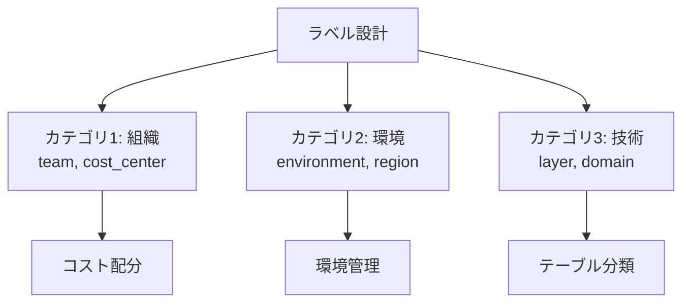
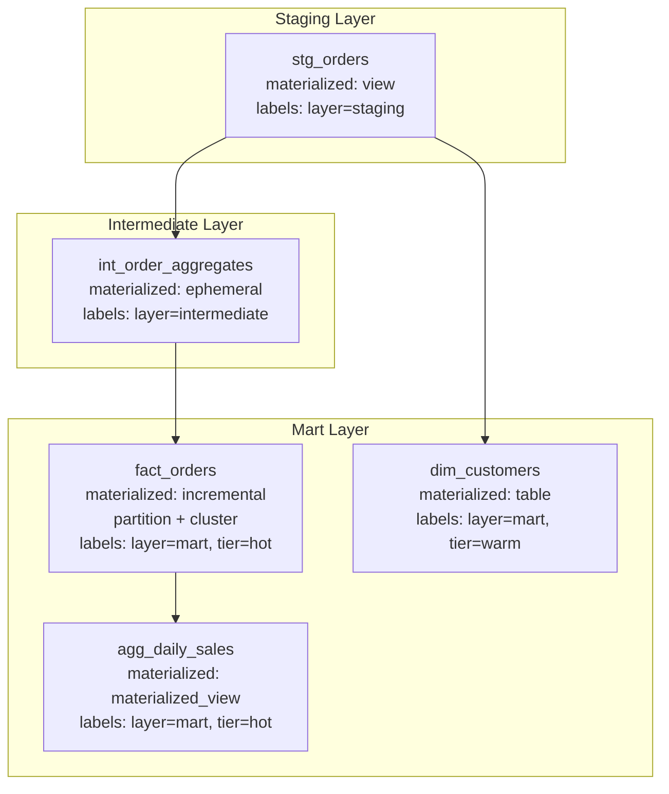
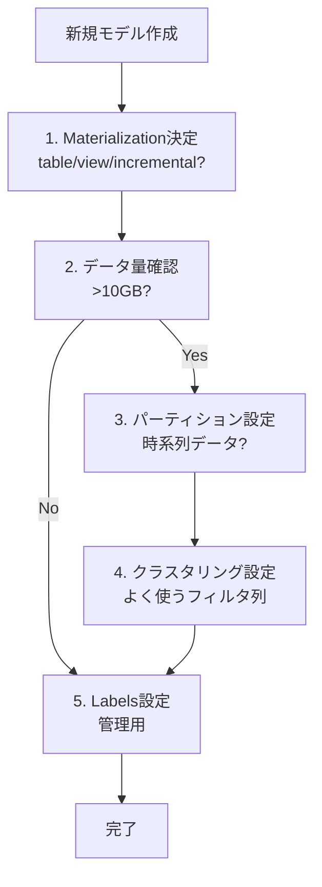

# 学べること

- **Labels による BigQuery テーブルの管理とコスト配分**
- **Table Expiration による一時テーブルの自動削除**
- **レイヤー別のモデル設定ベストプラクティス**
- **よくある間違いとその対策**

# はじめに

dbt + BigQueryのモデル設定には、パフォーマンスやコスト削減に直接影響する基本設定の他に、運用管理を効率化する高度な設定があります。本記事では、Labels（ラベル）とTable Expiration（テーブル自動削除）を中心に、実運用で役立つ設定とベストプラクティスをまとめます。

**検証環境**:

- dbt 1.11.5 + dbt-bigquery 1.11.0
- BigQueryプロジェクト: sdp-sb-yada-29d2
- データセット: dbt_sandbox
- 検証日: 2026-02-17

**検証結果**: 2項目すべて成功 ✅

# Labels（ラベル）

## 実装と検証結果 ✅

**設定例**:

```yaml
config:
  materialized: table
  labels:
    team: analytics
    environment: sandbox
    cost_center: data_engineering
```

**検証結果**:

- BigQueryテーブルにラベルが付与される
- BigQueryコンソールで確認可能
- INFORMATION_SCHEMAでクエリ可能

## ユースケース

### 1. コスト配分（部門別・プロジェクト別）

```yaml
# チーム別のコスト追跡
config:
  labels:
    team: analytics # アナリティクスチーム
    cost_center: marketing # マーケティング部門
    project: customer_360 # プロジェクト名
```

BigQueryコンソールで、ラベル別のコストを確認できます：

- Cloud Console → BigQuery → 課金 → ラベルでフィルタ

### 2. テーブル管理（環境・レイヤー別）

```yaml
# 環境別の管理
config:
  labels:
    environment: production # or dev, staging
    layer: mart # or staging, intermediate
    domain: sales # ビジネスドメイン
```

### 3. 検索性向上

**INFORMATION_SCHEMAでラベル検索**:

```sql
SELECT
  table_name,
  option_value AS labels
FROM `project.dataset.INFORMATION_SCHEMA.TABLE_OPTIONS`
WHERE option_name = 'labels'
  AND JSON_EXTRACT_SCALAR(option_value, '$.team') = 'analytics';
```

## ラベル設計のベストプラクティス



**推奨ラベル構成**:

| カテゴリ | ラベルキー    | 値の例                      | 用途             |
| -------- | ------------- | --------------------------- | ---------------- |
| 組織     | `team`        | analytics, engineering      | チーム別管理     |
| 組織     | `cost_center` | marketing, sales            | コスト配分       |
| 環境     | `environment` | prod, dev, staging          | 環境別管理       |
| 技術     | `layer`       | staging, mart, intermediate | dbtレイヤー      |
| 技術     | `domain`      | sales, finance, customer    | ビジネスドメイン |
| 技術     | `tier`        | hot, warm, cold             | データ階層       |

# Table Expiration（テーブル自動削除）

## 実装と検証結果 ✅

**設定例**:

```yaml
config:
  materialized: table
  hours_to_expiration: 24
```

**検証結果**:

- テーブル作成から24時間後に自動削除される
- BigQueryが自動で管理（手動削除不要）

## ユースケース

### 1. 一時的な分析テーブル

```yaml
# アドホック分析用の一時テーブル
config:
  materialized: table
  hours_to_expiration: 48
  labels:
    tier: temp
    purpose: adhoc_analysis
```

### 2. 中間テーブル（ETL処理）

```yaml
# ETLの中間テーブル（1日で削除）
config:
  materialized: table
  hours_to_expiration: 24
  labels:
    layer: intermediate
    tier: ephemeral
```

### 3. テストデータ

```yaml
# 開発環境のテストデータ（1週間で削除）
config:
  materialized: table
  hours_to_expiration: 168 # 7日間
  labels:
    environment: dev
    purpose: testing
```

## 注意点

⚠️ **重要な制約**:

- `partition_expiration_days` とは併用できない
- dbt runのたびに期限がリセットされる
- 削除は取り消せない（バックアップ推奨）

```yaml
# ❌ エラー: 併用不可
config:
  partition_by:
    field: date
    data_type: date
  partition_expiration_days: 7
  hours_to_expiration: 24 # これはエラー
```

# モデル設定のベストプラクティス

## レイヤー別の推奨設定



### パターン1: 大規模Factテーブル

```yaml
models:
  - name: fact_orders
    config:
      materialized: incremental
      incremental_strategy: insert_overwrite
      partition_by:
        field: order_date
        data_type: date
      cluster_by: ["customer_id", "product_id", "region"]
      require_partition_filter: true
      partition_expiration_days: 365
      labels:
        layer: mart
        domain: sales
        tier: hot
        team: analytics
```

### パターン2: Stagingビュー

```yaml
models:
  - name: stg_orders
    config:
      materialized: view
      labels:
        layer: staging
        source: raw_orders
        team: data_engineering
```

### パターン3: 集計マテビュー

```yaml
models:
  - name: agg_daily_revenue
    config:
      materialized: materialized_view
      enable_refresh: true
      refresh_interval_minutes: 30
      partition_by:
        field: date
        data_type: date
      labels:
        layer: mart
        domain: analytics
        tier: hot
        refresh: auto
```

### パターン4: 一時分析テーブル

```yaml
models:
  - name: tmp_customer_analysis
    config:
      materialized: table
      hours_to_expiration: 48
      labels:
        tier: temp
        purpose: adhoc_analysis
        team: analytics
```

## 設定項目の優先順位



**優先順位**:

1. **Materialization** - 最重要（table/view/incremental）
2. **Partition** - 大規模データ（>10GB）で必須
3. **Clustering** - パーティション後の最適化
4. **Incremental Strategy** - incrementalの場合の戦略
5. **Labels** - 管理・運用のため

# おわりに

## よくある間違いと対策

| 間違い                           | 問題               | 正しい方法                 |
| -------------------------------- | ------------------ | -------------------------- |
| すべてtable                      | ストレージコスト増 | stagingはview              |
| すべてview                       | クエリ遅延         | mart層はtable/incremental  |
| パーティションなし大規模テーブル | コスト爆発         | 10GB超はパーティション必須 |
| クラスタリング列順序誤り         | 効果半減           | カーディナリティ高→低の順  |
| mergeで大規模データ              | 処理遅延           | insert_overwrite検討       |
| ラベルなし                       | 管理困難           | 最低限team, layerは設定    |

## 制約事項

### BigQuery特有の制約

| 項目                        | 制約           |
| --------------------------- | -------------- |
| クラスタリング列数          | 最大4列        |
| パーティション + expiration | 併用不可       |
| Materialized View           | 複雑なJOIN制限 |
| TIMESTAMP パーティション    | DATE変換必要   |

### dbt-bigquery特有の制約

| 項目                          | 制約                               |
| ----------------------------- | ---------------------------------- |
| Time-ingestion パーティション | dbtサポート不完全                  |
| Microbatch begin              | 必須パラメータ                     |
| Labels                        | キー名は英数字とアンダースコアのみ |

## まとめ

**検証で得られた知見**:

- ✅ Labels によるコスト配分と管理効率化
- ✅ Table Expiration による自動クリーンアップ
- ✅ レイヤー別の最適設定パターン
- ✅ 優先順位に基づく段階的な設定

# 参考

- [BigQuery Labels](https://cloud.google.com/bigquery/docs/labels-intro)
- [BigQuery Table Expiration](https://cloud.google.com/bigquery/docs/managing-tables#table-expiration)
- [dbt-bigquery Configuration](https://docs.getdbt.com/reference/resource-configs/bigquery-configs)
- [Models Index](models.md) - カテゴリ全体の概要
- [クイックリファレンス](../../guides/quick-reference.md) - 全設定項目の逆引き

---

**最終更新**: 2026-02-17
