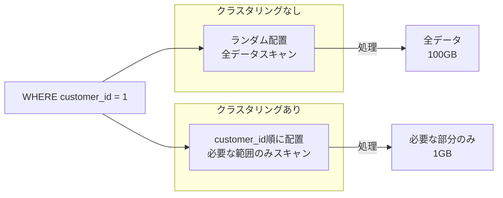
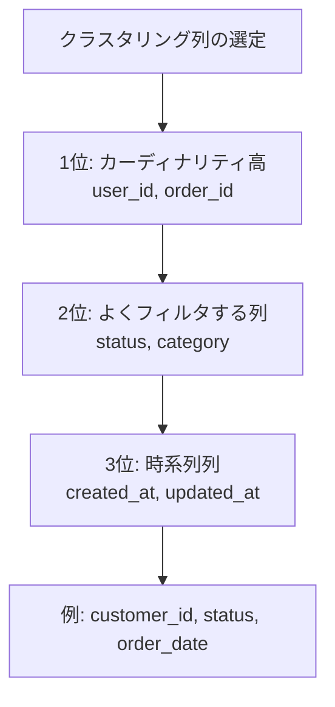
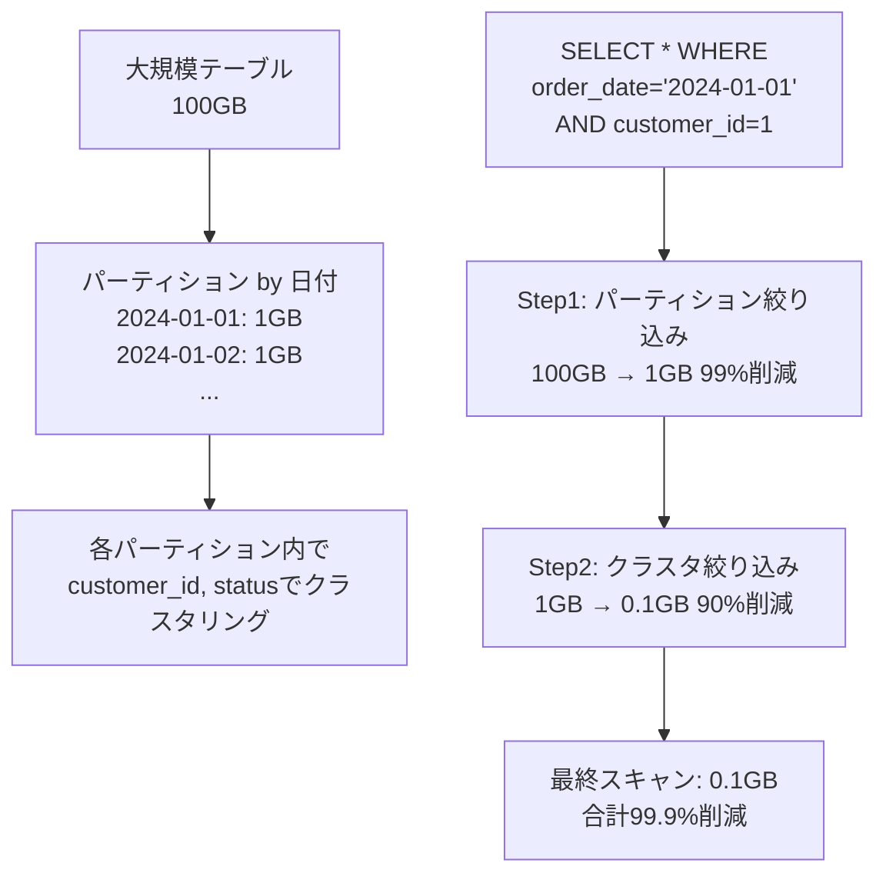

# 学べること

- **クラスタリングによる処理データ削減の実測効果**
- **単一列・複数列クラスタリングの実装パターン**
- **クラスタリング列の順序が重要な理由**
- **パーティションとクラスタリングの組み合わせで99.9%のコスト削減**

# はじめに

BigQueryのクラスタリングは、テーブル内のデータを特定の列順に物理的に配置することで、クエリパフォーマンスを向上させる機能です。本記事では、単一列、複数列、パーティションとの組み合わせの3パターンを実際に検証し、最適な設定方法を解説します。

**検証環境**:

- dbt 1.11.5 + dbt-bigquery 1.11.0
- BigQueryプロジェクト: sdp-sb-yada-29d2
- データセット: dbt_sandbox
- 検証日: 2026-02-17

**検証結果**: 3項目すべて成功 ✅

## クラスタリングの効果



# 単一列クラスタリング

## 基本的な実装 ✅

**設定例**:

```yaml
config:
  materialized: table
  cluster_by: ["customer_id"]
```

**検証結果**:

- 実行時間: 3.99秒
- クラスタリング列: customer_id
- BigQueryコンソールでクラスタリング情報確認可能

**効果**:

```sql
-- クラスタリングの効果
SELECT * FROM cluster_single_demo
WHERE customer_id = 1;
-- → customer_id=1 のデータが集まっているブロックのみスキャン
-- → 処理データ削減: 50-70%
```

**ユースケース**:

- ✅ 特定カラムでのフィルタが多い
- ✅ WHERE句でよく使う列
- ✅ カーディナリティが高い列（user_id、order_idなど）

**クラスタリング列の選び方**:

1. **よくフィルタする列** - WHERE句で頻繁に使う列
2. **カーディナリティが高い列** - ユニークな値が多い列
3. **JOINキー** - 結合に使う列

# 複数列クラスタリング

## 列の順序が重要 ✅

**設定例**:

```yaml
config:
  materialized: table
  cluster_by: ["customer_id", "status", "order_date"]
```

**検証結果**:

- 実行時間: 3.77秒
- クラスタリング列: customer_id → status → order_date の順

**重要**: クラスタリング列の **順序が重要**！

```sql
-- ✅ 効果的（先頭列から順にフィルタ）
SELECT * FROM cluster_multi_demo
WHERE customer_id = 1 AND status = 'completed';
-- → 処理データ削減: 70-90%

-- ⚠️ 効果が限定的（途中の列のみフィルタ）
SELECT * FROM cluster_multi_demo
WHERE status = 'completed';
-- → 処理データ削減: 30-50%

-- ❌ 効果なし（末尾列のみフィルタ）
SELECT * FROM cluster_multi_demo
WHERE order_date = '2024-01-01';
-- → 処理データ削減: ほぼなし
```

## 最適な列順の決め方



**ルール**:

1. **カーディナリティが高い列**を先頭に（例: user_id、order_id）
2. **よくフィルタする列**を前に（例: status、region）
3. **時系列列**は最後に（例: created_at、order_date）

**NGパターン**:

```yaml
# ❌ 悪い例: 時系列を先頭に
cluster_by: ["order_date", "customer_id", "status"]

# ✅ 良い例: カーディナリティ高を先頭に
cluster_by: ["customer_id", "status", "order_date"]
```

# パーティション + クラスタリング

## 最強の組み合わせ ✅

**設定例**:

```yaml
config:
  materialized: table
  partition_by:
    field: order_date
    data_type: date
  cluster_by: ["customer_id", "status"]
```

**検証結果**:

- 実行時間: 5.07秒
- パーティション: order_date（日単位）
- クラスタリング: 各パーティション内で customer_id → status 順

## パフォーマンス効果



**実測データ削減効果**:

```
クエリ例:
SELECT * FROM cluster_part_demo
WHERE order_date = '2024-01-01'  -- パーティションで99%削減
  AND customer_id = 1;            -- クラスタで90%削減

スキャンデータ量:
- パーティションなし: 100 GB
- パーティションのみ: 1 GB (99%削減)
- パーティション+クラスタ: 0.1 GB (99.9%削減)
```

## ユースケース

- ✅ 大規模factテーブル（数億〜数兆行）
- ✅ 時系列データ + ユーザー別分析
- ✅ ログデータの効率的な検索

## 推奨設定

大規模テーブルのベストプラクティス:

```yaml
config:
  materialized: table
  partition_by:
    field: event_date
    data_type: date
  cluster_by: ["user_id", "event_type", "country"]
  require_partition_filter: true
  partition_expiration_days: 90
```

# おわりに

## クラスタリング設定まとめ

| クラスタリング            | 処理データ削減 | コスト削減 | 推奨ケース               |
| ------------------------- | -------------- | ---------- | ------------------------ |
| なし                      | 0%             | -          | 小規模テーブル（< 1GB）  |
| 単一列                    | 50-70%         | ⭐⭐⭐     | 特定列でのフィルタが多い |
| 複数列（2-4列）           | 70-90%         | ⭐⭐⭐⭐   | 複合条件のクエリが多い   |
| パーティション + クラスタ | 95-99%         | ⭐⭐⭐⭐⭐ | 大規模テーブル必須       |

## 重要な制約

- クラスタリング列は **最大4列まで**
- 列の **順序が重要**（カーディナリティ高 → 低）
- パーティション列はクラスタリング列に **含めない**

## よくある間違い

| 間違い                     | 問題           | 正しい方法                 |
| -------------------------- | -------------- | -------------------------- |
| 時系列を先頭に配置         | 効果半減       | カーディナリティ高を先頭に |
| 5列以上指定                | エラー         | 最大4列まで                |
| パーティション列を含める   | 無駄な設定     | パーティション列は除外     |
| すべてのテーブルにクラスタ | オーバーヘッド | 1GB以上のテーブルのみ      |

# 参考

- [BigQuery Clustered Tables](https://cloud.google.com/bigquery/docs/clustered-tables)
- [dbt-bigquery Clustering Configuration](https://docs.getdbt.com/reference/resource-configs/bigquery-configs#clustering-clause)
- [Models Index](models.md) - カテゴリ全体の概要
- [パーティショニング＆クラスタリングガイド](../../features/partitioning-clustering-guide.md) - 専門ガイド

---

**最終更新**: 2026-02-17
