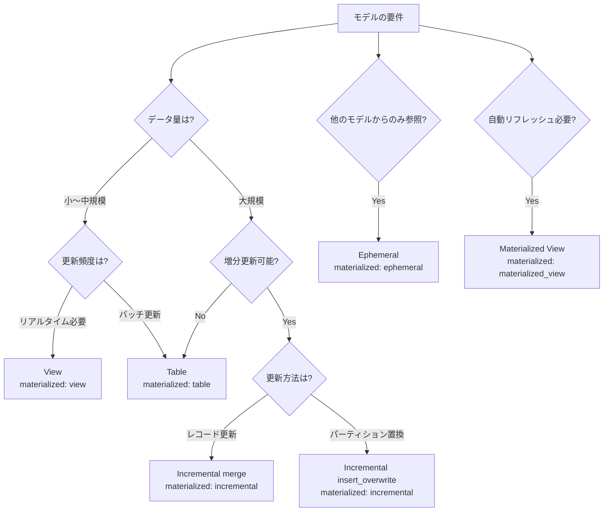

# 学べること

- **5種類のマテリアライゼーション戦略の実測検証結果**
- **選択フローチャートによる最適な方式の決定方法**
- **各方式のメリット・デメリットと具体的なユースケース**
- **BigQueryでの実装パターンとパフォーマンス特性**

# はじめに

dbtのMaterializationは、モデルをBigQueryでどのように実体化するかを決定する最も重要な設定です。本記事では、5種類すべてのマテリアライゼーション（table、view、incremental、ephemeral、materialized_view）を実際に検証し、実運用での選択基準を明確にします。

**検証環境**:

- dbt 1.11.5 + dbt-bigquery 1.11.0
- BigQueryプロジェクト: sdp-sb-yada-29d2
- データセット: dbt_sandbox
- 検証日: 2026-02-17

**検証結果**: 5項目すべて成功 ✅

# 選択フローチャートと基本戦略



# Table と View - 基本のマテリアライゼーション

## Table（テーブル）✅

**設定例**:

```yaml
config:
  materialized: table
```

**BigQueryでの実装**:

```sql
CREATE OR REPLACE TABLE `project.dataset.mat_table_demo`
AS (
  SELECT order_id, customer_id, order_date, status
  FROM `project.dataset.stg_orders`
  WHERE order_date IS NOT NULL
)
```

**検証結果**:

- 実行時間: 3.84秒
- 処理データ: 99行、3.3 KiB
- 物理テーブルとして保存

**ユースケース**:

- ✅ 集計結果の保存（fact/dimテーブル）
- ✅ 複雑なJOINの結果をキャッシュ
- ✅ クエリパフォーマンス重視

| メリット                       | デメリット                    |
| ------------------------------ | ----------------------------- |
| ✅ 高速なクエリ                | ❌ ストレージコスト           |
| ✅ パーティション/クラスタ可能 | ❌ データの鮮度（更新時のみ） |
| ✅ 安定したパフォーマンス      | ❌ ビルド時間                 |

## View（ビュー）✅

**設定例**:

```yaml
config:
  materialized: view
```

**BigQueryでの実装**:

```sql
CREATE OR REPLACE VIEW `project.dataset.mat_view_demo`
AS (
  SELECT order_id, customer_id, order_date, status
  FROM `project.dataset.stg_orders`
  WHERE order_date IS NOT NULL
)
```

**検証結果**:

- 実行時間: 2.48秒
- 処理データ: 0行（ビューはデータを保存しない）
- ビュー定義のみ保存

**ユースケース**:

- ✅ リアルタイム性が必要
- ✅ ストレージコスト削減
- ✅ stagingモデル（データ変換層）

| メリット                | デメリット              |
| ----------------------- | ----------------------- |
| ✅ 常に最新データ       | ❌ クエリのたびに実行   |
| ✅ ストレージコストなし | ❌ パフォーマンス不安定 |
| ✅ 即座に反映           | ❌ パーティション不可   |

# Incremental と Ephemeral - 高度なマテリアライゼーション

## Incremental（増分更新）✅

**設定例**:

```yaml
config:
  materialized: incremental
  incremental_strategy: merge
  unique_key: order_id
```

**BigQueryでの実装**:

初回実行（full-refresh）:

```sql
CREATE TABLE `project.dataset.mat_incremental_demo`
AS (SELECT * FROM source)
```

2回目以降（増分更新）:

```sql
MERGE INTO `project.dataset.mat_incremental_demo` AS target
USING (
  SELECT * FROM source
  WHERE order_date > (SELECT MAX(order_date) FROM target)
) AS source
ON target.order_id = source.order_id
WHEN MATCHED THEN UPDATE SET *
WHEN NOT MATCHED THEN INSERT *
```

**検証結果**:

- 初回実行時間: 4.09秒
- 処理データ: 99行、3.3 KiB
- MERGE文で効率的に更新

**ユースケース**:

- ✅ 大規模テーブルの効率的な更新
- ✅ SCD Type 1（最新状態のみ保持）
- ✅ イベントデータの追記

| メリット          | デメリット                |
| ----------------- | ------------------------- |
| ✅ 更新コスト削減 | ❌ ロジックが複雑         |
| ✅ 処理時間短縮   | ❌ 初回はfull-refresh必要 |
| ✅ 柔軟な更新戦略 | ❌ デバッグが難しい       |

## Ephemeral（エフェメラル）✅

**設定例**:

```yaml
config:
  materialized: ephemeral
```

**BigQueryでの実装**:

Ephemeralモデル自体はBigQueryに作成されず、参照元モデルのCTEとして埋め込まれます。

```sql
-- 参照元モデルの実際のコンパイル済みSQL
WITH mat_ephemeral_demo AS (
  SELECT order_id, customer_id, order_date, status
  FROM `project.dataset.stg_orders`
  WHERE status = 'completed'
)
SELECT customer_id, COUNT(*) AS completed_orders_count
FROM mat_ephemeral_demo
GROUP BY customer_id
```

**検証結果**:

- BigQueryにテーブル/ビューは作成されない
- 参照元モデルのCTEとして展開される

**ユースケース**:

- ✅ 中間計算ステップ（他のモデルからのみ参照）
- ✅ コード再利用（DRY原則）
- ✅ ストレージコスト削減

| メリット                | デメリット                      |
| ----------------------- | ------------------------------- |
| ✅ ストレージコストなし | ❌ 単独でクエリ不可             |
| ✅ コードの再利用性     | ❌ 複数箇所で参照すると重複計算 |
| ✅ 中間データの管理不要 | ❌ デバッグが難しい             |

**重要な注意点**:

- Ephemeralは複数のモデルから参照されると、**それぞれでCTEとして展開される**（重複計算）
- パフォーマンスが重要な場合は table または view を検討

# Materialized View - BigQuery特有機能

## Materialized View（マテリアライズドビュー）✅

**設定例**:

```yaml
config:
  materialized: materialized_view
  enable_refresh: true
  refresh_interval_minutes: 30
```

**BigQueryでの実装**:

```sql
CREATE MATERIALIZED VIEW `project.dataset.mat_matview_demo`
OPTIONS (
  enable_refresh = true,
  refresh_interval_minutes = 30
)
AS (
  SELECT
    customer_id,
    COUNT(*) AS order_count,
    SUM(CASE WHEN status = 'completed' THEN 1 ELSE 0 END) AS completed_count
  FROM `project.dataset.stg_orders`
  GROUP BY customer_id
)
```

**検証結果**:

- 実行時間: 2.93秒
- BigQueryが自動でリフレッシュ（30分ごと）

**ユースケース**:

- ✅ 集計クエリの高速化
- ✅ リアルタイム性とパフォーマンスの両立
- ✅ ダッシュボードのバックエンド

| メリット                 | デメリット                      |
| ------------------------ | ------------------------------- |
| ✅ 高速クエリ + 自動更新 | ❌ BigQuery特有機能（移植性低） |
| ✅ ストレージ最適化      | ❌ 複雑なJOIN制限あり           |
| ✅ 管理コスト低          | ❌ リフレッシュコスト           |

**BigQuery Materialized Viewの制約**:

- 集計（GROUP BY）は可能だが、複雑なJOINに制限あり
- サポートされる関数に制限あり（詳細は[公式ドキュメント](https://cloud.google.com/bigquery/docs/materialized-views-intro)参照）

# おわりに

## 比較表

| 方式                  | ストレージ | クエリ速度 | データ鮮度          | コスト | 推奨ケース                       |
| --------------------- | ---------- | ---------- | ------------------- | ------ | -------------------------------- |
| **table**             | 💾💾💾     | ⚡⚡⚡     | 🕐 更新時           | 💰💰   | 集計テーブル、パフォーマンス重視 |
| **view**              | -          | ⚡         | 🕐🕐🕐 リアルタイム | 💰     | stagingレイヤー、リアルタイム性  |
| **incremental**       | 💾💾💾     | ⚡⚡⚡     | 🕐 更新時           | 💰     | 大規模データ、効率的更新         |
| **ephemeral**         | -          | ⚡⚡       | 🕐🕐🕐 リアルタイム | -      | 中間計算、コード再利用           |
| **materialized_view** | 💾💾       | ⚡⚡⚡     | 🕐🕐 自動更新       | 💰💰   | 集計+リアルタイム性              |

## 推奨パターン

**Staging Layer**: view（リアルタイム性重視）
**Intermediate Layer**: ephemeral（中間計算）
**Mart Layer - Fact**: incremental（大規模データ）
**Mart Layer - Dim**: table（小規模マスタ）
**Mart Layer - Agg**: materialized_view（集計+自動更新）

# 参考

- [dbt Materialization公式ドキュメント](https://docs.getdbt.com/docs/build/materializations)
- [BigQuery Materialized Views](https://cloud.google.com/bigquery/docs/materialized-views-intro)
- [dbt-bigquery Configuration](https://docs.getdbt.com/reference/resource-configs/bigquery-configs)
- [Models Index](models.md) - カテゴリ全体の概要

---

**最終更新**: 2026-02-17
