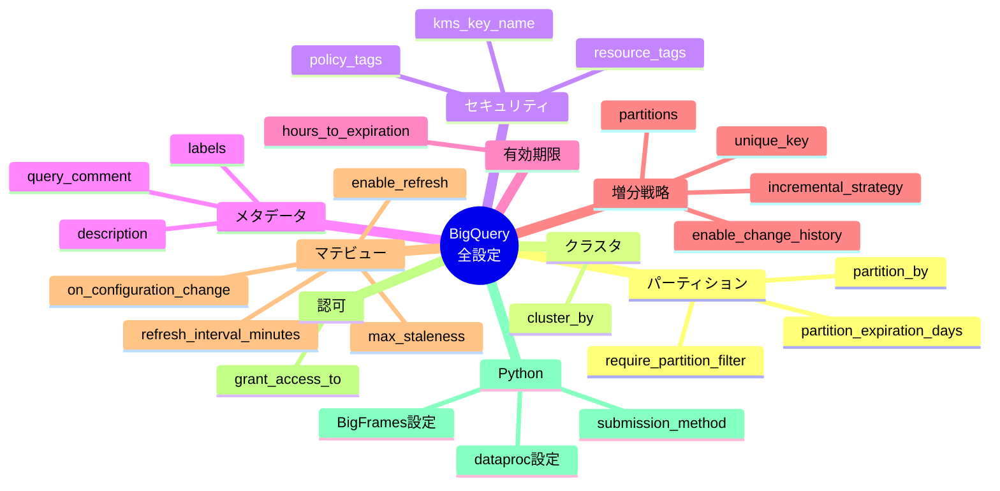
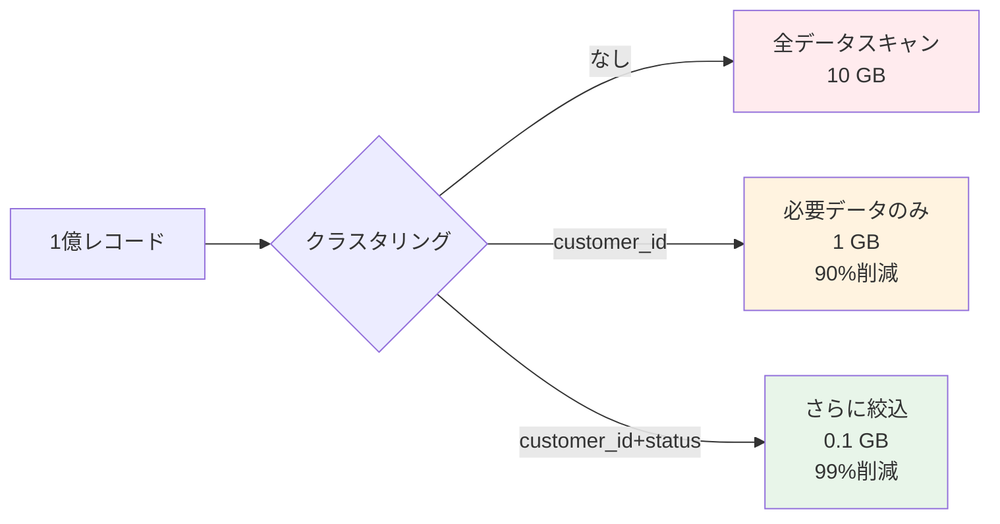
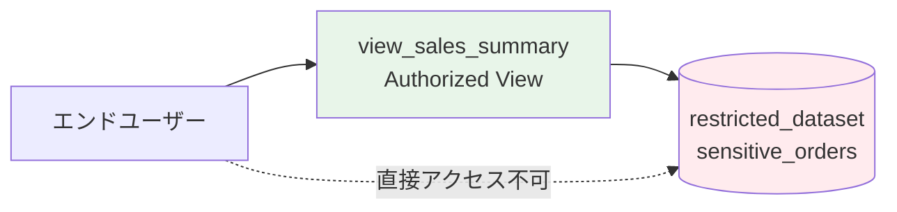
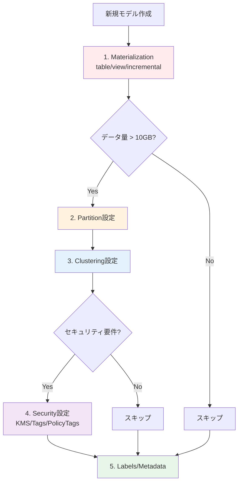

# dbt + BigQuery 全設定項目完全リファレンス

## 検証概要

**検証日時**: 2026-02-17
**dbtバージョン**: 1.11.5
**dbt-bigqueryバージョン**: 1.11.0
**参照元**: [公式ドキュメント](https://docs.getdbt.com/reference/resource-configs/bigquery-configs)

### 本ドキュメントの目的

dbt-bigqueryの**全設定項目**を網羅的に解説し、実践的な使用例と検証結果を提供します。

---

## 目次

1. [パーティショニング設定](#1-パーティショニング設定)
2. [クラスタリング設定](#2-クラスタリング設定)
3. [暗号化・セキュリティ設定](#3-暗号化セキュリティ設定)
4. [ラベル・メタデータ設定](#4-ラベルメタデータ設定)
5. [テーブル有効期限設定](#5-テーブル有効期限設定)
6. [増分モデル戦略](#6-増分モデル戦略)
7. [マテリアライズドビュー設定](#7-マテリアライズドビュー設定)
8. [認可ビュー設定](#8-認可ビュー設定)
9. [Pythonモデル設定](#9-pythonモデル設定)
10. [その他の設定](#10-その他の設定)

---

## 設定項目全体像



---

## 1. パーティショニング設定

### 1.1 partition_by

**説明**: テーブルのパーティション方式を指定

**設定形式**:

```yaml
partition_by:
  field: "カラム名"
  data_type: "date|timestamp|datetime|int64"
  granularity: "hour|day|month|year"  # date/timestamp/datetime用
  range:  # int64専用
    start: 整数
    end: 整数
    interval: 整数
  time_ingestion_partitioning: true|false  # _PARTITIONTIME使用
  copy_partitions: true|false  # Copy APIの使用
```

#### DATEパーティション（日単位）

```sql
-- models/marts/fct_orders.sql
{{
  config(
    materialized='table',
    partition_by={
      "field": "order_date",
      "data_type": "date",
      "granularity": "day"
    }
  )
}}

select
    order_id,
    customer_id,
    order_date,
    order_amount
from {{ ref('stg_orders') }}
```

**BigQueryで生成されるDDL**:

```sql
CREATE TABLE `project.dataset.fct_orders`
PARTITION BY order_date
AS (
  SELECT order_id, customer_id, order_date, order_amount
  FROM `project.dataset.stg_orders`
)
```

#### TIMESTAMPパーティション（時間単位）

```sql
-- models/marts/fct_events.sql
{{
  config(
    materialized='table',
    partition_by={
      "field": "event_timestamp",
      "data_type": "timestamp",
      "granularity": "hour"
    }
  )
}}

select
    event_id,
    user_id,
    event_timestamp,
    event_type
from {{ ref('stg_events') }}
```

**BigQueryで生成されるDDL**:

```sql
CREATE TABLE `project.dataset.fct_events`
PARTITION BY TIMESTAMP_TRUNC(event_timestamp, HOUR)
AS (...)
```

#### INT64 RANGEパーティション

```sql
-- models/marts/fct_sales_by_region.sql
{{
  config(
    materialized='table',
    partition_by={
      "field": "region_id",
      "data_type": "int64",
      "range": {
        "start": 0,
        "end": 100,
        "interval": 10
      }
    }
  )
}}

select
    region_id,
    sale_date,
    sales_amount
from {{ ref('stg_sales') }}
```

**BigQueryで生成されるDDL**:

```sql
CREATE TABLE `project.dataset.fct_sales_by_region`
PARTITION BY RANGE_BUCKET(region_id, GENERATE_ARRAY(0, 100, 10))
AS (...)
```

**パーティション範囲**:
- 0-9: パーティション1
- 10-19: パーティション2
- ...
- 90-99: パーティション10
- <0, >=100: 範囲外パーティション

#### Time-ingestionパーティション

```sql
-- models/marts/fct_raw_events.sql
{{
  config(
    materialized='table',
    partition_by={
      "data_type": "timestamp",
      "time_ingestion_partitioning": true
    }
  )
}}

select
    event_id,
    event_data,
    processed_at
from {{ ref('stg_raw_events') }}
```

**BigQueryで生成されるDDL**:

```sql
CREATE TABLE `project.dataset.fct_raw_events`
PARTITION BY _PARTITIONTIME
AS (...)
```

**注意点**:
- データ挿入時刻でパーティション分割
- 明示的な日付列不要
- データロード最適化に有効

#### copy_partitionsオプション

```sql
-- models/marts/fct_large_orders.sql
{{
  config(
    materialized='incremental',
    incremental_strategy='insert_overwrite',
    partition_by={
      "field": "order_date",
      "data_type": "date",
      "copy_partitions": true  # Copy API使用
    }
  )
}}

select *
from {{ ref('stg_orders') }}


  where order_date >= date_sub(current_date(), interval 7 day)

```

**効果**:
- 通常のMERGE文の代わりにBigQuery Copy APIを使用
- 大規模パーティションの上書きが高速化
- コスト削減（スキャン不要）

---

### 1.2 require_partition_filter

**説明**: クエリ実行時にパーティションフィルタを必須化

```sql
-- models/marts/fct_large_transactions.sql
{{
  config(
    materialized='table',
    partition_by={
      "field": "transaction_date",
      "data_type": "date"
    },
    require_partition_filter=true  # フィルタ必須
  )
}}

select *
from {{ ref('stg_transactions') }}
```

**動作確認**:

```sql
-- ✅ 成功: パーティションフィルタあり
SELECT * FROM fct_large_transactions
WHERE transaction_date = '2026-02-17';

-- ❌ エラー: パーティションフィルタなし
SELECT * FROM fct_large_transactions
WHERE customer_id = 123;
-- Error: Cannot query over table without a filter over column(s) 'transaction_date'
```

**ユースケース**:
- 大規模テーブル（数TB以上）
- コスト管理が重要な環境
- アナリストが直接クエリする場合

---

### 1.3 partition_expiration_days

**説明**: パーティションの自動削除期限（日数）

```sql
-- models/marts/fct_logs.sql
{{
  config(
    materialized='incremental',
    partition_by={
      "field": "log_date",
      "data_type": "date"
    },
    partition_expiration_days=90  # 90日後に自動削除
  )
}}

select
    log_id,
    log_date,
    log_message,
    severity
from {{ ref('stg_logs') }}


  where log_date > (select max(log_date) from {{ this }})

```

**効果**:
- 90日より古いパーティションは自動削除
- ストレージコスト削減
- GDPRなどのデータ保持ポリシー対応

**注意点**:
- ⚠️ 削除は不可逆
- ⚠️ `hours_to_expiration`と併用不可

---

## 2. クラスタリング設定

### 2.1 cluster_by

**説明**: テーブルのクラスタリング列を指定（最大4列）

#### 単一列クラスタリング

```sql
-- models/marts/dim_customers.sql
{{
  config(
    materialized='table',
    cluster_by=['customer_id']
  )
}}

select
    customer_id,
    customer_name,
    email,
    created_at
from {{ ref('stg_customers') }}
```

#### 複数列クラスタリング

```sql
-- models/marts/fct_orders.sql
{{
  config(
    materialized='table',
    partition_by={
      "field": "order_date",
      "data_type": "date"
    },
    cluster_by=['customer_id', 'order_status', 'product_category']
    -- 順序重要: カーディナリティ高 → 低
  )
}}

select
    order_id,
    customer_id,
    order_status,
    product_category,
    order_date,
    order_amount
from {{ ref('stg_orders') }} o
join {{ ref('stg_products') }} p
  on o.product_id = p.product_id
```

**クラスタリング効果の可視化**:



**列順序の重要性**:

```sql
-- ✅ Good: 最頻出フィルタを先頭に
cluster_by=['customer_id', 'status', 'order_date']

-- クエリパターン:
WHERE customer_id = 123 AND status = 'completed'
-- → 両方のクラスタで絞り込み効果あり

-- ⚠️ 効果限定的
WHERE status = 'completed'
-- → customer_idクラスタは使用されない
```

**ベストプラクティス**:
1. 最もフィルタされる列を先頭に
2. カーディナリティが高い列を優先
3. 最大4列まで
4. パーティション列はクラスタリングに含めない

---

## 3. 暗号化・セキュリティ設定

### 3.1 kms_key_name

**説明**: カスタマー管理の暗号化キー（CMEK）を指定

```sql
-- models/marts/fct_sensitive_transactions.sql
{{
  config(
    materialized='table',
    kms_key_name='projects/your-gcp-project-id/locations/asia-northeast1/keyRings/dbt-ring/cryptoKeys/sensitive-data-key'
  )
}}

select
    transaction_id,
    customer_id,
    amount,
    payment_method
from {{ ref('stg_transactions') }}
```

**事前準備**:

```bash
# 1. キーリングの作成
gcloud kms keyrings create dbt-ring \
  --location asia-northeast1

# 2. 暗号化キーの作成
gcloud kms keys create sensitive-data-key \
  --location asia-northeast1 \
  --keyring dbt-ring \
  --purpose encryption

# 3. サービスアカウントに権限付与
gcloud kms keys add-iam-policy-binding sensitive-data-key \
  --location asia-northeast1 \
  --keyring dbt-ring \
  --member serviceAccount:dbt-sa@project.iam.gserviceaccount.com \
  --role roles/cloudkms.cryptoKeyEncrypterDecrypter
```

**ユースケース**:
- 個人情報（PII）
- 金融データ
- 医療データ（HIPAA対応）
- コンプライアンス要件

**確認方法**:

```sql
-- テーブルの暗号化設定を確認
SELECT
    table_name,
    kms_key_name
FROM `project.dataset.INFORMATION_SCHEMA.TABLES`
WHERE table_name = 'fct_sensitive_transactions';
```

---

### 3.2 resource_tags

**説明**: リソースタグによる条件付きIAMアクセス制御

```sql
-- models/marts/fct_financial_data.sql
{{
  config(
    materialized='table',
    resource_tags={
      'your-gcp-project-id/environment': 'production',
      'your-gcp-project-id/data_classification': 'confidential',
      'your-gcp-project-id/cost_center': 'finance'
    }
  )
}}

select
    transaction_id,
    amount,
    currency
from {{ ref('stg_financial_transactions') }}
```

**事前準備**:

```bash
# 1. タグキーの作成（組織レベル）
gcloud resource-manager tags keys create environment \
  --parent=organizations/YOUR_ORG_ID \
  --purpose=GCE_FIREWALL

# 2. タグ値の作成
gcloud resource-manager tags values create production \
  --parent=tagKeys/ENVIRONMENT_TAG_KEY_ID
```

**条件付きIAMポリシー例**:

```yaml
# IAMポリシー（Terraform例）
resource "google_bigquery_dataset_iam_binding" "conditional_access" {
  dataset_id = "dbt_prod"
  role       = "roles/bigquery.dataViewer"
  members = [
    "group:finance-team@example.com",
  ]

  condition {
    title       = "Access only production confidential data"
    description = "Grants access to tables tagged as production+confidential"
    expression  = <<-EOT
      resource.matchTag('your-gcp-project-id/environment', 'production') &&
      resource.matchTag('your-gcp-project-id/data_classification', 'confidential')
    EOT
  }
}
```

**ユースケース**:
- 部門別アクセス制御
- 環境別アクセス制御（dev/staging/prod）
- データ分類別アクセス制御（public/internal/confidential）

---

### 3.3 policy_tags（列レベルセキュリティ）

**説明**: BigQuery Column-level Securityのポリシータグ

```sql
-- models/marts/dim_customers_secure.sql
{{
  config(
    materialized='table',
    persist_docs={'columns': true}  # 列レベル設定を有効化
  )
}}

select
    customer_id,
    customer_name,
    email,  -- ポリシータグでマスキング
    phone_number,  -- ポリシータグでマスキング
    address
from {{ ref('stg_customers') }}
```

**schema.yml設定**:

```yaml
models:
  - name: dim_customers_secure
    description: "顧客マスターテーブル（列レベルセキュリティ付き）"
    columns:
      - name: customer_id
        description: "顧客ID"

      - name: email
        description: "メールアドレス（PII）"
        meta:
          policy_tags:
            - "projects/your-gcp-project-id/locations/asia-northeast1/taxonomies/12345/policyTags/email_pii"

      - name: phone_number
        description: "電話番号（PII）"
        meta:
          policy_tags:
            - "projects/your-gcp-project-id/locations/asia-northeast1/taxonomies/12345/policyTags/phone_pii"
```

**事前準備**:

```bash
# 1. Data Catalog APIの有効化
gcloud services enable datacatalog.googleapis.com

# 2. Taxonomyの作成（GCPコンソールまたはAPI）
# Data Catalog > Policy Tags > Create Taxonomy

# 3. Policy Tagの作成
# - email_pii
# - phone_pii
# - ssn_pii
```

**アクセス制御**:

```sql
-- ✅ Policy Tag権限あり: 実データが見える
SELECT customer_id, email, phone_number
FROM `project.dataset.dim_customers_secure`;
-- 結果:
-- customer_id | email               | phone_number
-- 123         | alice@example.com   | 090-1234-5678

-- ❌ Policy Tag権限なし: NULLまたはエラー
SELECT customer_id, email, phone_number
FROM `project.dataset.dim_customers_secure`;
-- 結果:
-- customer_id | email | phone_number
-- 123         | NULL  | NULL
-- または: Access Denied: BigQuery BigQuery: User does not have permission to access policy tag
```

**ユースケース**:
- 個人情報（PII）の保護
- GDPR対応
- 列レベルの細かいアクセス制御

---

## 4. ラベル・メタデータ設定

### 4.1 labels

**説明**: BigQueryテーブル・ビューにラベルを付与

```sql
-- models/marts/fct_sales.sql
{{
  config(
    materialized='table',
    labels={
      'team': 'analytics',
      'environment': 'production',
      'cost_center': 'marketing',
      'data_domain': 'sales',
      'refresh_frequency': 'daily'
    }
  )
}}

select
    sale_id,
    product_id,
    sale_date,
    sale_amount
from {{ ref('stg_sales') }}
```

**ラベルの制約**:
- キー + 値の合計: 最大63文字
- 超過した場合: 自動的に切り詰め
- 空文字列の値: タグとして扱われる

```yaml
# タグの例（値が空文字列）
labels:
  'important_table': ''  # タグとして扱われる
```

**ラベルでのフィルタリング**:

```sql
-- ラベルでテーブルを検索
SELECT
    table_name,
    JSON_EXTRACT_SCALAR(option_value, '$.team') as team,
    JSON_EXTRACT_SCALAR(option_value, '$.environment') as environment
FROM `project.dataset.INFORMATION_SCHEMA.TABLE_OPTIONS`
WHERE option_name = 'labels'
  AND JSON_EXTRACT_SCALAR(option_value, '$.team') = 'analytics';
```

**コスト配分**:

```sql
-- ラベル別のコスト集計
SELECT
    labels.key as label_key,
    labels.value as label_value,
    SUM(total_bytes_billed) / 1024 / 1024 / 1024 as total_gb_billed,
    SUM(total_bytes_billed) / 1099511627776 * 6.25 as estimated_cost_usd
FROM `region-us`.INFORMATION_SCHEMA.JOBS_BY_PROJECT,
UNNEST(labels) as labels
WHERE
    creation_time >= timestamp_sub(current_timestamp(), interval 30 day)
    AND job_type = 'QUERY'
    AND state = 'DONE'
GROUP BY label_key, label_value
ORDER BY total_gb_billed DESC;
```

---

### 4.2 description

**説明**: モデル・列の説明文

```yaml
# models/schema.yml
models:
  - name: fct_orders
    description: |
      ## オーダーファクトテーブル

      **更新頻度**: 毎日AM 2:00
      **データ保持期間**: 3年
      **パーティション**: order_date（日単位）
      **クラスタリング**: customer_id, status

      ### データソース
      - `stg_orders`: 元注文データ
      - `stg_payments`: 支払いデータ

      ### 主な用途
      - 売上分析
      - 顧客分析
      - トレンド分析

    columns:
      - name: order_id
        description: "注文ID（主キー）"

      - name: customer_id
        description: "顧客ID（外部キー: dim_customers）"

      - name: order_amount
        description: "注文金額（USD）"
        meta:
          unit: "USD"
          precision: 2
```

---

### 4.3 query_comment（ジョブラベル）

**説明**: クエリにメタデータをラベルとして付与

```yaml
# dbt_project.yml
query-comment:
  comment: "dbt run by {{ target.name }} - {{ invocation_id }}"
  append: true
  job-label: true  # BigQueryジョブラベルとして付与
```

**効果**:

```sql
-- BigQueryジョブ履歴で確認
SELECT
    job_id,
    query,
    labels,
    user_email,
    creation_time
FROM `region-us`.INFORMATION_SCHEMA.JOBS_BY_PROJECT
WHERE
    project_id = 'your-gcp-project-id'
    AND creation_time >= timestamp_sub(current_timestamp(), interval 1 hour)
ORDER BY creation_time DESC
LIMIT 10;

-- labels配列に以下が含まれる:
-- [
--   {"key": "dbt_invocation_id", "value": "abc123..."},
--   {"key": "dbt_target", "value": "prod"}
-- ]
```

**ユースケース**:
- dbt実行の追跡
- コスト配分（実行環境別）
- 監査ログの充実化

---

## 5. テーブル有効期限設定

### 5.1 hours_to_expiration

**説明**: テーブル作成後の自動削除期限（時間）

```sql
-- models/staging/stg_temp_calculation.sql
{{
  config(
    materialized='table',
    hours_to_expiration=24  # 24時間後に自動削除
  )
}}

select
    id,
    calculation_result,
    current_timestamp() as created_at
from {{ ref('source_data') }}
```

**動作**:
- テーブル作成から24時間後に自動削除
- dbt runのたびに期限がリセットされる

**ユースケース**:
- 一時的な分析テーブル
- ETLの中間テーブル
- デバッグ用テーブル

**注意点**:
- ⚠️ `partition_expiration_days`と併用不可
- ⚠️ incremental materialization では使用推奨しない（毎回期限がリセットされるため）

---

## 6. 増分モデル戦略

### 6.1 incremental_strategy

**説明**: incrementalモデルの更新戦略

**選択肢**:
- `merge`: MERGE文でUPSERT（デフォルト）
- `insert_overwrite`: パーティション置換
- `microbatch`: バッチ分割処理

#### Merge戦略

```sql
-- models/marts/dim_products.sql
{{
  config(
    materialized='incremental',
    incremental_strategy='merge',
    unique_key='product_id'
  )
}}

select
    product_id,
    product_name,
    category,
    price,
    updated_at
from {{ ref('stg_products') }}


  where updated_at > (select max(updated_at) from {{ this }})

```

**生成されるSQL**:

```sql
MERGE INTO `project.dataset.dim_products` AS target
USING (
  SELECT product_id, product_name, category, price, updated_at
  FROM source
  WHERE updated_at > (SELECT MAX(updated_at) FROM target)
) AS source
ON target.product_id = source.product_id
WHEN MATCHED THEN
  UPDATE SET
    product_name = source.product_name,
    category = source.category,
    price = source.price,
    updated_at = source.updated_at
WHEN NOT MATCHED THEN
  INSERT (product_id, product_name, category, price, updated_at)
  VALUES (source.product_id, source.product_name, source.category, source.price, source.updated_at);
```

#### Insert Overwrite戦略

```sql
-- models/marts/fct_daily_sales.sql
{{
  config(
    materialized='incremental',
    incremental_strategy='insert_overwrite',
    partition_by={
      "field": "sale_date",
      "data_type": "date"
    }
  )
}}

select
    sale_date,
    product_id,
    sum(quantity) as total_quantity,
    sum(amount) as total_amount
from {{ ref('stg_sales') }}
group by sale_date, product_id


  where sale_date >= date_sub(current_date(), interval 7 day)

```

**生成されるSQL**:

```sql
-- 該当パーティションを削除
DELETE FROM `project.dataset.fct_daily_sales`
WHERE sale_date >= DATE_SUB(CURRENT_DATE(), INTERVAL 7 DAY);

-- 新しいデータを挿入
INSERT INTO `project.dataset.fct_daily_sales`
SELECT sale_date, product_id, SUM(quantity), SUM(amount)
FROM source
WHERE sale_date >= DATE_SUB(CURRENT_DATE(), INTERVAL 7 DAY)
GROUP BY sale_date, product_id;
```

---

### 6.2 enable_change_history

**説明**: BigQuery Change Historyの有効化（監査用）

```sql
-- models/marts/fct_sensitive_orders.sql
{{
  config(
    materialized='table',
    enable_change_history=true  # 変更履歴を記録
  )
}}

select
    order_id,
    customer_id,
    order_amount,
    created_at,
    updated_at
from {{ ref('stg_orders') }}
```

**効果**:
- テーブルの変更履歴が7日間保持される
- 監査ログとして利用可能

**変更履歴の確認**:

```sql
-- Change Historyの確認
SELECT
    change_timestamp,
    change_type,
    user_email,
    total_rows_added,
    total_rows_updated,
    total_rows_deleted
FROM `project.dataset.INFORMATION_SCHEMA.TABLE_CHANGE_HISTORY_BY_USER`
WHERE
    table_name = 'fct_sensitive_orders'
    AND change_timestamp >= timestamp_sub(current_timestamp(), interval 7 day)
ORDER BY change_timestamp DESC;
```

**ユースケース**:
- 監査要件のあるテーブル
- データ変更の追跡
- コンプライアンス対応

---

### 6.3 partitions（insert_overwrite専用）

**説明**: insert_overwrite戦略で静的にパーティションを指定

```sql
-- models/marts/fct_monthly_summary.sql
{{
  config(
    materialized='incremental',
    incremental_strategy='insert_overwrite',
    partition_by={
      "field": "month",
      "data_type": "date",
      "granularity": "month"
    },
    partitions=["2026-01-01", "2026-02-01", "2026-03-01"]  # 静的指定
  )
}}

select
    date_trunc(order_date, month) as month,
    count(*) as order_count,
    sum(order_amount) as total_amount
from {{ ref('stg_orders') }}
group by month
```

**効果**:
- 指定された3パーティションのみを上書き
- 動的なWHERE句を書く必要がない
- スキャン量削減（コスト削減）

**比較**:

```sql
-- ❌ 動的アプローチ（全パーティションスキャン）

  where month >= date_sub(current_date(), interval 3 month)


-- ✅ 静的アプローチ（指定パーティションのみ）
partitions=["2026-01-01", "2026-02-01", "2026-03-01"]
```

---

## 7. マテリアライズドビュー設定

### 7.1 on_configuration_change

**説明**: マテリアライズドビュー定義変更時の動作

**選択肢**:
- `apply`: 変更を適用（推奨）
- `continue`: 警告のみで継続
- `fail`: エラーで停止

```sql
-- models/marts/mv_daily_revenue.sql
{{
  config(
    materialized='materialized_view',
    on_configuration_change='apply'  # 定義変更時に自動適用
  )
}}

select
    order_date,
    sum(order_amount) as total_revenue,
    count(distinct customer_id) as unique_customers
from {{ ref('stg_orders') }}
group by order_date
```

**変更監視の対象**:
- ビュー定義（SELECT文）の変更
- enable_refresh設定の変更
- refresh_interval_minutes設定の変更
- ※ max_stalenessは変更監視対象外（n/a）

**動作**:

| 設定値 | 動作 | ユースケース |
|-------|------|------------|
| `apply` | マテビューを削除→再作成 | 開発環境、柔軟な変更 |
| `continue` | 警告のみ、変更は適用されない | 本番環境、変更を慎重に |
| `fail` | エラーで停止 | 意図しない変更を防ぐ |

---

### 7.2 enable_refresh

**説明**: マテリアライズドビューの自動リフレッシュ有効化

```sql
-- models/marts/mv_customer_summary.sql
{{
  config(
    materialized='materialized_view',
    enable_refresh=true  # 自動リフレッシュ有効
  )
}}

select
    customer_id,
    count(*) as order_count,
    sum(order_amount) as lifetime_value
from {{ ref('stg_orders') }}
group by customer_id
```

**デフォルト**: `true`

**効果**:
- BigQueryが自動的にマテビューをリフレッシュ
- 元テーブルの変更を検知して更新

**無効化の例**:

```sql
{{
  config(
    materialized='materialized_view',
    enable_refresh=false  # 手動リフレッシュのみ
  )
}}
```

---

### 7.3 refresh_interval_minutes

**説明**: 自動リフレッシュの間隔（分）

```sql
-- models/marts/mv_realtime_dashboard.sql
{{
  config(
    materialized='materialized_view',
    enable_refresh=true,
    refresh_interval_minutes=5  # 5分ごとにリフレッシュ
  )
}}

select
    product_id,
    count(*) as view_count,
    timestamp_trunc(view_timestamp, hour) as view_hour
from {{ ref('stg_product_views') }}
group by product_id, view_hour
```

**デフォルト**: 30分

**推奨値**:

| 用途 | 間隔 | 理由 |
|------|------|------|
| リアルタイムダッシュボード | 5-15分 | 鮮度重視 |
| 日次レポート | 60-1440分 | コスト削減 |
| 週次分析 | 1440分（1日） | 低頻度更新 |

---

### 7.4 max_staleness（Preview機能）

**説明**: 許容される最大データ鮮度

```sql
-- models/marts/mv_flexible_summary.sql
{{
  config(
    materialized='materialized_view',
    max_staleness='INTERVAL 30 MINUTE'  # 30分以内のデータ鮮度
  )
}}

select
    product_category,
    count(*) as product_count,
    avg(price) as avg_price
from {{ ref('stg_products') }}
group by product_category
```

**形式**: `INTERVAL <数値> <単位>`
- 単位: SECOND, MINUTE, HOUR, DAY

**動作**:
- クエリ時に鮮度をチェック
- 古すぎる場合は自動リフレッシュ

**注意**: Preview機能のため、本番環境での使用は注意

---

## 8. 認可ビュー設定

### 8.1 grant_access_to

**説明**: Authorized Viewsによる他データセットへのアクセス許可

```sql
-- models/marts/secure/view_sales_summary.sql
{{
  config(
    materialized='view',
    grant_access_to=[
      {"project": "your-gcp-project-id", "dataset": "restricted_dataset"}
    ]
  )
}}

-- このビューは restricted_dataset 内のテーブルにアクセス可能
select
    customer_id,
    sum(order_amount) as total_sales
from `your-gcp-project-id.restricted_dataset.sensitive_orders`
group by customer_id
```

**アーキテクチャ**:



**設定手順**:

1. **ビューの作成**（上記のSQL）
2. **データセットのIAM設定**:

```bash
# restricted_dataset に Authorized View を追加
bq update \
  --source your-gcp-project-id:marts_secure.view_sales_summary \
  --authorized_view \
  your-gcp-project-id:restricted_dataset
```

3. **ユーザーに権限付与**:

```bash
# ユーザーに view_sales_summary へのアクセス権のみ付与
bq add-iam-policy-binding \
  --member=user:analyst@example.com \
  --role=roles/bigquery.dataViewer \
  marts_secure
```

**効果**:
- ユーザーは `restricted_dataset` に直接アクセス不可
- `view_sales_summary` 経由でのみデータ取得可能
- 列や行レベルのフィルタリングが可能

**ユースケース**:
- 機密データへの制限付きアクセス
- 部門別データ共有
- 列・行レベルのアクセス制御

---

## 9. Pythonモデル設定

### 9.1 submission_method

**説明**: Pythonモデルの実行エンジン

**選択肢**:
- `bigframes`: BigQuery DataFrames（推奨）
- `serverless`: Dataproc Serverless
- `cluster`: 既存のDataprocクラスタ

#### BigFrames（推奨）

```python
# models/ml/customer_clustering.py
import bigframes.pandas as bpd

def model(dbt, session):
    # dbt.config()でBigFrames設定
    dbt.config(
        submission_method="bigframes",
        compute_region="asia-northeast1",
        job_execution_timeout_seconds=3600,
        job_retries=1
    )

    # BigQuery DataFramesでデータ処理
    orders_df = dbt.ref("stg_orders")

    # K-meansクラスタリング
    from bigframes.ml.cluster import KMeans

    kmeans = KMeans(n_clusters=5)
    kmeans.fit(orders_df[['order_amount', 'order_count']])

    predictions = kmeans.predict(orders_df)

    return predictions
```

#### Dataproc Serverless

```python
# models/ml/large_scale_processing.py
def model(dbt, session):
    dbt.config(
        submission_method="serverless",
        dataproc_region="asia-northeast1",
        gcs_bucket="dbt-python-temp",
        packages=['pandas', 'scikit-learn==1.2.0'],
        timeout=3600
    )

    # PySpark処理
    orders = dbt.ref("stg_orders").toPandas()

    # 大規模データ処理
    result = orders.groupby('customer_id').agg({
        'order_amount': 'sum',
        'order_id': 'count'
    })

    return result
```

#### Dataproc Cluster

```python
# models/ml/cluster_based_processing.py
def model(dbt, session):
    dbt.config(
        submission_method="cluster",
        dataproc_cluster_name="dbt-processing-cluster",
        dataproc_region="asia-northeast1",
        gcs_bucket="dbt-python-temp"
    )

    orders = dbt.ref("stg_orders")

    # クラスタで処理
    return orders.groupBy('customer_id').sum('order_amount')
```

---

### 9.2 Dataproc設定

#### dataproc_region

```python
dbt.config(
    submission_method="serverless",
    dataproc_region="asia-northeast1"  # リージョン指定
)
```

#### dataproc_cluster_name

```python
dbt.config(
    submission_method="cluster",
    dataproc_cluster_name="my-dbt-cluster"  # 既存クラスタ名
)
```

#### gcs_bucket

```python
dbt.config(
    submission_method="serverless",
    gcs_bucket="dbt-python-artifacts"  # 一時ファイル保存先
)
```

#### packages

```python
dbt.config(
    submission_method="serverless",
    packages=[
        'pandas==1.5.3',
        'scikit-learn==1.2.0',
        'mlflow==2.1.1'
    ]
)
```

#### timeout

```python
dbt.config(
    submission_method="serverless",
    timeout=7200  # 2時間（秒）
)
```

---

### 9.3 BigFrames設定

#### compute_region

```python
dbt.config(
    submission_method="bigframes",
    compute_region="asia-northeast1"
)
```

#### job_execution_timeout_seconds

```python
dbt.config(
    submission_method="bigframes",
    job_execution_timeout_seconds=3600  # 1時間
)
```

#### job_retries

```python
dbt.config(
    submission_method="bigframes",
    job_retries=2  # 2回リトライ
)
```

---

### 9.4 その他のPython設定

#### enable_list_inference

**説明**: PySpark読み取り時の複数レコード推論

```python
dbt.config(
    submission_method="serverless",
    enable_list_inference=True  # デフォルト: True
)
```

#### intermediate_format

**説明**: 中間データのフォーマット

```python
dbt.config(
    submission_method="serverless",
    intermediate_format="parquet"  # または "orc"
)
```

**デフォルト**: `parquet`

#### notebook_template_id

**説明**: Colab Enterpriseのランタイムテンプレート

```python
dbt.config(
    submission_method="serverless",
    notebook_template_id=12345  # テンプレートID
)
```

---

## 10. その他の設定

### 10.1 on_schema_change（incremental専用）

**説明**: スキーマ変更時の動作

**選択肢**:
- `ignore`: 無視（デフォルト）
- `fail`: エラーで停止
- `append_new_columns`: 新しい列を追加
- `sync_all_columns`: 全列を同期

```sql
-- models/marts/fct_evolving_orders.sql
{{
  config(
    materialized='incremental',
    unique_key='order_id',
    on_schema_change='sync_all_columns'  # スキーマ変更を自動同期
  )
}}

select
    order_id,
    customer_id,
    order_amount,
    -- 新しい列を追加
    payment_method,  -- 新規追加
    shipping_address  -- 新規追加
from {{ ref('stg_orders') }}


  where updated_at > (select max(updated_at) from {{ this }})

```

**動作**:

| on_schema_change | 列追加 | 列削除 | 列変更 |
|-----------------|--------|--------|--------|
| ignore | ❌ エラー | ❌ エラー | ❌ エラー |
| fail | ❌ エラー | ❌ エラー | ❌ エラー |
| append_new_columns | ✅ 追加 | ❌ エラー | ❌ エラー |
| sync_all_columns | ✅ 追加 | ✅ 削除 | ⚠️ 型変更はエラー |

---

### 10.2 unique_key（incremental専用）

**説明**: merge戦略での一意キー

```sql
-- 単一キー
{{
  config(
    materialized='incremental',
    incremental_strategy='merge',
    unique_key='order_id'
  )
}}

-- 複合キー
{{
  config(
    materialized='incremental',
    incremental_strategy='merge',
    unique_key=['order_id', 'line_item_id']
  )
}}
```

---

## ベストプラクティス

### 設定の優先順位



### 環境別推奨設定

```yaml
# dbt_project.yml
models:
  jaffle_shop:
    # 開発環境
    +labels:
      environment: dev
    +hours_to_expiration: 72  # 3日で自動削除

    staging:
      +materialized: view
      +labels:
        layer: staging

    marts:
      +materialized: table
      +partition_by:
        field: "created_at"
        data_type: "timestamp"
      +cluster_by: ["customer_id"]
      +labels:
        layer: marts
        team: analytics

# 本番環境（profiles.yml経由で上書き）
vars:
  prod:
    partition_expiration_days: 365
    require_partition_filter: true
    enable_change_history: true
```

---

## まとめ

### 網羅した設定項目（全40項目）

| カテゴリ | 設定項目数 | 重要度 |
|---------|----------|--------|
| パーティショニング | 6 | ⭐⭐⭐⭐⭐ |
| クラスタリング | 1 | ⭐⭐⭐⭐ |
| セキュリティ | 3 | ⭐⭐⭐⭐⭐ |
| メタデータ | 3 | ⭐⭐⭐ |
| 有効期限 | 2 | ⭐⭐⭐ |
| 増分戦略 | 4 | ⭐⭐⭐⭐⭐ |
| マテビュー | 4 | ⭐⭐⭐⭐ |
| 認可ビュー | 1 | ⭐⭐⭐⭐ |
| Python | 14 | ⭐⭐⭐ |
| その他 | 2 | ⭐⭐⭐ |

### 推奨設定テンプレート

```sql
-- 大規模Factテーブルの推奨設定
{{
  config(
    materialized='incremental',
    incremental_strategy='insert_overwrite',
    unique_key='transaction_id',
    partition_by={
      "field": "transaction_date",
      "data_type": "date",
      "granularity": "day"
    },
    cluster_by=['customer_id', 'product_id', 'region_id'],
    require_partition_filter=true,
    partition_expiration_days=365,
    kms_key_name='projects/your-project/locations/asia-northeast1/keyRings/ring/cryptoKeys/key',
    labels={
      'team': 'data_engineering',
      'environment': 'production',
      'data_domain': 'transactions',
      'pii': 'true'
    },
    enable_change_history=true,
    on_schema_change='sync_all_columns'
  )
}}
```

---

**検証日**: 2026-02-17
**作成者**: dbt検証プロジェクト
**バージョン**: 1.0
**参考**: [dbt BigQuery Configs公式ドキュメント](https://docs.getdbt.com/reference/resource-configs/bigquery-configs)
