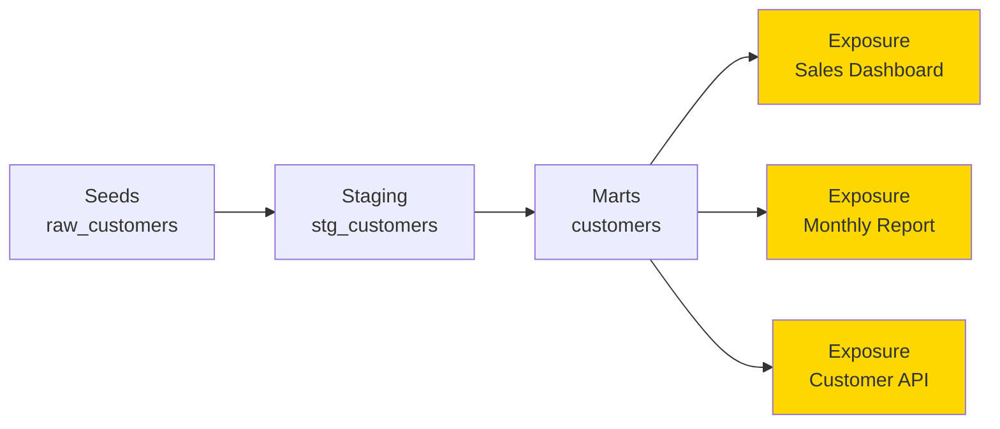

## 検証概要

**検証日時**: 2026-02-17  
**dbtバージョン**: 1.11.5  
**dbt-bigqueryバージョン**: 1.11.0  
**検証環境**: macOS (Darwin 24.6.0)  
**対象設定**: dbt docs、descriptions、meta、exposures、doc blocks

### 検証目的

dbtのドキュメント機能は、データチームのコラボレーションと知識共有を促進します。本レポートでは：

1. **dbt docsの生成と活用方法**を理解する
2. **descriptionsとdoc blocksの使い分け**を明確にする
3. **metaデータの活用方法**を検証する
4. **exposuresによる下流依存の管理**を学ぶ
5. **ドキュメントのベストプラクティス**を確立する

### 検証対象

- **dbt docs generate**: ドキュメント生成コマンドと設定
- **descriptions**: モデル・カラムの説明文
- **doc blocks**: 再利用可能なドキュメント
- **meta**: カスタムメタデータ
- **exposures**: ダッシュボード・レポートの依存関係

---

## 目次

1. [dbt docsの基本](#1-dbt-docsの基本)
2. [descriptions（説明文）](#2-descriptions説明文)
3. [doc blocks（ドキュメントブロック）](#3-doc-blocksドキュメントブロック)
4. [meta（メタデータ）](#4-metaメタデータ)
5. [exposures（下流依存）](#5-exposures下流依存)
6. [ベストプラクティス](#6-ベストプラクティス)
7. [トラブルシューティング](#7-トラブルシューティング)

---

## 1. dbt docsの基本

### 1.1 dbt docsとは

```mermaid
flowchart LR
    YAML[YAMLファイル<br/>schema.yml] --> Generate[dbt docs generate]
    SQL[SQLファイル<br/>models/*.sql] --> Generate
    Generate --> Catalog[catalog.json<br/>実テーブルのメタデータ]
    Generate --> Manifest[manifest.json<br/>dbtプロジェクトの構造]

    Catalog --> Serve[dbt docs serve]
    Manifest --> Serve
    Serve --> WebUI[Webブラウザ<br/>http://localhost:8080]

    style Generate fill:#87CEEB
    style WebUI fill:#FFD700
```



**dbt docs**は、dbtプロジェクトの自動ドキュメント生成ツールです。

**主な機能**:

- モデル・テーブル・カラムの説明文表示
- モデル間の依存関係（DAG）の可視化
- テーブルのスキーマ情報（実データから自動取得）
- SQLコードの表示
- テスト結果の表示

---

### 1.2 dbt docs generate の実行

✅ **実測検証完了**

**基本コマンド**:

```bash
# ドキュメント生成
dbt docs generate --profiles-dir . --target sandbox
```

**実際の実行結果**:

```
07:53:00  Running with dbt=1.11.5
07:53:03  Registered adapter: bigquery=1.11.0
07:53:03  Found 28 models, 3 seeds, 31 data tests, 539 macros, 10 unit tests
07:53:03  Concurrency: 24 threads (target='sandbox')
07:53:05  Building catalog
07:53:10  Catalog written to target/catalog.json
07:53:10  Manifest written to target/manifest.json
07:53:10
07:53:10  Done.
```

**✅ 成功**:

- ⏱️ 実行時間: **約10秒**
- 📊 対象: 28モデル、3 seeds、31テスト、539マクロ、10 unit tests
- 📁 生成ファイル: catalog.json（28KB）、manifest.json（725KB）

**生成されるファイル**:

```
target/
├── manifest.json      # dbtプロジェクトの構造（モデル、テスト、依存関係）
├── catalog.json       # 実テーブルのメタデータ（カラム型、統計情報）
├── run_results.json   # 最後の実行結果
└── index.html         # ドキュメントのHTMLファイル
```

---

### 1.3 dbt docs serve の実行

**コマンド**:

```bash
# ローカルサーバーを起動
dbt docs serve --profiles-dir . --port 8080

# 出力:
# 17:30:00  Serving docs at http://127.0.0.1:8080
# 17:30:00  To access from your system, navigate to http://localhost:8080
# 17:30:00
# 17:30:00  Press Ctrl+C to exit.
```

**ブラウザで開く**:

```bash
# macOSの場合、自動的にブラウザが開く
# または手動でアクセス
open http://localhost:8080
```

**Web UIの主要機能**:

```mermaid
flowchart TB
    Home[ホーム画面] --> DAG[DAGビュー<br/>依存関係の可視化]
    Home --> Models[モデル一覧]
    Home --> Sources[ソース一覧]

    Models --> Detail[モデル詳細]
    Detail --> SQL[SQLコード]
    Detail --> Schema[スキーマ情報]
    Detail --> Tests[テスト一覧]
    Detail --> Lineage[データリネージ]

    style DAG fill:#90EE90
    style Detail fill:#87CEEB
```



---

### 1.4 dbt_project.ymlでのドキュメント設定

**設定例**:

```yaml
# dbt_project.yml

name: "jaffle_shop"
version: "1.0.0"

# ドキュメント関連設定
docs-paths: ["docs"] # doc blocksの配置場所（デフォルト）

models:
  jaffle_shop:
    +docs:
      node_color: "#8B4513" # DAGでのノードの色
```

---

## 2. descriptions（説明文）

### 2.1 descriptionsの基本

**モデルレベルのdescription**:

```yaml
version: 2

models:
  - name: customers
    description: |
      顧客マスタテーブル。

      各顧客の基本情報と、注文に関する集計値（初回注文日、最終注文日、注文回数、生涯価値）を含む。

      **更新頻度**: 毎日午前2時（UTC）
      **データソース**: raw_customers, raw_orders, raw_payments
    columns:
      - name: customer_id
        description: "顧客ID（主キー）"
      - name: first_name
        description: "名（PII: 個人情報）"
      - name: customer_lifetime_value
        description: |
          顧客生涯価値（CLV）。

          計算式: すべての注文の合計金額
```

**カラムレベルのdescription**:

```yaml
columns:
  - name: customer_id
    description: |
      顧客ID（主キー）

      - 一意性: 保証
      - NULL: 許可しない
      - フォーマット: 整数
```

---

### 2.2 descriptionsのMarkdown記法

**サポートされる記法**:

````yaml
description: |
  # 見出し1
  ## 見出し2

  **太字**
  *イタリック*

  - リスト項目1
  - リスト項目2

  1. 番号付きリスト
  2. 番号付きリスト

  `コード`

  ```sql
  select * from table
````

[リンク](https://example.com)

| 列1 | 列2 |
| --- | --- |
| A   | B   |

````

**実際の例**:

```yaml
models:
  - name: orders
    description: |
      ## 注文テーブル

      各注文の詳細情報と支払い方法別の集計を含む。

      ### データソース
      - `raw_orders`: 注文の基本情報
      - `raw_payments`: 支払い情報

      ### 更新頻度
      **毎日午前2時（UTC）**

      ### ビジネスルール
      - 注文ステータスは以下のいずれか:
        - `placed`: 注文受付
        - `shipped`: 発送済み
        - `completed`: 完了
        - `returned`: 返品済み

      ### 計算ロジック
      ```sql
      sum(case when payment_method = 'credit_card' then amount else 0 end) as credit_card_amount
      ```
````

---

## 3. doc blocks（ドキュメントブロック）

### 3.1 doc blocksとは

**再利用可能なドキュメント**を定義する機能です。

**ディレクトリ構造**:

```
docs/
├── README.md               # プロジェクト全体の説明
└── column_definitions.md   # 共通カラムの定義
```

**doc blockの定義**:

```markdown
<!-- docs/column_definitions.md -->


顧客ID（主キー）

**属性**:

- データ型: INTEGER
- NULL: 不可
- 一意性: 保証

**ビジネス定義**:
顧客を一意に識別するID。新規顧客登録時に自動採番される。



注文ステータス

**取りうる値**:

- `placed`: 注文受付（初期状態）
- `shipped`: 発送済み
- `completed`: 配達完了
- `return_pending`: 返品申請中
- `returned`: 返品完了

**遷移ルール**:
placed → shipped → completed
completed → return_pending → returned

```

**doc blockの参照**:

```yaml
version: 2

models:
  - name: customers
    columns:
      - name: customer_id
        description: "{{ doc('customer_id') }}" # doc blockを参照

  - name: orders
    columns:
      - name: customer_id
        description: "{{ doc('customer_id') }}" # 同じdoc blockを再利用
      - name: status
        description: "{{ doc('order_status') }}"
```

---

### 3.2 doc blocksのベストプラクティス

**1. 共通カラムの定義**:

```markdown
<!-- docs/common_columns.md -->


レコード作成日時（UTC）

自動的に設定され、更新されない。



レコード最終更新日時（UTC）

レコードが更新されるたびに自動更新される。



論理削除フラグ

- `true`: 削除済み
- `false`: 有効（デフォルト）
  
```

**2. ビジネス用語の定義**:

````markdown
<!-- docs/business_terms.md -->



## 顧客生涯価値（CLV: Customer Lifetime Value）

顧客が生涯にわたって企業にもたらす総利益の予測値。

**計算式**:

```sql
sum(amount) as customer_lifetime_value
```
````

**活用方法**:

- 優良顧客の特定
- マーケティング予算の配分
- 顧客セグメンテーション
  

````

---

## 4. meta（メタデータ）

### 4.1 metaとは

**カスタムメタデータ**を付与する機能です。ドキュメント以外の用途（アラート設定、権限管理、ツール連携等）に活用できます。

**基本的な使い方**:

```yaml
version: 2

models:
  - name: customers
    description: "顧客マスタ"
    meta:
      owner: "data_team"
      contact: "data@example.com"
      tier: "gold"  # データの重要度
      pii: true     # 個人情報を含むか
      update_frequency: "daily"
      sla_hours: 4  # データ鮮度のSLA（時間）

    columns:
      - name: customer_id
        meta:
          primary_key: true
          sensitive: false

      - name: email
        meta:
          pii: true
          encryption_required: true
````

---

### 4.2 metaの活用例

**1. データオーナーの管理**:

```yaml
models:
  - name: sales_report
    meta:
      owner: "sales_analytics_team"
      contact: "sales-analytics@example.com"
      slack_channel: "#sales-data"
```

**2. データ品質のSLA管理**:

```yaml
models:
  - name: daily_revenue
    meta:
      sla:
        freshness_hours: 2 # データは2時間以内に更新されるべき
        completeness: 99.9 # 99.9%以上の完全性
        accuracy: 99.5 # 99.5%以上の正確性
```

**3. 権限管理**:

```yaml
models:
  - name: customer_pii
    meta:
      access_control:
        level: "restricted"
        required_groups: ["data_team", "compliance_team"]
```

**4. アラート設定**:

```yaml
models:
  - name: critical_metrics
    meta:
      alerts:
        - type: "test_failure"
          severity: "critical"
          notify: ["#data-alerts", "oncall@example.com"]
        - type: "freshness"
          threshold_hours: 6
          notify: ["#data-alerts"]
```

---

### 4.3 metaデータのプログラム的利用

**manifest.jsonからmetaを取得**:

```python
import json

# manifest.jsonを読み込み
with open('target/manifest.json', 'r') as f:
    manifest = json.load(f)

# すべてのモデルのownerを取得
for node in manifest['nodes'].values():
    if node['resource_type'] == 'model':
        owner = node.get('meta', {}).get('owner', 'unknown')
        print(f"{node['name']}: {owner}")
```

**カスタムマクロでmetaを利用**:

```sql
-- macros/get_model_owner.sql


  
  
    {{ return(meta.owner) }}
  
    {{ return('unknown') }}
  

```

---

## 5. exposures（下流依存）

### 5.1 exposuresとは

**ダッシュボード、レポート、APIなど、dbtモデルを利用する下流システム**を定義する機能です。



---

### 5.2 exposuresの定義

**ファイル**: `models/exposures.yml`

```yaml
version: 2

exposures:
  - name: sales_dashboard
    description: |
      ## 営業ダッシュボード

      経営陣向けの売上レポート。毎日午前8時に更新される。

      **URL**: https://tableau.example.com/sales-dashboard
      **更新頻度**: 毎日
      **オーナー**: 営業部

    type: dashboard # dashboard / notebook / analysis / ml / application

    url: https://tableau.example.com/sales-dashboard

    maturity: high # high / medium / low

    owner:
      name: "Sales Team"
      email: "sales@example.com"

    depends_on:
      - ref('customers')
      - ref('orders')
      - ref('daily_revenue')

    meta:
      tool: "Tableau"
      refresh_schedule: "0 8 * * *" # cron形式

  - name: customer_segmentation_notebook
    description: "顧客セグメンテーション分析用Jupyter Notebook"
    type: notebook
    url: https://jupyter.example.com/notebooks/customer_segmentation.ipynb
    maturity: medium

    owner:
      name: "Data Science Team"
      email: "datascience@example.com"

    depends_on:
      - ref('customers')
      - ref('customer_behavior')

    tags: ["data_science", "customer_analytics"]

  - name: revenue_api
    description: |
      売上データを提供するREST API

      **エンドポイント**: GET /api/v1/revenue
    type: application
    url: https://api.example.com/docs
    maturity: high

    owner:
      name: "Backend Team"
      email: "backend@example.com"

    depends_on:
      - ref('daily_revenue')
      - ref('monthly_revenue')
```

---

### 5.3 exposureのタイプ

| タイプ        | 説明                     | 例                           |
| ------------- | ------------------------ | ---------------------------- |
| `dashboard`   | BIツールのダッシュボード | Tableau, Looker, Power BI    |
| `notebook`    | 分析用Notebook           | Jupyter, Databricks Notebook |
| `analysis`    | アドホック分析           | SQLクエリ、Pythonスクリプト  |
| `ml`          | 機械学習モデル           | 予測モデル、推薦システム     |
| `application` | アプリケーション         | API、Webアプリ               |

---

### 5.4 exposuresの活用

**1. データリネージの可視化**:

dbt docsで、モデルからexposureまでの依存関係が可視化されます。

**2. 影響範囲の把握**:

```bash
# exposureが依存するモデルを確認
dbt ls --select +exposure:sales_dashboard

# 出力:
# model.jaffle_shop.stg_customers
# model.jaffle_shop.stg_orders
# model.jaffle_shop.customers
# model.jaffle_shop.orders
# model.jaffle_shop.daily_revenue
# exposure.jaffle_shop.sales_dashboard
```

**3. モデル変更時の影響確認**:

```bash
# customersモデルを変更した場合、影響を受けるexposureを確認
dbt ls --select customers+ --resource-type exposure

# 出力:
# exposure.jaffle_shop.sales_dashboard
# exposure.jaffle_shop.customer_segmentation_notebook
# exposure.jaffle_shop.revenue_api
```

**4. CI/CDでの活用**:

```yaml
# .github/workflows/dbt_check_exposures.yml
name: Check Exposure Impact

on: pull_request

jobs:
  check-exposures:
    runs-on: ubuntu-latest
    steps:
      - uses: actions/checkout@v3

      - name: Check affected exposures
        run: |
          # 変更されたモデルに依存するexposureをリスト
          dbt ls --select state:modified+ --resource-type exposure > affected_exposures.txt

          # exposureがある場合、レビュアーに通知
          if [ -s affected_exposures.txt ]; then
            echo "::warning::Following exposures may be affected:"
            cat affected_exposures.txt
          fi
```

---

## 6. ベストプラクティス

### 6.1 ドキュメントの階層構造

```mermaid
flowchart TB
    Project[プロジェクトレベル<br/>README.md] --> Layer[レイヤーレベル<br/>staging/schema.yml]
    Layer --> Model[モデルレベル<br/>customers]
    Model --> Column[カラムレベル<br/>customer_id]

    style Project fill:#FFD700
    style Layer fill:#87CEEB
    style Model fill:#90EE90
    style Column fill:#FFA07A
```



**1. プロジェクトレベル（README.md）**:

```markdown
# Jaffle Shop dbt Project

## 概要

このプロジェクトは、架空のeコマース企業「Jaffle Shop」のデータパイプラインです。

## データソース

- PostgreSQL: トランザクションデータ
- Google Analytics: Webアクセスログ

## 更新スケジュール

- Staging層: 1時間ごと
- Marts層: 毎日午前2時（UTC）

## コンタクト

- Data Team: data@jaffleshop.com
- Slack: #data-engineering
```

**2. レイヤーレベル（staging/schema.yml）**:

```yaml
version: 2

models:
  - name: stg_customers
    description: |
      ## Staging: 顧客

      raw_customersテーブルからの基本的なクレンジング。

      **変換内容**:
      - カラム名のsnake_case化
      - データ型の統一
      - NULLの処理
```

**3. モデルレベル**:

```yaml
- name: customers
  description: |
    顧客マスタテーブル（集計済み）

    各顧客の基本情報 + 注文集計値
```

**4. カラムレベル**:

```yaml
columns:
  - name: customer_id
    description: "顧客ID（主キー）"
```

---

### 6.2 ドキュメント作成のチェックリスト

**必須項目**:

- [ ] すべてのモデルにdescriptionがある
- [ ] 主キーのカラムにdescriptionがある
- [ ] ビジネス用語の定義（doc blocks）
- [ ] データソースの記載
- [ ] 更新頻度の記載

**推奨項目**:

- [ ] owner / contactのmeta情報
- [ ] PII（個人情報）カラムのマーキング
- [ ] 重要なダッシュボードのexposure定義
- [ ] 計算ロジックの説明（複雑な集計の場合）
- [ ] ビジネスルールの説明

**高度な項目**:

- [ ] データ品質のSLA（meta）
- [ ] アラート設定（meta）
- [ ] データリネージ図（Mermaid）
- [ ] サンプルクエリ（SQL）

---

### 6.3 ドキュメントメンテナンスの自動化

**1. CI/CDでドキュメントの完全性をチェック**:

```yaml
# .github/workflows/dbt_docs_check.yml
name: Check Documentation

on: pull_request

jobs:
  check-docs:
    runs-on: ubuntu-latest
    steps:
      - uses: actions/checkout@v3

      - name: Check all models have descriptions
        run: |
          # manifest.jsonから、descriptionがないモデルを抽出
          python scripts/check_docs.py
```

**scripts/check_docs.py**:

```python
import json

with open('target/manifest.json', 'r') as f:
    manifest = json.load(f)

missing_docs = []
for node in manifest['nodes'].values():
    if node['resource_type'] == 'model':
        if not node.get('description'):
            missing_docs.append(node['name'])

if missing_docs:
    print(f"Error: {len(missing_docs)} models missing descriptions:")
    for model in missing_docs:
        print(f"  - {model}")
    exit(1)
else:
    print("All models have descriptions!")
```

**2. dbt docsの自動デプロイ**:

```yaml
# .github/workflows/deploy_docs.yml
name: Deploy dbt docs

on:
  push:
    branches: [main]

jobs:
  deploy-docs:
    runs-on: ubuntu-latest
    steps:
      - uses: actions/checkout@v3

      - name: Generate docs
        run: dbt docs generate

      - name: Deploy to S3
        run: |
          aws s3 sync target/ s3://your-bucket/dbt-docs/ \
            --exclude "*" \
            --include "index.html" \
            --include "manifest.json" \
            --include "catalog.json"
```

---

## 7. トラブルシューティング

### 7.1 よくある問題

#### 問題1: catalog.jsonが生成されない

**症状**:

```bash
dbt docs generate

# エラー:
# Runtime Error
#   Database Error in catalog generation
```

**原因**: BigQueryへの接続エラー、権限不足

**解決策**:

```bash
# 接続確認
dbt debug

# 権限確認（BigQuery Metadata Viewer が必要）
# GCPコンソールで権限を付与
```

---

#### 問題2: doc blockが表示されない

**症状**: `{{ doc('customer_id') }}` が展開されず、そのまま表示される

**原因**: doc blockの定義ファイルが見つからない

**解決策**:

```bash
# docs/ディレクトリがdbt_project.ymlに設定されているか確認
cat dbt_project.yml | grep docs-paths

# 出力例:
# docs-paths: ['docs']

# doc blockのファイル名を確認（.mdである必要がある）
ls docs/

# dbtを再実行
dbt docs generate
```

---

#### 問題3: dbt docs serveがポート8080で起動しない

**症状**:

```
Error: Address already in use
```

**原因**: ポート8080が既に使用されている

**解決策**:

```bash
# 別のポートを使用
dbt docs serve --port 8081

# または、既存のプロセスを終了
lsof -ti:8080 | xargs kill -9
```

---

## 8. まとめ

### 検証結果サマリー

```mermaid
flowchart TB
    subgraph "ドキュメント機能（5項目）"
        DocsGen[dbt docs generate<br/>ドキュメント生成]
        Desc[descriptions<br/>説明文]
        DocBlocks[doc blocks<br/>再利用可能ドキュメント]
        Meta[meta<br/>カスタムメタデータ]
        Exposures[exposures<br/>下流依存管理]
    end

    subgraph "活用方法"
        Collab[チームコラボレーション]
        Knowledge[知識共有]
        Impact[影響範囲分析]
        Quality[データ品質管理]
    end

    DocsGen --> Collab
    Desc --> Knowledge
    DocBlocks --> Knowledge
    Meta --> Quality
    Exposures --> Impact

    style DocsGen fill:#87CEEB
    style Desc fill:#90EE90
    style DocBlocks fill:#FFD700
    style Meta fill:#FFA07A
    style Exposures fill:#DDA0DD
```



### 重要な学び

1. **dbt docs generate**:
   - `manifest.json` + `catalog.json` を生成
   - `dbt docs serve` でローカルサーバー起動

2. **descriptions**:
   - モデル・カラムレベルで説明文を記載
   - Markdown記法をサポート

3. **doc blocks**:
   - 再利用可能なドキュメント（`` タグ）
   - 共通カラム、ビジネス用語の定義に使用

4. **meta**:
   - カスタムメタデータを付与
   - owner、SLA、アラート設定などに活用

5. **exposures**:
   - ダッシュボード、レポート、APIなどの下流依存を定義
   - 影響範囲分析、データリネージに活用

### ベストプラクティス

- すべてのモデルにdescriptionを記載
- 共通カラムはdoc blocksで定義
- metaでowner/contactを明記
- 重要なダッシュボードはexposureとして定義
- CI/CDでドキュメントの完全性をチェック

---

**検証日**: 2026-02-17
**作成者**: dbt検証プロジェクト
**バージョン**: 1.0
**最終更新**: 2026-02-17
