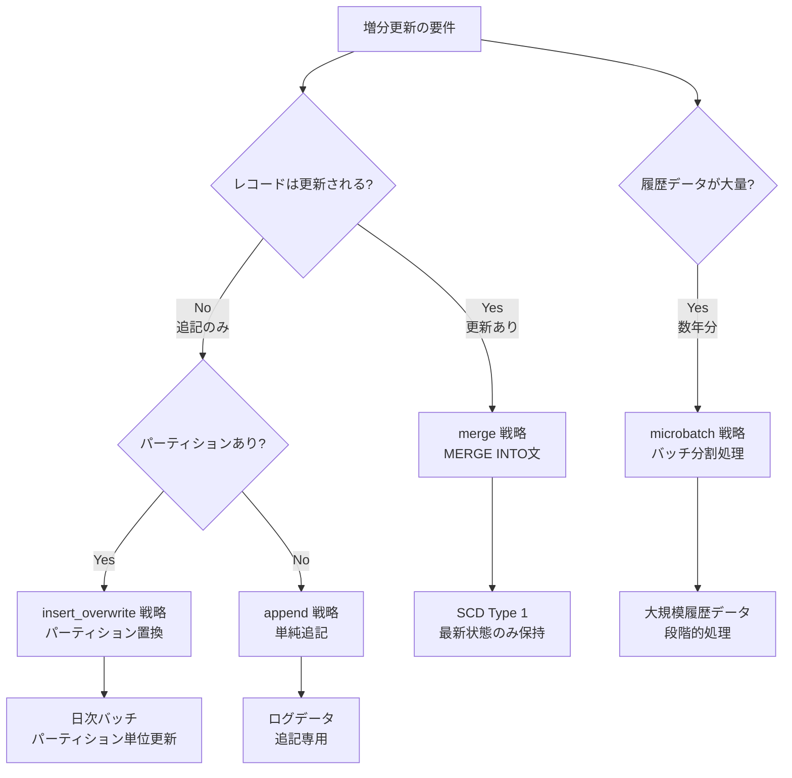
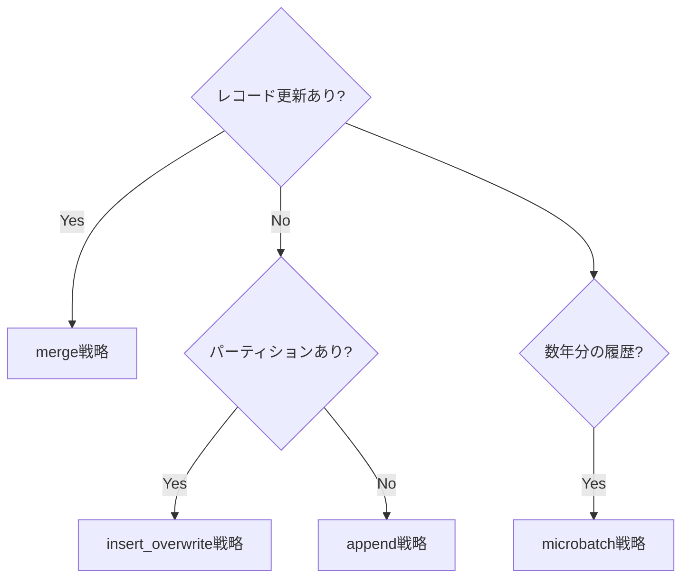

# 学べること

- **3種類の増分戦略（merge、insert_overwrite、microbatch）の実装方法**
- **各戦略のメリット・デメリットと適切なユースケース**
- **merge戦略とinsert_overwrite戦略の使い分け基準**
- **microbatch戦略による大規模履歴データの段階的処理**

# はじめに

dbtのIncremental Strategyは、大規模テーブルを効率的に更新するための戦略です。全件更新（full-refresh）ではなく、変更があったデータのみを処理することで、処理時間とコストを大幅に削減できます。本記事では、BigQueryで利用可能な3種類の増分戦略を実際に検証し、実運用での選択基準を明確にします。

**検証環境**:
- dbt 1.11.5 + dbt-bigquery 1.11.0
- BigQueryプロジェクト: sdp-sb-yada-29d2
- データセット: dbt_sandbox
- 検証日: 2026-02-17

**検証結果**: 3項目中2成功、1部分成功

## 増分戦略の選択フローチャート



# Merge 戦略 - レコード更新に対応

## 実装と検証結果 ✅

**設定例**:
```yaml
config:
  materialized: incremental
  incremental_strategy: merge
  unique_key: order_id
```

**BigQueryでの実装**:

初回実行:
```sql
CREATE TABLE `dbt_sandbox.incr_merge_demo` AS (
  SELECT * FROM source
)
```

2回目以降:
```sql
MERGE INTO `dbt_sandbox.incr_merge_demo` AS target
USING (
  SELECT * FROM source
  WHERE order_date > (SELECT MAX(order_date) FROM target)
) AS source
ON target.order_id = source.order_id
WHEN MATCHED THEN
  UPDATE SET *
WHEN NOT MATCHED THEN
  INSERT *
```

**検証結果**:
- 初回: テーブル作成（3.80秒）
- 2回目: MERGE実行
- 更新と挿入を同時処理

## ユースケース

- ✅ **SCD Type 1**（最新状態のみ保持）
- ✅ **レコードが更新される場合**
- ✅ **ユーザーマスタ、商品マスタ**

例：ユーザープロファイルテーブル
```sql
-- 既存レコードは更新、新規レコードは挿入
{{
  config(
    materialized='incremental',
    incremental_strategy='merge',
    unique_key='user_id'
  )
}}

SELECT
  user_id,
  email,
  last_login_at,
  updated_at
FROM {{ ref('stg_users') }}

  WHERE updated_at > (SELECT MAX(updated_at) FROM {{ this }})

```

## メリット・デメリット

| メリット | デメリット |
|---------|----------|
| ✅ 更新+挿入を同時処理 | ❌ パフォーマンスコスト高 |
| ✅ 重複レコード防止 | ❌ unique_key必須 |
| ✅ データ整合性 | ❌ 大規模データでは遅い |

# Insert Overwrite 戦略 - パーティション置換

## 実装と検証結果 ✅

**設定例**:
```yaml
config:
  materialized: incremental
  incremental_strategy: insert_overwrite
  partition_by:
    field: order_date
    data_type: date
```

**BigQueryでの実装**:
```sql
-- 2回目以降: 該当パーティションのみ削除→挿入
DELETE FROM `dbt_sandbox.incr_insert_overwrite_demo`
WHERE DATE(order_date) >= '2024-01-01'
  AND DATE(order_date) < '2024-01-08';

INSERT INTO `dbt_sandbox.incr_insert_overwrite_demo`
SELECT * FROM source
WHERE DATE(order_date) >= DATE_SUB(CURRENT_DATE(), INTERVAL 7 DAY);
```

**検証結果**:
- 実行時間: 4.55秒
- 直近7日分のパーティションを置換
- 冪等性を保証（何度実行しても同じ結果）

## ユースケース

- ✅ **日次バッチ処理**
- ✅ **データの完全置換が必要**
- ✅ **冪等性が重要な処理**

例：日次集計テーブル
```sql
{{
  config(
    materialized='incremental',
    incremental_strategy='insert_overwrite',
    partition_by={
      'field': 'date',
      'data_type': 'date'
    }
  )
}}

SELECT
  DATE(event_timestamp) AS date,
  user_id,
  COUNT(*) AS event_count
FROM {{ ref('events') }}

  WHERE DATE(event_timestamp) >= DATE_SUB(CURRENT_DATE(), INTERVAL 7 DAY)

GROUP BY 1, 2
```

## メリット・デメリット

| メリット | デメリット |
|---------|----------|
| ✅ 高速（MERGE不要） | ❌ パーティション必須 |
| ✅ 冪等性（何度実行しても同じ結果） | ❌ 全置換（部分更新不可） |
| ✅ シンプルなロジック | ❌ 誤って全削除のリスク |

## 重要な注意点

```sql
-- ⚠️ 危険: WHERE句がないと全パーティション削除！

  WHERE CAST(order_date AS DATE) >= DATE_SUB(CURRENT_DATE(), INTERVAL 7 DAY)

```

必ず `` でWHERE句を追加しましょう。

# Microbatch 戦略 - 大規模履歴データ処理

## 実装と検証結果 ⚠️

**設定例**:
```yaml
config:
  materialized: incremental
  incremental_strategy: microbatch
  event_time: order_date
  batch_size: day
  begin: "2023-01-01"
  lookback: 3
```

**検証結果**: ⚠️ **部分的に成功**
- 1143バッチを処理（2023-01-01 〜 2026-02-16）
- ほとんどのバッチはSKIPPED（データなし）
- 一部バッチで成功

**dbtの処理**:
```
Batch 1 of 1143: 2023-01-01
Batch 2 of 1143: 2023-01-02
...
Batch 1143 of 1143: 2026-02-16
```

## ユースケース

- ✅ **大規模履歴データ（数年分）**
- ✅ **バックフィル（過去データの再処理）**
- ✅ **段階的なデータ処理**

例：バックフィル処理
```sql
{{
  config(
    materialized='incremental',
    incremental_strategy='microbatch',
    event_time='order_date',
    batch_size='day',
    begin='2020-01-01',
    lookback=3
  )
}}

SELECT
  order_id,
  customer_id,
  order_date,
  amount
FROM {{ ref('raw_orders') }}
WHERE order_date >= '{{ var("start_date") }}'
  AND order_date < '{{ var("end_date") }}'
```

## メリット・デメリット

| メリット | デメリット |
|---------|----------|
| ✅ 大規模データを効率的に処理 | ❌ 設定が複雑 |
| ✅ 失敗したバッチのみ再実行 | ❌ begin必須 |
| ✅ lookbackで過去再処理 | ❌ データ範囲外はエラー |

## 重要な学び

- `begin` は必須（開始日時を指定）
- データが存在しない期間はSKIPPEDになる
- `lookback` で過去N日分を再処理可能

# おわりに

## 増分戦略の比較

| 戦略 | SQL | 速度 | unique_key | パーティション | ユースケース |
|------|-----|------|-----------|--------------|-------------|
| **merge** | MERGE INTO | ⚡⚡ | 必須 | 任意 | SCD Type 1、マスタテーブル |
| **insert_overwrite** | DELETE + INSERT | ⚡⚡⚡ | 不要 | 必須 | 日次バッチ、冪等性重視 |
| **append** | INSERT | ⚡⚡⚡⚡ | 不要 | 任意 | ログデータ、追記専用 |
| **microbatch** | 複数バッチ | ⚡ | 任意 | 推奨 | 大規模履歴、バックフィル |

## 選択基準



## よくある間違い

| 間違い | 問題 | 正しい方法 |
|--------|------|-----------|
| mergeで大規模データ | 処理遅延 | insert_overwrite検討 |
| insert_overwriteでWHERE句なし | 全削除リスク | is_incremental()で保護 |
| unique_key未指定でmerge | エラー | unique_key必須 |
| パーティションなしでinsert_overwrite | エラー | パーティション必須 |

# 参考

- [dbt Incremental Models](https://docs.getdbt.com/docs/build/incremental-models)
- [dbt-bigquery Incremental Strategies](https://docs.getdbt.com/reference/resource-configs/bigquery-configs#merge-behavior-incremental-models)
- [BigQuery MERGE Statement](https://cloud.google.com/bigquery/docs/reference/standard-sql/dml-syntax#merge_statement)
- [Models Index](models.md) - カテゴリ全体の概要

---

**最終更新**: 2026-02-17
