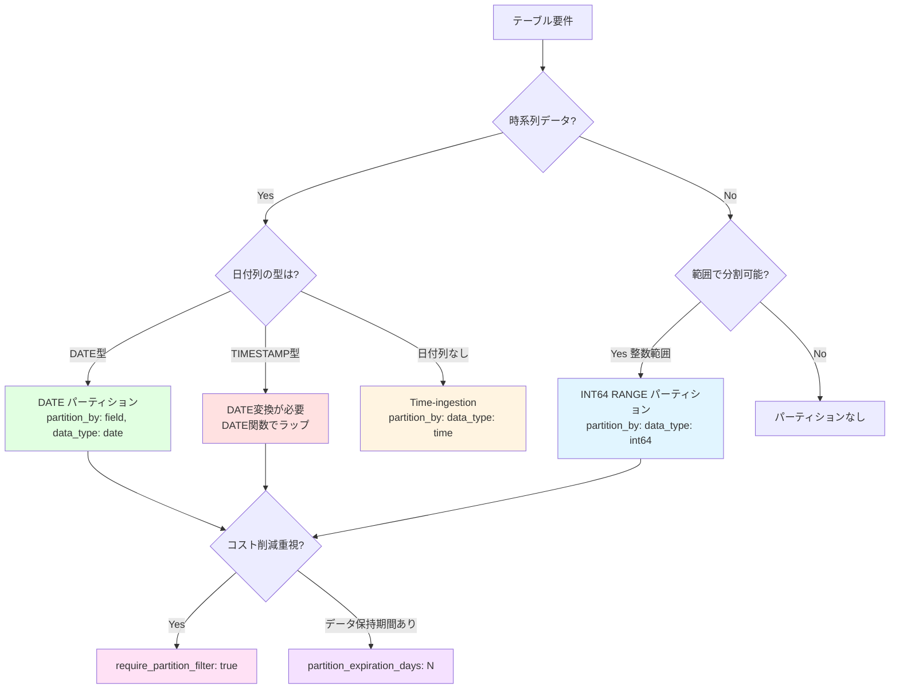

# 学べること

- **4種類のパーティション戦略の実装方法と検証結果**
- **TIMESTAMP パーティションのエラーとその回避方法**
- **パーティションフィルタ強制によるコスト削減テクニック**
- **パーティション有効期限による自動データ削除**

# はじめに

BigQueryのパーティショニングは、大規模テーブルのクエリコストとパフォーマンスを劇的に改善する重要な機能です。本記事では、dbt + BigQueryで利用可能な4種類のパーティション戦略を実際に検証し、成功パターンと失敗パターンを明らかにします。

**検証環境**:
- dbt 1.11.5 + dbt-bigquery 1.11.0
- BigQueryプロジェクト: sdp-sb-yada-29d2
- データセット: dbt_sandbox
- 検証日: 2026-02-17

**検証結果**: 6項目中4成功、2失敗（学習目的）

## パーティション戦略の選択フローチャート



# DATE と INT64 RANGE パーティション - 推奨パターン

## DATE パーティション ✅

**設定例**:
```yaml
config:
  materialized: table
  partition_by:
    field: order_date
    data_type: date
    granularity: day
```

**検証結果**:
- 実行時間: 5.10秒
- パーティション: 日付ごとに作成
- BigQueryコンソールでパーティション情報確認可能

**ユースケース**:
- ✅ 日次バッチ処理
- ✅ 時系列分析
- ✅ ログデータ、イベントデータ

**コスト削減効果**:
```sql
-- ✅ パーティションフィルタあり（推奨）
SELECT * FROM partition_date_demo
WHERE order_date = '2024-01-01'
-- → 1日分のみスキャン

-- ❌ パーティションフィルタなし（非推奨）
SELECT * FROM partition_date_demo
WHERE customer_id = 1
-- → 全パーティションスキャン（コスト高）
```

## INT64 RANGE パーティション ✅

**設定例**:
```yaml
config:
  materialized: table
  partition_by:
    field: customer_id
    data_type: int64
    range:
      start: 0
      end: 1000
      interval: 10
```

**BigQueryでの実装**:
```sql
CREATE TABLE `dbt_sandbox.partition_int_demo`
PARTITION BY RANGE_BUCKET(customer_id, GENERATE_ARRAY(0, 1000, 10))
AS (...)
```

**検証結果**:
- 実行時間: 4.16秒
- パーティション: customer_id を 10刻みで分割（0-9, 10-19, ...）

**ユースケース**:
- ✅ ユーザーID範囲による分割
- ✅ 地域コード、店舗IDなどの範囲分割
- ✅ 時系列以外のパーティショニング

**注意点**:
- 範囲外の値（<0 または >=1000）は特別なパーティションに格納される
- `interval` は均等分割のみ（カスタム境界値は `GENERATE_ARRAY` で指定）

# TIMESTAMP と Time-ingestion - 制約と回避方法

## TIMESTAMP パーティション ❌

**設定例（失敗）**:
```yaml
config:
  materialized: table
  partition_by:
    field: order_date
    data_type: timestamp
    granularity: day
```

**検証結果**: ❌ **失敗**

```
Database Error:
PARTITION BY expression must be DATE(<timestamp_column>),
TIMESTAMP_TRUNC(<timestamp_column>, DAY/HOUR/MONTH/YEAR), ...
```

**原因**: BigQueryはTIMESTAMP列を直接パーティションキーにできない

**正しい設定**:

方法1: DATE関数でラップ
```yaml
config:
  materialized: table
  partition_by:
    field: "DATE(order_date)"
    data_type: date
    granularity: day
```

方法2: モデル内でDATE列を作成
```sql
SELECT
  order_id,
  customer_id,
  order_date,
  DATE(order_date) AS order_date_only  -- この列でパーティション
FROM {{ ref('stg_orders') }}
```

**重要な学び**:
- ⚠️ TIMESTAMP列は `DATE()` または `TIMESTAMP_TRUNC()` で変換が必要
- ⚠️ dbt-bigqueryの `data_type: timestamp` は **直接は使えない**

## Time-ingestion パーティション ❌

**設定例（失敗）**:
```yaml
config:
  materialized: table
  partition_by:
    data_type: time
    granularity: day
```

**検証結果**: ❌ **失敗**

```
Runtime Error: Could not parse partition config
```

**原因**: dbt-bigquery 1.11.0でのTime-ingestionパーティション設定構文が不明確

**BigQueryでの正しいSQL**:
```sql
CREATE TABLE `dbt_sandbox.partition_ingestion_demo`
PARTITION BY _PARTITIONTIME  -- 疑似列を使用
AS (...)
```

**dbtでの代替方法**:

方法1: post-hookで設定
```sql
{{
  config(
    materialized='table',
    post_hook=[
      "ALTER TABLE {{ this }} SET OPTIONS (partition_expiration_days=90)"
    ]
  )
}}
```

方法2: DATE列を追加してパーティション
```sql
SELECT
  *,
  CURRENT_DATE() AS ingestion_date
FROM {{ ref('source') }}
```

**重要な学び**:
- ⚠️ Time-ingestion パーティションはdbt-bigqueryで直接サポートが不完全
- ✅ 代替: `CURRENT_DATE()` や `CURRENT_TIMESTAMP()` を列として追加してパーティション

# パーティションフィルタ強制とデータ有効期限

## require_partition_filter ✅

**設定例**:
```yaml
config:
  materialized: table
  partition_by:
    field: order_date
    data_type: date
  require_partition_filter: true
```

**検証結果**: ✅ **成功**
- テーブル作成成功
- パーティションフィルタなしのクエリは **エラーになる**

**クエリ例**:
```sql
-- ✅ 成功（パーティションフィルタあり）
SELECT * FROM partition_filter_required_demo
WHERE order_date = '2024-01-01';

-- ❌ エラー（パーティションフィルタなし）
SELECT * FROM partition_filter_required_demo
WHERE customer_id = 1;
-- Error: Cannot query over table without a filter over column(s) 'order_date'
```

**ユースケース**:
- ✅ 大規模テーブルで意図しない全件スキャンを防止
- ✅ コスト管理が重要なプロジェクト
- ✅ アナリストが直接クエリする環境

**推奨設定**:
- 本番環境の大規模factテーブルには **必ず設定すべき**
- 開発環境では柔軟性のため `false` も検討

## partition_expiration_days ✅

**設定例**:
```yaml
config:
  materialized: table
  partition_by:
    field: order_date
    data_type: date
  partition_expiration_days: 7
```

**検証結果**: ✅ **成功**
- 実行時間: 5.22秒
- 7日以上前のパーティションは自動削除される

**ユースケース**:
- ✅ ログデータ（保持期間: 30日、90日など）
- ✅ 一時的な分析テーブル
- ✅ GDPRなどの法的要件（データ削除）

**コスト削減効果**:
```
データ保持期間 7日:
- ストレージコスト: 1/52 (365日 → 7日)
- 自動削除: 管理コストなし
```

**注意点**:
- ⚠️ 削除は **取り消せない**（バックアップ推奨）
- ⚠️ テーブルレベルの `hours_to_expiration` とは併用できない

# おわりに

## パーティション設定まとめ

| パーティション方式 | 状態 | 推奨度 | ユースケース |
|-------------------|------|--------|-------------|
| **DATE** | ✅ | ⭐⭐⭐⭐⭐ | 日次データ、時系列分析 |
| **TIMESTAMP** | ⚠️ | ⭐⭐ | DATE変換が必要（推奨しない） |
| **INT64 RANGE** | ✅ | ⭐⭐⭐⭐ | ユーザーID範囲、地域コード |
| **Time-ingestion** | ❌ | ⭐ | dbtサポート不完全（代替手段推奨） |
| **require_partition_filter** | ✅ | ⭐⭐⭐⭐⭐ | 大規模テーブルに必須 |
| **partition_expiration_days** | ✅ | ⭐⭐⭐⭐ | ログ、一時データ |

## ベストプラクティス

大規模テーブルの推奨設定:
```yaml
config:
  materialized: table
  partition_by:
    field: event_date
    data_type: date
  require_partition_filter: true
  partition_expiration_days: 90
```

# 参考

- [BigQuery Partitioned Tables](https://cloud.google.com/bigquery/docs/partitioned-tables)
- [dbt-bigquery Partition Configuration](https://docs.getdbt.com/reference/resource-configs/bigquery-configs#partition-clause)
- [Models Index](index.md) - カテゴリ全体の概要
- [パーティショニング＆クラスタリングガイド](../../features/partitioning-clustering-guide.md) - 専門ガイド

---

**最終更新**: 2026-02-17
