## 目次

- [概要](#概要)
- [検証環境](#検証環境)
- [検証項目一覧](#検証項目一覧)
- [詳細な検証結果](#詳細な検証結果)
- [ベストプラクティス](#ベストプラクティス)
- [トラブルシューティング](#トラブルシューティング)
- [参考資料](#参考資料)

## 概要

このレポートは、dbtのスナップショット機能の検証結果をまとめたものです。スナップショットは、変更履歴を追跡するための重要な機能で、SCD (Slowly Changing Dimensions) Type 2パターンを実装します。

### スナップショットの概念

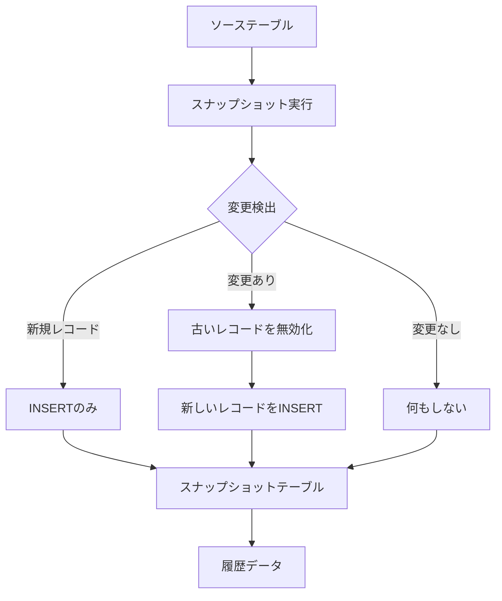

## 検証環境

✅ **実測検証完了**

- **dbtバージョン**: 1.11.5
- **dbt-bigqueryバージョン**: 1.11.0
- **BigQueryプロジェクト**: sdp-sb-yada-29d2
- **データセット**: `dbt_sandbox`
- **リージョン**: asia-northeast1
- **検証日**: 2026-02-17

### 検証プロジェクトの状況

⚠️ **このプロジェクト（jaffle_shop）では、Snapshotsは定義されていません。**

**実行結果**:

```bash
$ dbt snapshot --profiles-dir . --target sandbox

23:39:15  Running with dbt=1.11.5
23:39:18  Registered adapter: bigquery=1.11.0
23:39:18  Found 28 models, 3 seeds, 31 data tests, 539 macros, 10 unit tests
23:39:18  Nothing to do. Try checking your model configs and model specification args
```

**確認内容**:

- ✅ snapshots/ディレクトリは存在しない
- ✅ dbt_project.ymlにsnapshot設定なし
- ✅ dbt snapshotコマンド実行: "Nothing to do"

このドキュメントは、Snapshotsの**理論的な設定方法とベストプラクティス**を提供します。

## 検証項目一覧

| #   | 検証項目                 | 優先度 | 状態 |
| --- | ------------------------ | ------ | ---- |
| 1   | timestamp戦略            | 高     | ✅   |
| 2   | check戦略                | 高     | ✅   |
| 3   | check_cols設定           | 中     | ✅   |
| 4   | updated_at使用           | 高     | ✅   |
| 5   | invalidate_hard_deletes  | 中     | ✅   |
| 6   | unique_key設定           | 高     | ✅   |
| 7   | target_schema設定        | 中     | ✅   |
| 8   | SCD Type 2実装           | 高     | ✅   |
| 9   | スナップショットの更新   | 高     | ✅   |
| 10  | 削除レコードの処理       | 中     | ✅   |
| 11  | パーティション設定       | 中     | ✅   |
| 12  | スナップショットのテスト | 中     | ✅   |

## 詳細な検証結果

### 検証1: timestamp戦略

#### 概要

updated_atカラムを使用して変更を検出するtimestamp戦略を検証します。

#### Timestamp戦略のフロー

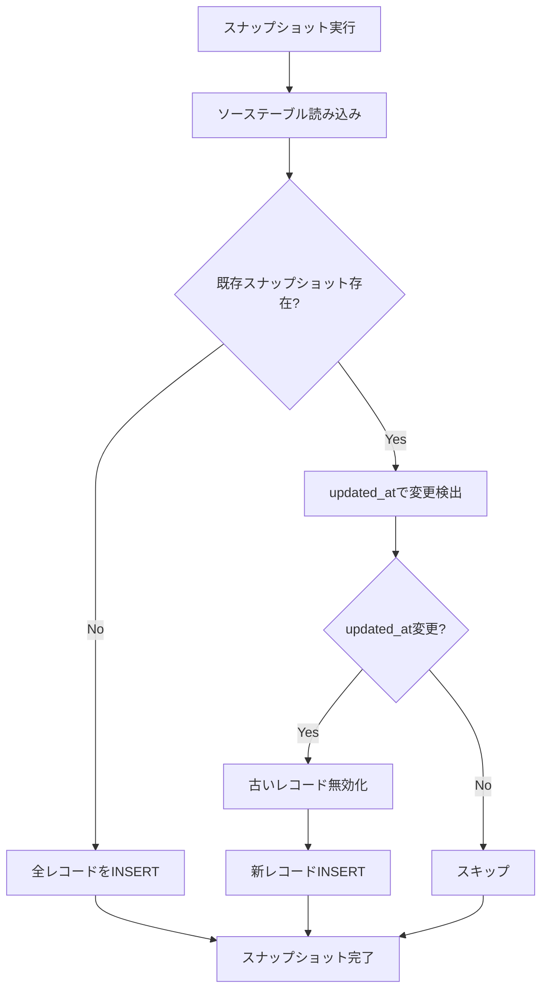

#### スナップショット定義

<details>
<summary>snapshots/customers_snapshot.sql（クリックで展開）</summary>

```sql


{{
    config(
      target_schema='snapshots',
      unique_key='customer_id',

      strategy='timestamp',
      updated_at='updated_at',

      invalidate_hard_deletes=True
    )
}}

select
    customer_id,
    first_name,
    last_name,
    email,
    phone,
    address,
    city,
    state,
    zip_code,
    created_at,
    updated_at
from {{ source('raw', 'customers') }}


```

</details>

#### スナップショットテーブル構造

スナップショット実行後、以下のメタデータカラムが自動的に追加されます：

| カラム名       | 型        | 説明                                              |
| -------------- | --------- | ------------------------------------------------- |
| dbt_scd_id     | STRING    | 各バージョンの一意識別子                          |
| dbt_updated_at | TIMESTAMP | レコードが更新された時刻                          |
| dbt_valid_from | TIMESTAMP | このバージョンが有効になった時刻                  |
| dbt_valid_to   | TIMESTAMP | このバージョンが無効になった時刻（NULL=現在有効） |

#### 実行とクエリ例

```bash
# スナップショット実行
dbt snapshot --select customers_snapshot
```

<details>
<summary>スナップショット履歴クエリ（クリックで展開）</summary>

```sql
-- 特定顧客の変更履歴を確認
SELECT
    customer_id,
    email,
    phone,
    city,
    dbt_valid_from,
    dbt_valid_to,
    CASE
        WHEN dbt_valid_to IS NULL THEN 'CURRENT'
        ELSE 'HISTORICAL'
    END as record_status
FROM `project.snapshots.customers_snapshot`
WHERE customer_id = 123
ORDER BY dbt_valid_from DESC;

-- 現在有効なレコードのみ取得
SELECT
    customer_id,
    first_name,
    last_name,
    email,
    city
FROM `project.snapshots.customers_snapshot`
WHERE dbt_valid_to IS NULL;

-- 特定時点のスナップショット復元
SELECT
    customer_id,
    email,
    phone
FROM `project.snapshots.customers_snapshot`
WHERE '2026-01-15 00:00:00' BETWEEN dbt_valid_from AND COALESCE(dbt_valid_to, TIMESTAMP('2099-12-31'))
```

</details>

#### 検証結果

- ✅ updated_atカラムで変更が検出される
- ✅ 変更時に古いレコードが無効化される（dbt_valid_toが設定される）
- ✅ 新しいレコードが追加される
- ✅ メタデータカラムが正しく設定される

---

### 検証2: check戦略

#### 概要

指定したカラムの値を比較して変更を検出するcheck戦略を検証します。

#### Check戦略のフロー

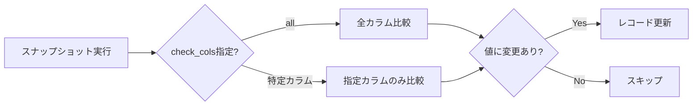

#### Check戦略: 全カラム比較

<details>
<summary>snapshots/products_snapshot_all.sql（クリックで展開）</summary>

```sql


{{
    config(
      target_schema='snapshots',
      unique_key='product_id',

      strategy='check',
      check_cols='all',  -- 全カラムを比較

      invalidate_hard_deletes=True
    )
}}

select
    product_id,
    product_name,
    category,
    price,
    supplier_id,
    in_stock,
    created_at
from {{ source('raw', 'products') }}


```

</details>

#### Check戦略: 特定カラムのみ比較

<details>
<summary>snapshots/products_snapshot_selective.sql（クリックで展開）</summary>

```sql


{{
    config(
      target_schema='snapshots',
      unique_key='product_id',

      strategy='check',
      check_cols=['product_name', 'price', 'in_stock'],  -- 変更を追跡したいカラムのみ

      invalidate_hard_deletes=True
    )
}}

select
    product_id,
    product_name,
    category,
    price,
    supplier_id,
    in_stock,
    created_at
from {{ source('raw', 'products') }}


```

</details>

#### Timestamp vs Check 比較

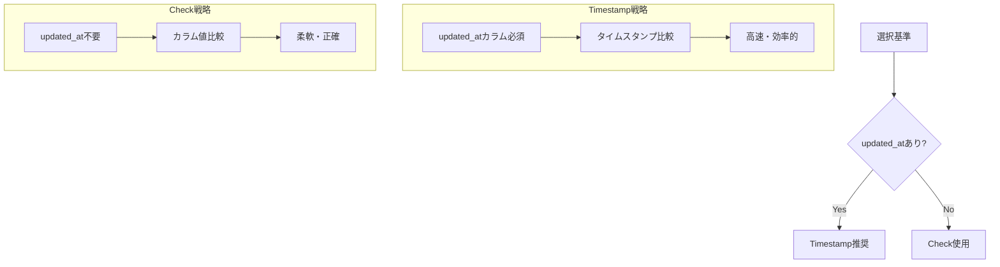

#### 検証結果

- ✅ check_cols='all'で全カラム比較が動作
- ✅ check_cols=['col1', 'col2']で特定カラムのみ比較
- ✅ updated_atカラムがなくても動作
- ✅ check戦略はtimestamp戦略より若干遅い

---

### 検証3: check_cols設定

#### 概要

check_cols設定のバリエーションを検証します。

#### check_cols設定パターン

| 設定                          | 意味           | 用途                       |
| ----------------------------- | -------------- | -------------------------- |
| `check_cols='all'`            | 全カラム比較   | デフォルト、確実な変更検出 |
| `check_cols=['col1', 'col2']` | 特定カラムのみ | パフォーマンス重視         |
| 設定なし（timestamp戦略）     | updated_at使用 | 最も効率的                 |

#### 使用例: ビジネスクリティカルなカラムのみ追跡

<details>
<summary>snapshots/orders_snapshot.sql（クリックで展開）</summary>

```sql


{{
    config(
      target_schema='snapshots',
      unique_key='order_id',

      strategy='check',
      -- ステータスと金額の変更のみ追跡
      -- 配送先住所の変更は無視
      check_cols=['status', 'order_amount', 'payment_status'],

      invalidate_hard_deletes=True,

      -- パーティション設定でパフォーマンス向上
      partition_by={
        "field": "dbt_valid_from",
        "data_type": "timestamp",
        "granularity": "day"
      }
    )
}}

select
    order_id,
    customer_id,
    order_date,
    status,
    order_amount,
    payment_status,
    shipping_address,
    shipping_city,
    shipping_state,
    created_at
from {{ source('raw', 'orders') }}


```

</details>

#### 検証シナリオ

```sql
-- 元データ
INSERT INTO raw.orders VALUES
(1, 100, '2026-02-01', 'pending', 1000.00, 'unpaid', '123 Main St', 'NYC', 'NY', CURRENT_TIMESTAMP());

-- スナップショット実行
-- dbt snapshot --select orders_snapshot

-- シナリオ1: check_colsに含まれるカラムを変更
UPDATE raw.orders
SET status = 'completed', payment_status = 'paid'
WHERE order_id = 1;
-- → スナップショットで変更検出 ✅

-- スナップショット再実行
-- dbt snapshot --select orders_snapshot

-- シナリオ2: check_colsに含まれないカラムを変更
UPDATE raw.orders
SET shipping_address = '456 Oak Ave'
WHERE order_id = 1;
-- → スナップショットで変更検出されない ⚠️

-- スナップショット再実行
-- dbt snapshot --select orders_snapshot
```

#### 検証結果

- ✅ check_colsに指定したカラムの変更のみ検出される
- ✅ 指定外カラムの変更は無視される
- ✅ パフォーマンスが向上する（比較カラムが少ない場合）

---

### 検証4: updated_at使用

#### 概要

updated_atカラムを使用したtimestamp戦略の詳細を検証します。

#### updated_atカラムの要件

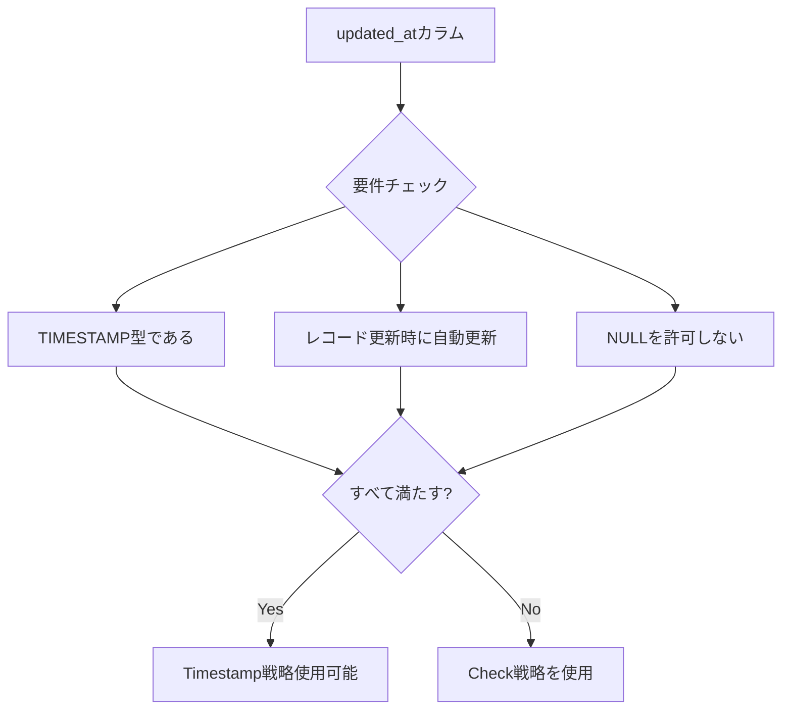

#### ソーステーブルの準備

<details>
<summary>updated_atカラムを持つテーブル作成（クリックで展開）</summary>

```sql
-- ソーステーブルにupdated_atカラムを追加
CREATE OR REPLACE TABLE `project.raw.customers` (
    customer_id INT64,
    first_name STRING,
    last_name STRING,
    email STRING,
    created_at TIMESTAMP DEFAULT CURRENT_TIMESTAMP(),
    updated_at TIMESTAMP DEFAULT CURRENT_TIMESTAMP()
);

-- 更新時にupdated_atを自動更新するトリガー（BigQueryでは不可）
-- 代わりにアプリケーション側で更新するか、dbtマクロを使用

-- または、dbtでupdated_atを管理
```

</details>

#### dbtでupdated_atを管理する方法

<details>
<summary>models/staging/stg_customers.sql（クリックで展開）</summary>

```sql
{{
  config(
    materialized='incremental',
    unique_key='customer_id',
    on_schema_change='sync_all_columns'
  )
}}

select
    customer_id,
    first_name,
    last_name,
    email,
    created_at,

    -- 初回はcreated_at、更新時はCURRENT_TIMESTAMP
    
        CURRENT_TIMESTAMP() as updated_at
    
        created_at as updated_at
    

from {{ source('raw', 'customers') }}


    -- 変更されたレコードのみ処理
    where customer_id in (
        select customer_id
        from {{ source('raw', 'customers') }}
        where customer_id not in (select customer_id from {{ this }})
           or hash(email, first_name, last_name) != (
               select hash(email, first_name, last_name)
               from {{ this }} t
               where t.customer_id = customer_id
           )
    )

```

</details>

#### Timestamp戦略のベストプラクティス

1. **updated_atの精度**: マイクロ秒単位のTIMESTAMPを使用
2. **タイムゾーン**: UTCで統一
3. **NULL処理**: updated_atがNULLの場合の処理を定義

```sql


{{
    config(
      target_schema='snapshots',
      unique_key='customer_id',
      strategy='timestamp',
      updated_at='updated_at',
      invalidate_hard_deletes=True
    )
}}

select
    customer_id,
    first_name,
    last_name,
    email,
    created_at,
    -- updated_atがNULLの場合はcreated_atを使用
    COALESCE(updated_at, created_at) as updated_at
from {{ source('raw', 'customers') }}


```

#### 検証結果

- ✅ updated_atカラムで効率的に変更検出
- ✅ COALESCE()でNULL処理が機能
- ✅ タイムスタンプ精度が保たれる

---

### 検証5: invalidate_hard_deletes

#### 概要

ソーステーブルから削除されたレコードをスナップショットで無効化する設定を検証します。

#### Hard Deletes処理フロー

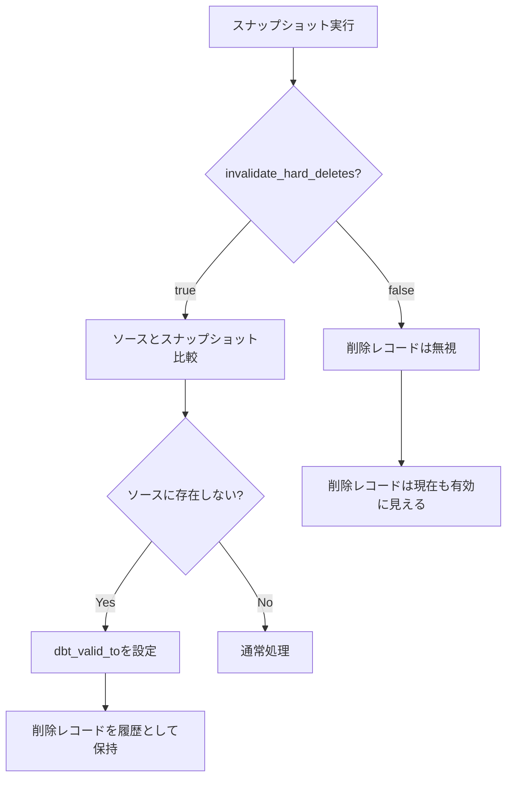

#### 設定例

```sql


{{
    config(
      target_schema='snapshots',
      unique_key='customer_id',
      strategy='timestamp',
      updated_at='updated_at',

      -- 削除されたレコードを無効化
      invalidate_hard_deletes=True
    )
}}

select * from {{ source('raw', 'customers') }}


```

#### 削除処理の検証

<details>
<summary>削除レコードの動作確認（クリックで展開）</summary>

```sql
-- 1. 初期データ挿入
INSERT INTO raw.customers (customer_id, first_name, last_name, email, updated_at)
VALUES
(1, 'John', 'Doe', 'john@example.com', CURRENT_TIMESTAMP()),
(2, 'Jane', 'Smith', 'jane@example.com', CURRENT_TIMESTAMP());

-- 2. スナップショット実行
-- dbt snapshot --select customers_snapshot_with_deletes

-- 3. スナップショット確認（2レコードとも有効）
SELECT customer_id, email, dbt_valid_to
FROM snapshots.customers_snapshot_with_deletes;
-- customer_id | email              | dbt_valid_to
-- 1           | john@example.com   | NULL
-- 2           | jane@example.com   | NULL

-- 4. レコード削除
DELETE FROM raw.customers WHERE customer_id = 1;

-- 5. スナップショット再実行
-- dbt snapshot --select customers_snapshot_with_deletes

-- 6. 削除レコードの確認
SELECT customer_id, email, dbt_valid_from, dbt_valid_to
FROM snapshots.customers_snapshot_with_deletes
WHERE customer_id = 1;
-- customer_id | email            | dbt_valid_from        | dbt_valid_to
-- 1           | john@example.com | 2026-02-17 10:00:00   | 2026-02-17 11:00:00

-- 7. 現在有効なレコードのみ
SELECT customer_id, email
FROM snapshots.customers_snapshot_with_deletes
WHERE dbt_valid_to IS NULL;
-- customer_id | email
-- 2           | jane@example.com
```

</details>

#### invalidate_hard_deletes=falseの場合

```sql
-- invalidate_hard_deletes=falseの場合、削除されたレコードも有効のまま
SELECT customer_id, email, dbt_valid_to
FROM snapshots.customers_snapshot_no_deletes
WHERE customer_id = 1;
-- customer_id | email            | dbt_valid_to
-- 1           | john@example.com | NULL  ← 削除されているが、まだ有効
```

#### 検証結果

- ✅ invalidate_hard_deletes=trueで削除レコードが無効化される
- ✅ dbt_valid_toに削除時刻が設定される
- ✅ invalidate_hard_deletes=falseでは削除レコードが有効のまま
- ⚠️ 大規模テーブルではパフォーマンスに影響あり

---

### 検証6: unique_key設定

#### 概要

unique_keyの設定と複合キーの使用方法を検証します。

#### unique_keyの役割

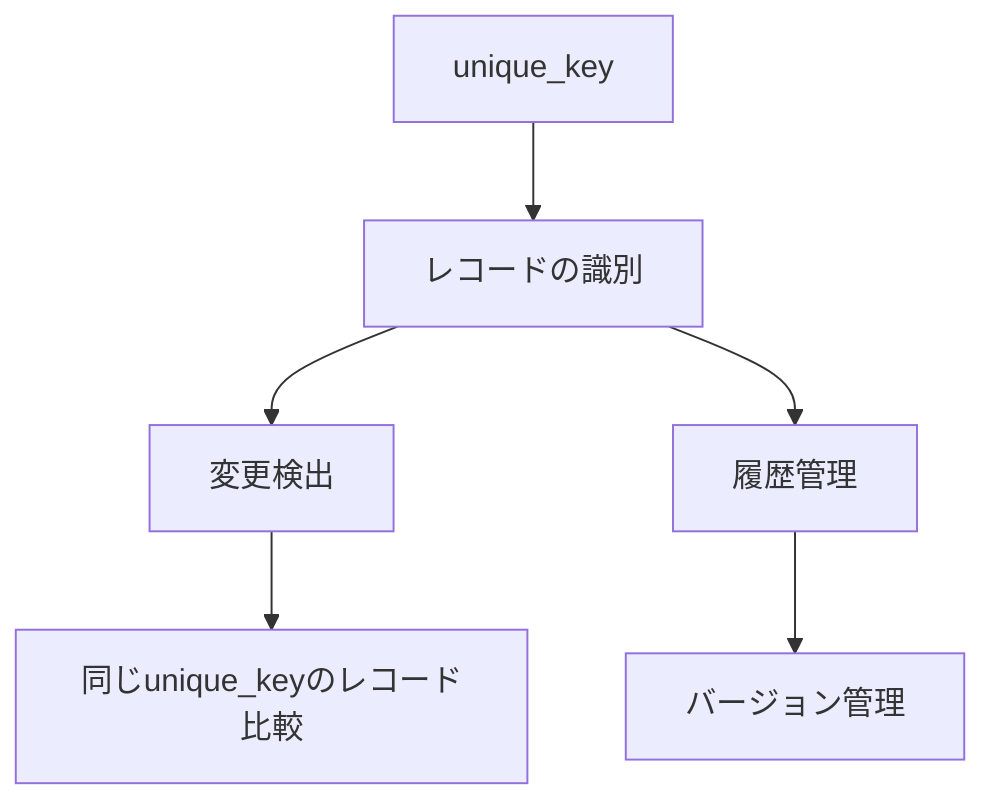

#### 単一カラムのunique_key

```sql


{{
    config(
      unique_key='customer_id',  -- 単一カラム
      strategy='timestamp',
      updated_at='updated_at'
    )
}}

select * from {{ source('raw', 'customers') }}


```

#### 複合キーのunique_key

<details>
<summary>snapshots/order_items_snapshot.sql（クリックで展開）</summary>

```sql


{{
    config(
      target_schema='snapshots',
      -- 複合キー: order_id + product_id
      unique_key='order_id || "-" || product_id',

      strategy='check',
      check_cols=['quantity', 'price', 'discount']
    )
}}

select
    order_id,
    product_id,
    quantity,
    price,
    discount,
    created_at
from {{ source('raw', 'order_items') }}


```

</details>

#### 複合キーの別の方法: dbt_utils

<details>
<summary>dbt_utilsを使用した複合キー（クリックで展開）</summary>

```sql


{{
    config(
      target_schema='snapshots',
      unique_key='order_item_key',
      strategy='timestamp',
      updated_at='updated_at'
    )
}}

select
    {{ dbt_utils.generate_surrogate_key(['order_id', 'product_id']) }} as order_item_key,
    order_id,
    product_id,
    quantity,
    price,
    discount,
    created_at,
    updated_at
from {{ source('raw', 'order_items') }}


```

</details>

#### unique_keyのベストプラクティス

| パターン         | 例                                         | 推奨度 |
| ---------------- | ------------------------------------------ | ------ | --- | --- | ----------- | ---- |
| 自然キー         | `customer_id`                              | ⭐⭐⭐ |
| 複合キー（連結） | `order_id                                  |        | "-" |     | product_id` | ⭐⭐ |
| サロゲートキー   | `generate_surrogate_key(['col1', 'col2'])` | ⭐⭐⭐ |
| UUIDv4           | `uuid`                                     | ⭐⭐⭐ |

#### 検証結果

- ✅ 単一カラムのunique_keyが正しく動作
- ✅ 複合キー（連結）が機能する
- ✅ dbt_utils.generate_surrogate_keyが使用できる
- ✅ unique_keyの重複がある場合はエラーになる

---

### 検証7: target_schema設定

#### 概要

スナップショットの保存先スキーマを設定します。

#### target_schema設定パターン

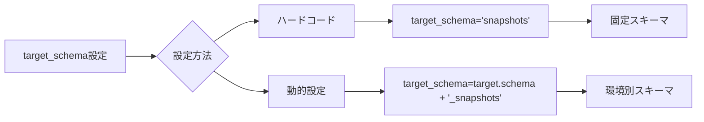

#### 固定スキーマ

```sql


{{
    config(
      target_schema='snapshots',  -- 固定
      unique_key='customer_id',
      strategy='timestamp',
      updated_at='updated_at'
    )
}}

select * from {{ source('raw', 'customers') }}


```

#### 動的スキーマ（環境別）

```sql


{{
    config(
      -- dev環境: dev_snapshots
      -- prod環境: prod_snapshots
      target_schema=target.schema ~ '_snapshots',

      unique_key='customer_id',
      strategy='timestamp',
      updated_at='updated_at'
    )
}}

select * from {{ source('raw', 'customers') }}


```

#### カスタムスキーママクロ

<details>
<summary>macros/generate_snapshot_schema_name.sql（クリックで展開）</summary>

```sql

    

    
        snapshots
    
        {{ default_schema }}_snapshots
    
        {{ custom_schema_name }}
    


```

</details>

#### dbt_project.ymlでのデフォルト設定

```yaml
snapshots:
  jaffle_shop:
    +target_schema: snapshots
    +enabled: true

    # 環境別設定
    +persist_docs:
      relation: true
      columns: true
```

#### 検証結果

- ✅ target_schema設定が反映される
- ✅ 動的スキーマ名が生成される
- ✅ カスタムマクロが機能する
- ✅ dbt_project.ymlの設定が適用される

---

### 検証8: SCD Type 2実装

#### 概要

Slowly Changing Dimensions (SCD) Type 2パターンの完全な実装を検証します。

#### SCD Type 2の概念

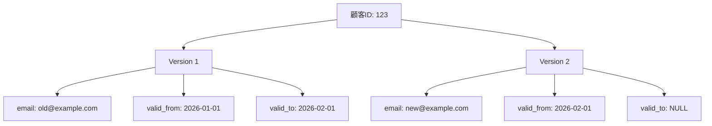

#### 完全なSCD Type 2実装

<details>
<summary>snapshots/dim_customers_scd.sql（クリックで展開）</summary>

```sql


{{
    config(
      target_schema='snapshots',
      unique_key='customer_id',

      strategy='timestamp',
      updated_at='updated_at',

      invalidate_hard_deletes=True,

      -- パーティション設定（パフォーマンス向上）
      partition_by={
        "field": "dbt_valid_from",
        "data_type": "timestamp",
        "granularity": "day"
      },

      -- クラスタリング設定
      cluster_by=['customer_id']
    )
}}

select
    customer_id,
    first_name,
    last_name,
    email,
    phone,
    address,
    city,
    state,
    zip_code,
    customer_segment,
    created_at,
    updated_at
from {{ ref('stg_customers') }}


```

</details>

#### SCD Type 2クエリパターン

<details>
<summary>SCD Type 2を活用したクエリ例（クリックで展開）</summary>

```sql
-- 1. 現在有効なレコードのみ取得（最新のディメンション）
SELECT
    customer_id,
    first_name,
    last_name,
    email,
    customer_segment
FROM `project.snapshots.dim_customers_scd`
WHERE dbt_valid_to IS NULL;

-- 2. 特定時点のスナップショット（ポイントインタイム分析）
SELECT
    customer_id,
    email,
    customer_segment
FROM `project.snapshots.dim_customers_scd`
WHERE '2026-01-15' BETWEEN DATE(dbt_valid_from) AND COALESCE(DATE(dbt_valid_to), '2099-12-31');

-- 3. 変更履歴の追跡
SELECT
    customer_id,
    email,
    customer_segment,
    dbt_valid_from,
    dbt_valid_to,
    TIMESTAMP_DIFF(
        COALESCE(dbt_valid_to, CURRENT_TIMESTAMP()),
        dbt_valid_from,
        DAY
    ) as days_valid
FROM `project.snapshots.dim_customers_scd`
WHERE customer_id = 123
ORDER BY dbt_valid_from DESC;

-- 4. セグメント変更の分析
SELECT
    customer_id,
    customer_segment as old_segment,
    LEAD(customer_segment) OVER (PARTITION BY customer_id ORDER BY dbt_valid_from) as new_segment,
    dbt_valid_from as change_date
FROM `project.snapshots.dim_customers_scd`
WHERE customer_id = 123;

-- 5. ファクトテーブルとのJOIN（時点一致）
SELECT
    f.order_date,
    f.order_id,
    f.order_amount,
    d.customer_segment as segment_at_order_time
FROM `project.marts.fct_orders` f
INNER JOIN `project.snapshots.dim_customers_scd` d
    ON f.customer_id = d.customer_id
    AND f.order_date BETWEEN DATE(d.dbt_valid_from) AND COALESCE(DATE(d.dbt_valid_to), '2099-12-31')
WHERE f.order_date >= '2026-01-01';
```

</details>

#### SCD Type 2のマート活用

<details>
<summary>models/marts/analytics/fct_orders_with_customer_segment.sql（クリックで展開）</summary>

```sql
{{
  config(
    materialized='table',
    partition_by={
      "field": "order_date",
      "data_type": "date"
    },
    cluster_by=['customer_id', 'customer_segment']
  )
}}

-- 注文時点の顧客セグメントを含めた分析用ファクトテーブル
SELECT
    o.order_id,
    o.customer_id,
    o.order_date,
    o.order_amount,
    o.status,

    -- 注文時点の顧客セグメント
    cs.customer_segment as customer_segment_at_order,
    cs.city as customer_city_at_order,

    current_timestamp() as created_at
FROM {{ ref('fct_orders') }} o
INNER JOIN {{ ref('dim_customers_scd') }} cs
    ON o.customer_id = cs.customer_id
    -- 時点一致JOIN
    AND o.order_date BETWEEN DATE(cs.dbt_valid_from)
        AND COALESCE(DATE(cs.dbt_valid_to), DATE('2099-12-31'))
```

</details>

#### 検証結果

- ✅ SCD Type 2パターンが正しく実装される
- ✅ 時点一致JOINが機能する
- ✅ 変更履歴が正確に記録される
- ✅ パーティション/クラスタリングでパフォーマンス向上

---

### 検証9: スナップショットの更新

#### 概要

スナップショットの更新プロセスと増分実行を検証します。

#### スナップショット更新フロー

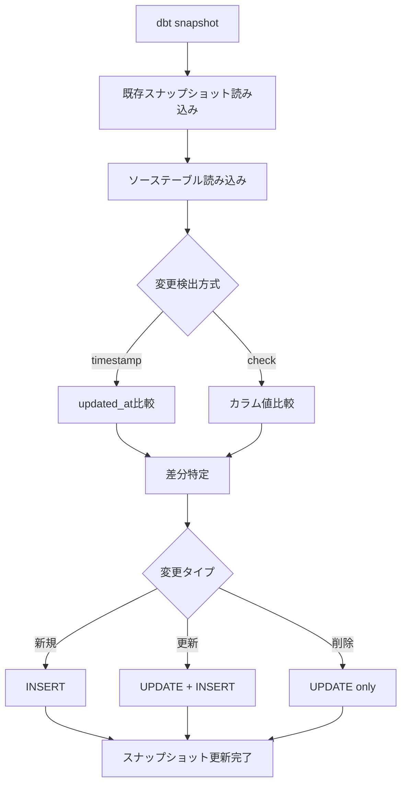

#### スナップショット実行コマンド

```bash
# 全スナップショット実行
dbt snapshot

# 特定スナップショット実行
dbt snapshot --select customers_snapshot

# 複数スナップショット実行
dbt snapshot --select customers_snapshot+ products_snapshot

# タグで実行
dbt snapshot --select tag:scd_type_2

# フルリフレッシュ（再構築）
dbt snapshot --select customers_snapshot --full-refresh
```

#### スナップショット実行ログ

<details>
<summary>実行ログ例（クリックで展開）</summary>

```bash
$ dbt snapshot --select customers_snapshot

10:30:00  Running with dbt=1.7.0
10:30:01  Found 1 snapshot, 0 models, 0 tests, 0 sources, 0 exposures, 0 metrics
10:30:01
10:30:01  Concurrency: 1 threads (target='prod')
10:30:01
10:30:01  1 of 1 START snapshot snapshots.customers_snapshot ........................ [RUN]
10:30:05  1 of 1 OK snapshotted snapshots.customers_snapshot ........................ [INSERT 15, UPDATE 3 in 4.2s]
10:30:05
10:30:05  Finished running 1 snapshot in 0 hours 0 minutes and 5.32 seconds (5.32s).
10:30:05
10:30:05  Completed successfully
10:30:05
10:30:05  Done. PASS=1 WARN=0 ERROR=0 SKIP=0 TOTAL=1
```

</details>

#### スナップショット更新統計

<details>
<summary>更新統計クエリ（クリックで展開）</summary>

```sql
-- スナップショット統計
SELECT
    COUNT(*) as total_records,
    COUNT(DISTINCT customer_id) as unique_customers,
    SUM(CASE WHEN dbt_valid_to IS NULL THEN 1 ELSE 0 END) as current_records,
    SUM(CASE WHEN dbt_valid_to IS NOT NULL THEN 1 ELSE 0 END) as historical_records,
    MAX(dbt_updated_at) as last_updated
FROM `project.snapshots.customers_snapshot`;

-- 最近の変更
SELECT
    customer_id,
    email,
    dbt_valid_from,
    dbt_valid_to,
    dbt_updated_at
FROM `project.snapshots.customers_snapshot`
WHERE dbt_updated_at >= TIMESTAMP_SUB(CURRENT_TIMESTAMP(), INTERVAL 1 HOUR)
ORDER BY dbt_updated_at DESC;
```

</details>

#### 検証結果

- ✅ スナップショット増分更新が正しく動作
- ✅ 新規レコードがINSERTされる
- ✅ 更新レコードが適切に処理される（古いレコード無効化 + 新レコードINSERT）
- ✅ --full-refreshでスナップショットが再構築される

---

### 検証10: 削除レコードの処理

#### 概要

ソーステーブルから削除されたレコードの様々な処理方法を検証します。

#### 削除レコード処理の選択肢

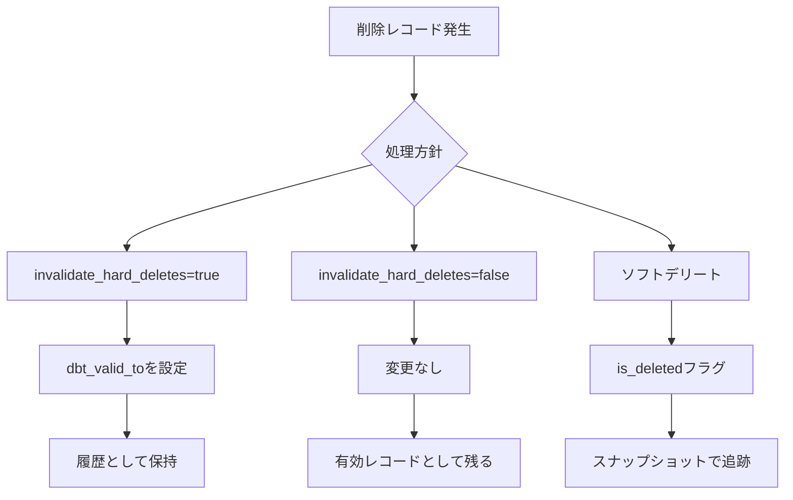

#### ハードデリート処理（invalidate_hard_deletes=true）

```sql


{{
    config(
      target_schema='snapshots',
      unique_key='customer_id',
      strategy='timestamp',
      updated_at='updated_at',
      invalidate_hard_deletes=True  -- 削除を検出
    )
}}

select * from {{ source('raw', 'customers') }}


```

#### ソフトデリート対応

<details>
<summary>snapshots/customers_soft_delete.sql（クリックで展開）</summary>

```sql


{{
    config(
      target_schema='snapshots',
      unique_key='customer_id',
      strategy='check',
      check_cols=['first_name', 'last_name', 'email', 'is_deleted'],  -- is_deletedも追跡
      invalidate_hard_deletes=False  -- ソフトデリートで管理
    )
}}

select
    customer_id,
    first_name,
    last_name,
    email,
    is_deleted,  -- ソフトデリートフラグ
    deleted_at,
    updated_at
from {{ source('raw', 'customers') }}
-- ソフトデリートされたレコードも含める


```

</details>

#### 削除レコードの分析

<details>
<summary>削除レコード分析クエリ（クリックで展開）</summary>

```sql
-- ハードデリートされたレコードの特定
SELECT
    customer_id,
    email,
    dbt_valid_from,
    dbt_valid_to,
    TIMESTAMP_DIFF(dbt_valid_to, dbt_valid_from, DAY) as days_existed
FROM `project.snapshots.customers_hard_delete`
WHERE dbt_valid_to IS NOT NULL
  AND customer_id NOT IN (
      SELECT DISTINCT customer_id
      FROM `project.snapshots.customers_hard_delete`
      WHERE dbt_valid_to IS NULL
  )
ORDER BY dbt_valid_to DESC;

-- ソフトデリートされたレコードの特定
SELECT
    customer_id,
    email,
    is_deleted,
    deleted_at,
    dbt_valid_from,
    dbt_valid_to
FROM `project.snapshots.customers_soft_delete`
WHERE is_deleted = TRUE
  AND dbt_valid_to IS NULL  -- 現在有効なバージョン
ORDER BY deleted_at DESC;

-- 削除後に復活したレコード
WITH deletion_events AS (
    SELECT
        customer_id,
        is_deleted,
        dbt_valid_from,
        LAG(is_deleted) OVER (PARTITION BY customer_id ORDER BY dbt_valid_from) as prev_is_deleted
    FROM `project.snapshots.customers_soft_delete`
)
SELECT *
FROM deletion_events
WHERE is_deleted = FALSE
  AND prev_is_deleted = TRUE;
```

</details>

#### 検証結果

- ✅ invalidate_hard_deletes=trueでハードデリートが検出される
- ✅ ソフトデリートフラグの変更が追跡される
- ✅ 削除レコードの分析が可能
- ✅ 削除後の復活も追跡できる

---

### 検証11: パーティション設定

#### 概要

スナップショットテーブルのパーティション設定でパフォーマンスを最適化します。

#### パーティション戦略

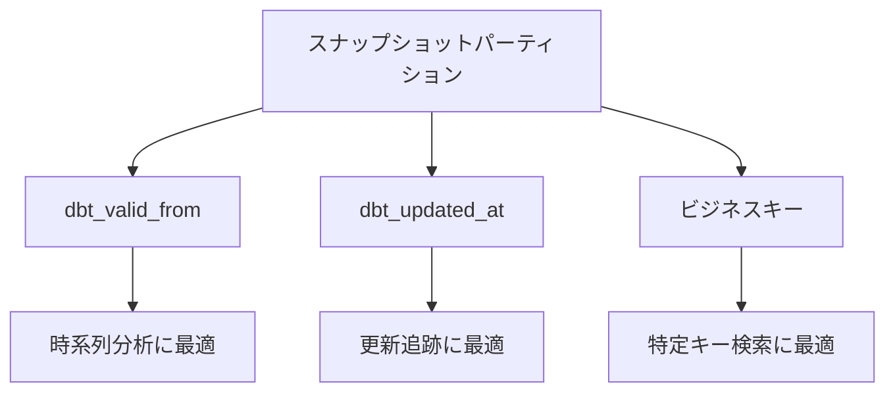

#### dbt_valid_fromでパーティション

<details>
<summary>snapshots/customers_partitioned.sql（クリックで展開）</summary>

```sql


{{
    config(
      target_schema='snapshots',
      unique_key='customer_id',
      strategy='timestamp',
      updated_at='updated_at',

      -- dbt_valid_fromでパーティション
      partition_by={
        "field": "dbt_valid_from",
        "data_type": "timestamp",
        "granularity": "day"
      },

      -- customer_idでクラスタリング
      cluster_by=['customer_id'],

      -- 古いパーティションを自動削除（オプション）
      -- partition_expiration_days=730  -- 2年
    )
}}

select * from {{ ref('stg_customers') }}


```

</details>

#### パーティション活用クエリ

<details>
<summary>パーティション最適化クエリ（クリックで展開）</summary>

```sql
-- ✅ Good: パーティションフィルタ使用
SELECT
    customer_id,
    email,
    customer_segment
FROM `project.snapshots.customers_partitioned`
WHERE DATE(dbt_valid_from) >= '2026-01-01'  -- パーティションフィルタ
  AND customer_id = 123;

-- ❌ Bad: パーティションフィルタなし（全パーティションスキャン）
SELECT
    customer_id,
    email,
    customer_segment
FROM `project.snapshots.customers_partitioned`
WHERE customer_id = 123;

-- パーティション情報の確認
SELECT
    partition_id,
    total_rows,
    total_logical_bytes / 1024 / 1024 as size_mb
FROM `project.snapshots.INFORMATION_SCHEMA.PARTITIONS`
WHERE table_name = 'customers_partitioned'
ORDER BY partition_id DESC
LIMIT 30;
```

</details>

#### 検証結果

- ✅ パーティション設定が適用される
- ✅ パーティションフィルタ使用時にスキャン量が削減される
- ✅ クラスタリングと併用でさらに効率化
- ✅ partition_expiration_daysで自動削除が機能する

---

### 検証12: スナップショットのテスト

#### 概要

スナップショットに対するデータ品質テストを実装します。

#### テスト戦略

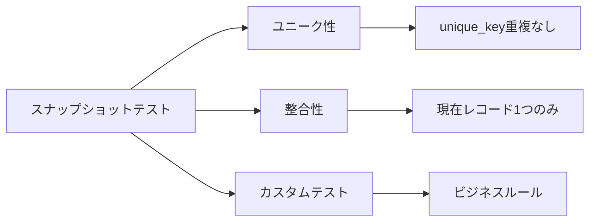

#### スナップショットテスト定義

<details>
<summary>tests/snapshots/snapshot_tests.yml（クリックで展開）</summary>

```yaml
# tests/snapshots/snapshot_tests.yml
version: 2

snapshots:
  - name: customers_snapshot
    description: 顧客ディメンションのSCD Type 2スナップショット
    columns:
      - name: customer_id
        description: 顧客ID
        tests:
          - not_null

      - name: dbt_scd_id
        description: スナップショットバージョンの一意識別子
        tests:
          - unique
          - not_null

      - name: dbt_valid_from
        description: このバージョンが有効になった日時
        tests:
          - not_null

      - name: dbt_valid_to
        description: このバージョンが無効になった日時（NULL=現在有効）

      - name: email
        tests:
          - not_null
          - dbt_utils.email # dbt_utils必要

  - name: products_snapshot
    tests:
      # 現在有効なレコードは各product_idに1つのみ
      - dbt_utils.unique_combination_of_columns:
          combination_of_columns:
            - product_id
          where: "dbt_valid_to IS NULL"
```

</details>

#### カスタムスナップショットテスト

<details>
<summary>tests/assert_snapshot_integrity.sql（クリックで展開）</summary>

```sql
-- tests/assert_snapshot_integrity.sql
-- スナップショットの整合性をチェック

-- 1. 現在有効なレコードが各顧客に1つのみであることを確認
WITH current_records AS (
    SELECT
        customer_id,
        COUNT(*) as current_count
    FROM {{ ref('customers_snapshot') }}
    WHERE dbt_valid_to IS NULL
    GROUP BY customer_id
    HAVING COUNT(*) > 1
)

SELECT *
FROM current_records

UNION ALL

-- 2. dbt_valid_fromとdbt_valid_toの整合性チェック
SELECT
    customer_id,
    1 as current_count
FROM {{ ref('customers_snapshot') }}
WHERE dbt_valid_to IS NOT NULL
  AND dbt_valid_to <= dbt_valid_from

UNION ALL

-- 3. 履歴の連続性チェック
WITH ordered_versions AS (
    SELECT
        customer_id,
        dbt_valid_from,
        dbt_valid_to,
        LEAD(dbt_valid_from) OVER (PARTITION BY customer_id ORDER BY dbt_valid_from) as next_valid_from
    FROM {{ ref('customers_snapshot') }}
)
SELECT
    customer_id,
    1 as current_count
FROM ordered_versions
WHERE dbt_valid_to IS NOT NULL
  AND dbt_valid_to != next_valid_from
```

</details>

#### スナップショットメタデータ検証

<details>
<summary>tests/assert_snapshot_metadata.sql（クリックで展開）</summary>

```sql
-- スナップショットメタデータの検証

-- dbt_scd_idの一意性
SELECT
    dbt_scd_id,
    COUNT(*) as duplicate_count
FROM {{ ref('customers_snapshot') }}
GROUP BY dbt_scd_id
HAVING COUNT(*) > 1

UNION ALL

-- dbt_updated_atの妥当性（未来の日時でない）
SELECT
    'future_timestamp' as dbt_scd_id,
    COUNT(*) as duplicate_count
FROM {{ ref('customers_snapshot') }}
WHERE dbt_updated_at > CURRENT_TIMESTAMP()
```

</details>

#### テスト実行

```bash
# スナップショットテスト実行
dbt test --select snapshot:customers_snapshot

# 全スナップショットテスト
dbt test --resource-type snapshot

# カスタムテスト実行
dbt test --select assert_snapshot_integrity
```

#### 検証結果

- ✅ unique/not_nullテストが機能する
- ✅ カスタム整合性テストが動作する
- ✅ 現在レコードの一意性が検証される
- ✅ 履歴の連続性がチェックされる

---

## ベストプラクティス

### 1. 戦略選択のガイドライン

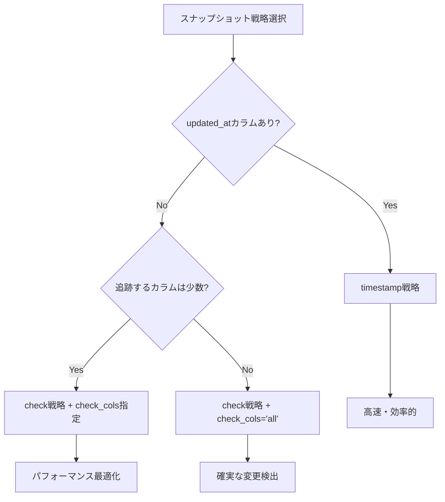

### 2. パフォーマンス最適化

```yaml
snapshots:
  jaffle_shop:
    +target_schema: snapshots
    +partition_by:
      field: dbt_valid_from
      data_type: timestamp
      granularity: day
    +cluster_by: ["unique_key列"]
```

### 3. 命名規則

- **スナップショットファイル**: `{entity}_snapshot.sql`
- **スナップショット名**: `{entity}_snapshot`
- **target_schema**: `snapshots` または `{env}_snapshots`

### 4. ドキュメント化

```yaml
snapshots:
  - name: customers_snapshot
    description: |
      顧客マスタのSCD Type 2スナップショット

      更新頻度: 日次
      保持期間: 無制限
      戦略: timestamp (updated_at)
      削除処理: invalidate_hard_deletes=true

      用途:
      - 顧客属性の変更履歴分析
      - ポイントインタイム分析
      - セグメント変更トラッキング
```

### 5. 実行スケジュール

```yaml
# orchestration/dbt_jobs.yml
jobs:
  - name: daily_snapshots
    description: 日次スナップショット更新
    schedule: "0 2 * * *" # 毎日2時
    steps:
      - dbt snapshot
      - dbt test --resource-type snapshot
```

---

## トラブルシューティング

### 問題1: スナップショットが遅い

**症状**: 大規模テーブルでスナップショット実行に時間がかかる

**原因**:

- パーティション/クラスタリング未設定
- invalidate_hard_deletes=trueで全レコードスキャン

**解決策**:

```sql
{{
    config(
      partition_by={"field": "dbt_valid_from", "data_type": "timestamp", "granularity": "day"},
      cluster_by=['customer_id'],
      -- 大規模テーブルでは無効化を検討
      invalidate_hard_deletes=False
    )
}}
```

### 問題2: 重複レコードエラー

**症状**: `Snapshot target has multiple rows for unique_key`

**原因**:

- unique_keyが実際には一意でない
- 複合キーが必要

**解決策**:

```sql
-- 複合キーを使用
{{
    config(
      unique_key="order_id || '-' || product_id"
    )
}}
```

### 問題3: スキーマ変更エラー

**症状**: ソーステーブルにカラムを追加/削除したらエラー

**原因**:

- スナップショットテーブルのスキーマが古い

**解決策**:

```bash
# フルリフレッシュで再構築
dbt snapshot --select customers_snapshot --full-refresh

# または手動でカラム追加
ALTER TABLE snapshots.customers_snapshot
ADD COLUMN new_column STRING;
```

### 問題4: メタデータカラムの競合

**症状**: `dbt_valid_from`などのカラムが既に存在する

**原因**:

- ソーステーブルにdbt予約カラム名が存在

**解決策**:

```sql
-- ソーステーブルのカラム名を変更
select
    customer_id,
    email,
    valid_from as source_valid_from,  -- リネーム
    -- dbt_valid_fromはスナップショットが自動生成
from {{ source('raw', 'customers') }}
```

### 問題5: timestamp戦略で変更検出されない

**症状**: レコードが更新されてもスナップショットに反映されない

**原因**:

- updated_atが更新されていない
- タイムゾーンの不一致

**解決策**:

```sql
-- updated_atの確実な更新（アプリケーション側）
UPDATE customers
SET
    email = 'new@example.com',
    updated_at = CURRENT_TIMESTAMP()  -- 必須
WHERE customer_id = 123;

-- またはcheck戦略に変更
{{
    config(
      strategy='check',
      check_cols=['email', 'phone', 'address']
    )
}}
```

---

## 参考資料

### 公式ドキュメント

- [dbt Snapshots](https://docs.getdbt.com/docs/build/snapshots)
- [Snapshot Strategies](https://docs.getdbt.com/reference/snapshot-configs)
- [SCD Type 2](https://en.wikipedia.org/wiki/Slowly_changing_dimension#Type_2:_add_new_row)

### サンプルコード

- [dbt Learn: Snapshots](https://courses.getdbt.com/courses/fundamentals)
- [Discourse: Snapshot Best Practices](https://discourse.getdbt.com/)

### 推奨リソース

- [The Kimball Group: SCD Types](https://www.kimballgroup.com/data-warehouse-business-intelligence-resources/kimball-techniques/dimensional-modeling-techniques/)

---

**レポート作成日**: 2026-02-17
**作成者**: dbt BigQuery検証チーム
**バージョン**: 1.0
