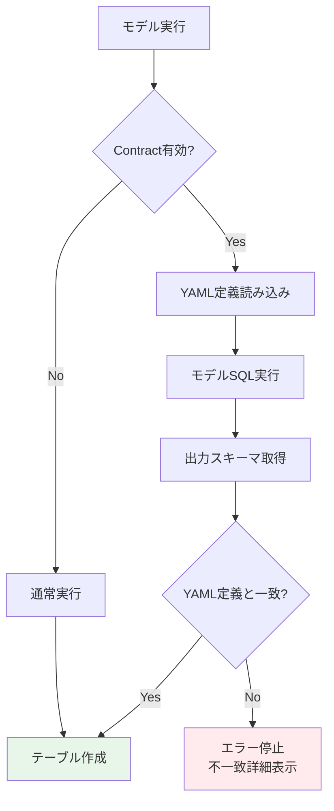
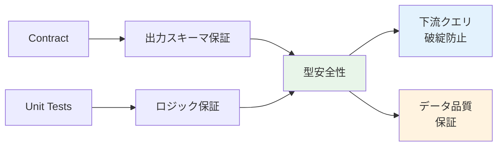
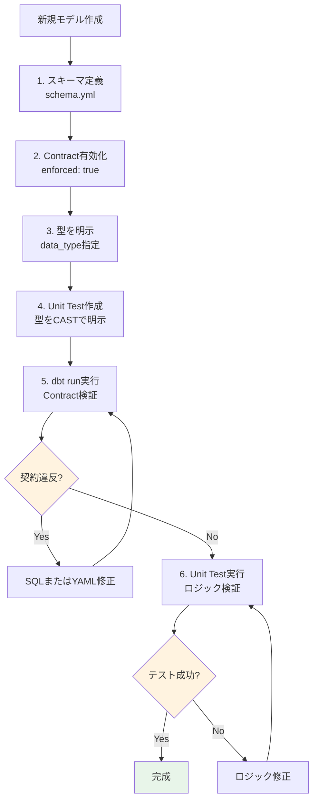
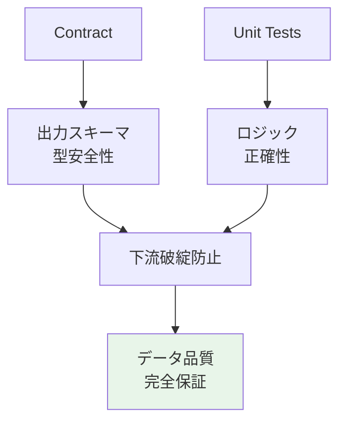

# dbt Contracts: スキーマ保証と型安全性

## 検証概要

**検証日時**: 2026-02-17
**dbtバージョン**: 1.11.5
**参照元**: [公式ドキュメント](https://docs.getdbt.com/reference/resource-configs/contract)

### Contractsとは

dbt Contractsは、モデルの出力スキーマ（列名・データ型）をYAML定義と完全に一致させる機能です。

**目的**:
- スキーマ変更による下流クエリの破綻を防止
- データ型の暗黙的変換を検出
- データ品質の事前保証

---

## 目次

1. [Contractsの基本](#1-contractsの基本)
2. [Unit Testsとの組み合わせ](#2-unit-testsとの組み合わせ)
3. [データ型の厳密な管理](#3-データ型の厳密な管理)
4. [実践例と検証](#4-実践例と検証)
5. [ベストプラクティス](#5-ベストプラクティス)
6. [トラブルシューティング](#6-トラブルシューティング)

---

## 1. Contractsの基本

### 1.1 Contractsの仕組み



### 1.2 基本設定

```yaml
# models/schema.yml
models:
  - name: dim_customers
    description: "顧客ディメンション"
    config:
      contract:
        enforced: true  # Contract有効化

    columns:
      - name: customer_id
        data_type: int64
        description: "顧客ID（主キー）"

      - name: customer_name
        data_type: string
        description: "顧客名"

      - name: email
        data_type: string
        description: "メールアドレス"

      - name: created_at
        data_type: timestamp
        description: "作成日時"
```

```sql
-- models/dim_customers.sql
{{
  config(
    materialized='table',
    contract={'enforced': true}
  )
}}

select
    customer_id,
    customer_name,
    email,
    created_at
from {{ ref('stg_customers') }}
```

### 1.3 サポート範囲

#### ✅ サポート対象

- **Materialization**: table, view, incremental
- **定義場所**: `dbt_project.yml`, `properties.yml`
- **モデル種類**: SQLモデルのみ

#### ❌ 非サポート

- **Materialization**: materialized_view, ephemeral
- **モデル種類**: Pythonモデル
- **その他**: sources, seeds, snapshots
- **BigQuery特有**: Recursive CTEs

---

## 2. Unit Testsとの組み合わせ

### 2.1 契約 + Unit Tests = 完全な型安全性



### 2.2 実践例: Contractとunit testsの併用

```yaml
# models/schema.yml
models:
  - name: fct_order_summary
    description: "注文サマリーファクト"
    config:
      contract:
        enforced: true  # スキーマ保証

    columns:
      - name: order_date
        data_type: date
        description: "注文日"

      - name: customer_id
        data_type: int64
        description: "顧客ID"

      - name: order_count
        data_type: int64
        description: "注文件数"

      - name: total_amount
        data_type: numeric
        description: "合計金額"

unit_tests:
  - name: test_order_aggregation_with_contract
    description: "注文集計ロジック検証（型安全性込み）"
    model: fct_order_summary

    given:
      - input: ref('stg_orders')
        format: sql
        rows: |
          select
            cast('2026-02-17' as date) as order_date,
            cast(1 as int64) as customer_id,
            cast(100 as int64) as order_id,
            cast(50.00 as numeric) as order_amount

    expect:
      format: sql
      rows: |
        select
          cast('2026-02-17' as date) as order_date,
          cast(1 as int64) as customer_id,
          cast(1 as int64) as order_count,
          cast(50.00 as numeric) as total_amount
```

**効果**:
1. **Contract**: YAMLで定義した型（date, int64, numeric）を強制
2. **Unit Test**: ロジックの正確性（集計処理）を検証
3. **型安全性**: unit testでもCASTで明示的に型指定

---

### 2.3 データ型不一致の早期検出

#### 問題シナリオ: 暗黙的な型変換

```sql
-- models/dim_customers.sql
select
    customer_id,  -- int64として定義
    customer_name,
    is_active,  -- 実際はbool型
    created_at
from {{ ref('stg_customers') }}
```

```yaml
# models/schema.yml（誤った定義）
models:
  - name: dim_customers
    config:
      contract:
        enforced: true

    columns:
      - name: customer_id
        data_type: int64

      - name: customer_name
        data_type: string

      - name: is_active
        data_type: int64  # ❌ 実際はboolだがint64と定義

      - name: created_at
        data_type: timestamp
```

**Contractなしの場合**:
```
✅ モデル実行成功
   → is_activeがbool→int64に暗黙変換される
   → 下流クエリで `WHERE is_active = true` がエラー
```

**Contractありの場合**:
```
❌ モデル実行失敗（契約違反）
   → エラーメッセージ:

   Contract Error in model dim_customers

   | Column       | Contract Type | Actual Type |
   |--------------|---------------|-------------|
   | customer_id  | int64         | int64       | ✓
   | customer_name| string        | string      | ✓
   | is_active    | int64         | bool        | ✗
   | created_at   | timestamp     | timestamp   | ✓

   Fix: Update YAML definition or model SQL
```

---

### 2.4 Unit Testsでの型検証

```yaml
unit_tests:
  - name: test_data_type_enforcement
    description: "データ型が正しく保持されることを検証"
    model: dim_customers

    given:
      - input: ref('stg_customers')
        format: sql
        rows: |
          select
            cast(1 as int64) as customer_id,
            cast('Alice' as string) as customer_name,
            cast(true as bool) as is_active,  -- bool型を明示
            cast('2026-02-17 10:00:00' as timestamp) as created_at

    expect:
      format: sql
      rows: |
        select
          cast(1 as int64) as customer_id,
          cast('Alice' as string) as customer_name,
          cast(true as bool) as is_active,  -- bool型を期待
          cast('2026-02-17 10:00:00' as timestamp) as created_at
```

**効果**:
- unit testで型をCASTで明示
- Contractで出力スキーマを保証
- 型変換の問題を開発段階で発見

---

## 3. データ型の厳密な管理

### 3.1 データ型エイリアス

dbtは汎用型名（`string`, `int`, `float`）をプラットフォーム固有の型に変換します。

#### デフォルト動作（alias_types: true）

```yaml
columns:
  - name: customer_name
    data_type: string  # → BigQuery: STRING

  - name: age
    data_type: int  # → BigQuery: INT64

  - name: score
    data_type: float  # → BigQuery: FLOAT64
```

#### エイリアス無効化

```yaml
models:
  - name: strict_schema_model
    config:
      contract:
        enforced: true
        alias_types: false  # エイリアス無効化

    columns:
      - name: customer_name
        data_type: STRING  # BigQuery固有の型名を使用

      - name: age
        data_type: INT64

      - name: score
        data_type: FLOAT64
```

### 3.2 精度（Precision）とスケール（Scale）

#### NUMERICの精度管理

```yaml
columns:
  - name: price
    data_type: numeric(10, 2)  # 精度10、スケール2
    # 例: 12345678.90（10桁、小数点以下2桁）

  - name: tax_rate
    data_type: numeric(5, 4)  # 精度5、スケール4
    # 例: 0.0825（5桁、小数点以下4桁）
```

**重要**: スケールを指定しないと暗黙的な強制変換が発生する可能性あり

```yaml
# ❌ Bad: スケール未指定
columns:
  - name: amount
    data_type: numeric

# ✅ Good: スケール明示
columns:
  - name: amount
    data_type: numeric(15, 2)
```

### 3.3 VARCHAR長の柔軟な扱い

BigQueryでは、`varchar(256)` と `varchar(257)` の細かい違いは無視されます。

```yaml
# YAML定義
columns:
  - name: description
    data_type: string(256)

# 実際のテーブル
CREATE TABLE ... (
  description STRING(257)  -- 1文字違うがOK
)
```

---

## 4. 実践例と検証

### 4.1 完全な型安全性の例

```yaml
# models/schema.yml
models:
  - name: fct_sales_type_safe
    description: "型安全な売上ファクト"
    config:
      contract:
        enforced: true
      materialized: incremental
      unique_key: sale_id

    columns:
      - name: sale_id
        data_type: int64
        description: "売上ID"

      - name: sale_date
        data_type: date
        description: "売上日"

      - name: product_id
        data_type: int64
        description: "商品ID"

      - name: quantity
        data_type: int64
        description: "数量"

      - name: unit_price
        data_type: numeric(10, 2)
        description: "単価"

      - name: total_amount
        data_type: numeric(12, 2)
        description: "合計金額"

      - name: is_refunded
        data_type: bool
        description: "返金フラグ"

unit_tests:
  - name: test_sales_calculation_type_safe
    description: "売上計算の型安全性検証"
    model: fct_sales_type_safe

    given:
      - input: ref('stg_sales')
        format: sql
        rows: |
          select
            cast(1 as int64) as sale_id,
            cast('2026-02-17' as date) as sale_date,
            cast(100 as int64) as product_id,
            cast(5 as int64) as quantity,
            cast(19.99 as numeric) as unit_price

    expect:
      format: sql
      rows: |
        select
          cast(1 as int64) as sale_id,
          cast('2026-02-17' as date) as sale_date,
          cast(100 as int64) as product_id,
          cast(5 as int64) as quantity,
          cast(19.99 as numeric) as unit_price,
          cast(99.95 as numeric) as total_amount,  -- quantity * unit_price
          cast(false as bool) as is_refunded
```

```sql
-- models/fct_sales_type_safe.sql
{{
  config(
    materialized='incremental',
    unique_key='sale_id',
    contract={'enforced': true}
  )
}}

select
    sale_id,
    sale_date,
    product_id,
    quantity,
    unit_price,
    quantity * unit_price as total_amount,
    false as is_refunded
from {{ ref('stg_sales') }}


  where sale_date > (select max(sale_date) from {{ this }})

```

---

### 4.2 Incrementalモデルでの注意点

Contractを使用するincrementalモデルでは、スキーマ変更時の動作を指定する必要があります。

```yaml
models:
  - name: fct_orders_incremental
    config:
      contract:
        enforced: true
      materialized: incremental
      unique_key: order_id
      on_schema_change: append_new_columns  # または fail

    columns:
      - name: order_id
        data_type: int64
      - name: customer_id
        data_type: int64
      - name: order_amount
        data_type: numeric(10, 2)
      # 新しい列を追加する場合
      - name: payment_method
        data_type: string
```

**推奨設定**:

| on_schema_change | 動作 | 推奨ケース |
|-----------------|------|-----------|
| `append_new_columns` | 新列を追加 | 開発環境 |
| `fail` | エラーで停止 | 本番環境（慎重な変更） |

---

### 4.3 契約違反時のエラーメッセージ

```bash
# dbt run実行
$ dbt run --select fct_sales_type_safe

# エラー出力
Compilation Error in model fct_sales_type_safe (models/fct_sales_type_safe.sql)
  Please ensure the name, data_type, and number of columns in your contract
  match the columns in your model's definition.

  | Column Name  | Definition Type | Contract Type | Matches |
  |--------------|-----------------|---------------|---------|
  | sale_id      | INT64           | INT64         | ✓       |
  | sale_date    | DATE            | DATE          | ✓       |
  | product_id   | INT64           | INT64         | ✓       |
  | quantity     | INT64           | INT64         | ✓       |
  | unit_price   | NUMERIC         | NUMERIC(10,2) | ✓       |
  | total_amount | FLOAT64         | NUMERIC(12,2) | ✗       |
  | is_refunded  | BOOL            | BOOL          | ✓       |

  The contract of 'fct_sales_type_safe' failed.

  Fix the SQL in fct_sales_type_safe.sql or adjust the contract in schema.yml
```

**問題**: `total_amount` が `FLOAT64` で計算されているが、Contractでは `NUMERIC(12,2)` を期待

**修正**:

```sql
-- ❌ Bad
select
    quantity * unit_price as total_amount  -- FLOAT64になる

-- ✅ Good
select
    cast(quantity * unit_price as numeric) as total_amount
```

---

## 5. ベストプラクティス

### 5.1 Contract + Unit Tests統合戦略



### 5.2 型定義のガイドライン

#### 数値型の選択

| 用途 | 推奨型 | 理由 |
|------|--------|------|
| ID（主キー） | `int64` | 整数、範囲広い |
| カウント | `int64` | 整数、負数なし |
| 金額 | `numeric(15, 2)` | 精度重視 |
| 割合・率 | `numeric(5, 4)` | 小数点以下精度 |
| 科学計算 | `float64` | 範囲広い、精度は低い |

#### 文字列型の選択

| 用途 | 推奨型 | 理由 |
|------|--------|------|
| 名前・タイトル | `string` | 可変長 |
| 固定長コード | `string(10)` | 長さ制限明示 |
| 大量テキスト | `string` | 制限なし |

#### 日付・時刻型の選択

| 用途 | 推奨型 | 理由 |
|------|--------|------|
| 日付のみ | `date` | タイムゾーン不要 |
| 日時（UTC） | `timestamp` | タイムゾーン対応 |
| 日時（ローカル） | `datetime` | タイムゾーンなし |

### 5.3 契約記述のテンプレート

```yaml
# テンプレート: Factテーブル
models:
  - name: fct_<domain>
    description: "<ドメイン>ファクトテーブル"
    config:
      contract:
        enforced: true
      materialized: incremental
      unique_key: <primary_key>
      on_schema_change: fail  # 本番は慎重に

    columns:
      # 主キー
      - name: <primary_key>
        data_type: int64
        description: "主キー"

      # 日付・時刻
      - name: event_date
        data_type: date
        description: "イベント日"

      - name: created_at
        data_type: timestamp
        description: "作成日時"

      # 外部キー
      - name: customer_id
        data_type: int64
        description: "顧客ID（外部キー）"

      # メトリクス
      - name: amount
        data_type: numeric(15, 2)
        description: "金額"

      - name: quantity
        data_type: int64
        description: "数量"

      # フラグ
      - name: is_active
        data_type: bool
        description: "有効フラグ"

unit_tests:
  - name: test_<domain>_logic
    description: "ロジック検証"
    model: fct_<domain>

    given:
      - input: ref('stg_<source>')
        format: sql
        rows: |
          select
            cast(1 as int64) as <primary_key>,
            cast('2026-02-17' as date) as event_date,
            cast(100.00 as numeric) as amount

    expect:
      format: sql
      rows: |
        select
          cast(1 as int64) as <primary_key>,
          cast('2026-02-17' as date) as event_date,
          cast(100.00 as numeric) as amount,
          cast(true as bool) as is_active
```

---

## 6. トラブルシューティング

### 問題1: 型不一致エラー

**症状**:
```
Contract Error: Column 'amount' has type FLOAT64 but contract expects NUMERIC
```

**原因**: 計算結果が予期しない型になる

**解決策**:
```sql
-- ❌ Bad
select quantity * price as amount

-- ✅ Good
select cast(quantity * price as numeric) as amount
```

---

### 問題2: 列の順序不一致

**症状**:
```
Contract Error: Column order mismatch
```

**原因**: YAML定義とSELECT文の列順序が異なる

**解決策**:
```yaml
# YAML定義順
columns:
  - name: id
  - name: name
  - name: created_at
```

```sql
-- ✅ 同じ順序でSELECT
select
    id,
    name,
    created_at
from source
```

---

### 問題3: Incremental + Contract のスキーマ変更

**症状**:
```
on_schema_change config must be set when using contracts with incremental models
```

**解決策**:
```yaml
config:
  contract:
    enforced: true
  materialized: incremental
  on_schema_change: append_new_columns  # 必須
```

---

### 問題4: Unit TestでのNULL処理

**症状**: Unit testでNULLが期待通りに扱われない

**解決策**:
```yaml
expect:
  format: sql
  rows: |
    select
      cast(1 as int64) as id,
      cast(null as string) as optional_field  -- NULLを明示的にCAST
```

---

## まとめ

### Contract + Unit Tests = 最強の品質保証



### 推奨設定まとめ

| 環境 | Contract | on_schema_change | Unit Tests |
|------|----------|------------------|------------|
| 開発 | `enforced: true` | `append_new_columns` | 必須 |
| ステージング | `enforced: true` | `append_new_columns` | 必須 |
| 本番 | `enforced: true` | `fail` | 必須 |

### 重要な学び

1. **型を明示する**: unit testでもCASTを使う
2. **Contractは必須**: incrementalモデルでは特に重要
3. **スキーマ変更は慎重に**: `on_schema_change: fail`で事故防止
4. **エラーは早期発見**: 開発段階で型不一致を検出

---

**検証日**: 2026-02-17
**作成者**: dbt検証プロジェクト
**バージョン**: 1.0
**参考**: [dbt Contracts公式ドキュメント](https://docs.getdbt.com/reference/resource-configs/contract)
