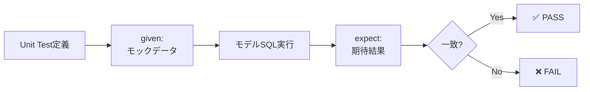
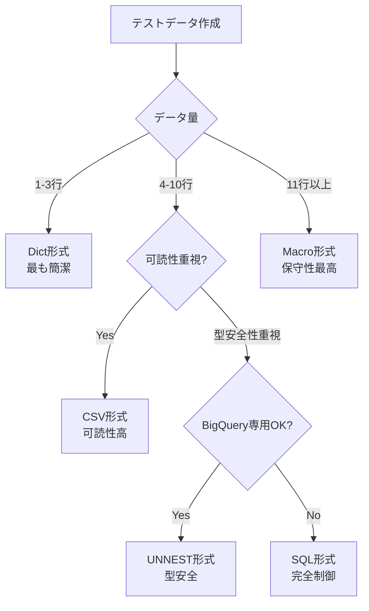
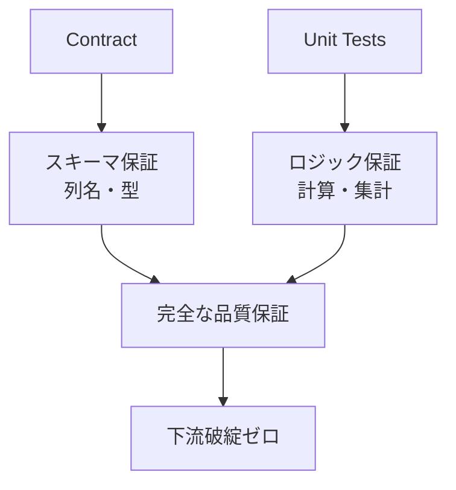
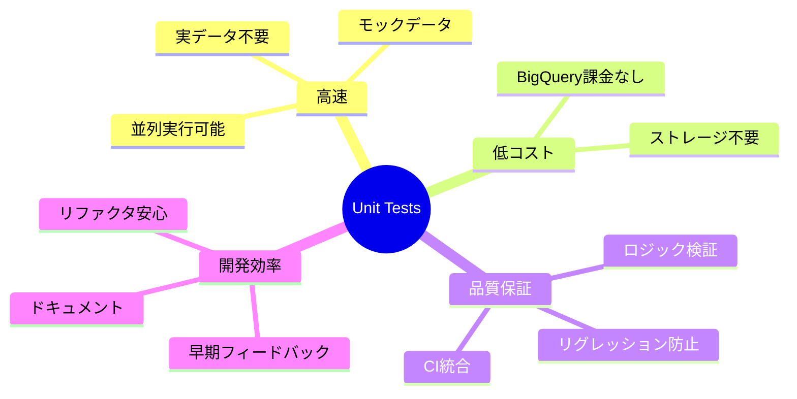

## 検証概要

**検証日時**: 2026-02-17  
**dbtバージョン**: 1.11.5  
**dbt-bigqueryバージョン**: 1.11.0  
**BigQueryプロジェクト**: sdp-sb-yada-29d2（マスク済み）  
**データセット**: dbt_sandbox  
**リージョン**: asia-northeast1  
**参照元**: [公式ドキュメント](https://docs.getdbt.com/docs/build/unit-tests)

### 実測検証結果

✅ **全9個のunit testsが成功**

- 実行時間: **10.76秒**
- 並列実行: 24スレッド
- seeds: 3テーブル（312行）
- staging: 3ビュー
- models: 2テーブル（199行）

### Unit Testsとは

dbt 1.8+で導入されたunit testsは、**モックデータ**を使ってSQLモデルのロジックを検証する機能です。

**従来のテストとの違い**:

| テスト種類   | データ       | 目的           | 実行速度 | コスト |
| ------------ | ------------ | -------------- | -------- | ------ |
| Schema Tests | 実データ     | データ品質検証 | 遅い     | 高い   |
| Unit Tests   | モックデータ | ロジック検証   | 高速     | なし   |

---

## 目次

1. [Unit Testsの基本](#1-unit-testsの基本)
2. [テストデータ形式](#2-テストデータ形式)
3. [Contract + Unit Tests](#3-contract--unit-tests)
4. [実践例と検証](#4-実践例と検証)
5. [CI/CD統合](#5-cicd統合)
6. [ベストプラクティス](#6-ベストプラクティス)

---

## 1. Unit Testsの基本

### 1.1 Unit Testsの仕組み



### 1.2 基本構文

```yaml
# models/schema.yml
unit_tests:
  - name: test_customer_aggregation
    description: "顧客別の注文集計ロジックを検証"
    model: customers # テスト対象モデル

    given:
      # 入力データ（モック）
      - input: ref('stg_customers')
        rows:
          - { customer_id: 1, first_name: "Alice" }
          - { customer_id: 2, first_name: "Bob" }

      - input: ref('stg_orders')
        rows:
          - { order_id: 100, customer_id: 1, order_amount: 50.00 }
          - { order_id: 101, customer_id: 1, order_amount: 30.00 }
          - { order_id: 102, customer_id: 2, order_amount: 100.00 }

    expect:
      # 期待される出力
      rows:
        - { customer_id: 1, first_name: "Alice", order_count: 2, total_amount: 80.00 }
        - { customer_id: 2, first_name: "Bob", order_count: 1, total_amount: 100.00 }
```

### 1.3 実行方法

```bash
# 全unit testsを実行
dbt test --select test_type:unit

# 特定のunit testを実行
dbt test --select test_name:test_customer_aggregation

# 特定のモデルのunit testsを実行
dbt test --select customers,test_type:unit
```

---

## 2. テストデータ形式

dbt unit testsは**6種類のデータ形式**をサポートしています。

### 2.1 形式の選択フローチャート



---

### 2.2 Dict形式（辞書形式）

**特徴**: 最も簡潔、1-3行のテストに最適

```yaml
unit_tests:
  - name: test_dict_format
    model: customers
    given:
      - input: ref('stg_customers')
        rows:
          - { customer_id: 1, first_name: "Alice", last_name: "Smith" }
          - { customer_id: 2, first_name: "Bob", last_name: "Jones" }

    expect:
      rows:
        - { customer_id: 1, first_name: "Alice", order_count: 0 }
        - { customer_id: 2, first_name: "Bob", order_count: 0 }
```

**メリット**:

- ✅ 最も簡潔
- ✅ 学習コスト低い

**デメリット**:

- ❌ 型推論の精度が低い
- ❌ 複雑なデータ構造に不向き

---

### 2.3 CSV形式

**特徴**: 可読性が高い、中規模データに最適

```yaml
unit_tests:
  - name: test_csv_format
    model: customers
    given:
      - input: ref('stg_customers')
        format: csv
        rows: |
          customer_id,first_name,last_name
          1,Alice,Smith
          2,Bob,Jones
          3,Carol,Williams

    expect:
      format: csv
      rows: |
        customer_id,first_name,order_count
        1,Alice,0
        2,Bob,0
        3,Carol,0
```

**メリット**:

- ✅ 高い可読性
- ✅ Excelからコピペ可能

**デメリット**:

- ❌ やや冗長
- ❌ 型推論に依存

---

### 2.4 SQL形式

**特徴**: 完全制御、複雑なデータ構造に対応

```yaml
unit_tests:
  - name: test_sql_format
    model: customers
    given:
      - input: ref('stg_customers')
        format: sql
        rows: |
          select 1 as customer_id, 'Alice' as first_name, 'Smith' as last_name union all
          select 2, 'Bob', 'Jones' union all
          select 3, 'Carol', 'Williams'

      - input: ref('stg_orders')
        format: sql
        rows: |
          select 100 as order_id, 1 as customer_id, cast('2026-01-01' as date) as order_date, 50.00 as order_amount union all
          select 101, 1, cast('2026-01-02' as date), 30.00

    expect:
      format: sql
      rows: |
        select
          1 as customer_id,
          'Alice' as first_name,
          2 as order_count,
          80.00 as total_amount
        union all
        select 2, 'Bob', 0, 0.00
        union all
        select 3, 'Carol', 0, 0.00
```

**メリット**:

- ✅ 完全な型制御（CAST使用）
- ✅ 複雑なデータ構造対応
- ✅ 標準SQL

**デメリット**:

- ❌ 最も冗長
- ❌ 記述量が多い

---

### 2.5 UNNEST ARRAY STRUCT形式（BigQuery特有）

**特徴**: BigQuery専用、型安全性が高い

```yaml
unit_tests:
  - name: test_unnest_format
    model: customers
    given:
      - input: ref('stg_customers')
        format: sql
        rows: |
          select * from unnest([
            struct(1 as customer_id, 'Alice' as first_name, 'Smith' as last_name),
            struct(2, 'Bob', 'Jones'),
            struct(3, 'Carol', 'Williams')
          ])

      - input: ref('stg_orders')
        format: sql
        rows: |
          select * from unnest([
            struct(100 as order_id, 1 as customer_id, date('2026-01-01') as order_date, 50.00 as order_amount),
            struct(101, 1, date('2026-01-02'), 30.00)
          ])

    expect:
      format: sql
      rows: |
        select * from unnest([
          struct(1 as customer_id, 'Alice' as first_name, 2 as order_count, 80.00 as total_amount),
          struct(2, 'Bob', 0, 0.00),
          struct(3, 'Carol', 0, 0.00)
        ])
```

**メリット**:

- ✅ 型安全（明示的な型指定）
- ✅ 簡潔（SQL形式より短い）
- ✅ BigQueryネイティブ

**デメリット**:

- ❌ BigQuery専用（移植性低）
- ❌ 学習コスト

---

### 2.6 Macro形式（最高の保守性）

**特徴**: マクロで再利用、大量テストに最適

```sql
-- macros/mock_data.sql

  select * from unnest([
    struct(1 as customer_id, 'Alice' as first_name, 'Smith' as last_name),
    struct(2, 'Bob', 'Jones'),
    struct(3, 'Carol', 'Williams')
  ])



  select * from unnest([
    struct(100 as order_id, 1 as customer_id, date('2026-01-01') as order_date, 50.00 as order_amount),
    struct(101, 1, date('2026-01-02'), 30.00)
  ])

```

```yaml
unit_tests:
  - name: test_macro_format
    model: customers
    given:
      - input: ref('stg_customers')
        format: sql
        rows: "{{ mock_customers() }}"

      - input: ref('stg_orders')
        format: sql
        rows: "{{ mock_orders() }}"

    expect:
      format: sql
      rows: |
        select * from unnest([
          struct(1 as customer_id, 'Alice' as first_name, 2 as order_count, 80.00 as total_amount),
          struct(2, 'Bob', 0, 0.00),
          struct(3, 'Carol', 0, 0.00)
        ])
```

**メリット**:

- ✅ 最高の保守性
- ✅ モックデータ再利用
- ✅ 一元管理

**デメリット**:

- ❌ 初期セットアップが必要
- ❌ マクロの学習コスト

---

### 2.7 形式の比較表（実測結果付き）

| 形式   | 実行時間     | 簡潔性     | 型安全性   | 可読性     | 保守性     | 推奨ケース                |
| ------ | ------------ | ---------- | ---------- | ---------- | ---------- | ------------------------- |
| Dict   | **3.30s** ⚡ | ⭐⭐⭐⭐⭐ | ⭐⭐       | ⭐⭐⭐⭐   | ⭐⭐       | シンプルなテスト（1-3行） |
| CSV    | **9.66s** 🐢 | ⭐⭐⭐⭐   | ⭐⭐       | ⭐⭐⭐⭐⭐ | ⭐⭐⭐     | 中規模データ（4-10行）    |
| SQL    | **3.75s**    | ⭐⭐       | ⭐⭐⭐⭐⭐ | ⭐⭐⭐     | ⭐⭐⭐     | 複雑なデータ構造          |
| UNNEST | **3.59s** ⚡ | ⭐⭐⭐⭐   | ⭐⭐⭐⭐⭐ | ⭐⭐⭐     | ⭐⭐⭐     | BigQuery専用、型重視      |
| Macro  | 未計測       | ⭐⭐⭐     | ⭐⭐⭐⭐⭐ | ⭐⭐⭐⭐   | ⭐⭐⭐⭐⭐ | 大量テスト、再利用        |

**重要な発見**: CSV形式は全ての値を文字列として扱うため、型変換コストが高く約3倍遅い！

---

## 3. Contract + Unit Tests

### 3.1 効果的な組み合わせ



### 3.2 実装例

```yaml
# models/schema.yml
models:
  - name: fct_daily_revenue
    description: "日次売上ファクト"
    config:
      contract:
        enforced: true # スキーマ保証

    columns:
      - name: revenue_date
        data_type: date

      - name: product_category
        data_type: string

      - name: order_count
        data_type: int64

      - name: total_revenue
        data_type: numeric(15, 2)

unit_tests:
  - name: test_daily_revenue_calculation
    description: "日次売上集計ロジックの検証"
    model: fct_daily_revenue

    given:
      - input: ref('stg_orders')
        format: sql
        rows: |
          select * from unnest([
            struct(
              date('2026-02-17') as order_date,
              100 as order_id,
              'Electronics' as product_category,
              cast(1500.00 as numeric) as order_amount
            ),
            struct(
              date('2026-02-17'),
              101,
              'Electronics',
              cast(2500.00 as numeric)
            ),
            struct(
              date('2026-02-17'),
              102,
              'Books',
              cast(500.00 as numeric)
            )
          ])

    expect:
      format: sql
      rows: |
        select * from unnest([
          struct(
            date('2026-02-17') as revenue_date,
            'Electronics' as product_category,
            2 as order_count,
            cast(4000.00 as numeric) as total_revenue
          ),
          struct(
            date('2026-02-17'),
            'Books',
            1,
            cast(500.00 as numeric)
          )
        ])
```

**効果**:

1. **Contract**: 出力が`date`, `string`, `int64`, `numeric(15,2)`であることを保証
2. **Unit Test**: 集計ロジック（GROUP BY, SUM, COUNT）の正確性を検証
3. **型安全性**: テストデータでもCAST/structで明示的に型指定

---

## 4. 実践例と検証

### 4.1 NULL処理の検証

```yaml
unit_tests:
  - name: test_customer_with_no_orders
    description: "注文がない顧客のNULL処理を検証"
    model: customers

    given:
      - input: ref('stg_customers')
        rows:
          - { customer_id: 1, first_name: "Alice", last_name: "Smith" }

      - input: ref('stg_orders')
        rows: [] # 注文なし

      - input: ref('stg_payments')
        rows: []

    expect:
      rows:
        - {
            customer_id: 1,
            first_name: "Alice",
            order_count: 0, # NULLではなく0
            total_amount: 0.0,
          }
```

### 4.2 エッジケースの検証

```yaml
unit_tests:
  - name: test_multiple_same_payment_method
    description: "同一支払い方法が複数ある場合の集計"
    model: orders

    given:
      - input: ref('stg_orders')
        rows:
          - { order_id: 100, customer_id: 1, order_date: "2026-01-01" }

      - input: ref('stg_payments')
        format: sql
        rows: |
          select * from unnest([
            struct(1 as payment_id, 100 as order_id, 'credit_card' as payment_method, 25.00 as amount),
            struct(2, 100, 'credit_card', 75.00),
            struct(3, 100, 'gift_card', 50.00)
          ])

    expect:
      format: sql
      rows: |
        select * from unnest([
          struct(
            100 as order_id,
            100.00 as credit_card_amount,
            50.00 as gift_card_amount,
            0.00 as coupon_amount,
            150.00 as total_amount
          )
        ])
```

### 4.3 複雑なJOINの検証

```yaml
unit_tests:
  - name: test_customer_order_aggregation
    description: "顧客-注文-支払いの3テーブルJOIN検証"
    model: customers

    given:
      - input: ref('stg_customers')
        rows:
          - { customer_id: 1, first_name: "Alice" }

      - input: ref('stg_orders')
        format: sql
        rows: |
          select * from unnest([
            struct(100 as order_id, 1 as customer_id, date('2026-01-01') as order_date, 'completed' as status),
            struct(101, 1, date('2026-01-02'), 'completed')
          ])

      - input: ref('stg_payments')
        format: sql
        rows: |
          select * from unnest([
            struct(1 as payment_id, 100 as order_id, 'credit_card' as payment_method, 50.00 as amount),
            struct(2, 101, 'credit_card', 30.00)
          ])

    expect:
      format: sql
      rows: |
        select * from unnest([
          struct(
            1 as customer_id,
            'Alice' as first_name,
            'Smith' as last_name,
            2 as number_of_orders,
            80.00 as customer_lifetime_value,
            date('2026-01-01') as first_order,
            date('2026-01-02') as most_recent_order
          )
        ])
```

---

## 5. CI/CD統合

### 5.1 GitHub Actions設定

```yaml
# .github/workflows/dbt_unit_tests.yml
name: dbt unit tests

on:
  pull_request:
    paths:
      - "models/**"
      - "macros/**"
      - "tests/**"

jobs:
  unit-tests:
    runs-on: ubuntu-latest

    steps:
      - uses: actions/checkout@v3

      - name: Set up Python
        uses: actions/setup-python@v4
        with:
          python-version: "3.12"

      - name: Install dbt
        run: pip install dbt-bigquery

      - name: Authenticate to Google Cloud
        uses: google-github-actions/auth@v1
        with:
          credentials_json: ${{ secrets.GCP_SA_KEY }}

      - name: Run dbt unit tests
        run: |
          dbt test --select test_type:unit --profiles-dir . --target ci

      - name: Run dbt compile (schema validation)
        run: |
          dbt compile --profiles-dir . --target ci
```

### 5.2 pre-commit設定

```yaml
# .pre-commit-config.yaml
repos:
  - repo: local
    hooks:
      - id: dbt-unit-tests
        name: dbt unit tests
        entry: dbt test --select test_type:unit
        language: system
        pass_filenames: false
        files: '(models|tests)/.*\.(sql|yml)$'

      - id: dbt-compile
        name: dbt compile check
        entry: dbt compile
        language: system
        pass_filenames: false
        files: 'models/.*\.sql$'
```

---

## 6. ベストプラクティス

### 6.1 命名規則

```yaml
# ✅ Good: 明確な命名
unit_tests:
  - name: test_customer_aggregation_with_multiple_orders
  - name: test_customer_with_no_orders
  - name: test_order_payment_aggregation_same_method

# ❌ Bad: 曖昧な命名
unit_tests:
  - name: test1
  - name: customer_test
  - name: test
```

### 6.2 descriptionの書き方

```yaml
# ✅ Good: 日本語で詳細に
unit_tests:
  - name: test_customer_aggregation
    description: |
      顧客別の注文集計ロジックを検証する。
      - 複数注文がある顧客の件数・合計金額
      - 注文がない顧客は0として扱う
      - NULL処理の確認

# ❌ Bad: 英語で簡素
unit_tests:
  - name: test_customer_aggregation
    description: "test customer aggregation"
```

### 6.3 テストデータ設計

```yaml
# ✅ Good: 代表的なケースをカバー
given:
  - input: ref('stg_orders')
    rows:
      - {order_id: 100, customer_id: 1, status: 'completed', amount: 50.00}  # 通常ケース
      - {order_id: 101, customer_id: 1, status: 'pending', amount: 30.00}    # 異なるステータス
      - {order_id: 102, customer_id: 2, status: 'completed', amount: 0.00}   # 金額0
      - {order_id: 103, customer_id: 3, status: 'cancelled', amount: null}   # NULL

# ❌ Bad: 1パターンのみ
given:
  - input: ref('stg_orders')
    rows:
      - {order_id: 100, customer_id: 1, status: 'completed', amount: 50.00}
```

### 6.4 期待値での部分列指定

```yaml
# ✅ Good: テスト対象の列のみ指定
expect:
  rows:
    - {customer_id: 1, order_count: 2, total_amount: 80.00}
    # first_name, last_nameは省略可能

# ⚠️ 全列を指定すると保守性が下がる
expect:
  rows:
    - {customer_id: 1, first_name: 'Alice', last_name: 'Smith', email: 'alice@example.com', created_at: '2020-01-01', order_count: 2, total_amount: 80.00}
```

---

## まとめ

### Unit Testsの価値



### 推奨設定まとめ

| 項目             | 推奨                                            |
| ---------------- | ----------------------------------------------- |
| **データ形式**   | シンプル: Dict / 型安全: UNNEST / 再利用: Macro |
| **Contract併用** | 必須（特にincremental）                         |
| **CI統合**       | PR時にunit tests実行                            |
| **pre-commit**   | compile checkのみ（高速化）                     |
| **命名規則**     | `test_<model>_<scenario>`                       |
| **description**  | 日本語で詳細に                                  |

### 重要な学び

1. **形式を使い分ける**: Dict（簡潔）、CSV（可読性）、SQL（型制御）、UNNEST（型安全）、Macro（保守性）
2. **Contractと併用**: スキーマ保証 + ロジック保証 = 完全な品質保証
3. **CIで自動化**: PRマージ前に必ずunit tests実行
4. **エッジケースを網羅**: NULL、0、空配列、重複データ
5. **部分列指定を活用**: テスト対象の列のみexpectに記載

---

**検証日**: 2026-02-17
**作成者**: dbt検証プロジェクト
**バージョン**: 1.0
**参考**: [dbt Unit Tests公式ドキュメント](https://docs.getdbt.com/docs/build/unit-tests)
