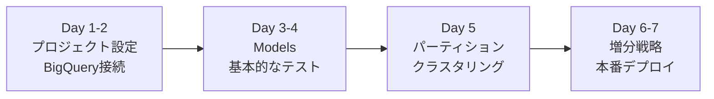
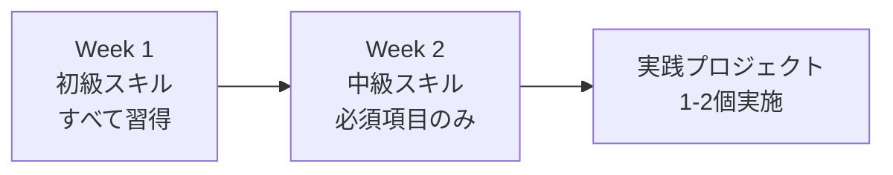

このページでは、dbt + BigQueryのスキルを**レベル別**に整理し、効率的な学習パスを提供します。

---

## 🎯 学習の進め方

1. **自分のレベルを確認** - 初級・中級・上級のどこから始めるか
2. **必須スキルから習得** - 各レベルの必須項目を優先
3. **実践で確認** - 実際に手を動かして検証
4. **次のレベルへ** - 一定の習熟度に達したら上位レベルへ

---

## 📊 スキルレベル別学習マップ

### 🟢 初級スキル (Essential)

**対象:** dbtを初めて使う、BigQueryの基本を学びたい

**目標:** dbtプロジェクトを立ち上げて、基本的なモデルを実行できる

#### 必須スキル

| スキル                    | 内容                                     | 参照先                                                        | 学習時間 |
| ------------------------- | ---------------------------------------- | ------------------------------------------------------------- | -------- |
| ✅ **プロジェクト設定**   | dbt_project.yml の理解と設定             | [プロジェクト基本設定](../categories/project-basic-config.md) | 2時間    |
| ✅ **BigQuery接続**       | 認証方法（OAuth, Service Account）の設定 | [BigQuery接続設定](../categories/bigquery-connection.md)      | 2時間    |
| ✅ **基本的なモデル作成** | table, view マテリアライゼーション       | [Models](../categories/models/)                       | 3時間    |
| ✅ **Seeds の使用**       | CSVファイルのロード                      | [Seeds](../categories/seed-config.md)                         | 1時間    |

#### 推奨スキル

| スキル                  | 内容                            | 参照先                                                    | 学習時間 |
| ----------------------- | ------------------------------- | --------------------------------------------------------- | -------- |
| ⭐ **基本的なテスト**   | Schema Tests (unique, not_null) | [Tests](../categories/testing-config.md)                  | 1.5時間  |
| ⭐ **ドキュメント生成** | dbt docs generate の使い方      | [ドキュメント設定](../categories/documentation-config.md) | 1時間    |

**習得の目安:**

- [ ] dbtプロジェクトを新規作成できる
- [ ] BigQueryに接続して dbt run を実行できる
- [ ] table と view の違いを理解している
- [ ] CSVファイルをSeedとしてロードできる

---

### 🟡 中級スキル (Intermediate)

**対象:** dbtの基本を理解し、本番運用を見据えた設計をしたい

**目標:** パーティション・クラスタリングを使った効率的なモデル設計、テストによるデータ品質保証

#### 必須スキル

| スキル                    | 内容                                 | 参照先                                                                             | 学習時間 |
| ------------------------- | ------------------------------------ | ---------------------------------------------------------------------------------- | -------- |
| ✅ **パーティショニング** | DATE, INT64 range パーティション設計 | [パーティショニング＆クラスタリング](../features/partitioning-clustering-guide.md) | 3時間    |
| ✅ **クラスタリング**     | 単一列・複数列クラスタリング         | [パーティショニング＆クラスタリング](../features/partitioning-clustering-guide.md) | 2時間    |
| ✅ **増分戦略**           | merge, insert_overwrite の使い分け   | [Models](../categories/models/)                                            | 3時間    |
| ✅ **包括的なテスト**     | Schema/Singular Tests の実装         | [Tests](../categories/testing-config.md)                                           | 3時間    |

#### 推奨スキル

| スキル                      | 内容                       | 参照先                                                            | 学習時間 |
| --------------------------- | -------------------------- | ----------------------------------------------------------------- | -------- |
| ⭐ **パフォーマンス最適化** | スロット最適化、並列実行   | [パフォーマンス最適化](../categories/performance-optimization.md) | 2時間    |
| ⭐ **Snapshots**            | SCD Type 2 実装            | [Snapshots](../categories/snapshot-config.md)                     | 2時間    |
| ⭐ **Hooks**                | pre-hook, post-hook の活用 | [Hooks](../categories/hooks-config.md)                            | 1.5時間  |

**習得の目安:**

- [ ] パーティション・クラスタリング戦略を設計できる
- [ ] 増分モデルを適切に実装できる
- [ ] データ品質テストを網羅的に書ける
- [ ] パフォーマンスボトルネックを特定できる

---

### 🔴 上級スキル (Advanced)

**対象:** 大規模プロジェクトの設計、高度な機能の活用

**目標:** エンタープライズ級のdbtプロジェクト構築、CI/CD統合、高度なデータ品質保証

#### 必須スキル

| スキル                            | 内容                           | 参照先                                                               | 学習時間 |
| --------------------------------- | ------------------------------ | -------------------------------------------------------------------- | -------- |
| ✅ **Contract (スキーマ保証)**    | 型安全性、破壊的変更の検出     | [Contract設定](../features/contracts-config.md)                      | 2時間    |
| ✅ **Unit Tests**                 | モックデータでのロジック検証   | [Unit Tests検証](../features/unit-tests-verification.md)             | 3時間    |
| ✅ **BigQuery高度な機能**         | 暗号化、Python UDF、マテビュー | [BigQuery設定リファレンス](../features/bigquery-configs-complete.md) | 4時間    |
| ✅ **パフォーマンスチューニング** | クエリ最適化、コスト削減       | [パフォーマンス最適化](../categories/performance-optimization.md)    | 3時間    |

#### 推奨スキル

| スキル            | 内容                   | 参照先                                                              | 学習時間 |
| ----------------- | ---------------------- | ------------------------------------------------------------------- | -------- |
| ⭐ **Python UDF** | カスタムロジックの実装 | [BigQuery Python UDF](../features/bigquery-python-udf-deep-dive.md) | 4時間    |
| ⭐ **高度な設定** | vars, packages, macros | [その他の設定](../categories/other-config.md)                       | 2時間    |

**習得の目安:**

- [ ] スキーマ変更を安全に管理できる
- [ ] CI/CDパイプラインでUnit Testsを実行できる
- [ ] Python UDFで複雑なロジックを実装できる
- [ ] 大規模データセット（TB級）を効率的に処理できる
- [ ] コストとパフォーマンスのトレードオフを判断できる

---

## 🎓 学習パス例

### パターン1: 最速で本番運用開始 (1週間)

**対象:** すぐに本番で使いたい
**スキルレベル:** 初級 → 中級の一部

### パターン2: 堅実に基礎固め (2週間)

**対象:** 基礎をしっかり固めたい
**スキルレベル:** 初級完了 → 中級習得

### パターン3: エキスパートを目指す (1ヶ月)

**対象:** dbtエキスパートになりたい
**スキルレベル:** 初級 → 中級 → 上級

---

## 🔍 スキル別逆引き

### 目的から探す

| 目的                   | おすすめスキル                               | レベル             |
| ---------------------- | -------------------------------------------- | ------------------ |
| **コスト削減**         | パーティショニング、クラスタリング、増分戦略 | 🟡 中級            |
| **データ品質向上**     | Tests、Contracts、Unit Tests                 | 🟡 中級 〜 🔴 上級 |
| **パフォーマンス改善** | パフォーマンス最適化、マテビュー             | 🔴 上級            |
| **履歴管理**           | Snapshots                                    | 🟡 中級            |
| **複雑なロジック実装** | Python UDF                                   | 🔴 上級            |
| **CI/CD構築**          | Unit Tests、Contracts                        | 🔴 上級            |

### 技術スタック別

#### SQL中心

- 🟢 Models (基本)
- 🟡 パーティション・クラスタリング
- 🟡 増分戦略
- 🟡 Tests

#### Python活用

- 🔴 Python UDF
- 🔴 カスタムマクロ

#### データエンジニアリング全般

- 🟢 プロジェクト設定
- 🟡 パフォーマンス最適化
- 🔴 Contracts + Unit Tests
- 🔴 CI/CD統合

---

## 📈 進捗管理

### 初級スキル習得チェックリスト

- [ ] dbt_project.yml を理解し、設定できる
- [ ] BigQueryに接続できる（OAuth または Service Account）
- [ ] table モデルを作成できる
- [ ] view モデルを作成できる
- [ ] CSVファイルをSeedとしてロードできる
- [ ] unique, not_null テストを書ける
- [ ] dbt docs generate を実行できる

**習得度:** \_\_\_/7

---

### 中級スキル習得チェックリスト

- [ ] DATE パーティションを設定できる
- [ ] INT64 range パーティションを設定できる
- [ ] クラスタリングを設定できる（単一列）
- [ ] クラスタリングを設定できる（複数列）
- [ ] incremental モデル (merge) を実装できる
- [ ] incremental モデル (insert_overwrite) を実装できる
- [ ] Singular Tests を書ける
- [ ] Snapshots (SCD Type 2) を実装できる
- [ ] pre-hook / post-hook を使える
- [ ] パフォーマンス問題を特定できる

**習得度:** \_\_\_/10

---

### 上級スキル習得チェックリスト

- [ ] Contracts を設定できる
- [ ] Unit Tests を実装できる
- [ ] Python UDF を実装できる
- [ ] Materialized View を使える
- [ ] CI/CDパイプラインを構築できる
- [ ] クエリパフォーマンスを最適化できる
- [ ] コストとパフォーマンスのトレードオフを判断できる
- [ ] 大規模プロジェクト（100+ models）を設計できる

**習得度:** \_\_\_/8

---

## 🎯 次のステップ

### 初級者の方

まずは **[学習ガイド](learning-guide.md)** の「初学者向け（1週間）」パスを参照してください。

### 中級者の方

**[実行ガイド](execution-guide.md)** で実際に検証プロジェクトを動かしてみましょう。

### 上級者の方

**[BigQuery Python UDF](../features/bigquery-python-udf-deep-dive.md)** や **[Contract設定](../features/contracts-config.md)** で最新機能を試してください。

---

## 📚 関連リソース

- [プロジェクト概要](../overview.md) - 全体像を把握
- [学習ガイド](learning-guide.md) - 詳細な学習パス
- [再実行ガイド](execution-guide.md) - 環境構築と検証手順

---

**最終更新:** 2026-02-17
