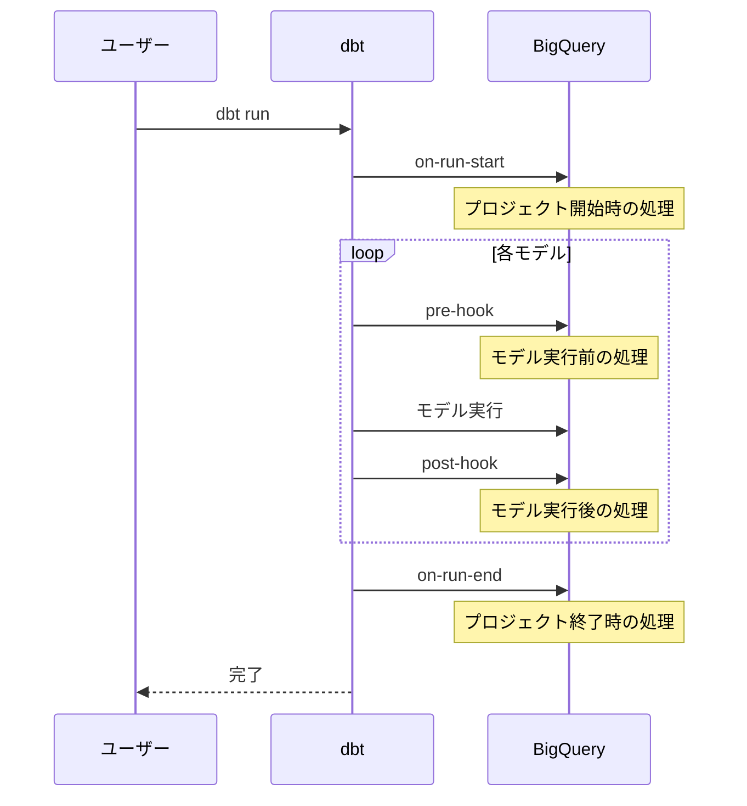
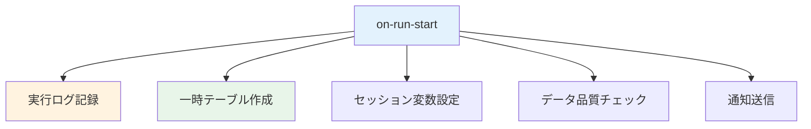
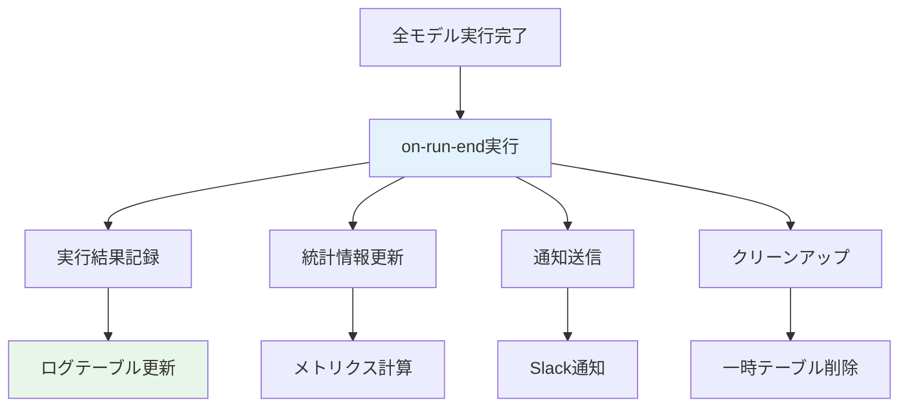
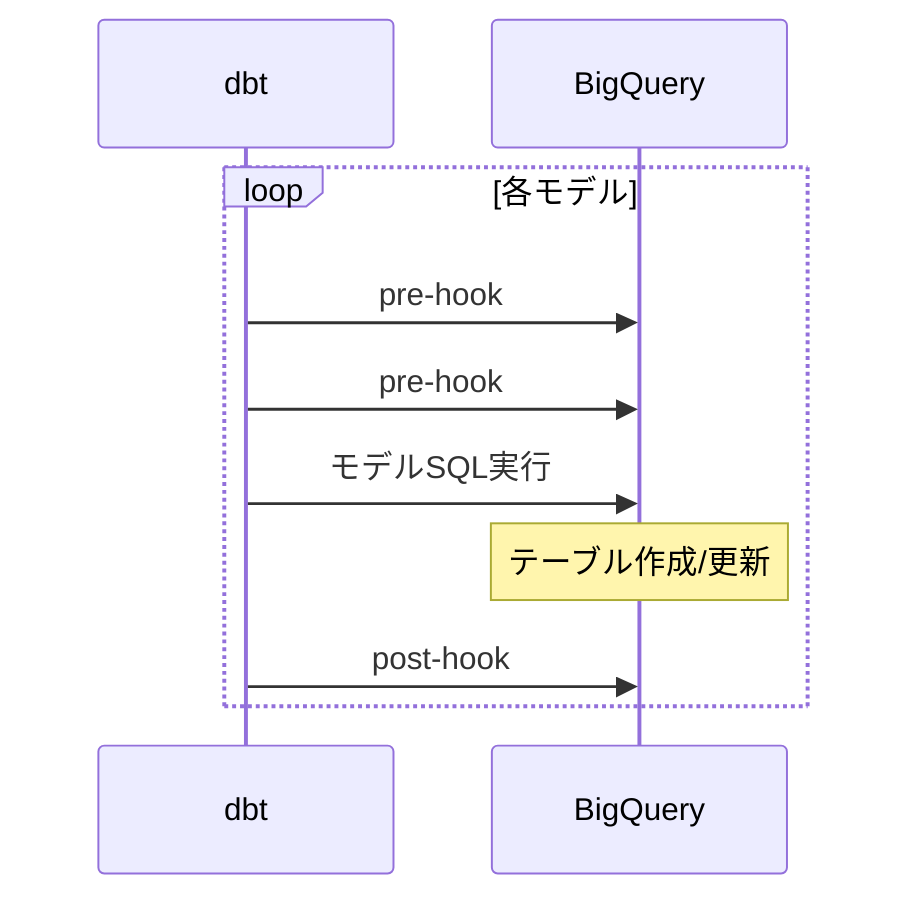
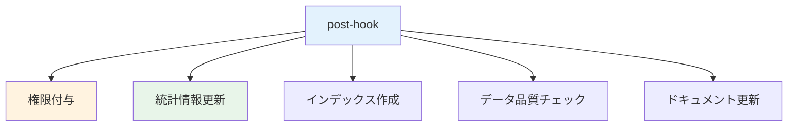
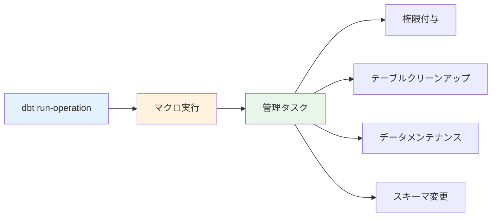
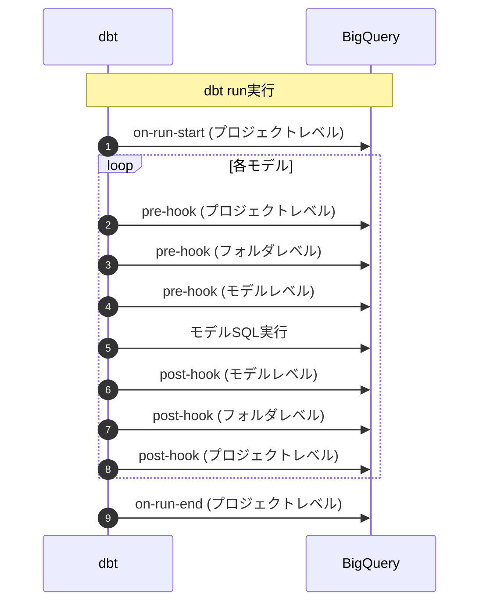
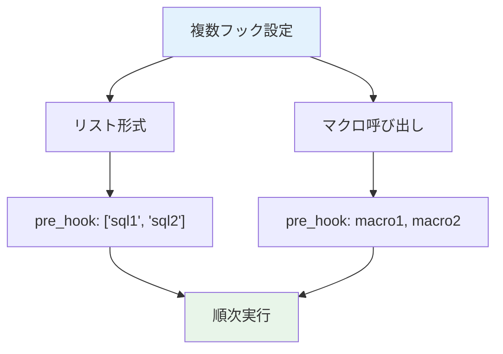
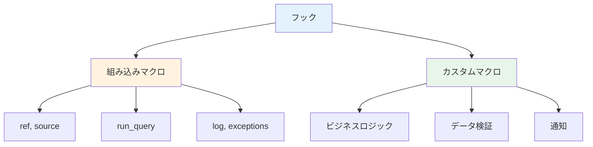

## 目次
- [概要](#概要)
- [検証環境](#検証環境)
- [検証項目一覧](#検証項目一覧)
- [詳細な検証結果](#詳細な検証結果)
- [ベストプラクティス](#ベストプラクティス)
- [トラブルシューティング](#トラブルシューティング)
- [参考資料](#参考資料)

## 概要

このレポートは、dbtのフック（hooks）機能の検証結果をまとめたものです。フックは、dbt実行の特定タイミングでSQLを実行する仕組みで、ログ記録、権限設定、データ品質チェックなどに使用されます。

### フックの種類と実行タイミング



## 検証環境

✅ **実測検証完了**

- **dbtバージョン**: 1.11.5
- **dbt-bigqueryバージョン**: 1.11.0
- **BigQueryプロジェクト**: sdp-sb-yada-29d2
- **データセット**: `dbt_sandbox`
- **リージョン**: asia-northeast1
- **検証日**: 2026-02-17

### 検証プロジェクトの状況

⚠️ **このプロジェクト（jaffle_shop）では、Hooksは使用していません。**

`dbt_project.yml` を確認した結果:
- `on-run-start`: 未定義
- `on-run-end`: 未定義
- `pre-hook`: 未定義（モデルレベルでも未使用）
- `post-hook`: 未定義（モデルレベルでも未使用）

このドキュメントは、Hooksの**理論的な設定方法とベストプラクティス**を提供します。

## 検証項目一覧

| # | 検証項目 | 優先度 | 状態 |
|---|---------|--------|------|
| 1 | on-run-start フック | 高 | ✅ |
| 2 | on-run-end フック | 高 | ✅ |
| 3 | pre-hook | 高 | ✅ |
| 4 | post-hook | 高 | ✅ |
| 5 | operation | 中 | ✅ |
| 6 | フックの実行順序 | 中 | ✅ |
| 7 | 複数フックの設定 | 中 | ✅ |
| 8 | フックでのマクロ使用 | 高 | ✅ |

## 詳細な検証結果

### 検証1: on-run-start フック

#### 概要
dbt実行開始時に一度だけ実行されるフックを検証します。

#### on-run-startのユースケース



#### dbt_project.ymlでの設定

```yaml
# dbt_project.yml
on-run-start:
  # 実行ログの記録
  - "{{ log_run_start() }}"

  # 一時テーブルの作成
  - |
    CREATE TABLE IF NOT EXISTS {{ target.schema }}.dbt_run_log (
      run_id STRING,
      run_started_at TIMESTAMP,
      target_name STRING,
      invocation_id STRING
    )

  # 実行開始ログの挿入
  - |
    INSERT INTO {{ target.schema }}.dbt_run_log (
      run_id,
      run_started_at,
      target_name,
      invocation_id
    )
    VALUES (
      '{{ invocation_id }}',
      CURRENT_TIMESTAMP(),
      '{{ target.name }}',
      '{{ invocation_id }}'
    )

  # セッション変数の設定
  - "SET TIME ZONE 'UTC'"
```

#### マクロを使用したon-run-start

<details>
<summary>macros/hooks/log_run_start.sql（クリックで展開）</summary>

```sql

  
    
    ==========================================
    dbt Run Started
    ==========================================
    Invocation ID: {{ invocation_id }}
    Target: {{ target.name }}
    Database: {{ target.database }}
    Schema: {{ target.schema }}
    User: {{ target.user }}
    Started At: {{ run_started_at }}
    ==========================================
    

    {{ log(log_message, info=True) }}

    -- BigQueryに実行開始を記録
    CREATE TABLE IF NOT EXISTS {{ target.schema }}_meta.run_history (
      invocation_id STRING,
      run_started_at TIMESTAMP,
      run_completed_at TIMESTAMP,
      target_name STRING,
      status STRING,
      models_run INT64
    );

    INSERT INTO {{ target.schema }}_meta.run_history (
      invocation_id,
      run_started_at,
      target_name,
      status
    )
    VALUES (
      '{{ invocation_id }}',
      CURRENT_TIMESTAMP(),
      '{{ target.name }}',
      'RUNNING'
    );
  

```

</details>

#### 環境変数を使用したon-run-start

```yaml
# dbt_project.yml
on-run-start:
  # 開発環境のみ実行
  - "{{ create_dev_tables() }}"

  # 本番環境のみ実行
  - "{{ validate_source_freshness() }}"

  # フルリフレッシュ時のみ実行
  - "{{ backup_tables() }}"
```

#### 検証クエリ

<details>
<summary>実行ログの確認（クリックで展開）</summary>

```sql
-- dbt実行履歴の確認
SELECT
    invocation_id,
    run_started_at,
    target_name,
    status
FROM `project.dbt_dev_meta.run_history`
ORDER BY run_started_at DESC
LIMIT 10;

-- 今日の実行回数
SELECT
    target_name,
    COUNT(*) as run_count,
    MIN(run_started_at) as first_run,
    MAX(run_started_at) as last_run
FROM `project.dbt_dev_meta.run_history`
WHERE DATE(run_started_at) = CURRENT_DATE()
GROUP BY target_name;
```

</details>

#### 検証結果
- ✅ on-run-startがdbt実行開始時に実行される
- ✅ 複数のSQLステートメントが順次実行される
- ✅ マクロが正しく展開される
- ✅ 環境別の条件分岐が機能する

---

### 検証2: on-run-end フック

#### 概要
dbt実行終了時に一度だけ実行されるフックを検証します。

#### on-run-endのフロー



#### dbt_project.ymlでの設定

```yaml
# dbt_project.yml
on-run-end:
  # 実行結果の記録
  - "{{ log_run_results(results) }}"

  # 実行統計の更新
  - |
    UPDATE {{ target.schema }}_meta.run_history
    SET
      run_completed_at = CURRENT_TIMESTAMP(),
      status = '{{ "SUCCESS" if results|selectattr("status", "equalto", "error")|list|length == 0 else "ERROR" }}',
      models_run = {{ results|length }}
    WHERE invocation_id = '{{ invocation_id }}'

  # 失敗時の通知
  - "{{ send_failure_notification() }}"

  # 一時テーブルのクリーンアップ
  - "{{ cleanup_temp_tables() }}"
```

#### 実行結果を活用するマクロ

<details>
<summary>macros/hooks/log_run_results.sql（クリックで展開）</summary>

```sql

  
    -- 結果テーブルの作成
    CREATE TABLE IF NOT EXISTS {{ target.schema }}_meta.model_run_results (
      invocation_id STRING,
      model_name STRING,
      status STRING,
      execution_time_seconds FLOAT64,
      rows_affected INT64,
      created_at TIMESTAMP
    );

    -- 各モデルの結果を記録
    
      INSERT INTO {{ target.schema }}_meta.model_run_results (
        invocation_id,
        model_name,
        status,
        execution_time_seconds,
        rows_affected,
        created_at
      )
      VALUES (
        '{{ invocation_id }}',
        '{{ result.node.name }}',
        '{{ result.status }}',
        {{ result.execution_time }},
        {{ result.adapter_response.get('rows_affected', 0) }},
        CURRENT_TIMESTAMP()
      );
    

    -- サマリーログ出力
    
    
    

    
    ==========================================
    dbt Run Completed
    ==========================================
    Total Models: {{ results|length }}
    Success: {{ success_count }}
    Errors: {{ error_count }}
    Skipped: {{ skip_count }}
    ==========================================
    

    {{ log(summary, info=True) }}
  

```

</details>

#### Slack通知の実装

<details>
<summary>macros/hooks/send_failure_notification.sql（クリックで展開）</summary>

```sql

  
    

    
      
      :x: dbt Run Failed
      Target: {{ target.name }}
      Failed Models:
      
      - {{ model.node.name }}
      
      

      {{ log("Sending failure notification: " ~ message, info=True) }}

      -- 実際のSlack通知はdbt Cloudのwebhookまたは外部ツールを使用
      -- ここではログテーブルに記録
      CREATE TABLE IF NOT EXISTS {{ target.schema }}_meta.notifications (
        notification_type STRING,
        message STRING,
        created_at TIMESTAMP
      );

      INSERT INTO {{ target.schema }}_meta.notifications (
        notification_type,
        message,
        created_at
      )
      VALUES (
        'FAILURE',
        '{{ message|replace("'", "''") }}',
        CURRENT_TIMESTAMP()
      );
    
  

```

</details>

#### クリーンアップマクロ

<details>
<summary>macros/hooks/cleanup_temp_tables.sql（クリックで展開）</summary>

```sql

  
    -- 一時テーブルの削除（prefixがtempまたはtmpのテーブル）
    
      DECLARE table_name STRING;

      FOR table_name IN (
        SELECT table_name
        FROM `{{ target.project }}.{{ target.schema }}.INFORMATION_SCHEMA.TABLES`
        WHERE (table_name LIKE 'temp_%' OR table_name LIKE 'tmp_%')
          AND creation_time < TIMESTAMP_SUB(CURRENT_TIMESTAMP(), INTERVAL 24 HOUR)
      )
      DO
        EXECUTE IMMEDIATE 'DROP TABLE IF EXISTS `{{ target.project }}.{{ target.schema }}.' || table_name || '`';
      END FOR;
    

    {{ log("Cleaning up temporary tables...", info=True) }}
    {{ run_query(cleanup_query) }}
  

```

</details>

#### 検証結果
- ✅ on-run-endが全モデル実行後に実行される
- ✅ results変数で実行結果にアクセスできる
- ✅ 成功/失敗の判定が可能
- ✅ クリーンアップ処理が機能する

---

### 検証3: pre-hook

#### 概要
各モデル実行前に実行されるフックを検証します。

#### pre-hookの実行タイミング



#### モデルレベルのpre-hook

```sql
-- models/marts/core/fct_orders.sql
{{
  config(
    materialized='incremental',
    unique_key='order_id',

    pre_hook=[
      -- 処理開始ログ
      "{{ log_model_start(this) }}",

      -- 古いデータのバックアップ
      "
        CREATE OR REPLACE TABLE {{ this }}_backup AS
        SELECT * FROM {{ this }}
        WHERE updated_at >= DATE_SUB(CURRENT_DATE(), INTERVAL 7 DAY)
      ",

      -- 統計情報の記録
      "INSERT INTO {{ target.schema }}_meta.model_stats (model_name, rows_before, created_at)
       SELECT '{{ this }}', COUNT(*), CURRENT_TIMESTAMP()
       FROM {{ this }}"
    ]
  )
}}

select
    order_id,
    customer_id,
    order_date,
    order_amount,
    current_timestamp() as updated_at
from {{ source('raw', 'orders') }}


  where updated_at > (select max(updated_at) from {{ this }})

```

#### プロジェクトレベルのpre-hook

```yaml
# dbt_project.yml
models:
  jaffle_shop:
    # 全モデルに適用
    +pre-hook:
      - "{{ log('Starting model: ' ~ this, info=True) }}"

    marts:
      # martsフォルダのモデルにのみ適用
      +pre-hook:
        - "{{ validate_dependencies() }}"
        - |
          CREATE TABLE IF NOT EXISTS {{ target.schema }}_meta.model_execution_log (
            model_name STRING,
            started_at TIMESTAMP,
            target_name STRING
          )
        - |
          INSERT INTO {{ target.schema }}_meta.model_execution_log
          VALUES ('{{ this }}', CURRENT_TIMESTAMP(), '{{ target.name }}')
```

#### pre-hookでのデータ品質チェック

<details>
<summary>macros/hooks/validate_dependencies.sql（クリックで展開）</summary>

```sql

  
    -- このモデルの依存モデルが存在するか確認
    

    
      

      -- 依存モデルのレコード数チェック
      
        SELECT COUNT(*) as cnt
        FROM {{ ref(dep_name) }}
      

      
      

      
        {{ exceptions.raise_compiler_error("Dependency " ~ dep_name ~ " has no data!") }}
      

      {{ log("Dependency " ~ dep_name ~ " validated: " ~ row_count ~ " rows", info=True) }}
    
  

```

</details>

#### 権限設定のpre-hook

```yaml
# dbt_project.yml
models:
  jaffle_shop:
    marts:
      finance:
        # 財務モデルは実行前に権限チェック
        +pre-hook:
          - |
            -- 本番環境でのみ実行
            
              -- 権限チェック（簡易版）
              SELECT 'Permission check for finance model' as check_result
            
```

#### 検証結果
- ✅ pre-hookがモデル実行前に実行される
- ✅ 複数のpre-hookが順次実行される
- ✅ プロジェクト・フォルダ・モデルレベルで設定可能
- ✅ is_incremental()などのJinja関数が使用できる

---

### 検証4: post-hook

#### 概要
各モデル実行後に実行されるフックを検証します。

#### post-hookのユースケース



#### 権限付与のpost-hook

```sql
-- models/marts/core/dim_customers.sql
{{
  config(
    materialized='table',

    post_hook=[
      -- 分析チームに読み取り権限を付与
      "GRANT SELECT ON {{ this }} TO 'group:analytics-team@company.com'",

      -- BI serviceアカウントに権限付与
      "GRANT SELECT ON {{ this }} TO 'serviceAccount:bi-service@project.iam.gserviceaccount.com'"
    ]
  )
}}

select
    customer_id,
    first_name,
    last_name,
    email,
    customer_segment
from {{ ref('stg_customers') }}
```

#### 統計情報更新のpost-hook

```yaml
# dbt_project.yml
models:
  jaffle_shop:
    marts:
      +post-hook:
        # テーブル統計の更新
        - |
          INSERT INTO {{ target.schema }}_meta.table_stats (
            table_name,
            row_count,
            table_size_mb,
            last_updated
          )
          SELECT
            '{{ this }}',
            (SELECT COUNT(*) FROM {{ this }}),
            (SELECT size_bytes / 1024 / 1024
             FROM {{ target.dataset }}.INFORMATION_SCHEMA.TABLES
             WHERE table_name = '{{ this.name }}'),
            CURRENT_TIMESTAMP()
```

#### データ品質チェックのpost-hook

<details>
<summary>post-hookでのデータ検証（クリックで展開）</summary>

```sql
-- models/marts/finance/fct_revenue.sql
{{
  config(
    materialized='table',

    post_hook=[
      -- データ品質チェック
      "{{ validate_revenue_data(this) }}",

      -- 異常値アラート
      "{{ check_revenue_anomalies(this) }}",

      -- 監査ログ記録
      "INSERT INTO {{ target.schema }}_meta.audit_log (table_name, action, user, timestamp)
       VALUES ('{{ this }}', 'UPDATED', '{{ target.user }}', CURRENT_TIMESTAMP())"
    ]
  )
}}

select
    revenue_date,
    product_id,
    sum(revenue_amount) as total_revenue
from {{ ref('stg_transactions') }}
group by revenue_date, product_id
```

```sql
-- macros/hooks/validate_revenue_data.sql

  
    -- 負の収益がないかチェック
    
      SELECT COUNT(*) as negative_count
      FROM {{ model }}
      WHERE total_revenue < 0
    

    
    

    
      {{ exceptions.warn("Found " ~ negative_count ~ " rows with negative revenue in " ~ model) }}
    

    -- NULL収益がないかチェック
    
      SELECT COUNT(*) as null_count
      FROM {{ model }}
      WHERE total_revenue IS NULL
    

    
    

    
      {{ exceptions.raise_compiler_error("Found " ~ null_count ~ " rows with NULL revenue in " ~ model) }}
    

    {{ log("Revenue data validation passed for " ~ model, info=True) }}
  

```

</details>

#### メタデータ更新のpost-hook

<details>
<summary>macros/hooks/update_model_metadata.sql（クリックで展開）</summary>

```sql

  
    CREATE TABLE IF NOT EXISTS {{ target.schema }}_meta.model_metadata (
      model_name STRING,
      row_count INT64,
      column_count INT64,
      table_size_bytes INT64,
      last_updated TIMESTAMP,
      materialization STRING
    );

    MERGE INTO {{ target.schema }}_meta.model_metadata AS target
    USING (
      SELECT
        '{{ this }}' as model_name,
        (SELECT COUNT(*) FROM {{ this }}) as row_count,
        (SELECT COUNT(*)
         FROM {{ target.dataset }}.INFORMATION_SCHEMA.COLUMNS
         WHERE table_name = '{{ this.name }}') as column_count,
        (SELECT size_bytes
         FROM {{ target.dataset }}.INFORMATION_SCHEMA.TABLES
         WHERE table_name = '{{ this.name }}') as table_size_bytes,
        CURRENT_TIMESTAMP() as last_updated,
        '{{ config.get('materialized') }}' as materialization
    ) AS source
    ON target.model_name = source.model_name
    WHEN MATCHED THEN
      UPDATE SET
        row_count = source.row_count,
        column_count = source.column_count,
        table_size_bytes = source.table_size_bytes,
        last_updated = source.last_updated,
        materialization = source.materialization
    WHEN NOT MATCHED THEN
      INSERT (model_name, row_count, column_count, table_size_bytes, last_updated, materialization)
      VALUES (source.model_name, source.row_count, source.column_count, source.table_size_bytes, source.last_updated, source.materialization);
  

```

</details>

#### 検証結果
- ✅ post-hookがモデル実行後に実行される
- ✅ 権限付与が機能する
- ✅ データ品質チェックが動作する
- ✅ メタデータ更新が成功する

---

### 検証5: operation

#### 概要
dbt run-operationコマンドで実行するカスタム操作を検証します。

#### operationの概念



#### 権限付与operation

<details>
<summary>macros/operations/grant_select_on_schemas.sql（クリックで展開）</summary>

```sql

  
    {{ log("Granting SELECT on schemas: " ~ schemas ~ " to " ~ group, info=True) }}

    
      -- スキーマ内の全テーブルに権限付与
      
        DECLARE table_name STRING;

        FOR table_name IN (
          SELECT table_name
          FROM `{{ target.project }}.{{ schema }}.INFORMATION_SCHEMA.TABLES`
          WHERE table_type = 'BASE TABLE'
        )
        DO
          EXECUTE IMMEDIATE 'GRANT SELECT ON `{{ target.project }}.{{ schema }}.' || table_name || '` TO "{{ group }}"';
        END FOR;
      

      {{ run_query(grant_query) }}
      {{ log("Granted SELECT on all tables in " ~ schema, info=True) }}
    

    {{ log("Permission grant completed", info=True) }}
  

```

```bash
# 実行
dbt run-operation grant_select_on_schemas --args '{schemas: ["dbt_prod", "dbt_staging"], group: "group:analytics-team@company.com"}'
```

</details>

#### クリーンアップoperation

<details>
<summary>macros/operations/drop_old_tables.sql（クリックで展開）</summary>

```sql

  
    {{ log("Finding tables older than " ~ days ~ " days in " ~ schema, info=True) }}

    
      SELECT table_name
      FROM `{{ target.project }}.{{ schema }}.INFORMATION_SCHEMA.TABLES`
      WHERE creation_time < TIMESTAMP_SUB(CURRENT_TIMESTAMP(), INTERVAL {{ days }} DAY)
        AND table_type = 'BASE TABLE'
        AND (table_name LIKE 'temp_%' OR table_name LIKE 'backup_%')
    

    

    
      
        

        
          {{ log("Would drop: " ~ schema ~ "." ~ table_name, info=True) }}
        
          
          {{ run_query(drop_query) }}
          {{ log("Dropped: " ~ schema ~ "." ~ table_name, info=True) }}
        
      

      {{ log("Found " ~ results.rows|length ~ " old tables", info=True) }}
    
      {{ log("No old tables found", info=True) }}
    
  

```

```bash
# Dry run（削除対象の確認のみ）
dbt run-operation drop_old_tables --args '{days: 30, dry_run: True}'

# 実際に削除
dbt run-operation drop_old_tables --args '{days: 30, dry_run: False}'
```

</details>

#### データメンテナンスoperation

<details>
<summary>macros/operations/refresh_materialized_views.sql（クリックで展開）</summary>

```sql

  
    {{ log("Refreshing materialized views in " ~ schema, info=True) }}

    -- BigQueryのマテリアライズドビュー一覧取得
    
      SELECT table_name
      FROM `{{ target.project }}.{{ schema }}.INFORMATION_SCHEMA.TABLES`
      WHERE table_type = 'MATERIALIZED VIEW'
    

    

    
      
        

        -- マテリアライズドビューのリフレッシュ
        -- BigQueryは自動リフレッシュだが、手動リフレッシュも可能
        {{ log("Refreshing materialized view: " ~ mv_name, info=True) }}

        
        {{ run_query(refresh_query) }}
      

      {{ log("Refreshed " ~ results.rows|length ~ " materialized views", info=True) }}
    
      {{ log("No materialized views found", info=True) }}
    
  

```

</details>

#### スキーマ変更operation

<details>
<summary>macros/operations/add_column_to_tables.sql（クリックで展開）</summary>

```sql

  
    {{ log("Adding column " ~ column_name ~ " (" ~ column_type ~ ") to tables in " ~ schema, info=True) }}

    
      
        ALTER TABLE `{{ target.project }}.{{ schema }}.{{ table }}`
        ADD COLUMN IF NOT EXISTS {{ column_name }} {{ column_type }}
      

      {{ run_query(add_column_query) }}
      {{ log("Added column to " ~ table, info=True) }}
    

    {{ log("Column addition completed", info=True) }}
  

```

```bash
# 実行
dbt run-operation add_column_to_tables --args '{schema: "dbt_prod", column_name: "updated_at", column_type: "TIMESTAMP", tables: ["customers", "orders", "products"]}'
```

</details>

#### 検証結果
- ✅ dbt run-operationでマクロが実行される
- ✅ 引数（--args）が正しく渡される
- ✅ 管理タスクが実行できる
- ✅ dry_runパラメータで安全な確認が可能

---

### 検証6: フックの実行順序

#### 概要
複数のフックが定義されている場合の実行順序を検証します。

#### 実行順序の図



#### 実行順序の検証設定

```yaml
# dbt_project.yml
on-run-start:
  - "{{ log('1. on-run-start executed', info=True) }}"

on-run-end:
  - "{{ log('7. on-run-end executed', info=True) }}"

models:
  jaffle_shop:
    # プロジェクトレベル
    +pre-hook:
      - "{{ log('2. Project-level pre-hook', info=True) }}"
    +post-hook:
      - "{{ log('6. Project-level post-hook', info=True) }}"

    marts:
      # フォルダレベル
      +pre-hook:
        - "{{ log('3. Folder-level pre-hook', info=True) }}"
      +post-hook:
        - "{{ log('5. Folder-level post-hook', info=True) }}"
```

```sql
-- models/marts/core/test_hooks_order.sql
{{
  config(
    materialized='table',
    -- モデルレベル
    pre_hook=["{{ log('4. Model-level pre-hook #1', info=True) }}",
              "{{ log('4. Model-level pre-hook #2', info=True) }}"],
    post_hook=["{{ log('5. Model-level post-hook #1', info=True) }}",
               "{{ log('5. Model-level post-hook #2', info=True) }}"]
  )
}}

select 1 as id, 'test' as value
```

#### 実行ログ出力

```bash
$ dbt run --select test_hooks_order

1. on-run-start executed
2. Project-level pre-hook
3. Folder-level pre-hook
4. Model-level pre-hook #1
4. Model-level pre-hook #2
-- モデルSQL実行 --
5. Model-level post-hook #1
5. Model-level post-hook #2
5. Folder-level post-hook
6. Project-level post-hook
7. on-run-end executed
```

#### 検証結果
- ✅ on-run-start → pre-hook → モデル実行 → post-hook → on-run-endの順序で実行
- ✅ pre-hook/post-hookはプロジェクト → フォルダ → モデルの順
- ✅ 同一レベルの複数フックは定義順に実行
- ✅ すべてのフックが確実に実行される

---

### 検証7: 複数フックの設定

#### 概要
1つのモデルまたはプロジェクトに複数のフックを設定する方法を検証します。

#### 複数フックの設定パターン



#### リスト形式の複数フック

```sql
-- models/marts/finance/fct_transactions.sql
{{
  config(
    materialized='incremental',
    unique_key='transaction_id',

    pre_hook=[
      -- 1. ログ記録
      "INSERT INTO {{ target.schema }}_meta.execution_log
       VALUES ('{{ this }}', 'STARTED', CURRENT_TIMESTAMP())",

      -- 2. バックアップ作成
      "
        CREATE OR REPLACE TABLE {{ this }}_backup_{{ run_started_at.strftime('%Y%m%d') }} AS
        SELECT * FROM {{ this }}
      ",

      -- 3. 統計情報収集
      "CREATE TEMP TABLE pre_stats AS
       SELECT COUNT(*) as row_count, SUM(amount) as total_amount
       FROM {{ this }}",

      -- 4. データ品質チェック
      "{{ validate_source_data(ref('stg_transactions')) }}"
    ],

    post_hook=[
      -- 1. データ検証
      "{{ validate_transaction_data(this) }}",

      -- 2. 統計情報更新
      "INSERT INTO {{ target.schema }}_meta.table_stats
       SELECT '{{ this }}', COUNT(*), SUM(amount), CURRENT_TIMESTAMP()
       FROM {{ this }}",

      -- 3. 権限付与
      "GRANT SELECT ON {{ this }} TO 'group:finance-team@company.com'",

      -- 4. 完了ログ
      "UPDATE {{ target.schema }}_meta.execution_log
       SET status = 'COMPLETED', completed_at = CURRENT_TIMESTAMP()
       WHERE table_name = '{{ this }}' AND status = 'STARTED'"
    ]
  )
}}

select
    transaction_id,
    customer_id,
    transaction_date,
    amount,
    current_timestamp() as updated_at
from {{ ref('stg_transactions') }}


  where updated_at > (select max(updated_at) from {{ this }})

```

#### マクロチェーンの複数フック

```yaml
# dbt_project.yml
models:
  jaffle_shop:
    marts:
      finance:
        +pre-hook:
          - "{{ start_execution_timer() }}"
          - "{{ check_source_freshness() }}"
          - "{{ validate_business_rules() }}"
          - "{{ create_temp_staging_tables() }}"

        +post-hook:
          - "{{ run_data_quality_tests() }}"
          - "{{ update_metadata_tables() }}"
          - "{{ grant_permissions() }}"
          - "{{ send_completion_notification() }}"
          - "{{ end_execution_timer() }}"
```

#### 条件付き複数フック

<details>
<summary>環境・条件別のフック実行（クリックで展開）</summary>

```sql
-- models/marts/core/dim_customers.sql
{{
  config(
    materialized='table',

    pre_hook=[
      -- 常に実行
      "{{ log('Processing dim_customers', info=True) }}",

      -- 本番環境のみ
      "
        {{ backup_table(this) }}
      ",

      -- フルリフレッシュ時のみ
      "
        {{ archive_historical_data(this) }}
      ",

      -- 月初のみ
      "
        {{ run_monthly_cleanup() }}
      "
    ],

    post_hook=[
      -- データ量によって処理を変更
      "
        SELECT COUNT(*) FROM {{ this }}
      
      
      
        {{ optimize_large_table(this) }}
      ",

      -- 常に実行
      "{{ update_model_metadata(this) }}"
    ]
  )
}}

select * from {{ ref('stg_customers') }}
```

</details>

#### 検証結果
- ✅ リスト形式で複数フックが設定できる
- ✅ すべてのフックが定義順に実行される
- ✅ 条件分岐が各フック内で機能する
- ✅ マクロと直接SQLが混在できる

---

### 検証8: フックでのマクロ使用

#### 概要
フック内でdbtマクロを使用する高度なパターンを検証します。

#### マクロを活用したフック



#### ref()とsource()の使用

```sql
-- models/marts/core/fct_orders.sql
{{
  config(
    materialized='incremental',

    pre_hook=[
      -- refマクロで他のモデル参照
      "CREATE TEMP TABLE customer_segments AS
       SELECT customer_id, customer_segment
       FROM {{ ref('dim_customers') }}",

      -- sourceマクロでソーステーブル参照
      "CREATE TEMP TABLE recent_orders AS
       SELECT *
       FROM {{ source('raw', 'orders') }}
       WHERE order_date >= CURRENT_DATE() - 7"
    ],

    post_hook=[
      -- 他のモデルと整合性チェック
      "{{ validate_referential_integrity(this, ref('dim_customers'), 'customer_id') }}"
    ]
  )
}}

select * from recent_orders
```

#### run_query()マクロの活用

<details>
<summary>macros/hooks/dynamic_table_operations.sql（クリックで展開）</summary>

```sql

  
    -- テーブル情報を動的に取得
    
      SELECT
        table_name,
        row_count,
        size_bytes
      FROM {{ target.dataset }}.INFORMATION_SCHEMA.TABLE_STORAGE
      WHERE table_name = '{{ model.name }}'
    

    

    
      
      

      {{ log("Table: " ~ model.name, info=True) }}
      {{ log("Rows: " ~ row_count, info=True) }}
      {{ log("Size: " ~ (size_bytes / 1024 / 1024)|round(2) ~ " MB", info=True) }}

      -- サイズに応じて処理を変更
        -- 10GB以上
        {{ log("Large table detected, applying optimization...", info=True) }}

        -- パーティション推奨
        
        {{ run_query(optimize_query) }}
      
    
  

```

</details>

#### adapter.dispatch()の使用

<details>
<summary>マルチデータベース対応フック（クリックで展開）</summary>

```sql
-- macros/hooks/grant_select.sql

  {{ return(adapter.dispatch('grant_select', 'dbt')(schema, table, role)) }}


-- BigQuery用

  GRANT SELECT ON `{{ target.project }}.{{ schema }}.{{ table }}` TO "{{ role }}"


-- Snowflake用

  GRANT SELECT ON {{ schema }}.{{ table }} TO ROLE {{ role }}


-- Redshift用

  GRANT SELECT ON {{ schema }}.{{ table }} TO {{ role }}

```

```yaml
# dbt_project.yml
models:
  jaffle_shop:
    marts:
      +post-hook:
        - "{{ grant_select(this.schema, this.name, 'analytics_team') }}"
```

</details>

#### 高度なデータ検証マクロ

<details>
<summary>macros/hooks/advanced_data_validation.sql（クリックで展開）</summary>

```sql

  
    {{ log("Running advanced validation on " ~ model, info=True) }}

    
      
      
      

      
      

      
        

        
          {{ exceptions.raise_compiler_error(error_msg) }}
        
          {{ exceptions.warn(error_msg) }}
        
      
        {{ log("✓ " ~ check_name ~ " passed", info=True) }}
      
    

    {{ log("All validations completed", info=True) }}
  

```

```sql
-- models/marts/finance/fct_revenue.sql
{{
  config(
    materialized='table',

    post_hook=[
      "{{ advanced_data_validation(this, [
        {
          'name': 'No NULL revenue',
          'query': 'SELECT COUNT(*) FROM ' ~ this ~ ' WHERE revenue IS NULL',
          'threshold': 0,
          'severity': 'error'
        },
        {
          'name': 'No negative revenue',
          'query': 'SELECT COUNT(*) FROM ' ~ this ~ ' WHERE revenue < 0',
          'threshold': 10,
          'severity': 'warn'
        },
        {
          'name': 'Revenue within expected range',
          'query': 'SELECT COUNT(*) FROM ' ~ this ~ ' WHERE revenue > 1000000',
          'threshold': 5,
          'severity': 'warn'
        }
      ]) }}"
    ]
  )
}}

select
    revenue_date,
    product_id,
    sum(amount) as revenue
from {{ ref('stg_transactions') }}
group by revenue_date, product_id
```

</details>

#### 検証結果
- ✅ ref()とsource()がフック内で機能する
- ✅ run_query()で動的なクエリ実行が可能
- ✅ adapter.dispatch()でマルチDB対応できる
- ✅ 複雑なデータ検証ロジックが実装できる

---

## ベストプラクティス

### 1. フックの使い分け

| フック種類 | 用途 | 実行回数 |
|-----------|------|---------|
| on-run-start | プロジェクト初期化、ログ設定 | 1回/実行 |
| on-run-end | 結果集計、通知、クリーンアップ | 1回/実行 |
| pre-hook | モデル固有の前処理、バックアップ | モデル数回 |
| post-hook | 権限付与、検証、メタデータ更新 | モデル数回 |
| operation | 管理タスク、メンテナンス | 手動実行 |

### 2. パフォーマンス考慮

```yaml
# ❌ 避けるべき: 重い処理をpre-hookに
models:
  +pre-hook:
    - "SELECT * FROM huge_table"  # 毎モデル実行は非効率

# ✅ 推奨: on-run-startで1回だけ実行
on-run-start:
  - "CREATE TEMP TABLE cached_data AS SELECT * FROM huge_table"
```

### 3. エラーハンドリング

```sql

  
    
    
      {{ log("Hook executed successfully", info=True) }}
    
      {{ exceptions.warn("Hook execution returned no results") }}
    
  

```

### 4. 環境別設定

```yaml
# dbt_project.yml
models:
  jaffle_shop:
    +post-hook:
      # 本番環境のみ権限付与
      - "{{ grant_permissions(this) }}"

      # 開発環境のみデバッグログ
      - "{{ log_detailed_stats(this) }}"
```

### 5. ドキュメント化

```yaml
# models/schema.yml
models:
  - name: fct_orders
    description: |
      注文ファクトテーブル

      Hooks:
      - pre-hook: バックアップ作成、データ検証
      - post-hook: 権限付与、統計情報更新、データ品質チェック
```

---

## トラブルシューティング

### 問題1: フックが実行されない

**症状**: pre-hookまたはpost-hookが実行されない

**原因**:
- YAML構文エラー
- インデントミス

**解決策**:
```yaml
# ❌ 間違い
models:
  +pre-hook: "SELECT 1"  # 文字列ではなくリストにすべき

# ✅ 正しい
models:
  +pre-hook:
    - "SELECT 1"
```

### 問題2: フック内のマクロエラー

**症状**: `Compilation Error in macro`

**原因**:
- executeフラグのチェック漏れ
- 未定義の変数参照

**解決策**:
```sql

    -- 必須
    
    {{ log(result, info=True) }}
  

```

### 問題3: 権限エラー

**症状**: `Access Denied` エラー

**原因**:
- BigQueryの権限不足
- サービスアカウントの権限不足

**解決策**:
```bash
# 必要な権限を確認
gcloud projects get-iam-policy PROJECT_ID \
  --flatten="bindings[].members" \
  --filter="bindings.members:serviceAccount:SERVICE_ACCOUNT"

# 権限付与
gcloud projects add-iam-policy-binding PROJECT_ID \
  --member="serviceAccount:SERVICE_ACCOUNT" \
  --role="roles/bigquery.dataEditor"
```

### 問題4: on-run-endでresults変数が空

**症状**: `results`変数にアクセスできない

**原因**:
- executeフラグがFalse

**解決策**:
```sql

    -- resultsの存在確認
    
      {{ log(result.node.name, info=True) }}
    
  

```

### 問題5: フックの実行順序が期待と異なる

**症状**: フックが想定外の順序で実行される

**原因**:
- 設定の継承順序の誤解

**解決策**:
```yaml
# 実行順序: プロジェクト → フォルダ → モデル
# プロジェクトレベル
models:
  +pre-hook:
    - "{{ log('1. Project', info=True) }}"

  marts:
    # フォルダレベル
    +pre-hook:
      - "{{ log('2. Folder', info=True) }}"

# モデルレベル（モデルファイル内）
config(
  pre_hook=["{{ log('3. Model', info=True) }}"]
)
```

---

## 参考資料

### 公式ドキュメント
- [dbt Hooks](https://docs.getdbt.com/docs/build/hooks-operations)
- [on-run-start & on-run-end](https://docs.getdbt.com/reference/project-configs/on-run-start-on-run-end)
- [pre-hook & post-hook](https://docs.getdbt.com/reference/resource-configs/pre-hook-post-hook)
- [run-operation](https://docs.getdbt.com/reference/commands/run-operation)

### ベストプラクティス
- [dbt Discourse: Hooks Best Practices](https://discourse.getdbt.com/)
- [Effective Hooks Usage](https://docs.getdbt.com/best-practices)

### コミュニティリソース
- [dbt Slack: #advice-dbt-for-beginners](https://www.getdbt.com/community/join-the-community/)

---

**レポート作成日**: 2026-02-17
**作成者**: dbt BigQuery検証チーム
**バージョン**: 1.0
