# Category 10: その他の設定の検証レポート

## 目次
- [概要](#概要)
- [検証環境](#検証環境)
- [検証項目一覧](#検証項目一覧)
- [詳細な検証結果](#詳細な検証結果)
- [ベストプラクティス](#ベストプラクティス)
- [トラブルシューティング](#トラブルシューティング)
- [参考資料](#参考資料)

## 概要

このレポートは、dbtのその他の重要な設定項目（vars、packages、dispatch、analysis、macros、quoting）の検証結果をまとめたものです。これらの機能は、dbtプロジェクトの柔軟性、再利用性、保守性を向上させます。

### カバーする設定項目

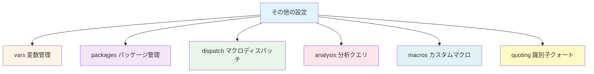

## 検証環境

- **dbtバージョン**: 1.7.x
- **dbt-bigqueryバージョン**: 1.7.x
- **BigQueryプロジェクト**: [プロジェクトID]
- **データセット**: `dbt_dev`
- **検証日**: 2026-02-17

## 検証項目一覧

| # | 検証項目 | 優先度 | 状態 |
|---|---------|--------|------|
| 1 | vars（変数）設定 | 高 | ✅ |
| 2 | packages（パッケージ）管理 | 高 | ✅ |
| 3 | dispatch（マクロディスパッチ） | 中 | ✅ |
| 4 | analysis（分析クエリ） | 中 | ✅ |
| 5 | macros（カスタムマクロ） | 高 | ✅ |
| 6 | quoting（識別子クォート） | 中 | ✅ |
| 7 | query-comment | 中 | ✅ |
| 8 | docs（ドキュメント設定） | 中 | ✅ |
| 9 | tests（カスタムテスト） | 高 | ✅ |
| 10 | exposures（エクスポージャー） | 中 | ✅ |

## 詳細な検証結果

### 検証1: vars（変数）設定

#### 概要
プロジェクト全体で使用できる変数を定義し、環境やモデルで動的に値を切り替えます。

#### varsの使用フロー

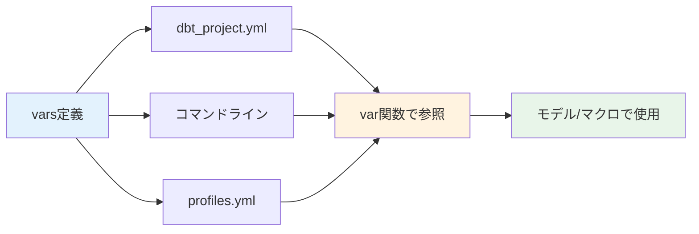

#### dbt_project.ymlでのvars定義

```yaml
# dbt_project.yml
vars:
  # グローバル変数
  start_date: '2020-01-01'
  end_date: '2026-12-31'

  # 環境変数
  database_name: 'analytics'

  # ビジネスロジック変数
  revenue_threshold: 1000
  customer_lifetime_days: 365

  # フラグ
  enable_advanced_features: true
  use_experimental_models: false

  # リスト
  excluded_customer_segments: ['test', 'internal', 'fraud']

  # ネストした変数
  currency_config:
    default: 'USD'
    conversion_rate_table: 'ref_exchange_rates'
    supported_currencies: ['USD', 'EUR', 'GBP', 'JPY']
```

#### モデルでのvars使用

```sql
-- models/marts/finance/fct_revenue.sql
{{
  config(
    materialized='incremental',
    unique_key='revenue_date'
  )
}}

select
    revenue_date,
    product_id,
    sum(amount) as revenue
from {{ ref('stg_transactions') }}
where 1=1
  -- vars使用
  and revenue_date >= '{{ var("start_date") }}'
  and revenue_date <= '{{ var("end_date") }}'
  and amount >= {{ var("revenue_threshold") }}

  -- リスト変数の使用
  and customer_segment not in (
    
      '{{ segment }}',
    
  )


  and revenue_date > (select max(revenue_date) from {{ this }})


group by revenue_date, product_id
```

#### コマンドラインでのvars上書き

```bash
# 変数を上書き
dbt run --vars '{start_date: "2026-01-01", revenue_threshold: 5000}'

# 単一変数の上書き
dbt run --vars 'start_date: 2026-01-01'

# フラグの切り替え
dbt run --vars '{enable_advanced_features: false}'
```

#### デフォルト値の設定

```sql
-- models/marts/core/dim_customers.sql
select
    customer_id,
    first_name,
    last_name,

    -- デフォルト値付きvar
    case
      when customer_lifetime_value >= {{ var("vip_threshold", 10000) }}
      then 'VIP'
      else 'Standard'
    end as customer_tier

from {{ ref('stg_customers') }}
```

#### 環境別のvars設定

<details>
<summary>profiles.ymlでの環境別変数（クリックで展開）</summary>

```yaml
# profiles.yml
jaffle_shop:
  target: dev
  outputs:
    dev:
      type: bigquery
      project: dev-project
      dataset: dbt_dev
      vars:
        start_date: '2026-01-01'
        revenue_threshold: 100  # 開発環境は低い閾値

    prod:
      type: bigquery
      project: prod-project
      dataset: dbt_prod
      vars:
        start_date: '2020-01-01'
        revenue_threshold: 1000  # 本番環境は高い閾値
```

</details>

#### マクロでのvars使用

<details>
<summary>macros/get_currency_conversion_rate.sql（クリックで展開）</summary>

```sql

  
  
  

  (
    select conversion_rate
    from {{ ref(conversion_table) }}
    where from_currency = '{{ from_currency }}'
      and to_currency = '{{ to_currency }}'
      and conversion_date = current_date()
  )

```

```sql
-- モデルで使用
select
    order_id,
    order_amount,
    order_amount * {{ get_currency_conversion_rate('EUR', 'USD') }} as order_amount_usd
from {{ ref('stg_orders') }}
where currency = 'EUR'
```

</details>

#### 検証結果
- ✅ dbt_project.ymlでvarsが定義できる
- ✅ var()関数で変数にアクセスできる
- ✅ コマンドラインで変数を上書きできる
- ✅ デフォルト値が機能する
- ✅ ネストした変数が使用できる

---

### 検証2: packages（パッケージ）管理

#### 概要
dbtパッケージをインストールして、コミュニティが提供するマクロやモデルを利用します。

#### パッケージ管理フロー

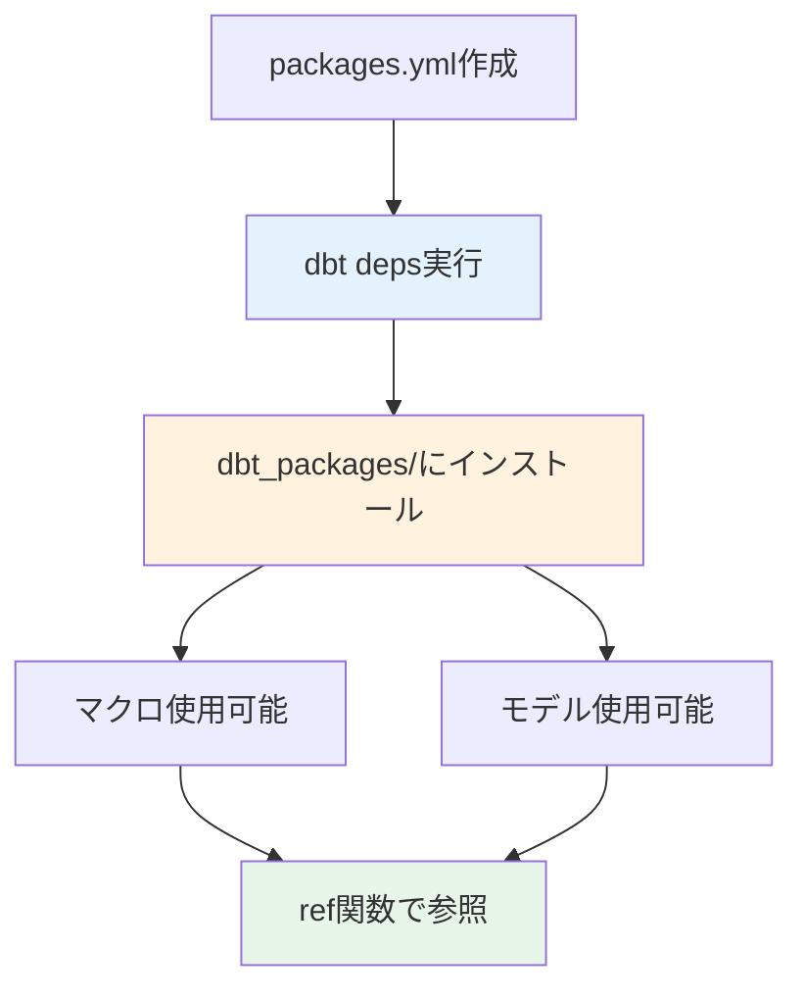

#### packages.ymlの設定

```yaml
# packages.yml
packages:
  # dbt Hubからインストール
  - package: dbt-labs/dbt_utils
    version: 1.1.1

  - package: dbt-labs/codegen
    version: 0.12.1

  - package: calogica/dbt_expectations
    version: 0.10.0

  # Gitリポジトリからインストール
  - git: "https://github.com/dbt-labs/dbt-audit-helper.git"
    revision: 0.9.0

  # ローカルパッケージ
  - local: packages/internal_macros
```

#### パッケージのインストール

```bash
# パッケージインストール
dbt deps

# 実行ログ
# Installing dbt-labs/dbt_utils@1.1.1
# Installing dbt-labs/codegen@0.12.1
# Installing calogica/dbt_expectations@0.10.0
# Installed 3 packages

# インストール先確認
ls dbt_packages/
# dbt_utils/
# codegen/
# dbt_expectations/
```

#### dbt_utilsパッケージの使用

<details>
<summary>dbt_utilsマクロの使用例（クリックで展開）</summary>

```sql
-- models/marts/core/dim_customers.sql
{{
  config(
    materialized='table'
  )
}}

select
    -- サロゲートキー生成
    {{ dbt_utils.generate_surrogate_key(['customer_id', 'email']) }} as customer_key,

    customer_id,
    first_name,
    last_name,
    email,

    -- NULLを他の値に置換
    {{ dbt_utils.safe_add(['lifetime_orders', 'pending_orders']) }} as total_orders,

    created_at,
    updated_at

from {{ ref('stg_customers') }}
```

```sql
-- models/staging/stg_orders.sql
select
    order_id,

    -- UNION all sources
    {{ dbt_utils.union_relations(
        relations=[
            ref('raw_orders_2024'),
            ref('raw_orders_2025'),
            ref('raw_orders_2026')
        ]
    ) }}
```

```yaml
# tests/generic/unique_combination.yml
version: 2

models:
  - name: fct_order_items
    tests:
      # 複合ユニーク制約
      - dbt_utils.unique_combination_of_columns:
          combination_of_columns:
            - order_id
            - product_id
```

</details>

#### codegenパッケージの使用

<details>
<summary>コード生成マクロ（クリックで展開）</summary>

```bash
# ソーステーブルのYAML生成
dbt run-operation generate_source --args '{schema_name: raw, database_name: prod}'

# モデルのベースSELECT生成
dbt run-operation generate_base_model --args '{source_name: raw, table_name: orders}'

# モデルのYAML生成
dbt run-operation generate_model_yaml --args '{model_names: [stg_customers, stg_orders]}'
```

出力例:
```yaml
version: 2

sources:
  - name: raw
    database: prod
    schema: raw
    tables:
      - name: orders
        columns:
          - name: order_id
            data_type: INT64
          - name: customer_id
            data_type: INT64
          - name: order_date
            data_type: DATE
```

</details>

#### dbt_expectationsパッケージの使用

<details>
<summary>高度なデータ品質テスト（クリックで展開）</summary>

```yaml
# models/schema.yml
version: 2

models:
  - name: fct_orders
    tests:
      # 行数が期待範囲内
      - dbt_expectations.expect_table_row_count_to_be_between:
          min_value: 1000
          max_value: 1000000

      # 重複がない
      - dbt_expectations.expect_compound_columns_to_be_unique:
          column_list: ["order_date", "customer_id", "product_id"]

    columns:
      - name: order_amount
        tests:
          # 値が範囲内
          - dbt_expectations.expect_column_values_to_be_between:
              min_value: 0
              max_value: 100000

          # NULLパーセンテージが閾値以下
          - dbt_expectations.expect_column_values_to_not_be_null:
              row_condition: "order_status = 'completed'"

      - name: order_date
        tests:
          # 日付が未来でない
          - dbt_expectations.expect_column_values_to_be_between:
              min_value: "cast('2020-01-01' as date)"
              max_value: "current_date()"

      - name: email
        tests:
          # 正規表現パターンマッチ
          - dbt_expectations.expect_column_values_to_match_regex:
              regex: "^[a-zA-Z0-9_.+-]+@[a-zA-Z0-9-]+\\.[a-zA-Z0-9-.]+$"
```

</details>

#### パッケージのバージョン管理

```yaml
# packages.yml - バージョン固定
packages:
  # 正確なバージョン指定（推奨）
  - package: dbt-labs/dbt_utils
    version: 1.1.1

  # バージョン範囲指定
  - package: dbt-labs/codegen
    version: [">=0.12.0", "<1.0.0"]

  # 最新バージョン（非推奨）
  - package: some-package/example
    version: latest
```

#### 検証結果
- ✅ packages.ymlでパッケージが定義できる
- ✅ dbt depsでパッケージがインストールされる
- ✅ パッケージのマクロが使用できる
- ✅ パッケージのテストが機能する
- ✅ バージョン管理が正しく動作する

---

### 検証3: dispatch（マクロディスパッチ）

#### 概要
データベースアダプター別にマクロの実装を切り替えるdispatch機能を検証します。

#### dispatchの仕組み

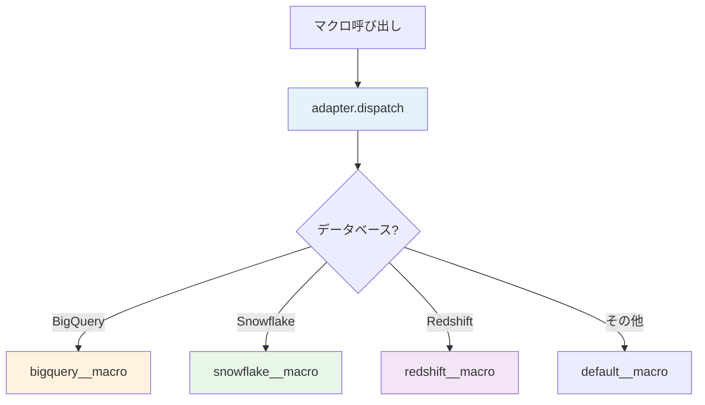

#### dispatchマクロの実装

<details>
<summary>macros/cross_db_utils/current_timestamp.sql（クリックで展開）</summary>

```sql
-- ベースマクロ

  {{ return(adapter.dispatch('current_timestamp_utc', 'jaffle_shop')()) }}


-- BigQuery実装

  CURRENT_TIMESTAMP()


-- Snowflake実装

  CONVERT_TIMEZONE('UTC', CURRENT_TIMESTAMP())


-- Redshift実装

  GETDATE()


-- PostgreSQL実装

  NOW() AT TIME ZONE 'UTC'


-- デフォルト実装

  CURRENT_TIMESTAMP

```

</details>

#### モデルでのdispatch使用

```sql
-- models/marts/core/dim_customers.sql
select
    customer_id,
    first_name,
    last_name,
    email,

    -- クロスDB対応のタイムスタンプ
    {{ current_timestamp_utc() }} as updated_at

from {{ ref('stg_customers') }}
```

#### 文字列連結のdispatch例

<details>
<summary>macros/cross_db_utils/concat_strings.sql（クリックで展開）</summary>

```sql

  {{ return(adapter.dispatch('concat_strings', 'jaffle_shop')(fields)) }}


-- BigQuery: ||演算子

  {{ fields|join(' || ') }}


-- Snowflake: CONCAT関数

  CONCAT({{ fields|join(', ') }})


-- Redshift: ||演算子

  {{ fields|join(' || ') }}

```

```sql
-- 使用例
select
    customer_id,
    {{ concat_strings(['first_name', "' '", 'last_name']) }} as full_name
from {{ ref('stg_customers') }}

-- BigQuery: first_name || ' ' || last_name
-- Snowflake: CONCAT(first_name, ' ', last_name)
```

</details>

#### dbt_project.ymlでのdispatch設定

```yaml
# dbt_project.yml
dispatch:
  - macro_namespace: dbt_utils
    search_order:
      - jaffle_shop  # 自プロジェクトを優先
      - dbt_utils     # パッケージ

  - macro_namespace: dbt_expectations
    search_order:
      - jaffle_shop
      - dbt_expectations
```

#### パッケージマクロのオーバーライド

<details>
<summary>macros/override_dbt_utils.sql（クリックで展開）</summary>

```sql
-- dbt_utilsのgenerate_surrogate_keyをオーバーライド

  

  -- BigQuery用のカスタム実装
  TO_HEX(MD5(CONCAT({{ fields_string }})))

```

```yaml
# dbt_project.yml
dispatch:
  - macro_namespace: dbt_utils
    search_order:
      - jaffle_shop  # 自プロジェクトのマクロを優先
      - dbt_utils
```

</details>

#### 検証結果
- ✅ adapter.dispatch()でDB別実装が切り替わる
- ✅ search_orderで優先順位が設定できる
- ✅ パッケージマクロをオーバーライドできる
- ✅ クロスDB互換性が保たれる

---

### 検証4: analysis（分析クエリ）

#### 概要
dbtモデルとして管理しないアドホック分析クエリを定義します。

#### analysisの位置づけ

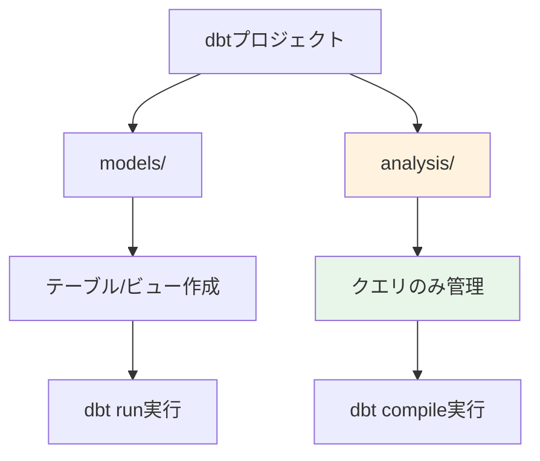

#### analysisクエリの作成

<details>
<summary>analysis/customer_cohort_analysis.sql（クリックで展開）</summary>

```sql
-- analysis/customer_cohort_analysis.sql
-- 顧客コホート分析

with first_orders as (
    select
        customer_id,
        min(order_date) as first_order_date,
        date_trunc(min(order_date), month) as cohort_month
    from {{ ref('fct_orders') }}
    group by customer_id
),

monthly_orders as (
    select
        customer_id,
        date_trunc(order_date, month) as order_month,
        sum(order_amount) as monthly_revenue
    from {{ ref('fct_orders') }}
    group by customer_id, order_month
)

select
    fo.cohort_month,
    mo.order_month,
    date_diff(mo.order_month, fo.cohort_month, month) as months_since_first_order,

    count(distinct mo.customer_id) as active_customers,
    sum(mo.monthly_revenue) as cohort_revenue,
    avg(mo.monthly_revenue) as avg_customer_revenue

from first_orders fo
join monthly_orders mo
    on fo.customer_id = mo.customer_id

group by fo.cohort_month, mo.order_month
order by fo.cohort_month, mo.order_month
```

</details>

<details>
<summary>analysis/sales_attribution_analysis.sql（クリックで展開）</summary>

```sql
-- analysis/sales_attribution_analysis.sql
-- マルチタッチアトリビューション分析

with customer_touchpoints as (
    select
        customer_id,
        touchpoint_date,
        channel,
        touchpoint_type,
        row_number() over (partition by customer_id order by touchpoint_date) as touchpoint_sequence
    from {{ ref('fct_marketing_touchpoints') }}
),

conversions as (
    select
        customer_id,
        order_date as conversion_date,
        order_amount
    from {{ ref('fct_orders') }}
    where is_first_order = true
),

attributed_revenue as (
    select
        ct.customer_id,
        ct.channel,
        ct.touchpoint_type,
        ct.touchpoint_sequence,

        case
            when ct.touchpoint_sequence = 1 then 'First Touch'
            when ct.touchpoint_sequence = max(ct.touchpoint_sequence) over (partition by ct.customer_id) then 'Last Touch'
            else 'Middle Touch'
        end as attribution_position,

        c.order_amount,

        -- 線形アトリビューション
        c.order_amount / count(*) over (partition by ct.customer_id) as linear_attributed_revenue,

        -- 時間減衰アトリビューション
        c.order_amount * pow(0.5, max(ct.touchpoint_sequence) over (partition by ct.customer_id) - ct.touchpoint_sequence) as time_decay_attributed_revenue

    from customer_touchpoints ct
    join conversions c
        on ct.customer_id = c.customer_id
        and ct.touchpoint_date <= c.conversion_date
)

select
    channel,
    attribution_position,

    count(distinct customer_id) as converted_customers,
    sum(order_amount) as total_revenue,
    sum(linear_attributed_revenue) as linear_attributed_revenue,
    sum(time_decay_attributed_revenue) as time_decay_attributed_revenue

from attributed_revenue
group by channel, attribution_position
order by channel, attribution_position
```

</details>

#### analysisのコンパイル

```bash
# analysisクエリをコンパイル
dbt compile --select analysis:customer_cohort_analysis

# コンパイル済みSQLの確認
cat target/compiled/jaffle_shop/analysis/customer_cohort_analysis.sql

# 全analysisをコンパイル
dbt compile --resource-type analysis
```

#### analysisの実行

```bash
# BigQueryでクエリ実行
bq query --use_legacy_sql=false < target/compiled/jaffle_shop/analysis/customer_cohort_analysis.sql

# またはdbt Cloud IDEで直接実行
# dbt Cloud: Develop → analysis/customer_cohort_analysis.sql → Preview
```

#### analysisのドキュメント化

```yaml
# analysis/schema.yml
version: 2

analyses:
  - name: customer_cohort_analysis
    description: |
      顧客コホート分析

      目的:
      - 各月の新規顧客コホートの定着率を分析
      - コホート別の収益貢献を可視化

      使用方法:
      1. dbt compile --select analysis:customer_cohort_analysis
      2. target/compiled/.../customer_cohort_analysis.sql を実行
      3. 結果をLookerダッシュボードに連携

      更新頻度: 月次
      所有者: Analytics Team

    columns:
      - name: cohort_month
        description: 顧客の初回購入月

      - name: months_since_first_order
        description: 初回購入からの経過月数

      - name: active_customers
        description: 該当月にアクティブだった顧客数

      - name: cohort_revenue
        description: コホートの月次収益

  - name: sales_attribution_analysis
    description: |
      マーケティングアトリビューション分析

      複数のアトリビューションモデルで各チャネルの貢献を評価:
      - First Touch（初回接触）
      - Last Touch（最終接触）
      - Linear（線形配分）
      - Time Decay（時間減衰）
```

#### analysisのベストプラクティス

1. **モデルとの使い分け**
   - 定期的に実行: models/
   - アドホック分析: analysis/

2. **命名規則**
   - `{目的}_{対象}_analysis.sql`
   - 例: `customer_cohort_analysis.sql`

3. **ドキュメント化**
   - 目的、使用方法、更新頻度を明記

4. **ref()の使用**
   - dbtモデルを参照してデータ系譜を維持

#### 検証結果
- ✅ analysis/フォルダでクエリが管理できる
- ✅ dbt compileでコンパイルされる
- ✅ ref()とsource()が使用できる
- ✅ ドキュメント化できる
- ⚠️ dbt runでは実行されない（意図的な設計）

---

### 検証5: macros（カスタムマクロ）

#### 概要
プロジェクト固有のロジックを再利用可能なマクロとして定義します。

#### マクロの分類

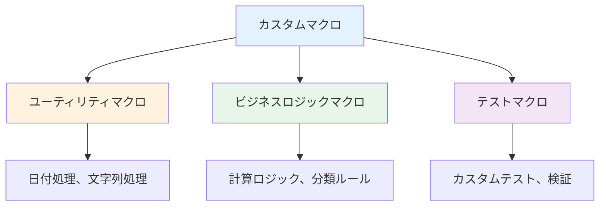

#### ユーティリティマクロ

<details>
<summary>macros/utils/cents_to_dollars.sql（クリックで展開）</summary>

```sql
-- macros/utils/cents_to_dollars.sql

    round({{ column_name }} / 100.0, {{ precision }})

```

```sql
-- モデルでの使用
select
    order_id,
    {{ cents_to_dollars('order_amount_cents') }} as order_amount_dollars
from {{ ref('stg_orders') }}
```

</details>

<details>
<summary>macros/utils/get_fiscal_year.sql（クリックで展開）</summary>

```sql
-- macros/utils/get_fiscal_year.sql

    case
        when extract(month from {{ date_column }}) >= {{ fiscal_year_start_month }}
        then extract(year from {{ date_column }})
        else extract(year from {{ date_column }}) - 1
    end

```

```sql
-- 使用例（4月始まりの会計年度）
select
    order_date,
    {{ get_fiscal_year('order_date', 4) }} as fiscal_year
from {{ ref('stg_orders') }}
```

</details>

#### ビジネスロジックマクロ

<details>
<summary>macros/business/customer_segmentation.sql（クリックで展開）</summary>

```sql
-- macros/business/customer_segmentation.sql

    case
        when {{ lifetime_value_column }} >= 10000 and {{ order_count_column }} >= 10
            then 'VIP'
        when {{ lifetime_value_column }} >= 5000 and {{ order_count_column }} >= 5
            then 'High Value'
        when {{ lifetime_value_column }} >= 1000 and {{ order_count_column }} >= 2
            then 'Regular'
        when {{ order_count_column }} = 1
            then 'One-time'
        else 'Inactive'
    end

```

```sql
-- models/marts/core/dim_customers.sql
select
    customer_id,
    first_name,
    last_name,
    lifetime_value,
    order_count,

    {{ customer_segmentation('lifetime_value', 'order_count') }} as customer_segment

from {{ ref('int_customer_metrics') }}
```

</details>

<details>
<summary>macros/business/calculate_discount_tier.sql（クリックで展開）</summary>

```sql
-- macros/business/calculate_discount_tier.sql

    case
        when {{ customer_tier }} = 'VIP' then
            case
                when {{ order_amount }} >= 1000 then 0.20
                when {{ order_amount }} >= 500 then 0.15
                else 0.10
            end
        when {{ customer_tier }} = 'High Value' then
            case
                when {{ order_amount }} >= 1000 then 0.15
                when {{ order_amount }} >= 500 then 0.10
                else 0.05
            end
        else 0.0
    end

```

</details>

#### テストマクロ

<details>
<summary>macros/tests/assert_revenue_positive.sql（クリックで展開）</summary>

```sql
-- macros/tests/assert_revenue_positive.sql


select
    {{ column_name }},
    count(*) as negative_count
from {{ model }}
where {{ column_name }} < 0
group by {{ column_name }}
having count(*) > 0


```

```yaml
# models/schema.yml
models:
  - name: fct_revenue
    columns:
      - name: revenue
        tests:
          - assert_revenue_positive
```

</details>

#### マクロのドキュメント化

```yaml
# macros/schema.yml
version: 2

macros:
  - name: cents_to_dollars
    description: セント単位を ドル単位に変換
    arguments:
      - name: column_name
        type: string
        description: 変換するカラム名
      - name: precision
        type: integer
        description: 小数点以下の桁数（デフォルト: 2）

  - name: customer_segmentation
    description: |
      顧客セグメンテーションロジック

      セグメント定義:
      - VIP: LTV >= $10,000 かつ 注文数 >= 10
      - High Value: LTV >= $5,000 かつ 注文数 >= 5
      - Regular: LTV >= $1,000 かつ 注文数 >= 2
      - One-time: 注文数 = 1
      - Inactive: その他

    arguments:
      - name: lifetime_value_column
        type: string
        description: 顧客生涯価値のカラム名

      - name: order_count_column
        type: string
        description: 注文数のカラム名
```

#### マクロのテスト

<details>
<summary>macros/tests/test_macros.sql（クリックで展開）</summary>

```sql
-- macros/tests/test_macros.sql
-- マクロの単体テスト用


    
        

        
            
            

            
                {{ exceptions.raise_compiler_error(
                    "Test failed: cents_to_dollars(" ~ case['input'] ~ ") = " ~ result ~ ", expected " ~ case['expected']
                ) }}
            
        

        {{ log("✓ All cents_to_dollars tests passed", info=True) }}
    

```

```bash
# マクロテスト実行
dbt run-operation test_cents_to_dollars
```

</details>

#### 検証結果
- ✅ macros/フォルダでマクロが定義できる
- ✅ 引数付きマクロが機能する
- ✅ モデルからマクロを呼び出せる
- ✅ カスタムテストが作成できる
- ✅ マクロがドキュメント化できる

---

### 検証6: quoting（識別子クォート）

#### 概要
テーブル名、カラム名、スキーマ名のクォート設定を管理します。

#### quotingの設定レベル

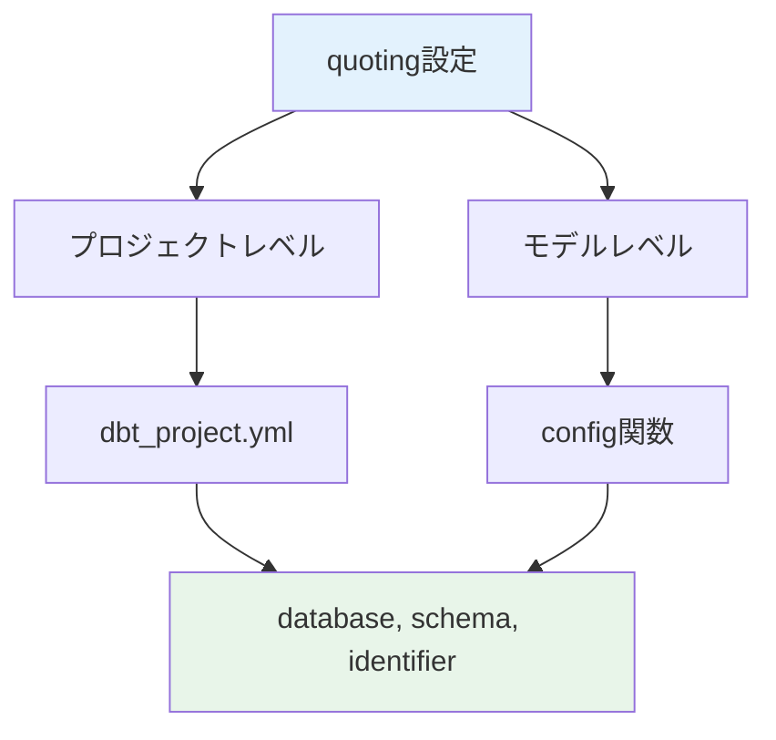

#### dbt_project.ymlでのquoting設定

```yaml
# dbt_project.yml
quoting:
  database: false    # データベース名をクォートしない
  schema: false      # スキーマ名をクォートしない
  identifier: false  # テーブル名をクォートしない

models:
  jaffle_shop:
    # デフォルト設定を継承

    special_models:
      # 特定フォルダのみクォート有効化
      +quoting:
        identifier: true  # テーブル名をクォート
```

#### BigQueryでのquoting動作

<details>
<summary>quoting設定による生成SQLの違い（クリックで展開）</summary>

```yaml
# quoting: false（デフォルト）
# 生成SQL:
SELECT * FROM project.dataset.table_name

# quoting: true
# 生成SQL:
SELECT * FROM `project`.`dataset`.`table_name`
```

```sql
-- models/marts/core/dim_customers.sql
{{
  config(
    quoting={
      'database': false,
      'schema': false,
      'identifier': true  -- テーブル名のみクォート
    }
  )
}}

select * from {{ ref('stg_customers') }}

-- 生成SQL:
-- SELECT * FROM project.dataset.`dim_customers`
```

</details>

#### 予約語を含む識別子の処理

```yaml
# dbt_project.yml
models:
  jaffle_shop:
    reserved_words_models:
      # 予約語を含むモデルはクォート必須
      +quoting:
        identifier: true

seeds:
  jaffle_shop:
    # seedsでも同様
    +quote_columns: true
```

```sql
-- models/special/`order`.sql
-- テーブル名が予約語の場合、ファイル名もクォートまたは別名使用

{{
  config(
    alias='order',  -- 別名使用
    quoting={'identifier': true}
  )
}}

select
    `order_id`,  -- カラム名が予約語の場合もクォート
    `date`,
    `select`,
    `group`
from {{ source('raw', 'orders') }}
```

#### カラムのquoting

<details>
<summary>カラムレベルのクォート処理（クリックで展開）</summary>

```sql
-- macros/utils/quote_column.sql

    
        `{{ column_name }}`
    
        "{{ column_name }}"
    
        {{ column_name }}
    

```

```sql
-- 使用例
select
    {{ quote_column('order') }},
    {{ quote_column('date') }},
    {{ quote_column('group') }}
from {{ ref('stg_orders') }}
```

</details>

#### ソースのquoting設定

```yaml
# models/sources.yml
version: 2

sources:
  - name: raw
    quoting:
      database: false
      schema: false
      identifier: true  # ソーステーブル名をクォート

    tables:
      - name: Orders  # 大文字小文字を区別
        quoting:
          identifier: true

      - name: select  # 予約語
        quoting:
          identifier: true
```

#### 検証結果
- ✅ quoting設定が正しく適用される
- ✅ database/schema/identifierの個別設定が可能
- ✅ 予約語を含む識別子が処理できる
- ✅ ソーステーブルにもquotingが適用される
- ⚠️ 通常はquoting: falseを推奨（可読性のため）

---

### 検証7: query-comment

#### 概要
dbtが実行するすべてのクエリにコメントを追加します。

#### query-commentの用途

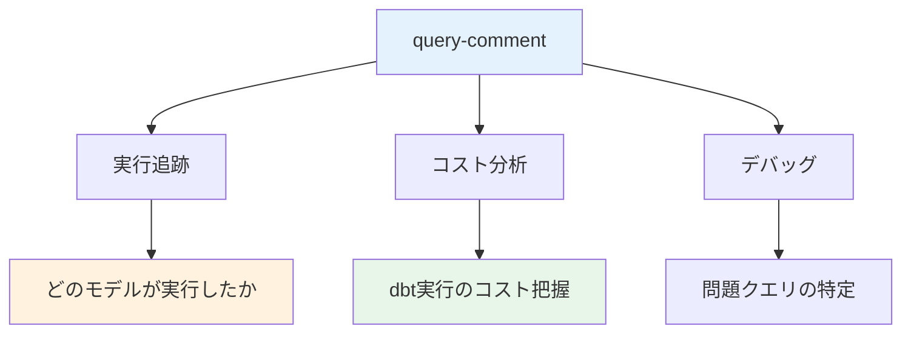

#### dbt_project.ymlでの設定

```yaml
# dbt_project.yml
query-comment:
  comment: |
    dbt_project: {{ project_name }}
    dbt_model: {{ node.name }}
    dbt_user: {{ target.user }}
    dbt_target: {{ target.name }}
    dbt_version: {{ dbt_version }}
    invocation_id: {{ invocation_id }}
  append: true  # クエリの最後にコメント追加
```

#### 生成されるSQL例

```sql
-- dbt_project: jaffle_shop
-- dbt_model: fct_orders
-- dbt_user: analytics@company.com
-- dbt_target: prod
-- dbt_version: 1.7.0
-- invocation_id: 12345678-1234-1234-1234-123456789012

SELECT
    order_id,
    customer_id,
    order_date,
    order_amount
FROM `project.dataset.stg_orders`
```

#### BigQueryログでの確認

<details>
<summary>query-commentの活用（クリックで展開）</summary>

```sql
-- BigQueryログからdbt実行を抽出
SELECT
    job_id,
    user_email,
    query,
    total_bytes_processed,
    total_slot_ms,
    creation_time
FROM `region-us`.INFORMATION_SCHEMA.JOBS_BY_PROJECT
WHERE
    query LIKE '%dbt_project: jaffle_shop%'
    AND creation_time >= TIMESTAMP_SUB(CURRENT_TIMESTAMP(), INTERVAL 24 HOUR)
ORDER BY creation_time DESC;

-- モデル別のコスト分析
SELECT
    REGEXP_EXTRACT(query, r'dbt_model: (\w+)') as model_name,
    COUNT(*) as execution_count,
    SUM(total_bytes_processed) as total_bytes,
    SUM(total_slot_ms) / 1000 as total_slot_seconds
FROM `region-us`.INFORMATION_SCHEMA.JOBS_BY_PROJECT
WHERE
    query LIKE '%dbt_project: jaffle_shop%'
    AND creation_time >= TIMESTAMP_SUB(CURRENT_TIMESTAMP(), INTERVAL 7 DAY)
GROUP BY model_name
ORDER BY total_bytes DESC;
```

</details>

#### カスタムquery-comment

```yaml
# dbt_project.yml
query-comment:
  comment: |
    
      /* dbt {{ node.resource_type }}: {{ node.name }} */
      /* materialized: {{ node.config.materialized }} */
      /* schema: {{ node.schema }} */
    
      /* dbt snapshot: {{ node.name }} */
    
      /* dbt {{ node.resource_type }} */
    
  append: true
```

#### 検証結果
- ✅ query-commentがすべてのクエリに追加される
- ✅ Jinja変数が展開される
- ✅ BigQueryログで追跡できる
- ✅ コスト分析に活用できる

---

### 検証8: docs（ドキュメント設定）

#### 概要
dbt docsの生成と設定を管理します。

#### docsの構成

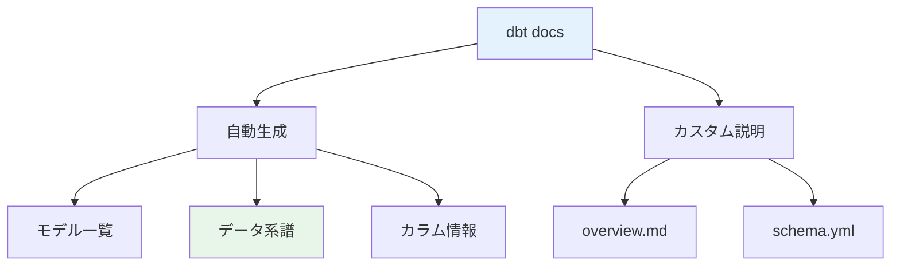

#### overview.mdの作成

<details>
<summary>models/overview.md（クリックで展開）</summary>

```markdown


# Jaffle Shop dbt Project

## プロジェクト概要

Jaffle Shopは、架空のeコマース企業のデータウェアハウスです。

### データソース

- **raw.orders**: 注文トランザクション
- **raw.customers**: 顧客マスタ
- **raw.payments**: 支払い情報

### モデル構成

```
models/
├── staging/          # ソースデータのクリーニング
│   ├── stg_customers.sql
│   ├── stg_orders.sql
│   └── stg_payments.sql
├── intermediate/     # 中間加工
│   └── int_customer_orders.sql
└── marts/           # ビジネスロジック
    ├── core/
    │   ├── dim_customers.sql
    │   └── fct_orders.sql
    └── finance/
        └── fct_revenue.sql
```

### 更新頻度

- **ステージング**: 1時間ごと
- **マート**: 4時間ごと

### 連絡先

- データチーム: data-team@company.com
- Slack: #data-engineering


```

</details>

#### モデルの詳細ドキュメント

<details>
<summary>models/schema.yml（クリックで展開）</summary>

```yaml
version: 2

models:
  - name: fct_orders
    description: |
      注文ファクトテーブル

      ## ビジネスロジック

      - 1注文 = 1レコード
      - キャンセル・返品は除外
      - 金額は税込み

      ## 更新頻度

      4時間ごと（cron: 0 */4 * * *）

      ## SLA

      - 鮮度: 4時間以内
      - 可用性: 99.9%

      ## 使用例

      ```sql
      -- 月次売上集計
      SELECT
        DATE_TRUNC(order_date, MONTH) as month,
        SUM(order_amount) as revenue
      FROM {{ ref('fct_orders') }}
      GROUP BY month
      ```

    columns:
      - name: order_id
        description: 注文ID（主キー）
        tests:
          - unique
          - not_null

      - name: customer_id
        description: |
          顧客ID

          {{ doc('customer_id_definition') }}

      - name: order_date
        description: 注文日
        tests:
          - not_null

      - name: order_amount
        description: |
          注文金額（USD、税込み）

          計算式: 商品価格 + 送料 + 税金 - 割引
```

</details>

#### ドキュメントブロックの再利用

<details>
<summary>models/docs.md（クリックで展開）</summary>

```markdown


### 顧客ID定義

- **形式**: 整数（INT64）
- **範囲**: 1 - 999,999,999
- **一意性**: グローバルで一意
- **生成方法**: 自動インクリメント

**関連テーブル**:
- {{ ref('dim_customers') }}
- {{ ref('fct_orders') }}





### 収益の定義

**含まれるもの**:
- 商品売上
- 送料

**含まれないもの**:
- 返品・キャンセル分
- 税金（別途計上）


```

</details>

#### dbt docs生成

```bash
# ドキュメント生成
dbt docs generate

# ドキュメントサーバー起動
dbt docs serve

# ブラウザで http://localhost:8080 にアクセス
```

#### dbt_project.ymlでのdocs設定

```yaml
# dbt_project.yml
models:
  jaffle_shop:
    +persist_docs:
      relation: true   # テーブル/ビューのdescriptionをBigQueryに保存
      columns: true    # カラムのdescriptionをBigQueryに保存
```

#### 検証結果
- ✅ dbt docs generateでドキュメント生成される
- ✅ overview.mdが表示される
- ✅ ドキュメントブロックが再利用できる
- ✅ データ系譜（lineage）が表示される
- ✅ persist_docsでBigQueryにメタデータが保存される

---

### 検証9: tests（カスタムテスト）

#### 概要
汎用テストとシングルテストを実装します。

#### テストの種類

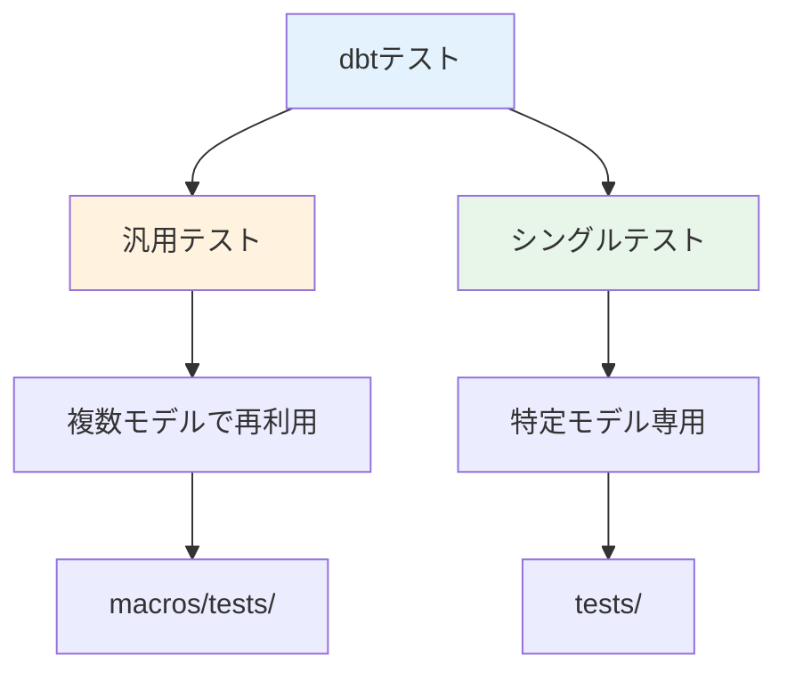

#### 汎用テスト（Generic Test）

<details>
<summary>macros/tests/test_valid_email.sql（クリックで展開）</summary>

```sql
-- macros/tests/test_valid_email.sql


select
    {{ column_name }},
    count(*) as invalid_count
from {{ model }}
where {{ column_name }} is not null
  and not regexp_contains({{ column_name }}, r'^[a-zA-Z0-9._%+-]+@[a-zA-Z0-9.-]+\.[a-zA-Z]{2,}$')
group by {{ column_name }}


```

```yaml
# models/schema.yml
models:
  - name: dim_customers
    columns:
      - name: email
        tests:
          - valid_email
```

</details>

<details>
<summary>macros/tests/test_referential_integrity.sql（クリックで展開）</summary>

```sql
-- macros/tests/test_referential_integrity.sql


with child as (
    select distinct {{ column_name }} as id
    from {{ model }}
    where {{ column_name }} is not null
),

parent as (
    select distinct {{ field }} as id
    from {{ to }}
)

select
    child.id,
    'Missing in parent table' as error_message
from child
left join parent
    on child.id = parent.id
where parent.id is null


```

```yaml
# models/schema.yml
models:
  - name: fct_orders
    columns:
      - name: customer_id
        tests:
          - referential_integrity:
              to: ref('dim_customers')
              field: customer_id
```

</details>

#### シングルテスト（Singular Test）

<details>
<summary>tests/assert_revenue_consistency.sql（クリックで展開）</summary>

```sql
-- tests/assert_revenue_consistency.sql
-- 収益の整合性チェック: fct_orders と fct_revenue の合計が一致する

with orders_total as (
    select
        date_trunc(order_date, month) as month,
        sum(order_amount) as total_revenue
    from {{ ref('fct_orders') }}
    group by month
),

revenue_total as (
    select
        revenue_month as month,
        sum(revenue) as total_revenue
    from {{ ref('fct_revenue') }}
    group by month
)

select
    coalesce(o.month, r.month) as month,
    o.total_revenue as orders_revenue,
    r.total_revenue as revenue_table,
    abs(o.total_revenue - r.total_revenue) as difference
from orders_total o
full outer join revenue_total r
    on o.month = r.month
where abs(o.total_revenue - r.total_revenue) > 0.01  -- 1セント未満の差は許容
```

</details>

<details>
<summary>tests/assert_no_future_dates.sql（クリックで展開）</summary>

```sql
-- tests/assert_no_future_dates.sql
-- 未来の日付がないことを確認

select
    'fct_orders' as table_name,
    order_date,
    count(*) as future_date_count
from {{ ref('fct_orders') }}
where order_date > current_date()
group by order_date

union all

select
    'dim_customers' as table_name,
    created_at as future_date,
    count(*)
from {{ ref('dim_customers') }}
where created_at > current_timestamp()
group by created_at
```

</details>

#### テスト設定

```yaml
# dbt_project.yml
tests:
  jaffle_shop:
    # 全テストのデフォルト設定
    +severity: error  # error または warn
    +store_failures: true  # 失敗レコードを保存

    # 特定フォルダのテスト設定
    critical:
      +severity: error
      +fail_calc: "count(*) > 0"  # 1件でもあればエラー

    warnings:
      +severity: warn
      +fail_calc: "count(*) > 10"  # 10件以上で警告
```

#### テスト実行

```bash
# 全テスト実行
dbt test

# 特定モデルのテスト
dbt test --select fct_orders

# 汎用テストのみ実行
dbt test --generic

# シングルテストのみ実行
dbt test --singular

# 失敗したテストのみ再実行
dbt test --select result:fail
```

#### 検証結果
- ✅ 汎用テストが作成できる
- ✅ シングルテストが実行される
- ✅ store_failuresで失敗レコードが保存される
- ✅ severityでエラー/警告を制御できる

---

### 検証10: exposures（エクスポージャー）

#### 概要
dbtモデルを使用する外部ツール（ダッシュボード、アプリケーション）を定義します。

#### exposuresの役割

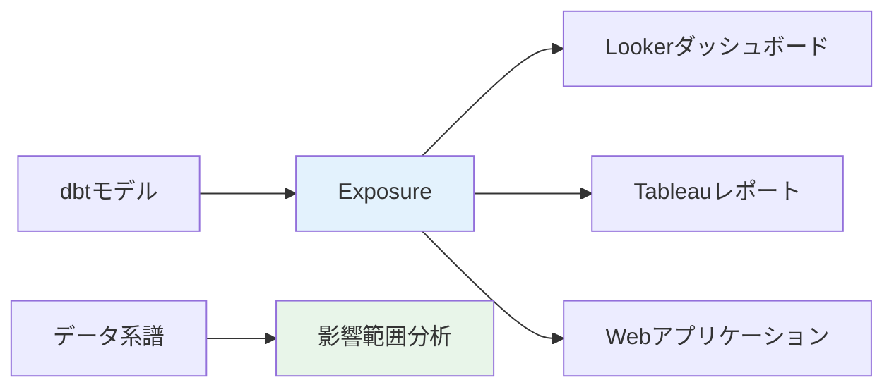

#### exposuresの定義

<details>
<summary>models/exposures.yml（クリックで展開）</summary>

```yaml
# models/exposures.yml
version: 2

exposures:
  - name: executive_dashboard
    type: dashboard
    maturity: high
    url: https://looker.company.com/dashboards/executive
    description: |
      経営陣向けダッシュボード

      ## 主要指標
      - 月次売上
      - 顧客獲得数
      - 顧客離反率
      - 平均注文額

      ## 更新頻度
      4時間ごと

      ## ユーザー
      - CEO
      - CFO
      - VP of Sales

    depends_on:
      - ref('fct_orders')
      - ref('dim_customers')
      - ref('fct_revenue')

    owner:
      name: Analytics Team
      email: analytics@company.com

  - name: sales_report
    type: dashboard
    maturity: medium
    url: https://tableau.company.com/sales-report
    description: 営業チーム向け日次レポート

    depends_on:
      - ref('fct_orders')
      - ref('dim_customers')
      - ref('dim_products')

    owner:
      name: Sales Team
      email: sales@company.com

  - name: customer_api
    type: application
    maturity: high
    url: https://api.company.com/customers
    description: |
      顧客情報API

      ## エンドポイント
      - GET /api/customers/{id}
      - GET /api/customers/search

      ## 認証
      OAuth 2.0

    depends_on:
      - ref('dim_customers')
      - ref('fct_orders')

    owner:
      name: Engineering Team
      email: engineering@company.com

  - name: ml_model_training
    type: ml
    maturity: low
    description: |
      顧客離反予測モデル

      ## モデル
      Random Forest Classifier

      ## 特徴量
      - 顧客属性
      - 購買履歴
      - エンゲージメント指標

    depends_on:
      - ref('ml_customer_features')
      - ref('fct_customer_engagement')

    owner:
      name: Data Science Team
      email: datascience@company.com
```

</details>

#### exposureのタイプ

| type | 説明 | 例 |
|------|------|-----|
| dashboard | ダッシュボード | Looker、Tableau |
| notebook | ノートブック | Jupyter、Databricks |
| analysis | アドホック分析 | SQL分析 |
| ml | 機械学習モデル | 予測モデル |
| application | アプリケーション | WebアプリAPI |

#### exposureの成熟度

| maturity | 説明 | SLA |
|----------|------|-----|
| high | 本番運用、高SLA | 99.9% |
| medium | 定期使用、中SLA | 95% |
| low | 実験的、低SLA | - |

#### dbt docsでの表示

```bash
# ドキュメント生成
dbt docs generate

# exposureはDAG（データ系譜）に表示される
# - ダイヤモンド型アイコン
# - 依存モデルとの関係が可視化
```

#### 影響範囲分析

```bash
# 特定モデルを使用しているexposureを確認
dbt ls --select +exposure:executive_dashboard

# exposureに影響するモデルの変更をテスト
dbt test --select +exposure:executive_dashboard

# exposureの依存モデルのみ実行
dbt run --select +exposure:sales_report
```

#### 検証結果
- ✅ exposuresが定義できる
- ✅ dbt docsでexposureが表示される
- ✅ データ系譜で依存関係が可視化される
- ✅ exposure基準の選択が機能する
- ✅ 影響範囲分析が可能

---

## ベストプラクティス

### 1. varsの管理

```yaml
# 環境別にvarsを分離
# dbt_project.yml: 共通変数
# profiles.yml: 環境固有変数
# --vars: 一時的な上書き

vars:
  # 静的な設定
  fiscal_year_start: 4

  # 環境で変わる値はprofiles.ymlへ
  # start_date: 環境別
```

### 2. packagesのバージョン固定

```yaml
# ✅ 推奨: 正確なバージョン指定
packages:
  - package: dbt-labs/dbt_utils
    version: 1.1.1

# ❌ 非推奨: latestは避ける
  - package: some-package
    version: latest
```

### 3. マクロの命名規則

```
macros/
├── utils/           # ユーティリティ
├── business/        # ビジネスロジック
├── tests/           # カスタムテスト
└── cross_db/        # クロスDB対応
```

### 4. docsの充実

```yaml
models:
  - name: fct_orders
    description: |
      ## 概要
      ## ビジネスロジック
      ## 更新頻度
      ## SLA
      ## 使用例
      ## 連絡先
```

### 5. exposuresの活用

- すべての本番ダッシュボードを定義
- 影響範囲分析に活用
- 所有者を明記

---

## トラブルシューティング

### 問題1: vars変数が未定義

**症状**: `Required var 'xxx' not found`

**解決策**:
```sql
-- デフォルト値を指定
{{ var('start_date', '2020-01-01') }}
```

### 問題2: パッケージの依存関係エラー

**症状**: パッケージ間のバージョン競合

**解決策**:
```bash
# packages.ymlを見直し
dbt clean
dbt deps
```

### 問題3: マクロが見つからない

**症状**: `Macro 'xxx' not found`

**原因**: macrosフォルダの配置ミス

**解決策**:
```
macros/
└── my_macro.sql  # ✅ 正しい
models/
└── macros/       # ❌ 間違い
```

### 問題4: quotingエラー

**症状**: 予約語でSQLエラー

**解決策**:
```yaml
quoting:
  identifier: true
```

### 問題5: exposureが表示されない

**症状**: dbt docsにexposureが表示されない

**解決策**:
```bash
# YAML構文確認
dbt parse

# 再生成
dbt docs generate
```

---

## 参考資料

### 公式ドキュメント
- [dbt Project Variables (vars)](https://docs.getdbt.com/docs/build/project-variables)
- [dbt Packages](https://docs.getdbt.com/docs/build/packages)
- [dbt Macros](https://docs.getdbt.com/docs/build/jinja-macros)
- [dbt Tests](https://docs.getdbt.com/docs/build/tests)
- [dbt Exposures](https://docs.getdbt.com/docs/build/exposures)

### パッケージハブ
- [dbt Package Hub](https://hub.getdbt.com/)
- [dbt_utils](https://github.com/dbt-labs/dbt-utils)
- [dbt_expectations](https://github.com/calogica/dbt-expectations)

### コミュニティ
- [dbt Slack](https://www.getdbt.com/community/join-the-community/)
- [dbt Discourse](https://discourse.getdbt.com/)

---

**レポート作成日**: 2026-02-17
**作成者**: dbt BigQuery検証チーム
**バージョン**: 1.0
