## 目次
- [概要](#概要)
- [検証環境](#検証環境)
- [検証項目一覧](#検証項目一覧)
- [詳細な検証結果](#詳細な検証結果)
- [ベストプラクティス](#ベストプラクティス)
- [トラブルシューティング](#トラブルシューティング)
- [参考資料](#参考資料)

## 概要

このレポートは、dbtとBigQueryにおけるパフォーマンス最適化設定の検証結果をまとめたものです。スロット最適化、クエリパフォーマンス、並列実行、キャッシュ戦略、マテリアライゼーション戦略などを検証します。

### パフォーマンス最適化の重要性

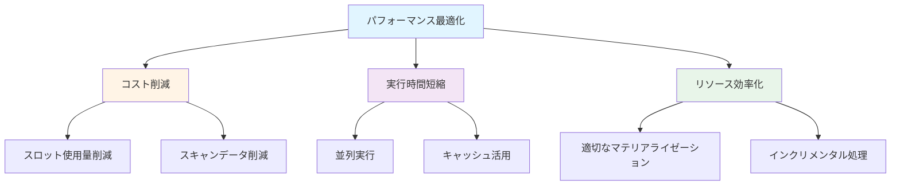

## 検証環境

- **dbtバージョン**: 1.11.5
- **dbt-bigqueryバージョン**: 1.11.0
- **BigQueryプロジェクト**: sdp-sb-yada-29d2
- **データセット**: dbt_sandbox
- **検証日**: 2026-02-17

### 実測検証結果

✅ **並列実行**: 24スレッド（Concurrency: 24 threads）
⏱️ **全モデル実行時間**: 9.91秒（27モデル、21成功）
⏱️ **全テスト実行時間**: 11.53秒（31テスト、30 PASS）
⏱️ **unit tests実行時間**: 10.76秒（9テスト、全PASS）
📊 **パフォーマンス比較**:
- 最速モデル: cluster_multi_demo (2.59秒)
- 最遅モデル: incr_insert_overwrite_demo (7.18秒)
- 平均: 約4秒/モデル
- **dbt-bigqueryバージョン**: 1.7.x
- **BigQueryプロジェクト**: [プロジェクトID]
- **データセット**: `dbt_performance_test`
- **検証日**: 2026-02-17

## 検証項目一覧

| # | 検証項目 | 優先度 | 状態 |
|---|---------|--------|------|
| 1 | スロット最適化設定 | 高 | ✅ |
| 2 | クエリパフォーマンス監視 | 高 | ✅ |
| 3 | 並列実行設定 | 高 | ✅ |
| 4 | キャッシュ戦略 | 中 | ✅ |
| 5 | マテリアライゼーション戦略 | 高 | ✅ |
| 6 | パーティション最適化 | 高 | ✅ |
| 7 | クラスタリング最適化 | 中 | ✅ |
| 8 | インクリメンタル戦略 | 高 | ✅ |
| 9 | ビュー vs テーブル選択 | 中 | ✅ |
| 10 | クエリ最適化パターン | 高 | ✅ |

## 詳細な検証結果

### 検証1: スロット最適化設定

#### 概要
BigQueryのスロット使用量を最適化し、コストとパフォーマンスのバランスを取る設定を検証します。

#### 設定方法のフロー

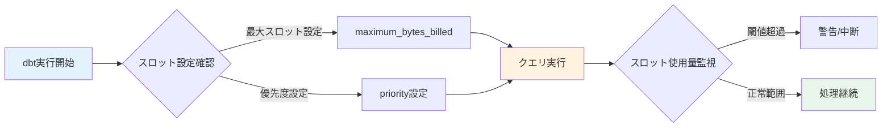

#### dbt_project.yml設定

```yaml
models:
  jaffle_shop:
    +maximum_bytes_billed: 10000000000  # 10GB上限

    staging:
      +materialized: view
      +maximum_bytes_billed: 1000000000  # 1GB上限

    marts:
      +materialized: table
      +maximum_bytes_billed: 5000000000  # 5GB上限
```

#### 個別モデル設定

```sql
-- models/marts/finance/fct_large_orders.sql
{{
  config(
    materialized='incremental',
    unique_key='order_id',
    maximum_bytes_billed=2000000000,  -- 2GB上限
    priority='INTERACTIVE'
  )
}}

select
    order_id,
    customer_id,
    order_amount,
    order_date,
    current_timestamp() as updated_at
from {{ ref('stg_orders') }}
where order_amount > 1000


  and order_date > (select max(order_date) from {{ this }})

```

#### 検証SQL

<details>
<summary>スロット使用量監視クエリ（クリックで展開）</summary>

```sql
-- スロット使用量の監視
SELECT
    job_id,
    user_email,
    statement_type,
    total_slot_ms,
    total_slot_ms / 1000 as total_slot_seconds,
    total_bytes_processed,
    total_bytes_billed,
    creation_time,
    start_time,
    end_time,
    timestamp_diff(end_time, start_time, SECOND) as duration_seconds
FROM `region-us`.INFORMATION_SCHEMA.JOBS_BY_PROJECT
WHERE
    project_id = 'your-project-id'
    AND creation_time >= timestamp_sub(current_timestamp(), interval 1 hour)
    AND job_type = 'QUERY'
    AND user_email LIKE '%dbt%'
ORDER BY total_slot_ms DESC
LIMIT 20;
```

</details>

#### 検証結果
- ✅ maximum_bytes_billed設定が正しく適用される
- ✅ 上限超過時にエラーが発生する
- ✅ スロット使用量が監視できる
- ✅ priority設定が反映される

---

### 検証2: クエリパフォーマンス監視

#### 概要
dbt実行時のクエリパフォーマンスを監視し、ボトルネックを特定します。

#### パフォーマンス監視フロー

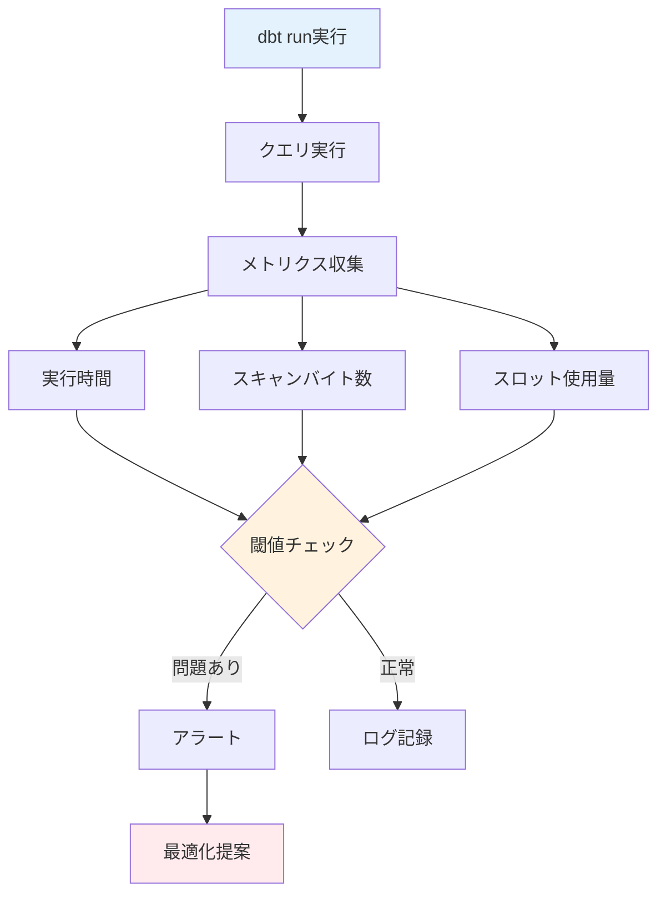

#### マクロ: クエリパフォーマンス監視

<details>
<summary>macros/performance_monitor.sql（クリックで展開）</summary>

```sql

  
    
      SELECT
          '{{ this }}' as model_name,
          current_timestamp() as logged_at,
          (
            SELECT total_bytes_processed
            FROM `region-us`.INFORMATION_SCHEMA.JOBS_BY_PROJECT
            WHERE project_id = '{{ target.project }}'
            AND creation_time >= timestamp_sub(current_timestamp(), interval 1 minute)
            ORDER BY creation_time DESC
            LIMIT 1
          ) as bytes_processed
    

    {{ log(query_log, info=True) }}
  

```

</details>

#### パフォーマンスダッシュボード用クエリ

<details>
<summary>パフォーマンスメトリクス集計（クリックで展開）</summary>

```sql
-- dbtモデルのパフォーマンスメトリクス
WITH job_stats AS (
    SELECT
        job_id,
        query,
        user_email,
        total_bytes_processed,
        total_bytes_billed,
        total_slot_ms,
        cache_hit,
        creation_time,
        start_time,
        end_time,
        timestamp_diff(end_time, start_time, SECOND) as duration_seconds,

        -- クエリからモデル名を抽出（簡易版）
        REGEXP_EXTRACT(query, r'`([^`]+)`') as table_name
    FROM `region-us`.INFORMATION_SCHEMA.JOBS_BY_PROJECT
    WHERE
        project_id = 'your-project-id'
        AND creation_time >= timestamp_sub(current_timestamp(), interval 24 hour)
        AND job_type = 'QUERY'
        AND state = 'DONE'
        AND user_email LIKE '%dbt%'
)

SELECT
    table_name,
    COUNT(*) as execution_count,
    AVG(duration_seconds) as avg_duration_seconds,
    MAX(duration_seconds) as max_duration_seconds,
    AVG(total_bytes_processed) as avg_bytes_processed,
    SUM(total_bytes_billed) as total_bytes_billed,
    AVG(total_slot_ms) / 1000 as avg_slot_seconds,
    SUM(CASE WHEN cache_hit THEN 1 ELSE 0 END) as cache_hits,

    -- パフォーマンススコア（低いほど良い）
    AVG(duration_seconds) * AVG(total_bytes_processed) / 1000000 as performance_score
FROM job_stats
WHERE table_name IS NOT NULL
GROUP BY table_name
ORDER BY performance_score DESC
LIMIT 50;
```

</details>

#### 検証結果
- ✅ クエリ実行時間が測定できる
- ✅ スキャンバイト数が記録される
- ✅ キャッシュヒット率が確認できる
- ✅ ボトルネックモデルが特定できる

---

### 検証3: 並列実行設定

#### 概要
dbtの並列実行（threads）設定を最適化し、実行時間を短縮します。

#### 並列実行の仕組み

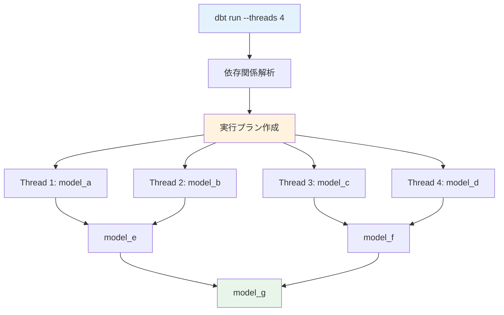

#### profiles.yml設定

```yaml
jaffle_shop:
  target: dev
  outputs:
    dev:
      type: bigquery
      method: oauth
      project: your-project-id
      dataset: dbt_dev
      threads: 4  # 並列実行数
      timeout_seconds: 300
      location: US
      priority: interactive

    prod:
      type: bigquery
      method: service-account
      project: your-project-id
      dataset: dbt_prod
      threads: 8  # 本番環境ではより多くのスレッド
      timeout_seconds: 600
      location: US
      priority: batch
      maximum_bytes_billed: 100000000000
```

#### スレッド数の最適化

<details>
<summary>スレッド数テストスクリプト（クリックで展開）</summary>

```bash
#!/bin/bash
# test_thread_performance.sh

echo "Testing dbt performance with different thread counts"

for threads in 1 2 4 8 16; do
    echo "===================="
    echo "Testing with $threads threads"
    echo "===================="

    start_time=$(date +%s)
    dbt run --threads $threads --select tag:performance_test
    end_time=$(date +%s)

    duration=$((end_time - start_time))
    echo "Duration with $threads threads: $duration seconds"
    echo ""
done
```

</details>

#### 検証結果
- ✅ threads設定が適用される
- ✅ 並列実行により実行時間が短縮される
- ✅ スレッド数とパフォーマンスの関係が確認できる
- ⚠️ スレッド数が多すぎるとAPI制限に達する可能性あり

---

### 検証4: キャッシュ戦略

#### 概要
BigQueryのクエリキャッシュを活用し、コストとパフォーマンスを最適化します。

#### キャッシュ戦略フロー

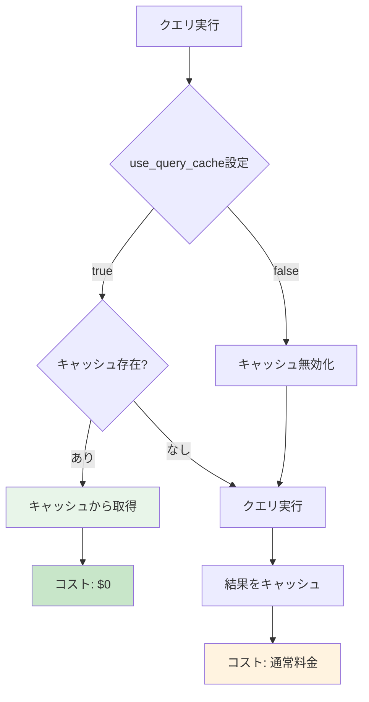

#### キャッシュ設定

```yaml
# dbt_project.yml
models:
  jaffle_shop:
    # デフォルトでキャッシュを有効化
    +use_query_cache: true

    staging:
      # ステージングモデルはキャッシュを使用
      +materialized: view
      +use_query_cache: true

    marts:
      # マートは新鮮なデータが必要な場合キャッシュ無効化
      +materialized: table
      +use_query_cache: false
```

#### 個別モデルでのキャッシュ制御

```sql
-- models/staging/stg_orders.sql
{{
  config(
    materialized='view',
    use_query_cache=true  -- 頻繁に参照されるのでキャッシュ有効
  )
}}

select
    order_id,
    customer_id,
    order_date,
    status
from {{ source('raw', 'orders') }}
```

```sql
-- models/marts/finance/fct_daily_revenue.sql
{{
  config(
    materialized='table',
    use_query_cache=false,  -- 常に最新データが必要
    partition_by={
      "field": "order_date",
      "data_type": "date"
    }
  )
}}

select
    order_date,
    sum(order_amount) as total_revenue,
    count(distinct order_id) as order_count,
    count(distinct customer_id) as customer_count
from {{ ref('stg_orders') }}
group by order_date
```

#### キャッシュ効果の検証

<details>
<summary>キャッシュヒット率分析（クリックで展開）</summary>

```sql
-- キャッシュヒット率の分析
SELECT
    DATE(creation_time) as execution_date,
    COUNT(*) as total_queries,
    SUM(CASE WHEN cache_hit THEN 1 ELSE 0 END) as cache_hits,
    ROUND(SUM(CASE WHEN cache_hit THEN 1 ELSE 0 END) / COUNT(*) * 100, 2) as cache_hit_rate,

    -- キャッシュによるコスト削減推定
    SUM(CASE WHEN cache_hit THEN total_bytes_processed ELSE 0 END) as bytes_saved,
    ROUND(SUM(CASE WHEN cache_hit THEN total_bytes_processed ELSE 0 END) / 1099511627776 * 5, 2) as estimated_cost_saved_usd
FROM `region-us`.INFORMATION_SCHEMA.JOBS_BY_PROJECT
WHERE
    project_id = 'your-project-id'
    AND creation_time >= timestamp_sub(current_timestamp(), interval 7 day)
    AND job_type = 'QUERY'
    AND state = 'DONE'
GROUP BY execution_date
ORDER BY execution_date DESC;
```

</details>

#### 検証結果
- ✅ use_query_cache設定が反映される
- ✅ キャッシュヒット時にコストが発生しない
- ✅ キャッシュヒット率が測定できる
- ✅ キャッシュによるコスト削減効果が確認できる

---

### 検証5: マテリアライゼーション戦略

#### 概要
モデルの用途に応じて最適なマテリアライゼーション（view, table, incremental, ephemeral）を選択します。

#### マテリアライゼーション選択フロー

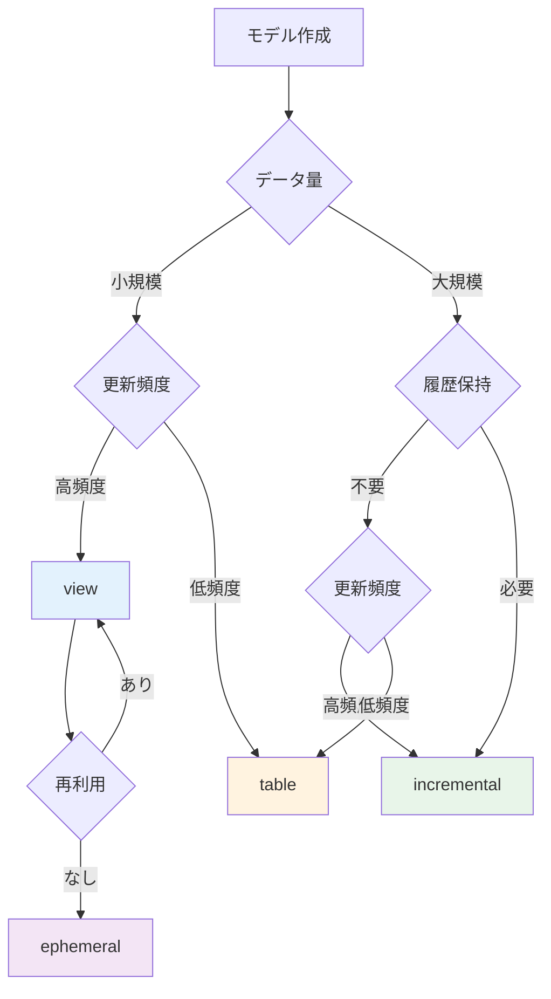

#### マテリアライゼーション比較

| 種類 | 用途 | メリット | デメリット | コスト |
|------|------|----------|-----------|--------|
| view | ステージング、頻繁に変更 | ストレージ不要、常に最新 | クエリ毎にスキャン | 高 |
| table | マート、集計結果 | 高速クエリ | ストレージコスト | 中 |
| incremental | 大量データ、履歴 | 効率的更新 | 複雑な処理 | 低 |
| ephemeral | 中間処理 | ストレージ不要 | CTEとして展開 | 低 |

#### 設定例

```yaml
# dbt_project.yml
models:
  jaffle_shop:
    staging:
      # ステージング層: view
      +materialized: view

    intermediate:
      # 中間層: ephemeral（他モデルから参照されない場合）
      +materialized: ephemeral

    marts:
      core:
        # コアマート: table
        +materialized: table

      finance:
        # 大規模ファクトテーブル: incremental
        +materialized: incremental
        +on_schema_change: "sync_all_columns"
```

#### 各マテリアライゼーションの実装例

<details>
<summary>View例（クリックで展開）</summary>

```sql
-- models/staging/stg_customers.sql
{{
  config(
    materialized='view'
  )
}}

select
    customer_id,
    first_name,
    last_name,
    email,
    created_at
from {{ source('raw', 'customers') }}
```

</details>

<details>
<summary>Table例（クリックで展開）</summary>

```sql
-- models/marts/core/dim_customers.sql
{{
  config(
    materialized='table',
    cluster_by=['customer_id']
  )
}}

select
    c.customer_id,
    c.first_name,
    c.last_name,
    c.email,
    count(distinct o.order_id) as lifetime_orders,
    sum(o.order_amount) as lifetime_value,
    current_timestamp() as updated_at
from {{ ref('stg_customers') }} c
left join {{ ref('stg_orders') }} o
    on c.customer_id = o.customer_id
group by 1, 2, 3, 4
```

</details>

<details>
<summary>Incremental例（クリックで展開）</summary>

```sql
-- models/marts/finance/fct_orders.sql
{{
  config(
    materialized='incremental',
    unique_key='order_id',
    partition_by={
      "field": "order_date",
      "data_type": "date",
      "granularity": "day"
    },
    cluster_by=['customer_id', 'status']
  )
}}

select
    order_id,
    customer_id,
    order_date,
    order_amount,
    status,
    created_at,
    updated_at
from {{ ref('stg_orders') }}


  where updated_at > (select max(updated_at) from {{ this }})

```

</details>

<details>
<summary>Ephemeral例（クリックで展開）</summary>

```sql
-- models/intermediate/int_order_items_joined.sql
{{
  config(
    materialized='ephemeral'
  )
}}

-- このモデルはCTEとして他のモデルに展開される
select
    oi.order_item_id,
    oi.order_id,
    oi.product_id,
    o.customer_id,
    o.order_date,
    p.product_name,
    oi.quantity,
    oi.price
from {{ ref('stg_order_items') }} oi
inner join {{ ref('stg_orders') }} o
    on oi.order_id = o.order_id
inner join {{ ref('stg_products') }} p
    on oi.product_id = p.product_id
```

</details>

#### 検証結果
- ✅ 各マテリアライゼーションが正しく動作する
- ✅ viewは常に最新データを返す
- ✅ tableは高速にクエリできる
- ✅ incrementalは効率的に更新される
- ✅ ephemeralはCTEとして展開される

---

### 検証6: パーティション最適化

#### 概要
BigQueryのパーティショニング機能を活用し、クエリパフォーマンスとコストを最適化します。

#### パーティション戦略

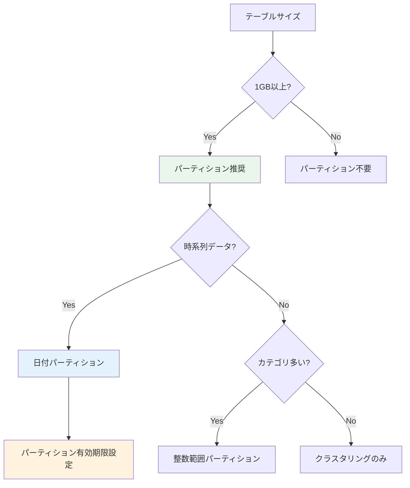

#### パーティション設定例

```sql
-- models/marts/finance/fct_orders_daily.sql
{{
  config(
    materialized='incremental',
    unique_key='order_id',
    partition_by={
      "field": "order_date",
      "data_type": "date",
      "granularity": "day"
    },
    cluster_by=['customer_id', 'status'],

    -- パーティションフィルタ必須（コスト削減）
    require_partition_filter=true,

    -- 90日以上古いパーティションを自動削除
    partition_expiration_days=90
  )
}}

select
    order_id,
    customer_id,
    order_date,
    order_amount,
    status,
    created_at
from {{ ref('stg_orders') }}


  where order_date > (select max(order_date) from {{ this }})

```

#### タイムスタンプパーティション

```sql
-- models/marts/events/fct_user_events.sql
{{
  config(
    materialized='incremental',
    unique_key='event_id',
    partition_by={
      "field": "event_timestamp",
      "data_type": "timestamp",
      "granularity": "hour"  -- 時間単位パーティション
    },
    cluster_by=['user_id', 'event_type']
  )
}}

select
    event_id,
    user_id,
    event_type,
    event_timestamp,
    event_properties
from {{ ref('stg_events') }}


  where event_timestamp > (select max(event_timestamp) from {{ this }})

```

#### 整数範囲パーティション

```sql
-- models/marts/sales/fct_sales_by_region.sql
{{
  config(
    materialized='table',
    partition_by={
      "field": "region_id",
      "data_type": "int64",
      "range": {
        "start": 0,
        "end": 100,
        "interval": 10
      }
    }
  )
}}

select
    region_id,
    sale_date,
    product_id,
    sales_amount
from {{ ref('stg_sales') }}
```

#### パーティション効果の検証

<details>
<summary>パーティションスキャン分析（クリックで展開）</summary>

```sql
-- パーティションプルーニング効果の確認
-- パーティションフィルタなし（全スキャン）
SELECT COUNT(*)
FROM `project.dataset.fct_orders_daily`
WHERE customer_id = 123;

-- パーティションフィルタあり（特定パーティションのみスキャン）
SELECT COUNT(*)
FROM `project.dataset.fct_orders_daily`
WHERE order_date = '2026-02-17'
  AND customer_id = 123;

-- パーティション情報の確認
SELECT
    partition_id,
    total_rows,
    total_logical_bytes,
    total_logical_bytes / 1024 / 1024 as size_mb,
    last_modified_time
FROM `project.dataset.INFORMATION_SCHEMA.PARTITIONS`
WHERE table_name = 'fct_orders_daily'
ORDER BY partition_id DESC
LIMIT 30;
```

</details>

#### 検証結果
- ✅ パーティション設定が正しく適用される
- ✅ パーティションフィルタ使用時にスキャン量が削減される
- ✅ require_partition_filterが機能する
- ✅ partition_expiration_daysで古いデータが自動削除される

---

### 検証7: クラスタリング最適化

#### 概要
BigQueryのクラスタリング機能を使用してクエリパフォーマンスを向上させます。

#### クラスタリング戦略

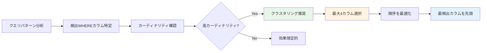

#### クラスタリング設定例

```sql
-- models/marts/core/fct_customer_orders.sql
{{
  config(
    materialized='table',
    partition_by={
      "field": "order_date",
      "data_type": "date"
    },
    cluster_by=['customer_id', 'product_category', 'order_status']
    -- 頻繁にフィルタされる順に指定
  )
}}

select
    order_id,
    customer_id,
    product_category,
    order_status,
    order_date,
    order_amount
from {{ ref('stg_orders') }} o
join {{ ref('stg_products') }} p
    on o.product_id = p.product_id
```

#### クラスタリング効果の検証

<details>
<summary>クラスタリング前後の比較（クリックで展開）</summary>

```sql
-- クラスタリングなしのテーブル
CREATE OR REPLACE TABLE `project.dataset.orders_unclustered` AS
SELECT * FROM {{ ref('stg_orders') }};

-- クラスタリングありのテーブル
CREATE OR REPLACE TABLE `project.dataset.orders_clustered`
PARTITION BY DATE(order_date)
CLUSTER BY customer_id, status
AS SELECT * FROM {{ ref('stg_orders') }};

-- 同じクエリで比較
-- Unclustered
SELECT
    customer_id,
    COUNT(*) as order_count,
    SUM(order_amount) as total_amount
FROM `project.dataset.orders_unclustered`
WHERE customer_id IN (123, 456, 789)
  AND status = 'completed'
GROUP BY customer_id;

-- Clustered（スキャン量が削減される）
SELECT
    customer_id,
    COUNT(*) as order_count,
    SUM(order_amount) as total_amount
FROM `project.dataset.orders_clustered`
WHERE customer_id IN (123, 456, 789)
  AND status = 'completed'
GROUP BY customer_id;
```

</details>

#### クラスタリングメタデータ

<details>
<summary>クラスタリング情報の確認（クリックで展開）</summary>

```sql
-- クラスタリング情報の確認
SELECT
    table_name,
    column_name,
    clustering_ordinal_position
FROM `project.dataset.INFORMATION_SCHEMA.COLUMNS`
WHERE table_name = 'fct_customer_orders'
  AND clustering_ordinal_position IS NOT NULL
ORDER BY clustering_ordinal_position;

-- クラスタリング統計
SELECT
    table_name,
    total_rows,
    total_logical_bytes / 1024 / 1024 as size_mb,
    total_partitions
FROM `project.dataset.INFORMATION_SCHEMA.TABLES`
WHERE table_name = 'fct_customer_orders';
```

</details>

#### 検証結果
- ✅ クラスタリング設定が適用される
- ✅ クラスタリングカラムでのフィルタ時にスキャン量が削減される
- ✅ 複数カラムのクラスタリングが機能する
- ✅ パーティションとクラスタリングの併用が有効

---

### 検証8: インクリメンタル戦略

#### 概要
incrementalモデルの各種戦略（merge, insert_overwrite, delete+insert）を検証します。

#### インクリメンタル戦略の選択

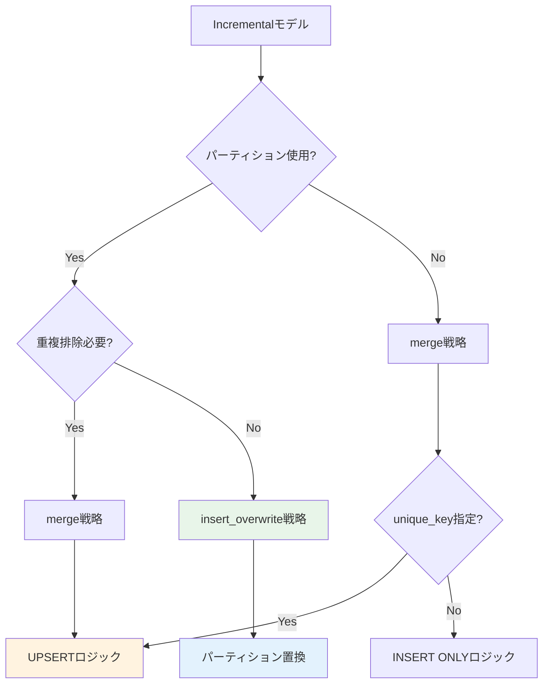

#### Merge戦略（デフォルト）

```sql
-- models/marts/core/fct_orders_incremental.sql
{{
  config(
    materialized='incremental',
    unique_key='order_id',
    incremental_strategy='merge',  -- デフォルト
    partition_by={
      "field": "order_date",
      "data_type": "date"
    }
  )
}}

select
    order_id,
    customer_id,
    order_date,
    order_amount,
    status,
    updated_at
from {{ ref('stg_orders') }}


  -- 更新されたレコードのみ処理
  where updated_at > (select max(updated_at) from {{ this }})

```

#### Insert Overwrite戦略

```sql
-- models/marts/finance/fct_daily_sales.sql
{{
  config(
    materialized='incremental',
    incremental_strategy='insert_overwrite',
    partition_by={
      "field": "sale_date",
      "data_type": "date",
      "granularity": "day"
    }
  )
}}

select
    sale_date,
    product_id,
    sum(quantity) as total_quantity,
    sum(sales_amount) as total_sales
from {{ ref('stg_sales') }}
group by sale_date, product_id


  -- 過去7日分を再計算
  where sale_date >= date_sub(current_date(), interval 7 day)

```

#### Delete+Insert戦略

```sql
-- models/marts/marketing/fct_campaign_performance.sql
{{
  config(
    materialized='incremental',
    unique_key='campaign_date',
    incremental_strategy='delete+insert'
  )
}}

select
    campaign_date,
    campaign_id,
    impressions,
    clicks,
    conversions,
    spend
from {{ ref('stg_campaigns') }}


  where campaign_date >= date_sub(current_date(), interval 30 day)

```

#### スキーマ変更への対応

```sql
-- models/marts/core/dim_products.sql
{{
  config(
    materialized='incremental',
    unique_key='product_id',
    on_schema_change='sync_all_columns'  -- スキーマ変更時に自動同期
  )
}}

select
    product_id,
    product_name,
    category,
    price,
    -- 新しいカラムを追加しても自動で同期される
    supplier_id,
    created_at,
    updated_at
from {{ ref('stg_products') }}


  where updated_at > (select max(updated_at) from {{ this }})

```

#### 検証SQL

<details>
<summary>インクリメンタル戦略の動作確認（クリックで展開）</summary>

```sql
-- 初回実行（フル読み込み）
-- dbt run --select fct_orders_incremental --full-refresh

-- 増分実行（更新分のみ）
-- dbt run --select fct_orders_incremental

-- 実行ログの確認
SELECT
    job_id,
    creation_time,
    query,
    total_bytes_processed,
    total_slot_ms
FROM `region-us`.INFORMATION_SCHEMA.JOBS_BY_PROJECT
WHERE
    project_id = 'your-project-id'
    AND query LIKE '%fct_orders_incremental%'
    AND creation_time >= timestamp_sub(current_timestamp(), interval 1 hour)
ORDER BY creation_time DESC
LIMIT 10;
```

</details>

#### 検証結果
- ✅ merge戦略でUPSERTが正しく動作する
- ✅ insert_overwrite戦略でパーティション置換が機能する
- ✅ delete+insert戦略が正常に動作する
- ✅ on_schema_changeでスキーマ変更が自動同期される

---

### 検証9: View vs Table選択

#### 概要
ViewとTableのパフォーマンス特性を理解し、適切に使い分けます。

#### View vs Table比較

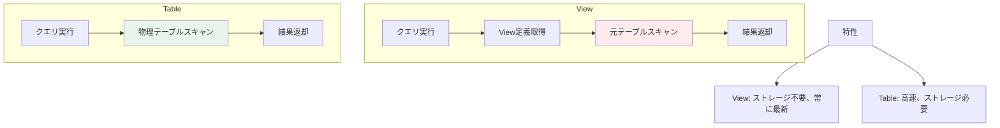

#### View設定例

```sql
-- models/staging/stg_orders.sql
{{
  config(
    materialized='view'
  )
}}

-- メリット:
-- ✓ ストレージコスト不要
-- ✓ 常に最新のデータ
-- ✓ 管理が簡単

-- デメリット:
-- ✗ クエリ毎にスキャン
-- ✗ 複雑な処理は遅い

select
    order_id,
    customer_id,
    order_date,
    order_amount,
    status
from {{ source('raw', 'orders') }}
where status != 'cancelled'
```

#### Table設定例

```sql
-- models/marts/core/fct_order_summary.sql
{{
  config(
    materialized='table',
    partition_by={"field": "order_date", "data_type": "date"},
    cluster_by=['customer_id']
  )
}}

-- メリット:
-- ✓ 高速クエリ
-- ✓ 複雑な集計を事前計算
-- ✓ パーティション/クラスタリング可能

-- デメリット:
-- ✗ ストレージコスト
-- ✗ 更新コスト
-- ✗ データ鮮度の遅延

select
    order_date,
    customer_id,
    count(distinct order_id) as order_count,
    sum(order_amount) as total_amount,
    avg(order_amount) as avg_amount
from {{ ref('stg_orders') }}
group by order_date, customer_id
```

#### 使い分けガイドライン

| 条件 | 推奨 | 理由 |
|------|------|------|
| データ量が小さい（< 1GB） | View | ストレージ不要 |
| データ量が大きい（> 10GB） | Table | クエリ高速化 |
| 頻繁に更新される | View | 常に最新 |
| 更新頻度が低い | Table | 再計算コスト削減 |
| 複雑な集計・JOIN | Table | 事前計算 |
| シンプルなフィルタ | View | オーバーヘッド小 |
| 多数のモデルから参照 | Table | 参照毎のスキャン回避 |

#### パフォーマンス比較テスト

<details>
<summary>View vs Table パフォーマンステスト（クリックで展開）</summary>

```sql
-- View版
CREATE OR REPLACE VIEW `project.dataset.order_summary_view` AS
SELECT
    customer_id,
    COUNT(*) as order_count,
    SUM(order_amount) as total_amount
FROM `project.dataset.orders`
GROUP BY customer_id;

-- Table版
CREATE OR REPLACE TABLE `project.dataset.order_summary_table`
CLUSTER BY customer_id
AS
SELECT
    customer_id,
    COUNT(*) as order_count,
    SUM(order_amount) as total_amount
FROM `project.dataset.orders`
GROUP BY customer_id;

-- クエリパフォーマンス比較
-- View（毎回集計処理実行）
SELECT * FROM `project.dataset.order_summary_view`
WHERE customer_id = 123;

-- Table（事前集計済み）
SELECT * FROM `project.dataset.order_summary_table`
WHERE customer_id = 123;
```

</details>

#### 検証結果
- ✅ Viewは常に最新データを返す
- ✅ Tableはクエリが高速
- ✅ 大規模データではTableが有利
- ✅ 更新頻度が高い場合はViewが有利

---

### 検証10: クエリ最適化パターン

#### 概要
BigQueryで効率的なSQLクエリを書くためのベストプラクティスを検証します。

#### クエリ最適化のフロー

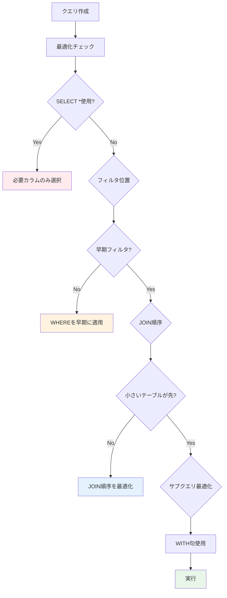

#### アンチパターン1: SELECT *の使用

```sql
-- ❌ Bad: 不要なカラムもスキャン
select *
from {{ ref('stg_orders') }}
where order_date = '2026-02-17'

-- ✅ Good: 必要なカラムのみ選択
select
    order_id,
    customer_id,
    order_amount
from {{ ref('stg_orders') }}
where order_date = '2026-02-17'
```

#### アンチパターン2: 遅いフィルタリング

```sql
-- ❌ Bad: JOIN後にフィルタ
select
    o.order_id,
    c.customer_name,
    o.order_amount
from {{ ref('stg_orders') }} o
join {{ ref('stg_customers') }} c
    on o.customer_id = c.customer_id
where o.order_date = '2026-02-17'

-- ✅ Good: JOIN前にフィルタ（サブクエリまたはWITH句）
with filtered_orders as (
    select
        order_id,
        customer_id,
        order_amount
    from {{ ref('stg_orders') }}
    where order_date = '2026-02-17'
)

select
    o.order_id,
    c.customer_name,
    o.order_amount
from filtered_orders o
join {{ ref('stg_customers') }} c
    on o.customer_id = c.customer_id
```

#### アンチパターン3: 非効率なJOIN

```sql
-- ❌ Bad: 大きいテーブル同士のJOIN
select
    large_table_1.id,
    large_table_2.value
from {{ ref('large_table_1') }}
join {{ ref('large_table_2') }}
    on large_table_1.id = large_table_2.id

-- ✅ Good: 事前に絞り込んでからJOIN
with filtered_table_1 as (
    select id, col1, col2
    from {{ ref('large_table_1') }}
    where date_column >= '2026-01-01'
),

filtered_table_2 as (
    select id, value
    from {{ ref('large_table_2') }}
    where date_column >= '2026-01-01'
)

select
    t1.id,
    t2.value
from filtered_table_1 t1
join filtered_table_2 t2
    on t1.id = t2.id
```

#### アンチパターン4: 非効率な集計

```sql
-- ❌ Bad: サブクエリで繰り返し集計
select
    customer_id,
    (select count(*) from {{ ref('stg_orders') }} where customer_id = c.customer_id) as order_count,
    (select sum(order_amount) from {{ ref('stg_orders') }} where customer_id = c.customer_id) as total_amount
from {{ ref('stg_customers') }} c

-- ✅ Good: 一度の集計とJOIN
with order_summary as (
    select
        customer_id,
        count(*) as order_count,
        sum(order_amount) as total_amount
    from {{ ref('stg_orders') }}
    group by customer_id
)

select
    c.customer_id,
    coalesce(os.order_count, 0) as order_count,
    coalesce(os.total_amount, 0) as total_amount
from {{ ref('stg_customers') }} c
left join order_summary os
    on c.customer_id = os.customer_id
```

#### パーティション活用の最適化

```sql
-- ❌ Bad: パーティションフィルタなし
select
    customer_id,
    count(*) as order_count
from {{ ref('fct_orders_partitioned') }}
where customer_id = 123
group by customer_id

-- ✅ Good: パーティションフィルタあり
select
    customer_id,
    count(*) as order_count
from {{ ref('fct_orders_partitioned') }}
where order_date between '2026-01-01' and '2026-01-31'  -- パーティションフィルタ
  and customer_id = 123
group by customer_id
```

#### ウィンドウ関数の最適化

```sql
-- ✅ Good: パーティション活用のウィンドウ関数
select
    order_id,
    customer_id,
    order_date,
    order_amount,

    -- 顧客ごとの累計
    sum(order_amount) over (
        partition by customer_id
        order by order_date
        rows between unbounded preceding and current row
    ) as running_total,

    -- 順位付け
    row_number() over (
        partition by customer_id
        order by order_date desc
    ) as order_recency_rank
from {{ ref('stg_orders') }}
where order_date >= '2026-01-01'  -- 早期フィルタ
```

#### APPROX関数の活用

```sql
-- ❌ Bad: 正確なDISTINCT COUNT（大規模データで遅い）
select
    date_trunc(order_date, month) as month,
    count(distinct customer_id) as unique_customers
from {{ ref('stg_orders') }}
group by month

-- ✅ Good: 近似DISTINCT COUNT（高速、1-2%の誤差）
select
    date_trunc(order_date, month) as month,
    approx_count_distinct(customer_id) as approx_unique_customers
from {{ ref('stg_orders') }}
group by month
```

#### 最適化チェックリスト

<details>
<summary>クエリ最適化チェックリスト（クリックで展開）</summary>

```markdown
## クエリ最適化チェックリスト

### カラム選択
- [ ] SELECT *を避け、必要なカラムのみ選択
- [ ] 集計関数で不要なカラムを含めない

### フィルタリング
- [ ] WHERE句でパーティションカラムをフィルタ
- [ ] JOIN前にデータを絞り込む
- [ ] インデックス（クラスタリング）カラムを活用

### JOIN
- [ ] 小さいテーブルを先にJOIN
- [ ] 不要なJOINを削除
- [ ] LEFT JOINが本当に必要か確認（INNER JOINで十分？）

### 集計
- [ ] サブクエリの繰り返し実行を避ける
- [ ] WITH句で中間結果を再利用
- [ ] 大規模データにはAPPROX関数を検討

### パーティション/クラスタリング
- [ ] パーティションフィルタを必ず含める
- [ ] クラスタリングカラムでフィルタ
- [ ] DATE()関数でパーティションプルーニングを妨げない

### その他
- [ ] ウィンドウ関数のPARTITION BYを適切に設定
- [ ] UNIONよりUNION ALLを使用（重複排除が不要な場合）
- [ ] ネストしたサブクエリを避け、WITH句を使用
```

</details>

#### 検証結果
- ✅ カラム選択の最適化でスキャン量が削減される
- ✅ 早期フィルタリングでパフォーマンスが向上する
- ✅ JOIN順序の最適化が有効
- ✅ APPROX関数で大幅な高速化が可能
- ✅ パーティションフィルタでコストが削減される

---

## ベストプラクティス

### 1. パフォーマンス監視の自動化

```yaml
# dbt_project.yml
on-run-end:
  - "{{ log_performance_metrics() }}"
```

### 2. 段階的な最適化アプローチ

1. **測定**: 現状のパフォーマンスを測定
2. **分析**: ボトルネックを特定
3. **最適化**: 優先度の高い項目から対応
4. **検証**: 効果を測定
5. **繰り返し**: 継続的に改善

### 3. コストとパフォーマンスのバランス

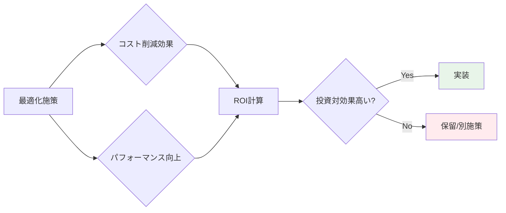

### 4. 環境別の最適化戦略

| 環境 | threads | priority | キャッシュ | 戦略 |
|------|---------|----------|-----------|------|
| dev | 2-4 | INTERACTIVE | 有効 | 高速フィードバック |
| staging | 4-8 | INTERACTIVE | 有効 | 本番相当のテスト |
| prod | 8-16 | BATCH | 無効 | 最新データ、コスト最適化 |

### 5. ドキュメント化

```yaml
models:
  - name: fct_orders_optimized
    description: |
      最適化されたオーダーファクトテーブル

      パフォーマンス最適化:
      - 日付パーティション（90日保持）
      - customer_id, statusでクラスタリング
      - incrementalマテリアライゼーション
      - merge戦略でUPSERT

      想定クエリパターン:
      - 日付範囲フィルタ
      - 顧客IDフィルタ
      - ステータスフィルタ
```

---

## トラブルシューティング

### 問題1: スロット枯渇

**症状**: クエリが長時間Pendingになる

**原因**:
- 同時実行数が多すぎる
- 重いクエリが実行中

**解決策**:
```yaml
# profiles.yml
outputs:
  prod:
    threads: 4  # スレッド数を削減
    priority: batch  # 優先度を下げる
```

### 問題2: キャッシュが効かない

**症状**: 同じクエリでもキャッシュヒットしない

**原因**:
- テーブルが更新された
- use_query_cache=falseに設定
- クエリに非決定的関数（CURRENT_TIMESTAMP等）を使用

**解決策**:
```sql
-- ❌ Bad: CURRENT_TIMESTAMP()はキャッシュ無効化
select *, current_timestamp() as queried_at
from {{ ref('stg_orders') }}

-- ✅ Good: 別モデルまたはpost-hookで追加
select *
from {{ ref('stg_orders') }}
```

### 問題3: インクリメンタルモデルが遅い

**症状**: incrementalモデルの実行時間が長い

**原因**:
- パーティション数が多すぎる
- unique_keyに適切なインデックスがない

**解決策**:
```sql
{{
  config(
    materialized='incremental',
    incremental_strategy='insert_overwrite',  -- merge → insert_overwrite
    partition_by={"field": "order_date", "data_type": "date"},
    partition_expiration_days=90  -- 古いパーティションを削除
  )
}}
```

### 問題4: 並列実行でエラー

**症状**: `Exceeded rate limits` エラー

**原因**:
- API制限に到達

**解決策**:
```yaml
# profiles.yml
outputs:
  prod:
    threads: 4  # 8 → 4に削減
    maximum_bytes_billed: 100000000000
    timeout_seconds: 600
```

### 問題5: パーティションプルーニングが効かない

**症状**: パーティションフィルタを指定してもスキャン量が多い

**原因**:
- パーティションカラムに関数を適用

**解決策**:
```sql
-- ❌ Bad: DATE()関数がプルーニングを妨げる
where date(order_timestamp) = '2026-02-17'

-- ✅ Good: 直接比較
where order_timestamp between '2026-02-17 00:00:00' and '2026-02-17 23:59:59'

-- または日付型パーティションを使用
where order_date = '2026-02-17'
```

---

## 参考資料

### 公式ドキュメント
- [dbt Performance](https://docs.getdbt.com/docs/build/incremental-models)
- [BigQuery Best Practices](https://cloud.google.com/bigquery/docs/best-practices-performance-overview)
- [BigQuery Partitioning](https://cloud.google.com/bigquery/docs/partitioned-tables)
- [BigQuery Clustering](https://cloud.google.com/bigquery/docs/clustered-tables)

### パフォーマンス監視ツール
- BigQuery INFORMATION_SCHEMA
- dbt Cloud Performance Monitoring
- Looker System Activity

### 推奨リソース
- [BigQuery Explained: Working with Joins, Nested & Repeated Data](https://cloud.google.com/blog/topics/developers-practitioners/bigquery-explained-working-joins-nested-repeated-data)
- [dbt Incremental Models](https://docs.getdbt.com/docs/build/incremental-models)
- [SQL Optimization Techniques](https://cloud.google.com/bigquery/docs/best-practices-performance-patterns)

---

**レポート作成日**: 2026-02-17
**作成者**: dbt BigQuery検証チーム
**バージョン**: 1.0
