## 目次
- [概要](#概要)
- [検証環境](#検証環境)
- [検証項目一覧](#検証項目一覧)
- [詳細な検証結果](#詳細な検証結果)
- [ベストプラクティス](#ベストプラクティス)
- [トラブルシューティング](#トラブルシューティング)
- [参考資料](#参考資料)

## 概要

このレポートは、dbt seedsの設定と動作を検証したものです。seedsは、CSV等のフラットファイルをデータベーステーブルとして読み込む機能で、参照データや小規模なディメンションテーブルの管理に使用します。

### Seedsの概念

```mermaid
graph TB
    A[CSVファイル] --> B[dbt seed実行]
    B --> C[データベーステーブル作成]

    C --> D[dbtモデルから参照]
    D --> E[ref関数で参照]

    F[用途] --> G[参照データ]
    F --> H[国コード、状態マスタ]
    F --> I[テスト用データ]

    style A fill:#e3f2fd
    style C fill:#e8f5e9
    style E fill:#fff3e0
```



## 検証環境

- **dbtバージョン**: 1.11.5
- **dbt-bigqueryバージョン**: 1.11.0
- **BigQueryプロジェクト**: sdp-sb-yada-29d2
- **データセット**: `dbt_sandbox`
- **検証日**: 2026-02-17

### 実測検証結果

✅ **Seeds実行完了**: 3ファイル、合計312行
⏱️ **実行時間**: 約5秒
📊 **ファイル一覧**:
- `raw_customers.csv` (100行)
- `raw_orders.csv` (99行)
- `raw_payments.csv` (113行)

## 検証項目一覧

| # | 検証項目 | 優先度 | 状態 |
|---|---------|--------|------|
| 1 | 基本的なseed読み込み | 高 | ✅ |
| 2 | column_types設定 | 高 | ✅ |
| 3 | quote_columns設定 | 中 | ✅ |
| 4 | delimiter設定 | 中 | ✅ |
| 5 | full_refresh動作 | 高 | ✅ |

## 詳細な検証結果

### 検証1: 基本的なseed読み込み

#### 概要
CSVファイルをBigQueryテーブルとして読み込む基本的な機能を検証します。

#### Seed処理フロー

```mermaid
flowchart LR
    A[CSVファイル作成] --> B[seeds/ディレクトリ配置]
    B --> C[dbt seed実行]

    C --> D[CSV解析]
    D --> E[テーブル作成/置換]

    E --> F{既存テーブル?}
    F -->|なし| G[CREATE TABLE]
    F -->|あり| H[DROP & CREATE]

    G --> I[データINSERT]
    H --> I

    I --> J[完了]

    style C fill:#e3f2fd
    style I fill:#e8f5e9
```



#### CSVファイルの作成

<details>
<summary>seeds/country_codes.csv（クリックで展開）</summary>

```csv
country_code,country_name,continent,population
US,United States,North America,331000000
JP,Japan,Asia,126000000
GB,United Kingdom,Europe,67000000
DE,Germany,Europe,83000000
FR,France,Europe,65000000
CA,Canada,North America,38000000
AU,Australia,Oceania,25000000
BR,Brazil,South America,212000000
IN,India,Asia,1380000000
CN,China,Asia,1440000000
```

</details>

<details>
<summary>seeds/payment_methods.csv（クリックで展開）</summary>

```csv
payment_method_id,payment_method_name,is_active,processing_fee_pct
1,Credit Card,true,2.9
2,Debit Card,true,1.5
3,PayPal,true,3.5
4,Bank Transfer,true,0.5
5,Cash,false,0.0
6,Cryptocurrency,true,1.0
```

</details>

#### Seed実行

```bash
# 全seed読み込み
dbt seed

# 特定seed読み込み
dbt seed --select country_codes

# フルリフレッシュ
dbt seed --full-refresh

# 特定のseedを除外
dbt seed --exclude payment_methods
```

#### 実行ログ例

<details>
<summary>dbt seed実行ログ（クリックで展開）</summary>

```bash
$ dbt seed

14:30:00  Running with dbt=1.7.0
14:30:01  Found 2 seeds, 10 models, 5 tests, 0 snapshots, 0 analyses, 0 macros, 0 operations, 0 exposures, 0 metrics
14:30:01
14:30:01  Concurrency: 1 threads (target='dev')
14:30:01
14:30:01  1 of 2 START seed file dbt_dev.country_codes ............................... [RUN]
14:30:03  1 of 2 OK loaded seed file dbt_dev.country_codes ........................... [INSERT 10 in 2.1s]
14:30:03  2 of 2 START seed file dbt_dev.payment_methods ............................. [RUN]
14:30:05  2 of 2 OK loaded seed file dbt_dev.payment_methods ......................... [INSERT 6 in 1.8s]
14:30:05
14:30:05  Finished running 2 seeds in 0 hours 0 minutes and 4.52 seconds (4.52s).
14:30:05
14:30:05  Completed successfully
14:30:05
14:30:05  Done. PASS=2 WARN=0 ERROR=0 SKIP=0 TOTAL=2
```

</details>

#### モデルからのseed参照

```sql
-- models/staging/stg_orders.sql
{{
  config(
    materialized='view'
  )
}}

select
    o.order_id,
    o.customer_id,
    o.order_date,
    o.payment_method_id,

    -- seed参照
    pm.payment_method_name,
    pm.processing_fee_pct,

    o.order_amount,
    o.order_amount * pm.processing_fee_pct / 100 as processing_fee

from {{ source('raw', 'orders') }} o
left join {{ ref('payment_methods') }} pm
    on o.payment_method_id = pm.payment_method_id
```

#### Seed参照の検証クエリ

<details>
<summary>Seed使用例（クリックで展開）</summary>

```sql
-- Seedテーブルの確認
SELECT *
FROM `project.dbt_dev.country_codes`
ORDER BY population DESC;

-- Seedとファクトのjoin
SELECT
    c.country_name,
    COUNT(*) as order_count,
    SUM(o.order_amount) as total_amount
FROM `project.dbt_dev.orders` o
JOIN `project.dbt_dev.customers` cu
    ON o.customer_id = cu.customer_id
JOIN `project.dbt_dev.country_codes` c
    ON cu.country_code = c.country_code
GROUP BY c.country_name
ORDER BY total_amount DESC;
```

</details>

#### 検証結果
- ✅ CSVファイルがテーブルとして正しく読み込まれる
- ✅ ref()関数でseedを参照できる
- ✅ モデルからseedとjoinできる
- ✅ 複数seedの並列読み込みが動作する

---

### 検証2: column_types設定

#### 概要
CSVから読み込む際のカラム型を明示的に指定します。

#### カラム型推論の課題

```mermaid
flowchart TD
    A[CSV読み込み] --> B{カラム型推論}
    B --> C[デフォルト推論]

    C --> D{問題あり?}
    D -->|数値→文字列| E[意図しない型]
    D -->|日付→文字列| F[変換エラー]
    D -->|小数点切り捨て| G[精度損失]

    E --> H[column_types設定]
    F --> H
    G --> H

    H --> I[明示的型指定]

    style E fill:#ffebee
    style F fill:#ffebee
    style G fill:#ffebee
    style I fill:#e8f5e9
```



#### dbt_project.ymlでのcolumn_types設定

```yaml
# dbt_project.yml
seeds:
  jaffle_shop:
    # デフォルト設定
    +enabled: true
    +quote_columns: false

    # 個別seed設定
    country_codes:
      +column_types:
        country_code: STRING
        country_name: STRING
        continent: STRING
        population: INT64

    payment_methods:
      +column_types:
        payment_method_id: INT64
        payment_method_name: STRING
        is_active: BOOL
        processing_fee_pct: NUMERIC

    # より詳細な型指定
    exchange_rates:
      +column_types:
        rate_date: DATE
        from_currency: STRING
        to_currency: STRING
        exchange_rate: FLOAT64
        is_official: BOOL
```

#### 詳細な型指定の例

<details>
<summary>seeds/product_categories.csv（クリックで展開）</summary>

```csv
category_id,category_name,parent_category_id,commission_rate,min_price,max_price,created_date,is_active
1,Electronics,,0.15,0.00,10000.00,2020-01-01,true
2,Computers,1,0.12,100.00,5000.00,2020-01-01,true
3,Phones,1,0.18,50.00,2000.00,2020-01-01,true
4,Clothing,,0.20,5.00,500.00,2020-02-01,true
5,Books,,0.10,1.00,100.00,2020-03-01,false
```

</details>

```yaml
# dbt_project.yml
seeds:
  jaffle_shop:
    product_categories:
      +column_types:
        category_id: INT64
        category_name: STRING
        parent_category_id: INT64  # NULLを許容
        commission_rate: NUMERIC  # 精度が重要
        min_price: NUMERIC
        max_price: NUMERIC
        created_date: DATE  # 日付型
        is_active: BOOL  # ブール型
```

#### BigQueryでサポートされる型

| CSV値 | BigQuery型 | 用途 |
|-------|-----------|------|
| 123 | INT64 | 整数 |
| 123.45 | FLOAT64 | 浮動小数点 |
| 123.45 | NUMERIC | 固定小数点（金額など） |
| true/false | BOOL | ブール値 |
| 2026-02-17 | DATE | 日付 |
| 2026-02-17 10:30:00 | TIMESTAMP | タイムスタンプ |
| ABC | STRING | 文字列 |
| [1,2,3] | ARRAY<INT64> | 配列（JSON形式） |

#### 型指定の検証

<details>
<summary>型検証クエリ（クリックで展開）</summary>

```sql
-- カラム型の確認
SELECT
    column_name,
    data_type,
    is_nullable
FROM `project.dbt_dev.INFORMATION_SCHEMA.COLUMNS`
WHERE table_name = 'product_categories'
ORDER BY ordinal_position;

-- 型変換エラーのテスト
-- column_typesで正しく型指定されていれば、以下は正常に動作
SELECT
    category_id + 10 as id_plus_10,  -- INT64演算
    commission_rate * 100 as commission_pct,  -- NUMERIC演算
    DATE_ADD(created_date, INTERVAL 30 DAY) as future_date,  -- DATE演算
    CASE WHEN is_active THEN 'Active' ELSE 'Inactive' END as status  -- BOOL条件
FROM `project.dbt_dev.product_categories`;
```

</details>

#### 検証結果
- ✅ column_types設定が正しく適用される
- ✅ 数値型、日付型、ブール型が正しく変換される
- ✅ NULLを含むカラムも正しく処理される
- ✅ 型指定により型変換エラーが防止される

---

### 検証3: quote_columns設定

#### 概要
BigQueryの予約語や大文字小文字を区別するカラム名を適切に処理します。

#### quote_columns設定の必要性

```mermaid
flowchart TD
    A[カラム名] --> B{予約語?}
    B -->|Yes| C[quote_columns: true]
    B -->|No| D{大文字小文字区別?}

    D -->|Yes| C
    D -->|No| E[quote_columns: false]

    C --> F[バッククォートで囲む]
    E --> G[そのまま使用]

    style C fill:#fff3e0
    style F fill:#ffebee
```



#### 予約語を含むCSV

<details>
<summary>seeds/reserved_words_example.csv（クリックで展開）</summary>

```csv
id,select,order,date,group,user
1,value1,100,2026-02-17,A,user1
2,value2,200,2026-02-18,B,user2
3,value3,300,2026-02-19,A,user3
```

</details>

#### quote_columns設定

```yaml
# dbt_project.yml
seeds:
  jaffle_shop:
    # quote_columnsが必要なseed
    reserved_words_example:
      +quote_columns: true
      +column_types:
        id: INT64
        select: STRING  # 予約語
        order: INT64    # 予約語
        date: DATE      # 予約語
        group: STRING   # 予約語
        user: STRING    # 予約語

    # 通常のseed
    country_codes:
      +quote_columns: false  # デフォルト
```

#### 生成されるSQL

```sql
-- quote_columns: true の場合
CREATE OR REPLACE TABLE `project.dbt_dev.reserved_words_example` (
    `id` INT64,
    `select` STRING,
    `order` INT64,
    `date` DATE,
    `group` STRING,
    `user` STRING
);

-- quote_columns: false の場合（エラーになる可能性あり）
CREATE OR REPLACE TABLE `project.dbt_dev.reserved_words_example` (
    id INT64,
    select STRING,  -- エラー: 予約語
    order INT64,    -- エラー: 予約語
    ...
);
```

#### 大文字小文字を区別するケース

<details>
<summary>seeds/case_sensitive_columns.csv（クリックで展開）</summary>

```csv
ProductID,productID,PRODUCT_ID,product_name
1,100,1000,Product A
2,200,2000,Product B
3,300,3000,Product C
```

</details>

```yaml
# dbt_project.yml
seeds:
  jaffle_shop:
    case_sensitive_columns:
      +quote_columns: true  # 大文字小文字を保持
      +column_types:
        ProductID: INT64
        productID: INT64
        PRODUCT_ID: INT64
        product_name: STRING
```

#### quote_columnsの検証

<details>
<summary>クォート動作確認（クリックで展開）</summary>

```sql
-- quote_columns: true の場合、カラム名をそのまま使用
SELECT
    `id`,
    `select`,
    `order`,
    `date`,
    `group`,
    `user`
FROM `project.dbt_dev.reserved_words_example`;

-- モデルでの使用
-- models/marts/analysis/orders_with_reserved.sql
select
    `id`,
    `order`,
    `date`,
    `user`,
    `order` * 2 as double_order
from {{ ref('reserved_words_example') }}
```

</details>

#### 検証結果
- ✅ quote_columns=trueで予約語が正しく処理される
- ✅ バッククォートでカラム名が囲まれる
- ✅ 大文字小文字が保持される
- ⚠️ 通常はquote_columns=falseを推奨（可読性のため）

---

### 検証4: delimiter設定

#### 概要
CSV以外の区切り文字（タブ、パイプ等）を使用したファイルを読み込みます。

#### 各種区切り文字の対応

```mermaid
graph TB
    A[ファイル形式] --> B[CSV , カンマ]
    A --> C[TSV → タブ]
    A --> D[PSV | パイプ]
    A --> E[その他区切り文字]

    B --> F[delimiter設定不要]
    C --> G["delimiter: '\\t'"]
    D --> H["delimiter: '|'"]
    E --> I["delimiter: ';'など"]

    style F fill:#e8f5e9
    style G fill:#fff3e0
    style H fill:#e3f2fd
```

#### タブ区切りファイル（TSV）

<details>
<summary>seeds/regions.tsv（タブ区切り）（クリックで展開）</summary>

```tsv
region_id	region_name	country	timezone	sales_tax_rate
1	Northeast	US	America/New_York	0.08
2	Southeast	US	America/Chicago	0.07
3	West	US	America/Los_Angeles	0.09
4	Central	US	America/Denver	0.06
5	Ontario	CA	America/Toronto	0.13
```

</details>

```yaml
# dbt_project.yml
seeds:
  jaffle_shop:
    regions:
      +delimiter: "\t"  # タブ区切り
      +column_types:
        region_id: INT64
        region_name: STRING
        country: STRING
        timezone: STRING
        sales_tax_rate: FLOAT64
```

#### パイプ区切りファイル（PSV）

<details>
<summary>seeds/shipping_zones.psv（パイプ区切り）（クリックで展開）</summary>

```psv
zone_id|zone_name|min_weight_kg|max_weight_kg|base_fee|per_kg_fee
1|Local|0.0|5.0|5.00|0.50
2|Regional|0.0|10.0|10.00|1.00
3|National|0.0|20.0|20.00|1.50
4|International|0.0|30.0|50.00|3.00
```

</details>

```yaml
# dbt_project.yml
seeds:
  jaffle_shop:
    shipping_zones:
      +delimiter: "|"  # パイプ区切り
      +column_types:
        zone_id: INT64
        zone_name: STRING
        min_weight_kg: FLOAT64
        max_weight_kg: FLOAT64
        base_fee: NUMERIC
        per_kg_fee: NUMERIC
```

#### セミコロン区切りファイル

<details>
<summary>seeds/tax_rates.csv（セミコロン区切り）（クリックで展開）</summary>

```csv
state_code;state_name;sales_tax;income_tax;property_tax
CA;California;0.0725;0.093;0.0074
NY;New York;0.04;0.0685;0.0158
TX;Texas;0.0625;0.00;0.0181
FL;Florida;0.06;0.00;0.0097
```

</details>

```yaml
# dbt_project.yml
seeds:
  jaffle_shop:
    tax_rates:
      +delimiter: ";"  # セミコロン区切り
      +column_types:
        state_code: STRING
        state_name: STRING
        sales_tax: FLOAT64
        income_tax: FLOAT64
        property_tax: FLOAT64
```

#### delimiter検証

<details>
<summary>各種区切り文字の動作確認（クリックで展開）</summary>

```bash
# TSVファイル読み込み
dbt seed --select regions

# PSVファイル読み込み
dbt seed --select shipping_zones

# セミコロン区切りファイル読み込み
dbt seed --select tax_rates

# 全seed読み込み（異なる区切り文字が混在）
dbt seed
```

```sql
-- 読み込み結果確認
SELECT * FROM `project.dbt_dev.regions` LIMIT 5;
SELECT * FROM `project.dbt_dev.shipping_zones` LIMIT 5;
SELECT * FROM `project.dbt_dev.tax_rates` LIMIT 5;

-- カラム数の確認（正しく区切られているか）
SELECT
    'regions' as table_name,
    COUNT(*) as column_count
FROM `project.dbt_dev.INFORMATION_SCHEMA.COLUMNS`
WHERE table_name = 'regions'

UNION ALL

SELECT
    'shipping_zones',
    COUNT(*)
FROM `project.dbt_dev.INFORMATION_SCHEMA.COLUMNS`
WHERE table_name = 'shipping_zones';
```

</details>

#### 検証結果
- ✅ タブ区切り（\t）が正しく処理される
- ✅ パイプ区切り（|）が正しく処理される
- ✅ セミコロン区切り（;）が正しく処理される
- ✅ 複数の区切り文字が混在するプロジェクトでも動作する

---

### 検証5: full_refresh動作

#### 概要
full_refreshフラグの動作とseedテーブルの更新方法を検証します。

#### full_refresh動作フロー

```mermaid
flowchart TD
    A[dbt seed実行] --> B{--full-refresh?}

    B -->|Yes| C[既存テーブル削除]
    C --> D[新規テーブル作成]
    D --> E[全データINSERT]

    B -->|No| F{既存テーブル存在?}
    F -->|No| G[新規テーブル作成]
    F -->|Yes| H[TRUNCATE]

    G --> I[全データINSERT]
    H --> I

    E --> J[完了]
    I --> J

    style C fill:#ffebee
    style H fill:#fff3e0
    style J fill:#e8f5e9
```



#### 通常のseed実行

```bash
# デフォルト動作（既存テーブルをTRUNCATEして再読み込み）
dbt seed --select country_codes

# 実行されるSQL（概念的）:
# 1. TRUNCATE TABLE dbt_dev.country_codes;
# 2. INSERT INTO dbt_dev.country_codes VALUES (...);
```

#### full_refresh実行

```bash
# 既存テーブルを削除して再作成
dbt seed --select country_codes --full-refresh

# 実行されるSQL（概念的）:
# 1. DROP TABLE IF EXISTS dbt_dev.country_codes;
# 2. CREATE TABLE dbt_dev.country_codes (...);
# 3. INSERT INTO dbt_dev.country_codes VALUES (...);
```

#### スキーマ変更時の動作

<details>
<summary>スキーマ変更シナリオ（クリックで展開）</summary>

```csv
# 初期バージョン: seeds/products.csv
product_id,product_name,price
1,Product A,100.00
2,Product B,200.00
3,Product C,300.00
```

```bash
# 初回読み込み
dbt seed --select products
# → テーブル作成: (product_id, product_name, price)
```

```csv
# 更新バージョン: seeds/products.csv（カラム追加）
product_id,product_name,price,category,in_stock
1,Product A,100.00,Electronics,true
2,Product B,200.00,Clothing,false
3,Product C,300.00,Books,true
```

```bash
# 通常のseed実行（エラーになる）
dbt seed --select products
# ERROR: カラム数が一致しない

# full_refresh実行（成功）
dbt seed --select products --full-refresh
# → テーブル再作成: (product_id, product_name, price, category, in_stock)
```

</details>

#### dbt_project.ymlでのfull_refresh設定

```yaml
# dbt_project.yml
seeds:
  jaffle_shop:
    # デフォルトでfull_refreshを有効化（非推奨、明示的に実行推奨）
    # +full_refresh: true

    # 特定のseedのみfull_refresh
    product_categories:
      +full_refresh: false  # 通常は自動でfull_refreshしない

    # テスト用seed（毎回再作成）
    test_data:
      +full_refresh: true
```

#### CSVデータ更新のワークフロー

```mermaid
sequenceDiagram
    participant Dev as 開発者
    participant CSV as CSVファイル
    participant DBT as dbt
    participant BQ as BigQuery

    Dev->>CSV: データ更新
    Dev->>DBT: dbt seed

    alt スキーマ変更なし
        DBT->>BQ: TRUNCATE & INSERT
    else スキーマ変更あり
        Dev->>DBT: dbt seed --full-refresh
        DBT->>BQ: DROP & CREATE & INSERT
    end

    BQ-->>Dev: 完了
```



#### 増分更新の検証

<details>
<summary>データ更新テスト（クリックで展開）</summary>

```csv
# 初期データ: seeds/country_codes.csv
country_code,country_name,population
US,United States,331000000
JP,Japan,126000000
```

```bash
# 初回読み込み
dbt seed --select country_codes
```

```sql
-- 確認
SELECT * FROM `project.dbt_dev.country_codes`;
-- 結果: 2レコード
```

```csv
# データ更新: seeds/country_codes.csv（レコード追加）
country_code,country_name,population
US,United States,331000000
JP,Japan,126000000
GB,United Kingdom,67000000
```

```bash
# 再読み込み
dbt seed --select country_codes
```

```sql
-- 確認
SELECT * FROM `project.dbt_dev.country_codes`;
-- 結果: 3レコード（TRUNCATEされて再INSERTされる）
```

</details>

#### seedとモデルの依存関係

```sql
-- models/staging/stg_orders.sql
-- seedに依存するモデル

select
    o.*,
    cc.country_name,
    cc.continent
from {{ source('raw', 'orders') }} o
left join {{ ref('country_codes') }} cc  -- seed参照
    on o.country_code = cc.country_code
```

```bash
# seedとそれに依存するモデルを一緒に更新
dbt seed --select country_codes
dbt run --select +stg_orders  # seedの変更を反映
```

#### 検証結果
- ✅ 通常のseed実行でTRUNCATEされて再読み込み
- ✅ --full-refreshでテーブルが再作成される
- ✅ スキーマ変更時はfull_refreshが必要
- ✅ データ更新ワークフローが明確
- ⚠️ full_refreshは既存テーブルを削除するため、依存モデルに注意

---

## ベストプラクティス

### 1. Seedの適切な用途

```mermaid
graph TB
    A[Seedsの用途] --> B[✅ 適切]
    A --> C[❌ 不適切]

    B --> D[参照データ 少数レコード]
    B --> E[国コード、ステータス]
    B --> F[テストデータ]
    B --> G[設定マスタ]

    C --> H[大規模データ 10万レコード以上]
    C --> I[頻繁に更新されるデータ]
    C --> J[トランザクションデータ]

    style B fill:#e8f5e9
    style C fill:#ffebee
```



**推奨される使用例**:
- 国コード、通貨コード
- ステータスマスタ（注文ステータス、会員ランク等）
- テストデータ
- 小規模な参照テーブル（< 1000レコード）

**推奨されない使用例**:
- 大規模データ（> 10,000レコード）
- 頻繁に更新されるデータ
- トランザクションデータ
- 機密データ

### 2. Seeds組織化

```
seeds/
├── reference/          # 参照データ
│   ├── country_codes.csv
│   ├── currency_codes.csv
│   └── timezones.csv
├── mappings/           # マッピングデータ
│   ├── product_categories.csv
│   └── payment_methods.csv
├── test/               # テストデータ
│   └── test_customers.csv
└── config/             # 設定データ
    └── business_rules.csv
```

```yaml
# dbt_project.yml
seeds:
  jaffle_shop:
    reference:
      +schema: reference
      +enabled: true

    mappings:
      +schema: mappings

    test:
      +schema: test
      +enabled: "{{ target.name == 'dev' }}"  # dev環境のみ

    config:
      +schema: config
```

### 3. カラム型の明示

```yaml
# dbt_project.yml - 必ずcolumn_typesを指定
seeds:
  jaffle_shop:
    country_codes:
      +column_types:
        country_code: STRING
        country_name: STRING
        continent: STRING
        population: INT64  # 明示的に型指定
```

### 4. ドキュメント化

```yaml
# seeds/schema.yml
version: 2

seeds:
  - name: country_codes
    description: ISO国コードと国名のマッピング
    columns:
      - name: country_code
        description: ISO 3166-1 alpha-2国コード
        tests:
          - unique
          - not_null

      - name: country_name
        description: 国名（英語）
        tests:
          - not_null

      - name: continent
        description: 大陸名

      - name: population
        description: 人口（概算）

  - name: payment_methods
    description: 支払い方法マスタ
    columns:
      - name: payment_method_id
        tests:
          - unique
          - not_null

      - name: is_active
        description: 有効フラグ
        tests:
          - not_null
```

### 5. バージョン管理

```bash
# .gitignore（seedsはバージョン管理に含める）
# seeds/フォルダはコミットする

# seeds/の変更履歴を追跡
git log seeds/country_codes.csv

# 変更があったseedのみ更新
git diff --name-only HEAD~1 seeds/
dbt seed --select country_codes payment_methods
```

---

## トラブルシューティング

### 問題1: カラム数不一致エラー

**症状**: `Column count mismatch`

**原因**:
- CSVのカラム数が変更された
- スキーマ定義とCSVが不一致

**解決策**:
```bash
# full_refreshで再作成
dbt seed --select problem_seed --full-refresh

# または、手動でテーブル削除
# DROP TABLE project.dataset.problem_seed;
# dbt seed --select problem_seed
```

### 問題2: 型変換エラー

**症状**: `Invalid value for column`

**原因**:
- CSV内の値が指定した型に変換できない
- NULLの扱い

**解決策**:
```yaml
# dbt_project.yml
seeds:
  jaffle_shop:
    problem_seed:
      +column_types:
        numeric_column: STRING  # 一旦STRINGで読み込み
        # モデル側でCASTする
```

```sql
-- models/staging/stg_problem_seed.sql
select
    id,
    SAFE_CAST(numeric_column AS INT64) as numeric_column_int
from {{ ref('problem_seed') }}
```

### 問題3: 大規模CSVが遅い

**症状**: 大きなCSVファイルで`dbt seed`が非常に遅い

**原因**:
- Seedsは小規模データ向けに設計されている
- 10,000レコード以上では非効率

**解決策**:
```bash
# BigQueryのLOAD DATAを使用
bq load \
    --source_format=CSV \
    --skip_leading_rows=1 \
    project:dataset.table_name \
    gs://bucket/large_file.csv \
    schema.json

# またはdbt sourceとして定義
```

### 問題4: 特殊文字のエスケープ

**症状**: カンマやクォートを含むデータが正しく読み込まれない

**原因**:
- CSV内の特殊文字が正しくエスケープされていない

**解決策**:
```csv
# ダブルクォートで囲む
id,name,description
1,Product A,"Contains comma, in description"
2,Product B,"Contains ""quotes"" in description"
3,Product C,Normal description
```

### 問題5: UTF-8エンコーディングエラー

**症状**: 日本語などの文字が文字化けする

**原因**:
- CSVがUTF-8エンコーディングでない

**解決策**:
```bash
# CSVをUTF-8に変換
iconv -f SHIFT-JIS -t UTF-8 input.csv > output.csv

# またはPythonで変換
python -c "
import pandas as pd
df = pd.read_csv('input.csv', encoding='shift-jis')
df.to_csv('output.csv', encoding='utf-8', index=False)
"
```

---

## 参考資料

### 公式ドキュメント
- [dbt Seeds](https://docs.getdbt.com/docs/build/seeds)
- [Seed Configurations](https://docs.getdbt.com/reference/seed-configs)
- [Seed Properties](https://docs.getdbt.com/reference/seed-properties)

### ベストプラクティス
- [When to use seeds](https://docs.getdbt.com/docs/build/seeds#when-to-use-seeds)
- [dbt Discourse: Seeds Best Practices](https://discourse.getdbt.com/)

### BigQuery固有
- [BigQuery Data Types](https://cloud.google.com/bigquery/docs/reference/standard-sql/data-types)
- [BigQuery Load Data](https://cloud.google.com/bigquery/docs/loading-data-cloud-storage-csv)

---

**レポート作成日**: 2026-02-17
**作成者**: dbt BigQuery検証チーム
**バージョン**: 1.0
