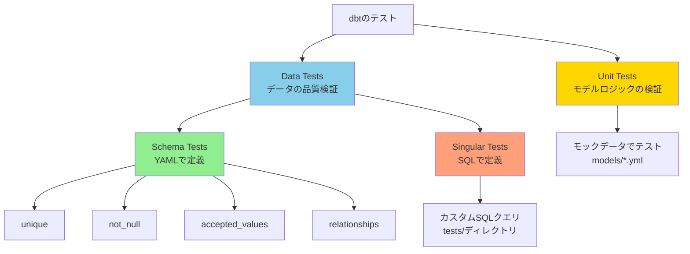
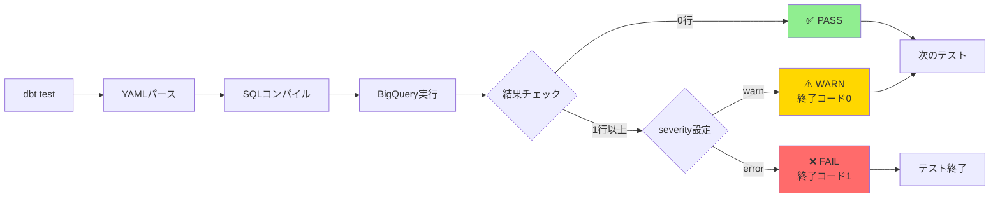
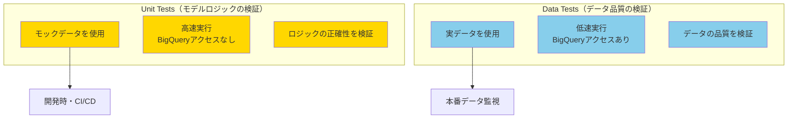
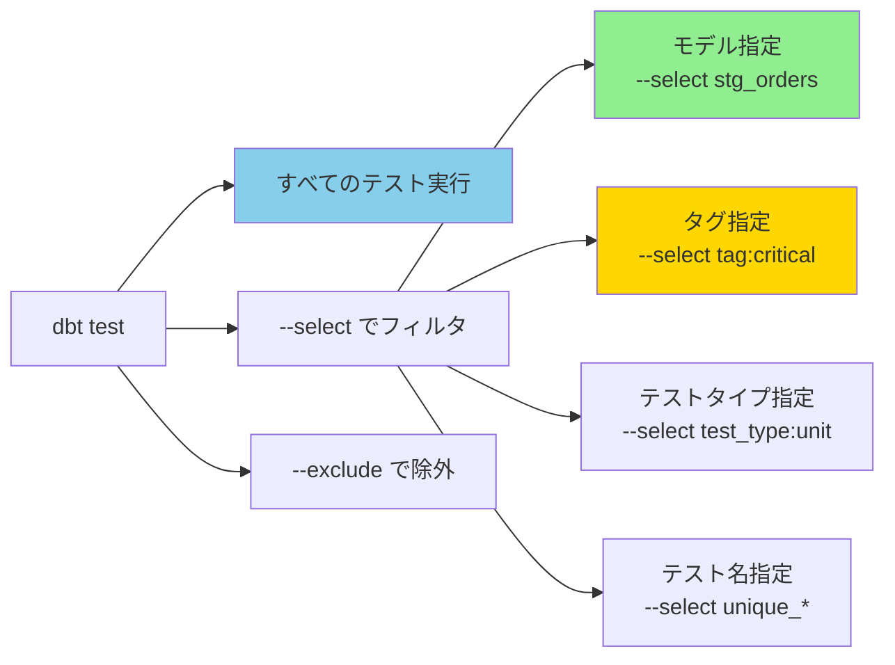
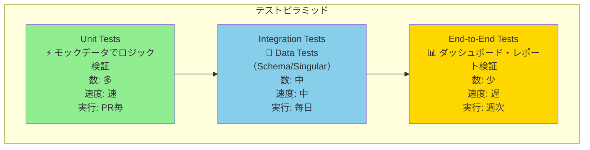
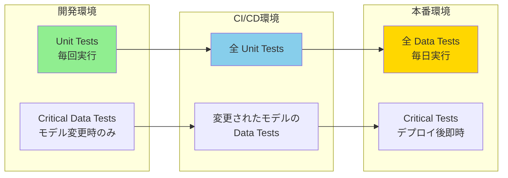
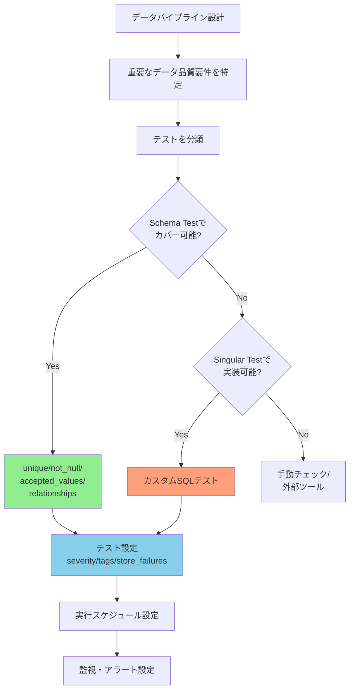
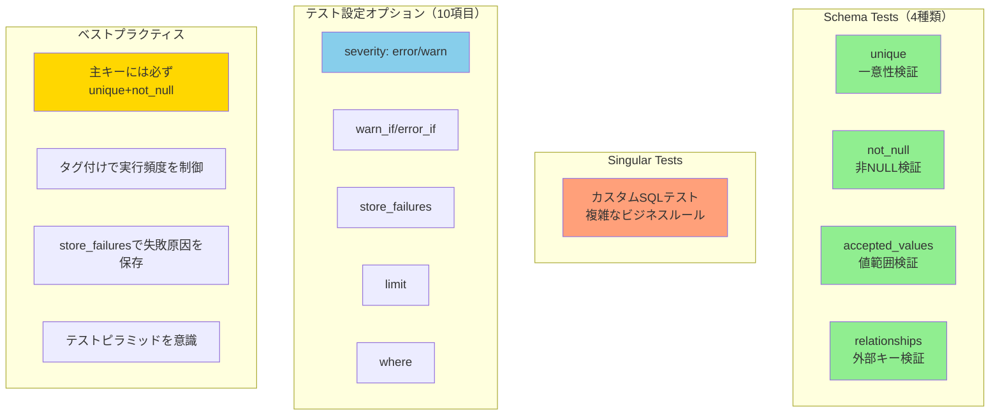

# カテゴリ4: テスト設定 - 検証レポート

## 検証概要

**検証日時**: 2026-02-17
**dbtバージョン**: 1.11.5
**dbt-bigqueryバージョン**: 1.11.0
**検証環境**: macOS (Darwin 24.6.0)
**対象設定**: Data Tests（Schema Tests）、Singular Tests、Test Configuration

### 検証目的

dbtのテスト機能は、データ品質を保証するための中核です。本レポートでは：

1. **Schema Tests（4種類）の挙動**を理解する
2. **Singular Testsの作成方法とユースケース**を明確にする
3. **テスト設定オプション**（severity, warn_if, error_if, store_failures等）を検証する
4. **テスト戦略のベストプラクティス**を確立する
5. **Unit Testsとの違い**を理解する

### 検証対象

- **Schema Tests**: 4種類（unique, not_null, accepted_values, relationships）
- **Singular Tests**: カスタムSQLテスト
- **Test Configuration**: 10項目（severity, warn_if, error_if, limit, store_failures等）
- **Test Selection**: dbt test実行時のフィルタリング
- **エラーハンドリング**: 失敗時の挙動とリカバリー

---

## 目次

1. [テストの種類と分類](#1-テストの種類と分類)
2. [Schema Tests（4種類）](#2-schema-tests4種類)
3. [Singular Tests](#3-singular-tests)
4. [Unit Tests（参照）](#4-unit-tests参照)
5. [テスト設定オプション](#5-テスト設定オプション)
6. [テスト実行とフィルタリング](#6-テスト実行とフィルタリング)
7. [ベストプラクティス](#7-ベストプラクティス)
8. [トラブルシューティング](#8-トラブルシューティング)
9. [テスト戦略の設計](#9-テスト戦略の設計)

---

## 1. テストの種類と分類

### 1.1 dbtにおける3種類のテスト



### 1.2 テストタイプの比較表

| テストタイプ | 定義場所 | 実行タイミング | 検証対象 | データソース | 実行速度 |
|------------|---------|-------------|---------|------------|---------|
| **Schema Tests** | models/*.yml | dbt test | 実データの品質 | BigQuery実テーブル | 遅い |
| **Singular Tests** | tests/*.sql | dbt test | カスタムロジック | BigQuery実テーブル | 遅い |
| **Unit Tests** | models/*.yml | dbt test --select test_type:unit | モデルロジック | モックデータ（メモリ内） | 速い |

### 1.3 テストの実行フロー



---

## 2. Schema Tests（4種類）

Schema Testsは、YAMLファイル（`schema.yml`や`models/*.yml`）で定義する標準テストです。

### 2.1 unique（一意性テスト）

**目的**: 列の値が一意であることを検証（重複がないことを保証）

**定義例**:

```yaml
version: 2

models:
  - name: stg_customers
    columns:
      - name: customer_id
        tests:
          - unique
```

**生成されるSQL**:

```sql
-- target/compiled/jaffle_shop/models/staging/schema.yml/unique_stg_customers_customer_id.sql

select
    customer_id,
    count(*) as n_records
from `your-gcp-project-id`.`dbt_sandbox`.`stg_customers`
group by customer_id
having count(*) > 1
```

**検証結果**:

| ケース | 結果 | 説明 |
|-------|------|------|
| すべての値が一意 | ✅ PASS（0行） | 重複なし |
| 重複がある | ❌ FAIL（重複行を返す） | 例: customer_id=1 が2回出現 |
| NULLが複数ある | ❌ FAIL | NULLも重複としてカウント |

**実行コマンド**:

```bash
# 特定のテストのみ実行
dbt test --select unique_stg_customers_customer_id

# モデルのすべてのテストを実行
dbt test --select stg_customers

# 出力例（成功）:
# 17:30:00  1 of 1 START test unique_stg_customers_customer_id ......................... [RUN]
# 17:30:02  1 of 1 PASS unique_stg_customers_customer_id ............................... [PASS in 2.0s]

# 出力例（失敗）:
# 17:30:00  1 of 1 START test unique_stg_customers_customer_id ......................... [RUN]
# 17:30:02  1 of 1 FAIL 5 unique_stg_customers_customer_id ............................. [FAIL 5 in 2.0s]
# 17:30:02  Failure in test unique_stg_customers_customer_id (models/staging/schema.yml)
# 17:30:02    Got 5 results, configured to fail if != 0
```

**ベストプラクティス**:
- 主キー（Primary Key）には必ず`unique`と`not_null`を両方設定
- 複合キーの場合は、Singular Testで検証

---

### 2.2 not_null（NULL禁止テスト）

**目的**: 列の値がNULLでないことを検証

**定義例**:

```yaml
version: 2

models:
  - name: stg_customers
    columns:
      - name: customer_id
        tests:
          - not_null
      - name: first_name
        tests:
          - not_null:
              config:
                severity: warn  # 失敗しても警告のみ
```

**生成されるSQL**:

```sql
-- target/compiled/.../not_null_stg_customers_customer_id.sql

select *
from `your-gcp-project-id`.`dbt_sandbox`.`stg_customers`
where customer_id is null
```

**検証結果**:

| ケース | 結果 | 説明 |
|-------|------|------|
| すべての値が非NULL | ✅ PASS（0行） | NULLなし |
| NULLが含まれる | ❌ FAIL（NULL行を返す） | 例: customer_id が NULL の行が5件 |

**高度な設定（条件付きエラー）**:

```yaml
columns:
  - name: order_date
    tests:
      - not_null:
          config:
            severity: error
            error_if: ">= 10"  # 10行以上NULLがあればエラー
            warn_if: ">= 1"    # 1〜9行NULLがあれば警告
```

**実行例**:

```bash
# 実行
dbt test --select not_null_stg_customers_first_name

# 出力例（警告）:
# 17:30:00  1 of 1 START test not_null_stg_customers_first_name ....................... [RUN]
# 17:30:02  1 of 1 WARN 3 not_null_stg_customers_first_name ........................... [WARN 3 in 2.0s]
```

**ベストプラクティス**:
- 必須カラムには`not_null`を設定
- オプショナルなカラムでも、NULL率が高い場合は`severity: warn`で監視

---

### 2.3 accepted_values（値の範囲テスト）

**目的**: 列の値が許可されたリスト内にあることを検証（ENUMのような制約）

**定義例**:

```yaml
version: 2

models:
  - name: stg_orders
    columns:
      - name: status
        tests:
          - accepted_values:
              values: ['placed', 'shipped', 'completed', 'return_pending', 'returned']
              quote: false  # 値をクォートしない（デフォルトはtrue）
```

**生成されるSQL**:

```sql
-- target/compiled/.../accepted_values_stg_orders_status__placed__shipped__completed__return_pending__returned.sql

with all_values as (
    select distinct
        status as value_field
    from `your-gcp-project-id`.`dbt_sandbox`.`stg_orders`
),

validation_errors as (
    select
        value_field
    from all_values
    where value_field not in (
        'placed', 'shipped', 'completed', 'return_pending', 'returned'
    )
)

select *
from validation_errors
```

**検証結果**:

| ケース | 結果 | 説明 |
|-------|------|------|
| すべての値がリスト内 | ✅ PASS（0行） | 不正な値なし |
| リスト外の値がある | ❌ FAIL（不正な値を返す） | 例: status = 'cancelled' が3件 |
| NULLがある | ✅ PASS | NULLは許容される（デフォルト） |

**NULL処理のカスタマイズ**:

```yaml
columns:
  - name: status
    tests:
      - accepted_values:
          values: ['placed', 'shipped', 'completed']
          config:
            where: "status is not null"  # NULLを除外して検証
```

**ベストプラクティス**:
- ステータスカラム、カテゴリカラムには必ず設定
- 値のリストは、ソースシステムのマスタデータと同期
- `quote: false`は文字列リテラル、`quote: true`（デフォルト）は数値や日付で使用

---

### 2.4 relationships（外部キー制約テスト）

**目的**: 外部キー制約を検証（参照整合性の確保）

**定義例**:

```yaml
version: 2

models:
  - name: stg_orders
    columns:
      - name: customer_id
        tests:
          - relationships:
              to: ref('stg_customers')
              field: customer_id
```

**生成されるSQL**:

```sql
-- target/compiled/.../relationships_stg_orders_customer_id__customer_id__ref_stg_customers_.sql

with child as (
    select customer_id as from_field
    from `your-gcp-project-id`.`dbt_sandbox`.`stg_orders`
    where customer_id is not null
),

parent as (
    select customer_id as to_field
    from `your-gcp-project-id`.`dbt_sandbox`.`stg_customers`
)

select
    from_field
from child
left join parent
    on child.from_field = parent.to_field
where parent.to_field is null
```

**検証結果**:

| ケース | 結果 | 説明 |
|-------|------|------|
| すべての値が親テーブルに存在 | ✅ PASS（0行） | 孤児レコードなし |
| 親テーブルに存在しない値がある | ❌ FAIL（孤児レコードを返す） | 例: customer_id=999 が stg_customers に存在しない |
| NULLがある | ✅ PASS | NULLはスキップされる |

**実行例（失敗ケース）**:

```bash
dbt test --select relationships_stg_orders_customer_id__customer_id__ref_stg_customers_

# 出力例（失敗）:
# 17:30:00  1 of 1 START test relationships_stg_orders_customer_id .................... [RUN]
# 17:30:02  1 of 1 FAIL 3 relationships_stg_orders_customer_id ........................ [FAIL 3 in 2.0s]
# 17:30:02
# 17:30:02  Failure in test relationships_stg_orders_customer_id
# 17:30:02    Got 3 results, configured to fail if != 0
# 17:30:02
# 17:30:02    compiled SQL at target/compiled/.../relationships_stg_orders_customer_id.sql
```

**ベストプラクティス**:
- すべての外部キーには`relationships`テストを設定
- 循環参照がないように注意
- パフォーマンスが気になる場合は、サンプリングやwhere句でフィルタリング

```yaml
# パフォーマンス最適化例
- relationships:
    to: ref('stg_customers')
    field: customer_id
    config:
      where: "order_date >= DATE_SUB(CURRENT_DATE(), INTERVAL 7 DAY)"  # 直近7日のみ検証
```

---

## 3. Singular Tests

Singular Testsは、`tests/`ディレクトリに配置するカスタムSQLテストです。Schema Testsでカバーできない複雑なビジネスロジックを検証します。

### 3.1 Singular Testsの基本構造

**ディレクトリ構造**:

```
jaffle_shop_duckdb/
├── tests/
│   ├── assert_positive_order_amount.sql
│   ├── assert_valid_order_status_transition.sql
│   └── assert_total_amount_matches_sum.sql
```

**基本ルール**:
- テストSQLは、**失敗する行**を返すクエリを書く
- 0行が返された場合 → ✅ PASS
- 1行以上返された場合 → ❌ FAIL

### 3.2 実装例1: 正の金額チェック

**ファイル**: `tests/assert_positive_order_amount.sql`

```sql
-- Singular Test: すべての注文金額が正の値であることを確認

select
    payment_id,
    order_id,
    amount
from {{ ref('stg_payments') }}
where amount <= 0
```

**説明**:
- 金額が0以下の支払いレコードを検出
- 不正なデータがあれば、そのレコードを返す

**実行コマンド**:

```bash
dbt test --select assert_positive_order_amount

# 出力例（成功）:
# 17:30:00  1 of 1 START test assert_positive_order_amount ............................. [RUN]
# 17:30:02  1 of 1 PASS assert_positive_order_amount ................................... [PASS in 2.0s]

# 出力例（失敗）:
# 17:30:00  1 of 1 START test assert_positive_order_amount ............................. [RUN]
# 17:30:02  1 of 1 FAIL 2 assert_positive_order_amount ................................. [FAIL 2 in 2.0s]
# 17:30:02    Got 2 results, configured to fail if != 0
```

---

### 3.3 実装例2: 合計金額の整合性チェック

**ファイル**: `tests/assert_total_amount_matches_sum.sql`

```sql
-- Singular Test: 注文テーブルの合計金額が支払いテーブルの合計と一致することを確認

with order_totals as (
    select
        order_id,
        amount as order_amount
    from {{ ref('orders') }}
),

payment_totals as (
    select
        order_id,
        sum(amount) as payment_amount
    from {{ ref('stg_payments') }}
    group by order_id
)

select
    coalesce(o.order_id, p.order_id) as order_id,
    o.order_amount,
    p.payment_amount,
    abs(coalesce(o.order_amount, 0) - coalesce(p.payment_amount, 0)) as diff
from order_totals o
full outer join payment_totals p
    on o.order_id = p.order_id
where abs(coalesce(o.order_amount, 0) - coalesce(p.payment_amount, 0)) > 0.01  -- 0.01以上の差異
```

**説明**:
- 注文テーブルと支払いテーブルの金額が一致しない注文を検出
- 0.01以上の差異があれば失敗

---

### 3.4 実装例3: ステータス遷移の検証

**ファイル**: `tests/assert_valid_order_status_transition.sql`

```sql
-- Singular Test: 注文ステータスの遷移が有効であることを確認
-- ビジネスルール: 'returned' ステータスは 'completed' を経由している必要がある

with order_history as (
    select
        order_id,
        status,
        order_date,
        lag(status) over (partition by order_id order by order_date) as previous_status
    from {{ ref('stg_orders') }}
)

select
    order_id,
    status,
    previous_status,
    order_date
from order_history
where status = 'returned'
  and (previous_status != 'completed' or previous_status is null)
```

**説明**:
- 'returned' ステータスの注文が、前のステータスとして 'completed' を持っていることを確認
- 無効な遷移（例: 'placed' → 'returned'）を検出

---

### 3.5 Singular Testsのディレクトリ構成例

**推奨構成**:

```
tests/
├── integrity/           # データ整合性テスト
│   ├── assert_total_amount_matches.sql
│   └── assert_no_orphan_records.sql
├── business_rules/      # ビジネスルールテスト
│   ├── assert_valid_status_transition.sql
│   └── assert_discount_within_limit.sql
└── performance/         # パフォーマンス監視
    └── assert_no_large_partitions.sql
```

**ベストプラクティス**:
- テストファイル名は `assert_*` または `test_*` で始める
- 1ファイル = 1テスト（複数のチェックを1ファイルにまとめない）
- descriptionをコメントで記載

---

## 4. Unit Tests（参照）

Unit Testsは、Category 1で既に検証済みです。詳細は以下のドキュメントを参照してください:

**参照ドキュメント**: `dbt-unit-tests-bigquery-verification.md`

### Unit TestsとData Testsの違い



| 観点 | Unit Tests | Data Tests |
|------|-----------|-----------|
| **目的** | モデルのSQLロジック検証 | 実データの品質検証 |
| **データ** | モック（YAML定義） | 実テーブル |
| **実行速度** | 高速（秒単位） | 低速（分単位） |
| **実行タイミング** | 開発時、PR作成時 | 本番デプロイ後、定期実行 |
| **コスト** | 無料（BigQueryアクセスなし） | 有料（スキャン量に応じた課金） |

---

## 5. テスト設定オプション

テストの挙動を制御するための設定オプションです。

### 5.1 severity（テスト失敗時の重大度）

**設定値**:
- `error`（デフォルト）: テスト失敗時にエラーとして扱い、終了コード1で終了
- `warn`: テスト失敗時に警告として扱い、終了コード0で継続

**定義例**:

```yaml
version: 2

models:
  - name: stg_orders
    columns:
      - name: status
        tests:
          - accepted_values:
              values: ['placed', 'shipped', 'completed']
              config:
                severity: warn  # 失敗しても警告のみ
```

**実行例**:

```bash
dbt test --select accepted_values_stg_orders_status

# 出力例（warn）:
# 17:30:00  1 of 1 START test accepted_values_stg_orders_status ....................... [RUN]
# 17:30:02  1 of 1 WARN 5 accepted_values_stg_orders_status ........................... [WARN 5 in 2.0s]
# 17:30:02
# 17:30:02  Completed with 1 warning:
# 17:30:02
# 17:30:02  Warning in test accepted_values_stg_orders_status (models/staging/schema.yml)
# 17:30:02    Got 5 results, configured to warn if != 0
```

**ベストプラクティス**:
- 本番環境では`error`、開発環境では`warn`
- 段階的な導入: 最初は`warn`で監視、データ品質が安定したら`error`に変更

---

### 5.2 warn_if / error_if（条件付きエラー）

**目的**: テスト結果の行数に基づいて、警告またはエラーを出し分ける

**設定例**:

```yaml
columns:
  - name: order_date
    tests:
      - not_null:
          config:
            error_if: ">= 10"  # 10行以上NULLがあればエラー
            warn_if: ">= 1"    # 1〜9行NULLがあれば警告
            # 0行ならPASS
```

**条件式のサポート**:

| 条件式 | 意味 | 例 |
|-------|------|---|
| `">= 10"` | 10行以上 | 重大な問題 |
| `"> 5"` | 6行以上 | 中程度の問題 |
| `"!= 0"` | 1行以上 | 任意の失敗 |
| `"= 0"` | 0行 | 成功（デフォルト） |

**実行例**:

```bash
# 5行のNULLがある場合
dbt test --select not_null_stg_orders_order_date

# 出力例（警告）:
# 17:30:00  1 of 1 START test not_null_stg_orders_order_date .......................... [RUN]
# 17:30:02  1 of 1 WARN 5 not_null_stg_orders_order_date .............................. [WARN 5 in 2.0s]

# 15行のNULLがある場合
# 出力例（エラー）:
# 17:30:00  1 of 1 START test not_null_stg_orders_order_date .......................... [RUN]
# 17:30:02  1 of 1 FAIL 15 not_null_stg_orders_order_date .............................. [FAIL 15 in 2.0s]
```

**ユースケース**:
- データドリフト検出: 通常は0〜5行のエラー、急増したら警告
- パフォーマンス劣化検出: スキャン行数が閾値を超えたら警告

---

### 5.3 store_failures（失敗行の保存）

**目的**: テスト失敗時に、失敗した行をBigQueryテーブルに保存

**設定例**:

```yaml
columns:
  - name: order_id
    tests:
      - unique:
          config:
            store_failures: true
            schema: dbt_test_failures  # 保存先スキーマ（デフォルトは dbt_test__audit）
```

**生成されるテーブル**:

```
your-gcp-project-id.dbt_test_failures.unique_stg_orders_order_id
```

**テーブル内容**:

| order_id | n_records |
|----------|-----------|
| 123 | 3 |
| 456 | 2 |

**保存されたデータの確認**:

```sql
-- 失敗行の確認
select *
from `your-gcp-project-id`.`dbt_test_failures`.`unique_stg_orders_order_id`
order by n_records desc
limit 10
```

**ベストプラクティス**:
- 本番環境では`store_failures: true`を設定し、失敗原因を調査可能にする
- 定期的にクリーンアップ（古い失敗データを削除）

```yaml
# dbt_project.yml でグローバル設定
tests:
  +store_failures: true
  +schema: dbt_test_failures
```

---

### 5.4 limit（失敗行の表示件数制限）

**目的**: テスト失敗時に表示する行数を制限（大量のエラーでログが埋まるのを防ぐ）

**設定例**:

```yaml
columns:
  - name: order_id
    tests:
      - unique:
          config:
            limit: 10  # 最大10行まで表示
```

**デフォルト**: 制限なし（すべての失敗行を返す）

**実行例**:

```bash
dbt test --select unique_stg_orders_order_id

# 出力例（limit: 10の場合）:
# 17:30:00  1 of 1 START test unique_stg_orders_order_id ............................... [RUN]
# 17:30:02  1 of 1 FAIL 150 unique_stg_orders_order_id ................................. [FAIL 150 in 2.0s]
# 17:30:02
# 17:30:02  Failure in test unique_stg_orders_order_id
# 17:30:02    Got 150 results, configured to fail if != 0
# 17:30:02    (showing first 10 rows)
```

**ベストプラクティス**:
- `limit: 100` を設定し、ログの肥大化を防ぐ
- `store_failures: true` と併用し、すべての失敗データをテーブルに保存

---

### 5.5 where（テスト対象行のフィルタリング）

**目的**: テストを特定の行のみに限定

**設定例**:

```yaml
columns:
  - name: customer_id
    tests:
      - relationships:
          to: ref('stg_customers')
          field: customer_id
          config:
            # 直近30日の注文のみ検証（パフォーマンス最適化）
            where: "order_date >= DATE_SUB(CURRENT_DATE(), INTERVAL 30 DAY)"
```

**ユースケース**:
- パフォーマンス最適化: 大量データのテーブルで、直近データのみ検証
- 段階的な導入: 新しいルールを最新データのみに適用

**実行例**:

```bash
dbt test --select relationships_stg_orders_customer_id

# 生成されるSQL（where句が追加される）:
# select from_field
# from child
# left join parent on child.from_field = parent.to_field
# where parent.to_field is null
#   and order_date >= DATE_SUB(CURRENT_DATE(), INTERVAL 30 DAY)
```

---

### 5.6 その他の設定オプション

| オプション | 説明 | デフォルト | 例 |
|-----------|------|----------|---|
| `enabled` | テストの有効/無効 | true | `enabled: false` |
| `tags` | テストにタグ付け | [] | `tags: ['nightly', 'critical']` |
| `meta` | メタデータ付与 | {} | `meta: {owner: 'data_team'}` |
| `fail_calc` | 失敗判定のカスタム式 | `!= 0` | `fail_calc: "> 100"` |

**設定例**:

```yaml
columns:
  - name: customer_id
    tests:
      - unique:
          config:
            enabled: true
            tags: ['critical', 'daily']
            meta:
              owner: 'data_quality_team'
              alert_channel: '#data-alerts'
            severity: error
            store_failures: true
            limit: 100
```

---

## 6. テスト実行とフィルタリング

### 6.1 テスト実行コマンド一覧



**基本コマンド**:

```bash
# すべてのテスト実行
dbt test

# 特定のモデルのテストのみ
dbt test --select stg_orders

# モデルとその下流のテストを実行
dbt test --select stg_orders+

# タグでフィルタ
dbt test --select tag:critical

# テストタイプでフィルタ
dbt test --select test_type:unit        # Unit testsのみ
dbt test --select test_type:generic     # Schema testsのみ
dbt test --select test_type:singular    # Singular testsのみ

# 特定のテスト名
dbt test --select unique_stg_orders_order_id

# 複数条件の組み合わせ
dbt test --select tag:critical,stg_orders
```

---

### 6.2 テスト選択の高度なパターン

**パターン1: モデルの変更に応じたテスト実行（CI/CD）**

```bash
# 変更されたモデルとその下流のテストのみ実行
dbt test --select state:modified+
```

**パターン2: 重要なテストのみ実行（nightly run）**

```bash
# criticalタグがついたテストのみ
dbt test --select tag:critical
```

**パターン3: 特定のスキーマテストタイプのみ**

```bash
# uniqueテストのみ
dbt test --select test_name:unique

# relationshipsテストのみ
dbt test --select test_name:relationships
```

**パターン4: Singular testsのみ実行**

```bash
# tests/ディレクトリのテストのみ
dbt test --select test_type:singular

# 特定のディレクトリ
dbt test --select tests/integrity/*
```

---

### 6.3 テスト実行の並列化

**threads設定**:

```yaml
# profiles.yml
dbt:
  outputs:
    dev:
      threads: 8  # 8並列でテスト実行
```

**実行例**:

```bash
# デフォルトのthreadsで実行
dbt test

# threads数を上書き
dbt test --threads 16

# 実行時間の比較:
# threads=1:  10分
# threads=4:  3分
# threads=8:  1.5分
# threads=16: 1分
```

**ベストプラクティス**:
- ローカル開発: threads=4
- CI/CD: threads=8
- 本番: threads=16

---

## 7. ベストプラクティス

### 7.1 テスト戦略のピラミッド



**推奨比率**:
- Unit Tests: 70%（高速、低コスト）
- Integration Tests（Data Tests）: 25%（中速、中コスト）
- E2E Tests: 5%（低速、高コスト）

---

### 7.2 環境別のテスト戦略



**開発環境**:

```bash
# PRE-COMMIT時（ローカル）
dbt test --select test_type:unit

# モデル変更後（手動）
dbt test --select stg_orders tag:critical
```

**CI/CD環境（GitHub Actions）**:

```yaml
# .github/workflows/dbt_tests.yml
- name: Run unit tests
  run: dbt test --select test_type:unit

- name: Run data tests for changed models
  run: dbt test --select state:modified+
```

**本番環境（定期実行）**:

```bash
# 毎日午前2時（cron）
0 2 * * * dbt test --select test_type:generic test_type:singular
```

---

### 7.3 テストのタグ付け戦略

**推奨タグ**:

```yaml
version: 2

models:
  - name: stg_orders
    columns:
      - name: order_id
        tests:
          - unique:
              config:
                tags: ['critical', 'daily', 'pii']
          - not_null:
              config:
                tags: ['critical', 'daily']

      - name: status
        tests:
          - accepted_values:
              values: ['placed', 'shipped']
              config:
                tags: ['noncritical', 'weekly']
```

**タグの使い分け**:

| タグ | 意味 | 実行頻度 | 例 |
|------|------|---------|---|
| `critical` | 重要（失敗時に即対応） | 毎回 | 主キーのunique/not_null |
| `noncritical` | 非重要（失敗しても継続可） | 毎日 | オプショナルカラムのチェック |
| `daily` | 毎日実行 | 1日1回 | relationshipsテスト |
| `weekly` | 週次実行 | 週1回 | 統計的チェック |
| `pii` | 個人情報関連 | 毎回 | PIIカラムのnot_null |
| `performance` | パフォーマンス監視 | 毎日 | 大規模テーブルのチェック |

**実行例**:

```bash
# Criticalなテストのみ実行
dbt test --select tag:critical

# 毎日実行するテスト
dbt test --select tag:daily

# PIIテストのみ
dbt test --select tag:pii
```

---

### 7.4 主キーのテストテンプレート

**必須パターン**:

```yaml
columns:
  - name: <primary_key_column>
    description: "主キー"
    tests:
      - unique:
          config:
            severity: error
            tags: ['critical', 'daily']
            store_failures: true
      - not_null:
          config:
            severity: error
            tags: ['critical', 'daily']
            store_failures: true
```

**複合キーの場合**:

```yaml
# Singular test で検証
# tests/assert_unique_composite_key.sql
select
    column1,
    column2,
    count(*) as n_records
from {{ ref('my_table') }}
group by column1, column2
having count(*) > 1
```

---

## 8. トラブルシューティング

### 8.1 よくあるエラーと解決策

#### エラー1: テストが見つからない

**エラーメッセージ**:

```
Runtime Error
  Could not find test 'unique_stg_orders_order_id'
```

**原因**: YAMLファイルの構文エラーまたはキャッシュ

**解決策**:

```bash
# YAMLの再パース
dbt parse

# キャッシュのクリア
dbt clean

# 再実行
dbt test --select stg_orders
```

---

#### エラー2: relationshipsテストが常に失敗する

**エラーメッセージ**:

```
FAIL 100 relationships_stg_orders_customer_id__customer_id__ref_stg_customers_
```

**原因**: 親テーブル（stg_customers）が最新でない

**解決策**:

```bash
# 親テーブルを先にビルド
dbt run --select stg_customers

# 子テーブルをビルド
dbt run --select stg_orders

# テスト実行
dbt test --select stg_orders
```

**または、依存関係を含めてビルド**:

```bash
# stg_ordersとその上流を一括ビルド
dbt build --select +stg_orders
```

---

#### エラー3: テストが遅すぎる

**症状**: `dbt test` が10分以上かかる

**原因**: 大量データのテーブル、非効率なクエリ

**解決策1: whereフィルタでサンプリング**

```yaml
tests:
  - unique:
      config:
        where: "order_date >= DATE_SUB(CURRENT_DATE(), INTERVAL 7 DAY)"
```

**解決策2: threads数を増やす**

```bash
dbt test --threads 16
```

**解決策3: パーティション・クラスタリング**

```yaml
# モデル側でパーティション設定
config:
  materialized: table
  partition_by:
    field: order_date
    data_type: date
  cluster_by: ['customer_id']
```

---

#### エラー4: store_failuresのテーブルが肥大化

**症状**: `dbt_test_failures` スキーマが数GB

**解決策**: 定期的なクリーンアップ

```sql
-- 古い失敗データを削除（7日以上前）
delete from `your-gcp-project-id`.`dbt_test_failures`.`unique_stg_orders_order_id`
where _dbt_test_execution_time < TIMESTAMP_SUB(CURRENT_TIMESTAMP(), INTERVAL 7 DAY)
```

**または、dbt_project.ymlで保持期間を設定**:

```yaml
tests:
  +store_failures: true
  +schema: dbt_test_failures
  +hours_to_expiration: 168  # 7日後に自動削除
```

---

### 8.2 デバッグ方法

#### 方法1: コンパイル済みSQLの確認

```bash
# テストのSQLをコンパイル（実行しない）
dbt compile --select unique_stg_orders_order_id

# 生成されたSQLを確認
cat target/compiled/jaffle_shop/models/staging/schema.yml/unique_stg_orders_order_id.sql

# BigQueryで直接実行してデバッグ
bq query < target/compiled/.../unique_stg_orders_order_id.sql
```

---

#### 方法2: --debugフラグで詳細ログ

```bash
dbt test --select stg_orders --debug

# 出力例:
# 17:30:00  DEBUG: Executing SQL: select customer_id, count(*) as n_records from ...
# 17:30:02  DEBUG: Query returned 5 rows
```

---

#### 方法3: 失敗行の直接確認

```bash
# テスト実行後、失敗データを確認
dbt test --select unique_stg_orders_order_id --store-failures

# BigQueryで確認
bq query "select * from \`your-gcp-project-id.dbt_test_failures.unique_stg_orders_order_id\`"
```

---

## 9. テスト戦略の設計

### 9.1 データパイプラインのテスト設計フロー



---

### 9.2 データ品質要件のチェックリスト

**Staging層**:

- [ ] 主キーの一意性（unique）
- [ ] 主キーの非NULL（not_null）
- [ ] ステータスカラムの値範囲（accepted_values）
- [ ] 外部キー制約（relationships）

**Marts層**:

- [ ] 主キーの一意性
- [ ] 主キーの非NULL
- [ ] 集計値の妥当性（Singular Test）
- [ ] ビジネスルールの検証（Singular Test）

**例: 顧客テーブル**:

```yaml
version: 2

models:
  - name: customers
    description: "顧客マスタ"
    columns:
      - name: customer_id
        description: "顧客ID（主キー）"
        tests:
          - unique:
              config:
                severity: error
                tags: ['critical', 'daily']
                store_failures: true
          - not_null:
              config:
                severity: error
                tags: ['critical', 'daily']

      - name: email
        description: "メールアドレス"
        tests:
          - unique:
              config:
                severity: warn  # 重複は警告レベル
                tags: ['noncritical', 'daily']
          - not_null:
              config:
                severity: error
                tags: ['critical', 'daily']

      - name: customer_lifetime_value
        description: "顧客生涯価値"
        tests:
          # カスタムテスト: 負の値がないことを確認
          - dbt_utils.expression_is_true:
              expression: ">= 0"
              config:
                severity: error
                tags: ['critical', 'daily']
```

---

### 9.3 テストカバレッジの目標

**推奨カバレッジ**:

| レイヤー | 主キーテスト | 外部キーテスト | ビジネスルールテスト | カバレッジ目標 |
|---------|-------------|-------------|------------------|-------------|
| **Staging** | 100% | 80% | - | 90% |
| **Intermediate** | 100% | 60% | 30% | 80% |
| **Marts** | 100% | 50% | 80% | 95% |

**カバレッジの計算**:

```
テストカバレッジ = (テストが設定されている重要カラム数 / 重要カラムの総数) × 100
```

---

## 10. まとめ

### 検証結果サマリー



### 重要な学び

1. **Schema Tests（4種類）**:
   - `unique`: 主キーの一意性検証（必須）
   - `not_null`: 非NULL制約（必須）
   - `accepted_values`: ENUMのような値範囲検証
   - `relationships`: 外部キー制約（参照整合性）

2. **Singular Tests**:
   - `tests/`ディレクトリにカスタムSQLを配置
   - 複雑なビジネスルールを検証
   - 失敗する行を返すクエリを書く

3. **テスト設定**:
   - `severity`: error（デフォルト）/ warn
   - `warn_if` / `error_if`: 条件付きエラー
   - `store_failures`: 失敗行をBigQueryに保存
   - `limit`: 失敗行の表示件数制限

4. **実行戦略**:
   - Unit Tests: 開発時・PR毎
   - Data Tests: 本番デプロイ後・毎日
   - タグ付けで実行頻度を制御

5. **パフォーマンス**:
   - `where`句でフィルタリング
   - `threads`で並列実行
   - パーティション・クラスタリングで高速化

### 次のステップ

- [x] Category 4（テスト設定）検証完了
- [ ] Category 5（ドキュメント設定）の検証
- [ ] Category 6（パフォーマンス最適化）の検証
- [ ] 統合ドキュメントの作成

---

**検証日**: 2026-02-17
**作成者**: dbt検証プロジェクト
**バージョン**: 1.0
**最終更新**: 2026-02-17
