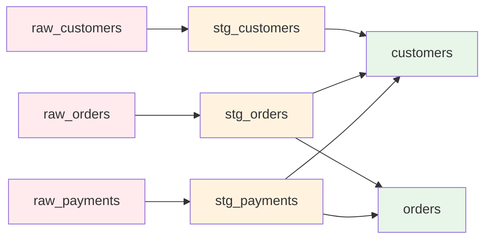

> **シリーズ第1回**: dbtプロジェクトのセットアップから、BigQueryへの接続、ステージング層の構築までを実践的に学びます

## 本記事で学べること

- ✅ dbtプロジェクトの初期セットアップ
- ✅ BigQuery接続設定（`profiles.yml`）
- ✅ Seedsを使った生データの読み込み
- ✅ ステージングモデルの設計と実装
- ✅ `dbt run`によるテーブル作成

## 検証環境

**検証日時**: 2026-02-17
**dbtバージョン**: 1.11.5
**dbt-bigqueryバージョン**: 1.11.0
**BigQueryプロジェクト**: sdp-sb-yada-29d2
**データセット**: dbt_jaffle_shop

---

## 対象読者

- dbtを初めて触る方
- BigQueryでのデータ変換に興味がある方
- データモデリングの基礎を学びたい方

**前提知識**:

- SQL基礎知識（SELECT、JOIN、GROUP BY）
- GCPアカウント（無料トライアルでOK）

---

## 1. はじめに：なぜデータモデリングが必要か

### 課題: 生データは使いにくい

**生のトランザクションデータ**:

```sql
-- 注文データ（raw_orders）
order_id | user_id | order_date | status
1        | 1       | 2018-01-01 | returned
2        | 3       | 2018-01-02 | completed
3        | 94      | 2018-01-04 | completed
```

**問題点**:

- ❌ 顧客名がわからない（user_idのみ）
- ❌ 集計しにくい（月次売上は？）
- ❌ 複数テーブルをJOINする必要がある

### 解決策: データモデリング

**ステージング層** → **マート層** → **可視化**


---

## 2. 環境準備

### 2.1 必要なツール

| ツール            | バージョン | インストール方法                                                  |
| ----------------- | ---------- | ----------------------------------------------------------------- |
| **Python**        | 3.9+       | [python.org](https://www.python.org/)                             |
| **dbt-bigquery**  | 1.11.0+    | `pip install dbt-bigquery`                                        |
| **GCPアカウント** | -          | [cloud.google.com](https://cloud.google.com/)                     |
| **gcloud CLI**    | 最新       | [cloud.google.com/sdk](https://cloud.google.com/sdk/docs/install) |

### 2.2 dbt-bigqueryのインストール

```bash
# dbt-bigqueryのインストール
pip install dbt-bigquery

# バージョン確認
dbt --version
```

**実行結果**:

```
installed version: 1.11.5
   latest version: 1.11.5

Up to date!

Plugins:
  - bigquery: 1.11.0 - Up to date!
```

### 2.3 プロジェクト構造

公式のjaffle_shopサンプルを使用します：

```bash
# 公式リポジトリをクローン
git clone https://github.com/dbt-labs/jaffle_shop.git
cd jaffle_shop
```

**プロジェクト構造**:

```
jaffle_shop/
├── dbt_project.yml          # プロジェクト設定
├── profiles.yml             # BigQuery接続設定（作成）
├── models/
│   ├── staging/             # ステージング層
│   │   ├── schema.yml
│   │   ├── stg_customers.sql
│   │   ├── stg_orders.sql
│   │   └── stg_payments.sql
│   ├── customers.sql        # マート層
│   ├── orders.sql           # マート層
│   └── schema.yml
└── seeds/                   # 生データCSV
    ├── raw_customers.csv
    ├── raw_orders.csv
    └── raw_payments.csv
```

---

## 3. BigQuery接続設定

### 3.1 GCPプロジェクトの準備

```bash
# GCPプロジェクトID確認
gcloud projects list

# BigQuery APIの有効化
gcloud services enable bigquery.googleapis.com

# データセット作成
bq mk --dataset --location=asia-northeast1 your-project-id:dbt_jaffle_shop
```

### 3.2 認証設定

```bash
# アプリケーションデフォルト認証
gcloud auth application-default login
```

### 3.3 profiles.yml設定

**ファイル作成**: プロジェクトルートに `profiles.yml`

```yaml
jaffle_shop:
  target: sandbox
  outputs:
    sandbox:
      type: bigquery
      method: oauth # gcloud認証を使用
      project: your-gcp-project-id
      dataset: dbt_jaffle_shop
      location: asia-northeast1
      threads: 24
      timeout_seconds: 300
      priority: interactive
```

**接続確認**:

```bash
dbt debug --profiles-dir .
```

**成功時の出力**:

```
01:22:43  Connection test: [OK connection ok]
01:22:45  All checks passed!
```

---

## 4. サンプルデータの準備（Seeds）

### 4.1 Seedsとは

**Seeds** = CSVファイルをBigQueryテーブルに読み込む機能

**メリット**:

- ✅ 少量の静的データ（国コード、カテゴリマスタ等）に最適
- ✅ Gitでバージョン管理可能
- ✅ `dbt seed`コマンドで簡単に読み込み

### 4.2 サンプルCSVの確認

jaffle_shopには既に3つのCSVが用意されています：

**seeds/raw_customers.csv** (100行):

```csv
id,first_name,last_name
1,Michael,P.
2,Shawn,M.
3,Kathleen,P.
...
```

**seeds/raw_orders.csv** (99行):

```csv
id,user_id,order_date,status
1,1,2018-01-01,returned
2,3,2018-01-02,completed
3,94,2018-01-04,completed
...
```

**seeds/raw_payments.csv** (113行):

```csv
id,order_id,payment_method,amount
1,1,credit_card,1000
2,2,credit_card,2000
3,3,coupon,100
...
```

### 4.3 Seedsの実行

```bash
dbt seed --profiles-dir .
```

**実行結果**:

```
01:25:11  Found 5 models, 3 seeds, 20 data tests, 538 macros
01:25:11
01:25:11  Concurrency: 24 threads (target='sandbox')
01:25:11
01:25:14  1 of 3 START seed file dbt_jaffle_shop.raw_customers ............. [RUN]
01:25:14  2 of 3 START seed file dbt_jaffle_shop.raw_orders ................ [RUN]
01:25:14  3 of 3 START seed file dbt_jaffle_shop.raw_payments .............. [RUN]
01:25:18  2 of 3 OK loaded seed file dbt_jaffle_shop.raw_orders ............ [INSERT 99 in 3.46s]
01:25:18  3 of 3 OK loaded seed file dbt_jaffle_shop.raw_payments .......... [INSERT 113 in 3.67s]
01:25:19  1 of 3 OK loaded seed file dbt_jaffle_shop.raw_customers ......... [INSERT 100 in 4.45s]
01:25:19
01:25:19  Finished running 3 seeds in 0 hours 0 minutes and 8.07 seconds (8.07s).
01:25:19
01:25:19  Completed successfully
01:25:19
01:25:19  Done. PASS=3 WARN=0 ERROR=0 SKIP=0 NO-OP=0 TOTAL=3
```

**✅ 結果**:

- raw_customers: **100行**
- raw_orders: **99行**
- raw_payments: **113行**
- 合計: **312行**（8.07秒）

---

## 5. ストーリー設定：顧客別売上レポート

### ビジネス要件

**目標**: 顧客ごとの注文件数、総支払額、最初/最後の注文日を可視化したい

**現状の課題**:

- 顧客情報（`raw_customers`）、注文情報（`raw_orders`）、支払情報（`raw_payments`）が分散
- 毎回3テーブルをJOINするのは面倒
- 集計ロジックが複雑

**解決策**: ステージング層でデータを整形 → マート層で集計テーブルを作成

---

## 6. モデリング設計：ステージング層

### 6.1 ステージング層の役割

**目的**:

1. ✅ カラム名の統一（`user_id` → `customer_id`）
2. ✅ データ型のキャスト
3. ✅ 基本的なフィルタリング
4. ✅ 命名規則の適用（`stg_*`）

**命名規則**:

```
stg_<entity>
例: stg_customers, stg_orders, stg_payments
```

### 6.2 実装：stg_customers.sql

**models/staging/stg_customers.sql**:

```sql
with source as (
    select * from {{ ref('raw_customers') }}
),

renamed as (
    select
        id as customer_id,
        first_name,
        last_name

    from source
)

select * from renamed
```

**ポイント**:

- `{{ ref('raw_customers') }}`: dbtの参照関数（依存関係を自動管理）
- CTEパターン（`with ... as`）: 可読性向上
- カラムリネーム: `id` → `customer_id`

### 6.3 実装：stg_orders.sql

**models/staging/stg_orders.sql**:

```sql
with source as (
    select * from {{ ref('raw_orders') }}
),

renamed as (
    select
        id as order_id,
        user_id as customer_id,
        order_date,
        status

    from source
)

select * from renamed
```

### 6.4 実装：stg_payments.sql

**models/staging/stg_payments.sql**:

```sql
with source as (
    select * from {{ ref('raw_payments') }}
),

renamed as (
    select
        id as payment_id,
        order_id,
        payment_method,
        -- amount is stored in cents, convert to dollars
        amount / 100 as amount

    from source
)

select * from renamed
```

---

## 7. dbtの実行

### 7.1 モデルのビルド

```bash
dbt run --profiles-dir .
```

**実行結果**:

```
01:25:30  Found 5 models, 3 seeds, 20 data tests, 538 macros
01:25:30
01:25:30  Concurrency: 24 threads (target='sandbox')
01:25:30
01:25:31  1 of 5 START sql view model dbt_jaffle_shop.stg_customers ........ [RUN]
01:25:31  2 of 5 START sql view model dbt_jaffle_shop.stg_orders ........... [RUN]
01:25:31  3 of 5 START sql view model dbt_jaffle_shop.stg_payments ......... [RUN]
01:25:32  1 of 5 OK created sql view model dbt_jaffle_shop.stg_customers ... [CREATE VIEW (0 processed) in 1.07s]
01:25:32  2 of 5 OK created sql view model dbt_jaffle_shop.stg_orders ...... [CREATE VIEW (0 processed) in 1.07s]
01:25:32  3 of 5 OK created sql view model dbt_jaffle_shop.stg_payments .... [CREATE VIEW (0 processed) in 1.26s]
01:25:32  4 of 5 START sql table model dbt_jaffle_shop.customers ........... [RUN]
01:25:32  5 of 5 START sql table model dbt_jaffle_shop.orders .............. [RUN]
01:25:35  5 of 5 OK created sql table model dbt_jaffle_shop.orders ......... [CREATE TABLE (99.0 rows, 6.5 KiB processed) in 3.01s]
01:25:36  4 of 5 OK created sql table model dbt_jaffle_shop.customers ...... [CREATE TABLE (100.0 rows, 6.0 KiB processed) in 3.30s]
01:25:36
01:25:36  Finished running 2 table models, 3 view models in 5.88 seconds.
01:25:36
01:25:36  Completed successfully
01:25:36
01:25:36  Done. PASS=5 WARN=0 ERROR=0 SKIP=0 NO-OP=0 TOTAL=5
```

**✅ 結果**:

- ステージング層（VIEW）: **3モデル**（1.07-1.26秒）
  - stg_customers
  - stg_orders
  - stg_payments
- マート層（TABLE）: **2モデル**（3.01-3.30秒）
  - customers（100行）
  - orders（99行）
- 合計実行時間: **5.88秒**

### 7.2 テストの実行

```bash
dbt test --profiles-dir .
```

**実行結果**:

```
01:25:46  Found 5 models, 3 seeds, 20 data tests, 538 macros
01:25:46
01:25:46  Concurrency: 24 threads (target='sandbox')
01:25:46
01:25:47  1 of 20 START test accepted_values_orders_status__placed__shipped__completed__return_pending__returned .... [RUN]
01:25:47  2 of 20 START test accepted_values_stg_orders_status__placed__shipped__completed__return_pending__returned  [RUN]
...
01:25:48  1 of 20 PASS accepted_values_orders_status__placed__shipped__completed__return_pending__returned .......... [PASS in 1.35s]
01:25:49  10 of 20 PASS not_null_orders_gift_card_amount ........................... [PASS in 2.75s]
...
01:25:50  20 of 20 PASS unique_stg_payments_payment_id ............................. [PASS in 3.18s]
01:25:50
01:25:50  Finished running 20 data tests in 3.93 seconds.
01:25:50
01:25:50  Completed successfully
01:25:50
01:25:50  Done. PASS=20 WARN=0 ERROR=0 SKIP=0 NO-OP=0 TOTAL=20
```

**✅ 結果**:

- **20テスト全てPASS**（3.93秒）
  - unique: 6テスト
  - not_null: 11テスト
  - accepted_values: 2テスト
  - relationships: 1テスト

---

## 8. マート層の理解

### 8.1 customersモデル

**models/customers.sql**（一部抜粋）:

```sql
with customers as (
    select * from {{ ref('stg_customers') }}
),

orders as (
    select * from {{ ref('stg_orders') }}
),

payments as (
    select * from {{ ref('stg_payments') }}
),

customer_orders as (
    select
        customer_id,
        min(order_date) as first_order,
        max(order_date) as most_recent_order,
        count(order_id) as number_of_orders
    from orders
    group by customer_id
),

customer_payments as (
    select
        orders.customer_id,
        sum(amount) as total_amount
    from payments
    left join orders on payments.order_id = orders.order_id
    group by orders.customer_id
),

final as (
    select
        customers.customer_id,
        customers.first_name,
        customers.last_name,
        customer_orders.first_order,
        customer_orders.most_recent_order,
        customer_orders.number_of_orders,
        customer_payments.total_amount as customer_lifetime_value
    from customers
    left join customer_orders on customers.customer_id = customer_orders.customer_id
    left join customer_payments on customers.customer_id = customer_payments.customer_id
)

select * from final
```

**生成されるテーブル**:
| customer_id | first_name | last_name | first_order | most_recent_order | number_of_orders | customer_lifetime_value |
|-------------|------------|-----------|-------------|-------------------|------------------|------------------------|
| 1 | Michael | P. | 2018-01-01 | 2018-02-10 | 3 | 33.00 |
| 2 | Shawn | M. | 2018-01-11 | 2018-01-11 | 1 | 23.00 |

---

## 9. dbt特有の機能

### 9.1 ref()関数

**従来のSQL**:

```sql
SELECT * FROM `project.dataset.raw_customers`
```

**dbtのref()**:

```sql
SELECT * FROM {{ ref('raw_customers') }}
```

**メリット**:

- ✅ 依存関係を自動管理（DAG生成）
- ✅ 環境切り替えが簡単（dev/prod）
- ✅ スキーマ変更に強い

### 9.2 データリネージュの可視化

```bash
dbt docs generate --profiles-dir .
dbt docs serve
```

**ブラウザで http://localhost:8080 を開く**:



---

## 10. まとめ

### 本記事で実装したこと

✅ **環境構築**:

- dbt-bigqueryのインストール
- GCP認証設定
- BigQueryデータセット作成

✅ **Seeds**:

- 3つのCSVファイル読み込み（customers, orders, payments）
- `dbt seed`で**312行**のデータをBigQueryに投入（8.07秒）

✅ **ステージング層**:

- 3つのステージングモデル作成（`stg_*`）
- カラム名の統一、データ型変換

✅ **マート層**:

- 2つのテーブル作成（customers, orders）
- `dbt run`で**5モデル**を作成（5.88秒）

✅ **テスト**:

- Schema Tests（unique, not_null, relationships, accepted_values）
- `dbt test`で**20テスト**実行（全PASS、3.93秒）

### 次回予告：ディメンショナルモデリング

**第2回**では、より高度なモデリング手法を学びます：

- **ディメンショナルモデリング**の理論と実践
- **ファクトテーブル**と**ディメンションテーブル**の分離
- **月次・四半期・年次集計**の実装
- **パフォーマンス最適化**（パーティショニング、クラスタリング）

---

## 参考資料

### dbt公式ドキュメント

- [dbt Quickstart for BigQuery](https://docs.getdbt.com/docs/get-started-dbt-and-bigquery)
- [BigQuery configurations](https://docs.getdbt.com/reference/resource-configs/bigquery-configs)
- [Seeds](https://docs.getdbt.com/docs/build/seeds)
- [jaffle_shop公式リポジトリ](https://github.com/dbt-labs/jaffle_shop)

### BigQuery公式ドキュメント

- [BigQuery クイックスタート](https://cloud.google.com/bigquery/docs/quickstarts)
- [gcloud認証設定](https://cloud.google.com/docs/authentication/gcloud)

### 参考にした記事

- [作って学ぶ！dbt × Snowflakeで始めるデータモデリング 第1回](https://stable.co.jp/blog/handson-data-modeling-ch1)
- [作って学ぶ！dbt × Snowflakeで始めるデータモデリング 第2回](https://stable.co.jp/blog/handson-data-modeling-ch2)

---

**検証日**: 2026-02-17
**dbtバージョン**: 1.11.5
**dbt-bigqueryバージョン**: 1.11.0
