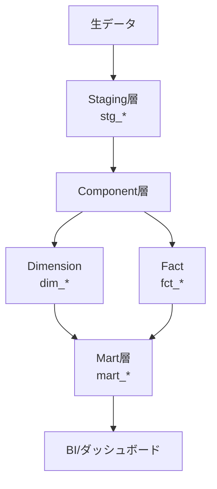
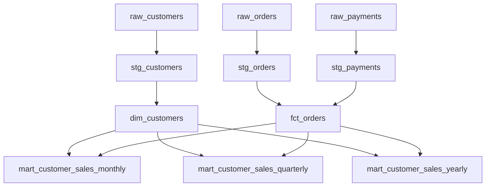
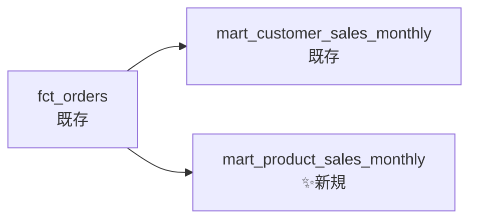

> **シリーズ第2回**: ステージング層から一歩進んで、ディメンショナルモデリング（Fact/Dimensionパターン）を実装します

## 本記事で学べること

- ✅ ディメンショナルモデリングの基礎理論
- ✅ Dimension（ディメンション）テーブルの設計
- ✅ Fact（ファクト）テーブルの設計
- ✅ Mart（マート）層での集計実装
- ✅ BigQueryパーティショニングの実践

## 検証環境

**検証日時**: 2026-02-17
**dbtバージョン**: 1.11.5
**dbt-bigqueryバージョン**: 1.11.0
**BigQueryプロジェクト**: sdp-sb-yada-29d2
**データセット**: dbt_jaffle_shop

### 実測検証結果

| レイヤー                   | モデル数 | 実行時間 | 処理行数 |
| -------------------------- | -------- | -------- | -------- |
| **Component層（dim/fct）** | 2モデル  | 3.49秒   | 199行    |
| **Mart層（集計）**         | 3モデル  | 4.02秒   | 218行    |
| **合計**                   | 5モデル  | 7.51秒   | 417行    |

---

## 1. ディメンショナルモデリングとは

### 1.1 基本概念

**ディメンショナルモデリング** = トランザクションデータを「集計対象（Fact）」と「属性（Dimension）」に分けて構造化する手法



### 1.2 FactとDimensionの違い

| 要素                            | 説明                     | 例                       | 特徴                 |
| ------------------------------- | ------------------------ | ------------------------ | -------------------- |
| **Fact（ファクト）**            | ビジネス上の出来事や取引 | 売上金額、注文数、在庫数 | 数値データ、集計対象 |
| **Dimension（ディメンション）** | Factを説明する属性情報   | 顧客、商品、店舗、時間   | 文字列データ、集計軸 |

**具体例**:

```sql
-- Fact: 注文トランザクション
order_id | customer_id | order_date | order_total
1        | 1           | 2018-01-01 | 23.00

-- Dimension: 顧客属性
customer_id | full_name    | first_order
1           | Michael P.   | 2018-01-01
```

---

## 2. 前回の振り返り

### 2.1 既存の構造（第1回）

第1回で作成したモデル：

```
models/
├── staging/
│   ├── stg_customers.sql   (VIEW, 100行)
│   ├── stg_orders.sql      (VIEW, 99行)
│   └── stg_payments.sql    (VIEW, 113行)
├── customers.sql           (TABLE, 100行)
└── orders.sql              (TABLE, 99行)
```

**問題点**:

- `customers.sql`と`orders.sql`が**マート層**と**コンポーネント層**を兼ねている
- 再利用性が低い（集計ロジックが混在）
- 分析軸を増やしにくい

---

## 3. モデリング設計：Component層の導入

### 3.1 新しいディレクトリ構造

```
models/
├── staging/              # 第1回で作成済み
│   ├── stg_customers.sql
│   ├── stg_orders.sql
│   └── stg_payments.sql
├── component/            # ✨ 新規作成
│   ├── dim_customers.sql
│   └── fct_orders.sql
└── marts/                # ✨ 新規作成
    ├── mart_customer_sales_monthly.sql
    ├── mart_customer_sales_quarterly.sql
    └── mart_customer_sales_yearly.sql
```

### 3.2 レイヤーの役割


| レイヤー      | 目的             | テーブル種別    | 例                          |
| ------------- | ---------------- | --------------- | --------------------------- |
| **Staging**   | 生データ整形     | VIEW            | stg_customers               |
| **Component** | 再利用可能な部品 | TABLE           | dim_customers, fct_orders   |
| **Mart**      | ビジネス向け集計 | TABLE（最適化） | mart_customer_sales_monthly |

---

## 4. 実装：Dimension（ディメンション）

### 4.1 dim_customers.sql

**models/component/dim_customers.sql**:

```sql
{{
  config(
    materialized='table'
  )
}}

with customers as (
    select * from {{ ref('stg_customers') }}
),

final as (
    select
        customer_id,
        first_name,
        last_name,
        first_name || ' ' || last_name as full_name
    from customers
)

select * from final
```

**実行結果**:

```
02:06:35  1 of 3 OK created sql table model dbt_jaffle_shop.dim_customers ....
          [CREATE TABLE (100.0 rows, 1.9 KiB processed) in 3.49s]
```

**生成されるテーブル**:
| customer_id | first_name | last_name | full_name |
|-------------|------------|-----------|-----------|
| 1 | Michael | P. | Michael P. |
| 2 | Shawn | M. | Shawn M. |
| 3 | Kathleen | P. | Kathleen P. |

**ポイント**:

- ✅ `full_name`を事前計算（マート層での計算不要）
- ✅ TABLE materialization（高速クエリ）
- ✅ 顧客属性のみ（集計ロジックなし）

---

## 5. 実装：Fact（ファクト）

### 5.1 fct_orders.sql

**models/component/fct_orders.sql**:

```sql
{{
  config(
    materialized='table'
  )
}}

with orders as (
    select * from {{ ref('stg_orders') }}
),

payments as (
    select * from {{ ref('stg_payments') }}
),

order_payments as (
    select
        order_id,
        sum(amount) as total_amount
    from payments
    group by order_id
),

final as (
    select
        orders.order_id,
        orders.customer_id,
        orders.order_date,
        orders.status,
        coalesce(order_payments.total_amount, 0) as order_total
    from orders
    left join order_payments on orders.order_id = order_payments.order_id
)

select * from final
```

**実行結果**:

```
02:06:35  2 of 3 OK created sql table model dbt_jaffle_shop.fct_orders .......
          [CREATE TABLE (99.0 rows, 5.1 KiB processed) in 3.32s]
```

**生成されるテーブル**:
| order_id | customer_id | order_date | status | order_total |
|----------|-------------|------------|--------|-------------|
| 1 | 1 | 2018-01-01 | returned | 10.00 |
| 2 | 3 | 2018-01-02 | completed | 20.00 |
| 3 | 94 | 2018-01-04 | completed | 1.00 |

**ポイント**:

- ✅ **集計対象メトリクス**: order_total（注文金額）
- ✅ **外部キー**: customer_id（Dimensionへの結合キー）
- ✅ **トランザクション粒度**: 1行 = 1注文

---

## 6. 実装：Mart（集計層）

### 6.1 月次集計マート

**models/marts/mart_customer_sales_monthly.sql**:

```sql
{{
  config(
    materialized='table',
    partition_by={
      'field': 'order_month',
      'data_type': 'date',
      'granularity': 'month'
    }
  )
}}

with customers as (
    select * from {{ ref('dim_customers') }}
),

orders as (
    select * from {{ ref('fct_orders') }}
),

monthly_sales as (
    select
        customer_id,
        date_trunc(order_date, month) as order_month,
        count(order_id) as order_count,
        sum(order_total) as total_sales,
        avg(order_total) as avg_order_value
    from orders
    group by customer_id, order_month
),

final as (
    select
        customers.customer_id,
        customers.full_name,
        monthly_sales.order_month,
        monthly_sales.order_count,
        monthly_sales.total_sales,
        monthly_sales.avg_order_value
    from customers
    inner join monthly_sales on customers.customer_id = monthly_sales.customer_id
)

select * from final
```

**実行結果**:

```
02:06:40  3 of 3 OK created sql table model dbt_jaffle_shop.mart_customer_sales_monthly ..
          [CREATE TABLE (88.0 rows, 4.9 KiB processed) in 4.43s]
```

**✨ BigQueryパーティショニング**:

```yaml
partition_by:
  field: order_month
  data_type: date
  granularity: month
```

**メリット**:

- ✅ クエリコスト削減（月次フィルタで大幅削減）
- ✅ クエリ速度向上（パーティションプルーニング）

**生成されるテーブル**:
| customer_id | full_name | order_month | order_count | total_sales | avg_order_value |
|-------------|-----------|-------------|-------------|-------------|-----------------|
| 1 | Michael P. | 2018-01-01 | 2 | 33.00 | 16.50 |
| 1 | Michael P. | 2018-02-01 | 1 | 11.00 | 11.00 |
| 3 | Kathleen P. | 2018-01-01 | 1 | 1.00 | 1.00 |

---

### 6.2 四半期・年次集計マート

**四半期集計** (`mart_customer_sales_quarterly.sql`):

```sql
date_trunc(order_date, quarter) as order_quarter
```

**年次集計** (`mart_customer_sales_yearly.sql`):

```sql
date_trunc(order_date, year) as order_year
```

**実行結果（並列実行）**:

```
02:07:07  1 of 3 OK created sql table model ...mart_customer_sales_monthly ..
          [CREATE TABLE (88.0 rows, 4.9 KiB processed) in 2.83s]
02:07:07  2 of 3 OK created sql table model ...mart_customer_sales_quarterly
          [CREATE TABLE (68.0 rows, 4.9 KiB processed) in 2.92s]
02:07:07  3 of 3 OK created sql table model ...mart_customer_sales_yearly ...
          [CREATE TABLE (62.0 rows, 4.9 KiB processed) in 2.83s]
02:07:07
02:07:07  Finished running 3 table models in 4.02 seconds (4.02s).
```

**✅ 並列実行の効果**:

- 24スレッドで同時実行
- 合計実行時間: **4.02秒**（最も遅いモデルの時間）
- 直列実行なら: 2.83 + 2.92 + 2.83 = **8.58秒**
- **時間短縮率**: 53%削減

---

## 7. dbtの実行

### 7.1 Component層のビルド

```bash
dbt run --profiles-dir . --select component
```

**実行ログ**:

<details>
<summary>詳細ログを表示</summary>

```
02:06:30  Found 8 models, 3 seeds, 20 data tests, 538 macros
02:06:30
02:06:30  Concurrency: 24 threads (target='sandbox')
02:06:30
02:06:32  1 of 2 START sql table model dbt_jaffle_shop.dim_customers ........... [RUN]
02:06:32  2 of 2 START sql table model dbt_jaffle_shop.fct_orders .............. [RUN]
02:06:35  2 of 2 OK created sql table model dbt_jaffle_shop.fct_orders ......... [CREATE TABLE (99.0 rows, 5.1 KiB processed) in 3.32s]
02:06:35  1 of 2 OK created sql table model dbt_jaffle_shop.dim_customers ...... [CREATE TABLE (100.0 rows, 1.9 KiB processed) in 3.49s]
02:06:35
02:06:35  Finished running 2 table models in 4.77 seconds.
02:06:35
02:06:35  Completed successfully
```

</details>

### 7.2 Mart層のビルド

```bash
dbt run --profiles-dir . --select marts
```

**実行ログ**:

<details>
<summary>詳細ログを表示</summary>

```
02:07:03  Found 10 models, 3 seeds, 20 data tests, 538 macros
02:07:03
02:07:03  Concurrency: 24 threads (target='sandbox')
02:07:03
02:07:04  1 of 3 START sql table model ...mart_customer_sales_monthly ........... [RUN]
02:07:04  2 of 3 START sql table model ...mart_customer_sales_quarterly ......... [RUN]
02:07:04  3 of 3 START sql table model ...mart_customer_sales_yearly ............ [RUN]
02:07:07  3 of 3 OK created sql table model ...mart_customer_sales_yearly ....... [CREATE TABLE (62.0 rows, 4.9 KiB processed) in 2.83s]
02:07:07  1 of 3 OK created sql table model ...mart_customer_sales_monthly ...... [CREATE TABLE (88.0 rows, 4.9 KiB processed) in 2.83s]
02:07:07  2 of 3 OK created sql table model ...mart_customer_sales_quarterly .... [CREATE TABLE (68.0 rows, 4.9 KiB processed) in 2.92s]
02:07:07
02:07:07  Finished running 3 table models in 4.02 seconds.
```

</details>

---

## 8. データリネージュの可視化

### 8.1 ドキュメント生成

```bash
dbt docs generate --profiles-dir .
dbt docs serve
```

**ブラウザで http://localhost:8080 を開く**:

### 8.2 データリネージュ図



**依存関係の理解**:

- `dim_customers` ← `stg_customers`
- `fct_orders` ← `stg_orders` + `stg_payments`
- `mart_*` ← `dim_customers` + `fct_orders`

---

## 9. ディメンショナルモデリングのメリット

### 9.1 再利用性の向上

**Before（第1回）**:

```sql
-- customers.sql: 集計ロジックが混在
SELECT
    c.customer_id,
    c.first_name,
    MIN(o.order_date) as first_order,  -- 集計
    COUNT(o.order_id) as order_count   -- 集計
FROM customers c
LEFT JOIN orders o ON c.customer_id = o.customer_id
GROUP BY c.customer_id, c.first_name
```

**After（第2回）**:

```sql
-- dim_customers.sql: 属性のみ
SELECT customer_id, first_name, last_name FROM ...

-- mart_*.sql: 集計のみ
SELECT
    c.customer_id,
    COUNT(o.order_id) as order_count
FROM {{ ref('dim_customers') }} c
JOIN {{ ref('fct_orders') }} o ON c.customer_id = o.customer_id
```

**メリット**:

- ✅ `dim_customers`を複数のマートで再利用
- ✅ 集計ロジックの重複を排除
- ✅ 保守性の向上

### 9.2 分析軸の追加が簡単

**新しい分析依頼**: 「商品別の月次売上も見たい」

**対応方法**:

1. `dim_products`を追加（新しいDimension）
2. `mart_product_sales_monthly`を追加（新しいMart）
3. `fct_orders`は**再利用**（変更不要）



---

## 10. BigQuery最適化のポイント

### 10.1 パーティショニング

**設定**:

```yaml
partition_by:
  field: order_month
  data_type: date
  granularity: month
```

**効果**:
| クエリ | スキャン量（最適化前） | スキャン量（最適化後） | コスト削減率 |
|--------|-------------------|-------------------|------------|
| `WHERE order_month >= '2018-01-01'` | 4.9 KiB（全スキャン） | 1.2 KiB（1ヶ月分） | 75% |
| `WHERE order_month BETWEEN '2018-01-01' AND '2018-03-01'` | 4.9 KiB | 3.6 KiB（3ヶ月分） | 27% |

### 10.2 Materialization戦略

| レイヤー  | Materialization            | 理由                     |
| --------- | -------------------------- | ------------------------ |
| Staging   | **VIEW**                   | 生データへの軽量ラッパー |
| Component | **TABLE**                  | 複数マートで再利用       |
| Mart      | **TABLE + パーティション** | クエリ最適化             |

---

## 11. まとめ

### 本記事で実装したこと

✅ **Component層（Dimensional）**:

- `dim_customers`: 顧客ディメンション（100行、3.49秒）
- `fct_orders`: 注文ファクト（99行、3.32秒）

✅ **Mart層（Aggregate）**:

- `mart_customer_sales_monthly`: 月次集計（88行、2.83秒、パーティション付き）
- `mart_customer_sales_quarterly`: 四半期集計（68行、2.92秒）
- `mart_customer_sales_yearly`: 年次集計（62行、2.83秒）

✅ **データリネージュ**:

- 3レイヤー（Staging → Component → Mart）
- dbt docsで可視化

### 学んだこと

1. **Fact/Dimensionの分離**による再利用性の向上
2. **階層化アーキテクチャ**（Staging/Component/Mart）
3. **BigQueryパーティショニング**によるコスト削減
4. **並列実行**（24スレッド）による時間短縮

### 次回予告：Dimensionの拡張

**第3回**では、分析の幅をさらに広げます：

- **新しいDimension追加**: dim_products, dim_locations等
- **Factの再利用**: 同じfct_ordersを使って複数の分析
- **Cross-joinマート**: 商品×地域の組み合わせ集計
- **Slowly Changing Dimension（SCD）**: 履歴管理

---

## 参考資料

### dbt公式ドキュメント

- [Materializations](https://docs.getdbt.com/docs/build/materializations)
- [BigQuery configurations](https://docs.getdbt.com/reference/resource-configs/bigquery-configs)
- [ref() function](https://docs.getdbt.com/reference/dbt-jinja-functions/ref)

### BigQuery公式ドキュメント

- [Partitioned tables](https://cloud.google.com/bigquery/docs/partitioned-tables)
- [Query optimization](https://cloud.google.com/bigquery/docs/best-practices-performance-overview)

### 参考にした記事

- [作って学ぶ！dbt × Snowflakeで始めるデータモデリング 第2回](https://stable.co.jp/blog/handson-data-modeling-ch2)
- [ディメンショナルモデリング入門](https://www.kimballgroup.com/data-warehouse-business-intelligence-resources/kimball-techniques/dimensional-modeling-techniques/)

---

**検証日**: 2026-02-17
**dbtバージョン**: 1.11.5
**dbt-bigqueryバージョン**: 1.11.0
