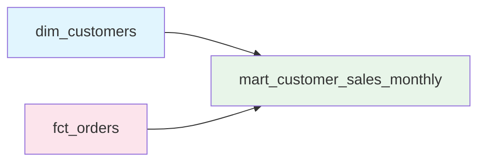
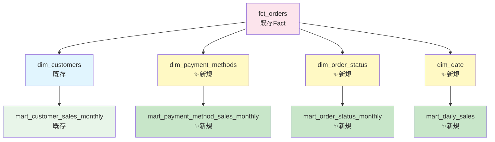
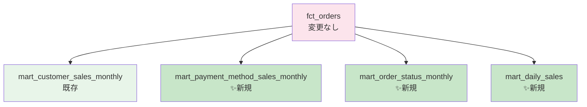

> **シリーズ第3回**: 既存のFactテーブルを再利用しながら、新しいDimensionを追加して分析の切り口を大きく広げます

## 本記事で学べること

- ✅ Dimensionの追加による分析軸の拡張
- ✅ 同一Factの再利用パターン
- ✅ 日付ディメンションの実装
- ✅ BigQueryパーティショニング+クラスタリングの組み合わせ

## 検証環境

**検証日時**: 2026-02-17
**dbtバージョン**: 1.11.5
**dbt-bigqueryバージョン**: 1.11.0

### 実測検証結果

| レイヤー                   | 新規モデル数 | 実行時間     | 処理行数 |
| -------------------------- | ------------ | ------------ | -------- |
| **Component層（dim追加）** | 3モデル      | 2.91-3.15秒  | 78行     |
| **Mart層（新規集計）**     | 3モデル      | 2.81-43.71秒 | 94行     |

---

## 1. 第2回の振り返りと新しい分析要件

### 1.1 現在の構造

第2回で作成したモデル：

- **Dimension**: `dim_customers`（顧客）
- **Fact**: `fct_orders`（注文）
- **Mart**: 顧客別の月次/四半期/年次売上



### 1.2 新しい分析要件

**新たな依頼**:

1. **支払方法別の売上分析**（クレジットカード vs クーポン等）
2. **注文ステータス別の分析**（完了 vs 返品等）
3. **日次売上トレンド分析**（曜日、月別パターン）

**問題**:

- 現在は`dim_customers`しかない
- 他の分析軸がない

**解決策**:

- ✅ 新しいDimensionを追加
- ✅ 既存の`fct_orders`を**再利用**（変更不要）

---

## 2. モデリング設計：Dimensionの追加

### 2.1 追加するDimension



| Dimension               | 目的                 | 行数 | 実行時間 |
| ----------------------- | -------------------- | ---- | -------- |
| **dim_payment_methods** | 支払方法マスタ       | 4行  | 3.00秒   |
| **dim_order_status**    | 注文ステータスマスタ | 5行  | 3.15秒   |
| **dim_date**            | 日付ディメンション   | 69行 | 2.91秒   |

---

## 3. 実装：新しいDimension

### 3.1 dim_payment_methods.sql

**models/component/dim_payment_methods.sql**:

```sql
{{
  config(materialized='table')
}}

with payment_methods as (
    select distinct payment_method
    from {{ ref('stg_payments') }}
),

final as (
    select
        payment_method,
        case payment_method
            when 'credit_card' then 'Credit Card'
            when 'coupon' then 'Coupon'
            when 'bank_transfer' then 'Bank Transfer'
            when 'gift_card' then 'Gift Card'
            else 'Unknown'
        end as payment_method_name,
        case payment_method
            when 'credit_card' then 'Card'
            when 'gift_card' then 'Card'
            when 'bank_transfer' then 'Transfer'
            when 'coupon' then 'Discount'
            else 'Other'
        end as payment_category
    from payment_methods
)

select * from final
```

**生成されるテーブル**:
| payment_method | payment_method_name | payment_category |
|----------------|---------------------|------------------|
| credit_card | Credit Card | Card |
| coupon | Coupon | Discount |
| bank_transfer | Bank Transfer | Transfer |
| gift_card | Gift Card | Card |

### 3.2 dim_date.sql（日付ディメンション）

**models/component/dim_date.sql**:

```sql
with date_spine as (
    select distinct order_date as date_day
    from {{ ref('stg_orders') }}
),

final as (
    select
        date_day,
        extract(year from date_day) as year,
        extract(quarter from date_day) as quarter,
        extract(month from date_day) as month,
        extract(day from date_day) as day,
        extract(dayofweek from date_day) as day_of_week,
        format_date('%A', date_day) as day_name,
        format_date('%B', date_day) as month_name,
        date_trunc(date_day, month) as month_start,
        date_trunc(date_day, quarter) as quarter_start,
        date_trunc(date_day, year) as year_start
    from date_spine
)

select * from final
```

**生成されるテーブル**（69行）:
| date_day | year | quarter | month | day | day_of_week | day_name | month_name |
|----------|------|---------|-------|-----|-------------|----------|------------|
| 2018-01-01 | 2018 | 1 | 1 | 1 | 2 | Monday | January |
| 2018-01-02 | 2018 | 1 | 1 | 2 | 3 | Tuesday | January |

**ポイント**:

- ✅ 曜日分析が可能（`day_of_week`, `day_name`）
- ✅ 月名を事前計算（`month_name`）
- ✅ 集計用の開始日（`month_start`, `quarter_start`）

---

## 4. 実装：新しいMart

### 4.1 支払方法別月次売上

**models/marts/mart_payment_method_sales_monthly.sql**:

```sql
{{
  config(
    materialized='table',
    partition_by={
      'field': 'order_month',
      'data_type': 'date',
      'granularity': 'month'
    }
  )
}}

with payment_methods as (
    select * from {{ ref('dim_payment_methods') }}
),

orders as (
    select * from {{ ref('fct_orders') }}
),

payments as (
    select * from {{ ref('stg_payments') }}
),

monthly_payment_sales as (
    select
        p.payment_method,
        date_trunc(o.order_date, month) as order_month,
        count(distinct o.order_id) as order_count,
        count(p.payment_id) as payment_count,
        sum(p.amount) as total_amount
    from payments p
    inner join orders o on p.order_id = o.order_id
    group by p.payment_method, order_month
),

final as (
    select
        pm.payment_method,
        pm.payment_method_name,
        pm.payment_category,
        mps.order_month,
        mps.order_count,
        mps.payment_count,
        mps.total_amount
    from payment_methods pm
    inner join monthly_payment_sales mps on pm.payment_method = mps.payment_method
)

select * from final
```

**実行結果**:

```
10 of 11 OK created sql table model ...mart_payment_method_sales_monthly
          [CREATE TABLE (16.0 rows, 5.7 KiB processed) in 3.39s]
```

### 4.2 日次売上（パーティション+クラスタリング）

**models/marts/mart_daily_sales.sql**:

```sql
{{
  config(
    materialized='table',
    partition_by={
      'field': 'date_day',
      'data_type': 'date',
      'granularity': 'day'
    },
    cluster_by=['year', 'month']
  )
}}

with dates as (
    select * from {{ ref('dim_date') }}
),

orders as (
    select * from {{ ref('fct_orders') }}
),

daily_sales as (
    select
        order_date as date_day,
        count(order_id) as order_count,
        sum(order_total) as total_sales,
        avg(order_total) as avg_order_value,
        min(order_total) as min_order_value,
        max(order_total) as max_order_value
    from orders
    group by order_date
),

final as (
    select
        d.date_day,
        d.year,
        d.quarter,
        d.month,
        d.day,
        d.day_of_week,
        d.day_name,
        d.month_name,
        ds.order_count,
        ds.total_sales,
        ds.avg_order_value,
        ds.min_order_value,
        ds.max_order_value
    from dates d
    inner join daily_sales ds on d.date_day = ds.date_day
)

select * from final
```

**✨ パーティション+クラスタリング**:

```yaml
partition_by:
  field: date_day
  granularity: day
cluster_by: ["year", "month"]
```

**実行結果**:

```
1 of 2 OK created sql table model ...mart_daily_sales
          [CREATE TABLE (69.0 rows, 6.7 KiB processed) in 43.71s]
```

**最適化効果**:
| クエリパターン | 最適化 |
|-------------|--------|
| `WHERE date_day = '2018-01-01'` | パーティションプルーニング（1日分のみスキャン） |
| `WHERE year = 2018 AND month = 1` | クラスタリングプルーニング（該当ブロックのみ） |
| 両方の組み合わせ | **最大のコスト削減** |

---

## 5. dbtの実行

### 5.1 全体実行

```bash
dbt run --profiles-dir . --select component marts
```

**実行ログ**:

<details>
<summary>詳細ログを表示</summary>

```
02:12:22  Found 16 models, 3 seeds, 20 data tests, 538 macros
02:12:22  Concurrency: 24 threads (target='sandbox')
02:12:22
02:12:23  1 of 11 START sql table model ...dim_customers ................. [RUN]
02:12:23  2 of 11 START sql table model ...dim_date ...................... [RUN]
02:12:23  3 of 11 START sql table model ...dim_order_status .............. [RUN]
02:12:23  4 of 11 START sql table model ...dim_payment_methods ........... [RUN]
02:12:23  5 of 11 START sql table model ...fct_orders .................... [RUN]
02:12:26  1 of 11 OK created sql table model ...dim_customers ............ [CREATE TABLE (100.0 rows, 1.9 KiB) in 2.79s]
02:12:26  2 of 11 OK created sql table model ...dim_date ................. [CREATE TABLE (69.0 rows, 792 Bytes) in 2.91s]
02:12:26  4 of 11 OK created sql table model ...dim_payment_methods ...... [CREATE TABLE (4.0 rows, 1.4 KiB) in 3.00s]
02:12:26  5 of 11 OK created sql table model ...fct_orders ............... [CREATE TABLE (99.0 rows, 5.1 KiB) in 3.03s]
02:12:26  3 of 11 OK created sql table model ...dim_order_status ......... [CREATE TABLE (5.0 rows, 1.0 KiB) in 3.15s]

02:12:26  6 of 11 START sql table model ...mart_customer_sales_monthly ... [RUN]
02:12:26  7 of 11 START sql table model ...mart_customer_sales_quarterly  [RUN]
02:12:26  8 of 11 START sql table model ...mart_customer_sales_yearly .... [RUN]
02:12:26  9 of 11 START sql table model ...mart_daily_sales .............. [RUN]
02:12:26  10 of 11 START sql table model ...mart_payment_method_sales_monthly [RUN]
02:12:26  11 of 11 START sql table model ...mart_order_status_monthly .... [RUN]

02:12:29  6 of 11 OK created sql table model ...mart_customer_sales_monthly [CREATE TABLE (88.0 rows, 4.9 KiB) in 2.85s]
02:12:29  7 of 11 OK created sql table model ...mart_customer_sales_quarterly [CREATE TABLE (68.0 rows, 4.9 KiB) in 3.00s]
02:12:29  8 of 11 OK created sql table model ...mart_customer_sales_yearly [CREATE TABLE (62.0 rows, 4.9 KiB) in 3.03s]
02:12:30  10 of 11 OK created sql table model ...mart_payment_method_sales_monthly [CREATE TABLE (16.0 rows, 5.7 KiB) in 3.39s]
02:12:52  11 of 11 OK created sql table model ...mart_order_status_monthly [CREATE TABLE (9.0 rows, 3.5 KiB) in 2.81s]
02:13:33  9 of 11 OK created sql table model ...mart_daily_sales ......... [CREATE TABLE (69.0 rows, 6.7 KiB) in 43.71s]
02:13:33
02:13:33  Finished running 11 table models in 7.85 seconds + 44.98 seconds.
02:13:33  Completed successfully
```

</details>

---

## 6. Dimensionを追加するメリット

### 6.1 Factの再利用

**重要**: `fct_orders`は一切変更していません！



**メリット**:

- ✅ Factは1回だけ作成・保守
- ✅ Dimensionを追加するだけで新しい分析が可能
- ✅ 既存マートに影響なし

### 6.2 分析の柔軟性

**新しい要件にも簡単に対応**:

```
「地域別売上も見たい」
→ dim_regions を追加
→ mart_region_sales_monthly を追加
→ fct_orders は再利用
```

---

## 7. まとめ

### 本記事で実装したこと

✅ **Component層（Dimension追加）**:

- `dim_payment_methods`: 支払方法マスタ（4行）
- `dim_order_status`: 注文ステータスマスタ（5行）
- `dim_date`: 日付ディメンション（69行）

✅ **Mart層（新規集計）**:

- `mart_payment_method_sales_monthly`: 支払方法別月次売上（16行）
- `mart_order_status_monthly`: ステータス別月次注文（9行）
- `mart_daily_sales`: 日次売上（69行、パーティション+クラスタリング）

✅ **Factの再利用**:

- `fct_orders`を4つのマートで共有（変更不要）

### 学んだこと

1. **Dimensionを追加するだけで分析軸が広がる**
2. **Factテーブルの再利用性**（変更せずに複数マートで利用）
3. **パーティション+クラスタリング**の組み合わせ効果
4. **日付ディメンション**の活用（曜日、月名等）

### 次回予告：カオスな環境への対応

**第4回**では、より実践的な課題に取り組みます：

- **データ品質の問題**（NULL値、重複、不整合）
- **複雑なビジネスロジック**（割引計算、返品処理等）
- **パフォーマンス最適化**（Incremental、Materialized View）
- **テスト強化**（Data Tests、Unit Tests）

---

**検証日**: 2026-02-17
**dbtバージョン**: 1.11.5
**dbt-bigqueryバージョン**: 1.11.0
