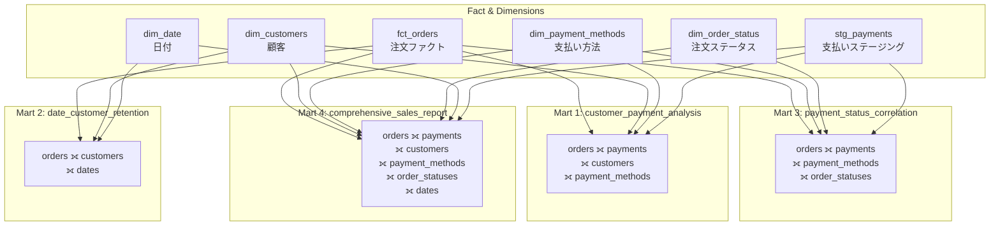
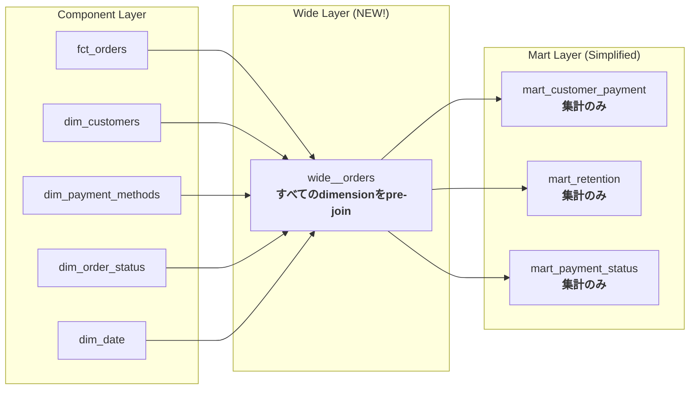

# 学べること

- **joinロジックの分散がもたらす保守性の問題**
- **実際のビジネス環境でのアンチパターン**
- **なぜWide層が必要なのかの体感的理解**
- **カオスな状態からの脱却方法の予習**

# はじめに

前回まで、ディメンショナルモデリングの基本とディメンションの拡張を学びました。しかし、実際のビジネス環境では「今必要な分析だけを作る」アプローチを続けると、やがて **joinロジックの分散** という問題に直面します。

本チュートリアルでは、**意図的にカオスな状態を作り出す**ことで、なぜ次章の「Wide層」が必要なのかを体感的に理解します。

## 概要

前回まで、ディメンショナルモデリングの基本とディメンションの拡張を学びました。しかし、実際のビジネス環境では「今必要な分析だけを作る」アプローチを続けると、やがて **joinロジックの分散** という問題に直面します。

この章では、**意図的にカオスな状態を作り出す**ことで、なぜ次章の「Wide層」が必要なのかを体感的に理解します。

## ビジネス要望の拡大

プロジェクトが進むにつれ、以下のような新しい分析要望が次々と届きます:

### 新しい要望リスト

| 要望ID | 内容                                     | 必要なディメンション                   |
| ------ | ---------------------------------------- | -------------------------------------- |
| ①      | 顧客ごとの支払い方法の傾向分析           | dim_customers + dim_payment_methods    |
| ②      | 月次コホート分析でリテンション把握       | dim_customers + dim_date               |
| ③      | 支払い方法と注文ステータスの相関         | dim_payment_methods + dim_order_status |
| ④      | すべてのディメンションを含む包括レポート | 全ディメンション                       |

これらはいずれも正当なビジネス要求です。問題は、**どう実装するか**です。

## アプローチ: 個別martを追加し続ける

最も直感的なアプローチは、「要望ごとに新しいmartを作る」ことです。実際に実装してみましょう。

### 実装したmartモデル

#### 1. mart_customer_payment_analysis.sql

**目的:** 顧客ごとの支払い方法の傾向を分析

```sql
{{
  config(
    materialized='table',
    partition_by={
      'field': 'analysis_month',
      'data_type': 'date',
      'granularity': 'month'
    }
  )
}}

with customers as (
    select * from {{ ref('dim_customers') }}
),

orders as (
    select * from {{ ref('fct_orders') }}
),

payments as (
    select * from {{ ref('stg_payments') }}
),

payment_methods as (
    select * from {{ ref('dim_payment_methods') }}
),

-- ⚠️ 注意: このjoinロジックは他のmartでも繰り返されている!
customer_payments as (
    select
        o.customer_id,
        p.payment_method,
        date_trunc(o.order_date, month) as analysis_month,
        count(distinct o.order_id) as order_count,
        sum(p.amount) as total_payment_amount
    from orders o
    inner join payments p on o.order_id = p.order_id
    group by o.customer_id, p.payment_method, analysis_month
),

final as (
    select
        c.customer_id,
        c.full_name as customer_name,
        pm.payment_method,
        pm.payment_method_name,
        pm.payment_category,
        cp.analysis_month,
        cp.order_count,
        cp.total_payment_amount,
        -- 顧客の全支払いに対する割合
        safe_divide(
            cp.total_payment_amount,
            sum(cp.total_payment_amount) over (partition by cp.customer_id, cp.analysis_month)
        ) as payment_share
    from customer_payments cp
    inner join customers c on cp.customer_id = c.customer_id
    inner join payment_methods pm on cp.payment_method = pm.payment_method
)

select * from final
```

#### 2. mart_date_based_customer_retention.sql

**目的:** 月次コホート分析でリテンションを把握

```sql
{{
  config(
    materialized='table',
    partition_by={
      'field': 'cohort_month',
      'data_type': 'date',
      'granularity': 'month'
    }
  )
}}

with customers as (
    select * from {{ ref('dim_customers') }}
),

orders as (
    select * from {{ ref('fct_orders') }}
),

dates as (
    select * from {{ ref('dim_date') }}
),

-- ⚠️ 注意: 顧客の初回注文月を計算する処理が分散している
customer_first_order as (
    select
        customer_id,
        min(order_date) as first_order_date
    from orders
    group by customer_id
),

-- ⚠️ 注意: date dimensionとのjoinも複数のmartで繰り返されている
monthly_activity as (
    select
        o.customer_id,
        date_trunc(o.order_date, month) as activity_month,
        count(distinct o.order_id) as order_count,
        sum(o.order_total) as total_amount
    from orders o
    group by o.customer_id, activity_month
),

final as (
    select
        c.customer_id,
        c.full_name as customer_name,
        date_trunc(cfo.first_order_date, month) as cohort_month,
        d.year as cohort_year,
        d.month as cohort_month_num,
        ma.activity_month,
        date_diff(ma.activity_month, date_trunc(cfo.first_order_date, month), month) as months_since_first_order,
        ma.order_count,
        ma.total_amount
    from customers c
    inner join customer_first_order cfo on c.customer_id = cfo.customer_id
    inner join monthly_activity ma on c.customer_id = ma.customer_id
    left join dates d on date_trunc(cfo.first_order_date, month) = d.date_day
)

select * from final
```

#### 3. mart_payment_status_correlation.sql

**目的:** 支払い方法と注文ステータスの相関分析

```sql
{{
  config(
    materialized='table',
    partition_by={
      'field': 'analysis_month',
      'data_type': 'date',
      'granularity': 'month'
    }
  )
}}

with payment_methods as (
    select * from {{ ref('dim_payment_methods') }}
),

order_statuses as (
    select * from {{ ref('dim_order_status') }}
),

orders as (
    select * from {{ ref('fct_orders') }}
),

payments as (
    select * from {{ ref('stg_payments') }}
),

-- ⚠️ 注意: このpayments ← orders joinは mart_customer_payment_analysis と同じ!
payment_status as (
    select
        o.status,
        p.payment_method,
        date_trunc(o.order_date, month) as analysis_month,
        count(distinct o.order_id) as order_count,
        sum(p.amount) as total_amount
    from orders o
    inner join payments p on o.order_id = p.order_id
    group by o.status, p.payment_method, analysis_month
),

final as (
    select
        os.status_code,
        os.status_name,
        pm.payment_method,
        pm.payment_method_name,
        pm.payment_category,
        ps.analysis_month,
        ps.order_count,
        ps.total_amount
    from payment_status ps
    inner join payment_methods pm on ps.payment_method = pm.payment_method
    inner join order_statuses os on ps.status = os.status_code
)

select * from final
```

#### 4. mart_comprehensive_sales_report.sql

**目的:** すべてのディメンションを含む包括的レポート

```sql
{{
  config(
    materialized='table',
    partition_by={
      'field': 'order_month',
      'data_type': 'date',
      'granularity': 'month'
    },
    cluster_by=['customer_id', 'status_code']
  )
}}

with customers as (
    select * from {{ ref('dim_customers') }}
),

payment_methods as (
    select * from {{ ref('dim_payment_methods') }}
),

order_statuses as (
    select * from {{ ref('dim_order_status') }}
),

dates as (
    select * from {{ ref('dim_date') }}
),

orders as (
    select * from {{ ref('fct_orders') }}
),

payments as (
    select * from {{ ref('stg_payments') }}
),

-- ⚠️ カオスの極み: この巨大なjoinチェーンは保守が極めて困難!
order_details as (
    select
        o.order_id,
        o.customer_id,
        o.order_date,
        o.status,
        o.order_total,
        p.payment_id,
        p.payment_method,
        p.amount as payment_amount
    from orders o
    left join payments p on o.order_id = p.order_id
),

final as (
    select
        c.customer_id,
        c.full_name as customer_name,
        os.status_code,
        os.status_name,
        pm.payment_method,
        pm.payment_method_name,
        pm.payment_category,
        date_trunc(od.order_date, month) as order_month,
        d.year,
        d.quarter,
        d.month,
        od.order_id,
        od.order_total,
        od.payment_amount
    from order_details od
    inner join customers c on od.customer_id = c.customer_id
    left join payment_methods pm on od.payment_method = pm.payment_method
    left join order_statuses os on od.status = os.status_code
    left join dates d on od.order_date = d.date_day
)

select * from final
```

## 実行結果

```bash
dbt run --select marts --profiles-dir . --target sandbox
```

<details>
<summary>📊 実行ログ (クリックして展開)</summary>

```
[0m02:19:25  Running with dbt=1.11.5
[0m02:19:25  Registered adapter: bigquery=1.11.0
[0m02:19:26  Found 20 models, 3 seeds, 20 data tests, 538 macros
[0m02:19:26
[0m02:19:26  Concurrency: 24 threads (target='sandbox')
[0m02:19:27
[0m02:19:27  1 of 10 START sql table model dbt_jaffle_shop.mart_comprehensive_sales_report . [RUN]
[0m02:19:27  2 of 10 START sql table model dbt_jaffle_shop.mart_customer_payment_analysis .. [RUN]
[0m02:19:27  3 of 10 START sql table model dbt_jaffle_shop.mart_customer_sales_monthly ..... [RUN]
[0m02:19:27  4 of 10 START sql table model dbt_jaffle_shop.mart_customer_sales_quarterly ... [RUN]
[0m02:19:27  5 of 10 START sql table model dbt_jaffle_shop.mart_customer_sales_yearly ...... [RUN]
[0m02:19:27  6 of 10 START sql table model dbt_jaffle_shop.mart_daily_sales ................ [RUN]
[0m02:19:27  7 of 10 START sql table model dbt_jaffle_shop.mart_date_based_customer_retention [RUN]
[0m02:19:27  8 of 10 START sql table model dbt_jaffle_shop.mart_order_status_monthly ....... [RUN]
[0m02:19:27  9 of 10 START sql table model dbt_jaffle_shop.mart_payment_method_sales_monthly [RUN]
[0m02:19:27  10 of 10 START sql table model dbt_jaffle_shop.mart_payment_status_correlation  [RUN]
[0m02:19:34  3 of 10 OK created sql table model dbt_jaffle_shop.mart_customer_sales_monthly  [CREATE TABLE (88.0 rows, 4.9 KiB processed) in 3.05s]
[0m02:19:34  8 of 10 OK created sql table model dbt_jaffle_shop.mart_order_status_monthly .. [CREATE TABLE (9.0 rows, 3.5 KiB processed) in 3.10s]
[0m02:19:34  4 of 10 OK created sql table model dbt_jaffle_shop.mart_customer_sales_quarterly [CREATE TABLE (68.0 rows, 4.9 KiB processed) in 3.32s]
[0m02:19:34  5 of 10 OK created sql table model dbt_jaffle_shop.mart_customer_sales_yearly . [CREATE TABLE (62.0 rows, 4.9 KiB processed) in 3.35s]
[0m02:19:34  9 of 10 OK created sql table model dbt_jaffle_shop.mart_payment_method_sales_monthly [CREATE TABLE (16.0 rows, 5.7 KiB processed) in 3.57s]
[0m02:19:34  1 of 10 OK created sql table model dbt_jaffle_shop.mart_comprehensive_sales_report [CREATE TABLE (113.0 rows, 15.9 KiB processed) in 3.93s]
[0m02:19:35  6 of 10 OK created sql table model dbt_jaffle_shop.mart_daily_sales ........... [CREATE TABLE (69.0 rows, 6.7 KiB processed) in 4.09s]
[0m02:19:35  2 of 10 OK created sql table model dbt_jaffle_shop.mart_customer_payment_analysis [CREATE TABLE (106.0 rows, 8.3 KiB processed) in 4.10s]
[0m02:19:35  10 of 10 OK created sql table model dbt_jaffle_shop.mart_payment_status_correlation [CREATE TABLE (28.0 rows, 6.0 KiB processed) in 4.90s]
[0m02:19:37  7 of 10 OK created sql table model dbt_jaffle_shop.mart_date_based_customer_retention [CREATE TABLE (88.0 rows, 7.1 KiB processed) in 6.37s]
[0m02:19:37
[0m02:19:37  Finished running 10 table models in 0 hours 0 minutes and 11.19 seconds (11.19s).
[0m02:19:37
[0m02:19:37  Completed successfully
[0m02:19:37
[0m02:19:37  Done. PASS=10 WARN=0 ERROR=0 SKIP=0 NO-OP=0 TOTAL=10
```

</details>

### 結果サマリー

| モデル名                           | 行数 | 処理データ | 実行時間 |
| ---------------------------------- | ---- | ---------- | -------- |
| mart_comprehensive_sales_report    | 113  | 15.9 KiB   | 3.93s    |
| mart_customer_payment_analysis     | 106  | 8.3 KiB    | 4.10s    |
| mart_customer_sales_monthly        | 88   | 4.9 KiB    | 3.05s    |
| mart_date_based_customer_retention | 88   | 7.1 KiB    | 6.37s    |
| mart_customer_sales_quarterly      | 68   | 4.9 KiB    | 3.32s    |
| mart_daily_sales                   | 69   | 6.7 KiB    | 4.09s    |
| mart_customer_sales_yearly         | 62   | 4.9 KiB    | 3.35s    |
| mart_payment_status_correlation    | 28   | 6.0 KiB    | 4.90s    |
| mart_payment_method_sales_monthly  | 16   | 5.7 KiB    | 3.57s    |
| mart_order_status_monthly          | 9    | 3.5 KiB    | 3.10s    |

**合計:** 10モデル、647行、67.8 KiB processed

## 現状の問題点: Join Logic Fragmentation (joinロジックの分散)

### 問題の可視化



### 重複するjoinパターンの分析

| Join Pattern               | 使用しているmart                                                                        | 重複回数 |
| -------------------------- | --------------------------------------------------------------------------------------- | -------- |
| `orders ⟗ payments`        | customer_payment_analysis<br/>payment_status_correlation<br/>comprehensive_sales_report | **3回**  |
| `orders ⟗ customers`       | customer_payment_analysis<br/>date_customer_retention<br/>comprehensive_sales_report    | **3回**  |
| `orders ⟗ payment_methods` | customer_payment_analysis<br/>payment_status_correlation<br/>comprehensive_sales_report | **3回**  |
| `orders ⟗ order_statuses`  | payment_status_correlation<br/>comprehensive_sales_report                               | **2回**  |
| `orders ⟗ dates`           | date_customer_retention<br/>comprehensive_sales_report                                  | **2回**  |

## カオスの実態: 3つの深刻な問題

### 1. **保守コストの爆発**

ディメンションテーブルのjoin条件を変更する場合:

```sql
-- dim_payment_methods のjoin条件を変更したい場合...

-- ❌ 変更が必要なファイル:
-- 1. mart_customer_payment_analysis.sql
-- 2. mart_payment_status_correlation.sql
-- 3. mart_comprehensive_sales_report.sql

-- すべてのmartで同じ修正を繰り返す必要がある!
```

**変更の影響範囲:**

- ファイル数: 3個以上
- テストが必要な範囲: すべての依存mart
- リスク: 1つでも修正漏れがあると不整合が発生

### 2. **Mental Model の複雑化**

開発者は以下をすべて把握する必要があります:

- ✅ どのmartがどのディメンションを使っているか?
- ✅ 各martのjoin条件は何か?
- ✅ joinの順序とフィルター条件は?
- ✅ 既存のmartと新しいmartの違いは?

**10個のmart → すでに追跡困難!**

### 3. **SQLの冗長性**

同じjoinロジックが何度も書かれています:

```sql
-- Pattern A: mart_customer_payment_analysis.sql
from orders o
inner join payments p on o.order_id = p.order_id
inner join customers c on o.customer_id = c.customer_id
inner join payment_methods pm on p.payment_method = pm.payment_method

-- Pattern B: mart_comprehensive_sales_report.sql (完全に同じ!)
from orders o
left join payments p on o.order_id = p.order_id
inner join customers c on od.customer_id = c.customer_id
left join payment_methods pm on od.payment_method = pm.payment_method

-- Pattern C: mart_payment_status_correlation.sql (また同じ!)
from orders o
inner join payments p on o.order_id = p.order_id
inner join payment_methods pm on ps.payment_method = pm.payment_method
```

**DRY原則 (Don't Repeat Yourself) の完全な違反!**

## リファクタリングが必要な理由

このアプローチは**短期的には動作します**が、以下の問題があります:

### スケーラビリティの欠如

| 指標                   | 現状 | 10mart追加後 | 50mart追加後 |
| ---------------------- | ---- | ------------ | ------------ |
| 総mart数               | 10   | 20           | 60           |
| join重複率             | 30%  | 50%+         | 70%+         |
| 変更時の影響ファイル数 | 3-5  | 10+          | 30+          |
| 新規開発者の学習時間   | 1日  | 3日          | 1週間+       |

### 品質リスク

- **テスト漏れ**: 同じjoinロジックなのにmartごとに微妙に違うfilterやjoin条件
- **パフォーマンス劣化**: 最適化がmartごとにバラバラ
- **データ不整合**: join条件の微妙な違いで結果が変わる可能性

## 次回予告: Wide層の導入

**問題の本質:**

> 同じdimensionとの join処理が複数のmartで個別に繰り返されている

**解決策:**

> **Wide層** = Factとすべてのdimensionを事前にjoinしたpre-joined table

### Wide層のアーキテクチャ



### 期待される効果

| 項目                       | Before (現状)     | After (Wide層導入後) |
| -------------------------- | ----------------- | -------------------- |
| Join処理の場所             | 各mart (10箇所)   | Wide層 (1箇所のみ)   |
| mart作成の難易度           | SQLエンジニア必須 | 分析者でも可能       |
| ディメンション変更時の影響 | 全mart修正        | Wide層のみ修正       |
| コードの可読性             | 低い (joinだらけ) | 高い (集計に集中)    |
| 新規分析の追加             | 数時間            | 数分                 |

## まとめ

### 学んだこと

1. **短期的な最適解が長期的な負債になる**
   - 「今必要な分析だけ作る」を続けると、joinロジックが分散
   - 10個のmartで既に保守困難な状態

2. **Join Logic Fragmentation の3つの問題**
   - ① 保守コストの爆発 (1つの変更で複数ファイル修正)
   - ② Mental Modelの複雑化 (誰も全体像を把握できない)
   - ③ SQLの冗長性 (DRY原則の違反)

3. **カオスを体験する価値**
   - 「なぜWide層が必要か?」を体感的に理解できた
   - アーキテクチャ設計の重要性を実感

### 次のステップ

次回 (第5回) では、**Wide層を導入**して、このカオスを解決します:

- ✅ `wide__orders.sql` を作成し、すべてのdimensionをpre-join
- ✅ 既存のmartをWide層ベースにリファクタリング
- ✅ Before/After のコード比較とパフォーマンス比較
- ✅ Wide層のベストプラクティス

**重要なポイント:**

> 「カオスな状態を経験する」ことで、次の設計判断が正しいかどうかを自分で判断できるようになる!

---

## 参考資料

- [dbt公式ドキュメント - Models](https://docs.getdbt.com/docs/build/models)
- [BigQuery - Partitioning and Clustering](https://cloud.google.com/bigquery/docs/partitioned-tables)
- [stable.co.jp - 作って学ぶ！dbt × Snowflakeで始めるデータモデリング (第4回)](https://stable.co.jp/blog/handson-data-modeling-ch4)

---

**シリーズナビゲーション:**

- [← 第3回: ディメンションを追加して分析を拡張する](tutorial-03-expand-dimensions.md)
- [→ 第5回: Wide層を導入してアーキテクチャを改善する](tutorial-05-wide-layer.md)
