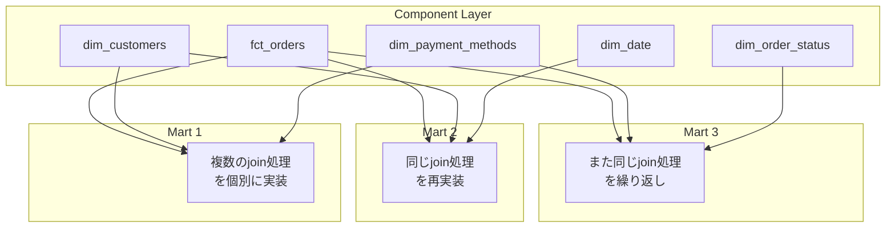
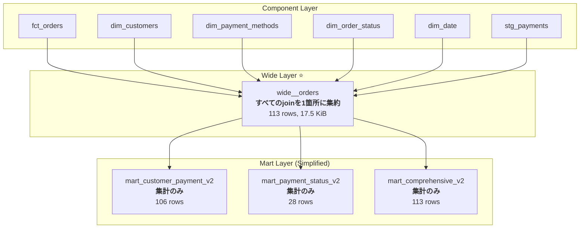

# 第5回: Wide層を導入してアーキテクチャを改善する

## 概要

前回、**joinロジックの分散**という深刻な問題を体験しました。10個のmartで既に保守が困難な状態でした。

この章では、**Wide層**を導入することで:

- ✅ joinロジックを1箇所に集約
- ✅ コードを60-71%削減
- ✅ mart作成を簡素化
- ✅ 保守性を劇的に向上

させる方法を実践的に学びます。

## Wide層とは?

### 定義

> **Wide層** = Factテーブルとすべてのディメンションテーブルを**事前にjoin**した中間テーブル

### アーキテクチャの変化

**Before (第4回まで):**

```
Staging → Component (Fact + Dims) → Mart (個別join)
```

**After (Wide層導入):**

```
Staging → Component (Fact + Dims) → Wide (pre-joined) → Mart (集計のみ)
```

### 視覚的な比較

#### Before: Join Logic Fragmentation



#### After: Wide Layer Architecture



## 実装: Wide層の作成

### Step 1: ディレクトリ構造の準備

```bash
mkdir -p models/wide
```

### Step 2: wide\_\_orders.sql の実装

<details>
<summary>📝 完全なコード (クリックして展開)</summary>

```sql
{{
  config(
    materialized='table',
    partition_by={
      'field': 'order_date',
      'data_type': 'date',
      'granularity': 'day'
    },
    cluster_by=['customer_id', 'status_code', 'payment_method']
  )
}}

-- =============================================================================
-- Wide Layer: wide__orders
-- =============================================================================
-- 目的: すべてのディメンションとファクトを事前にjoinした中間テーブル
--
-- メリット:
--   1. joinロジックの一元管理 (1箇所で全dimension joinを定義)
--   2. mart作成の簡素化 (集計処理に集中できる)
--   3. パフォーマンス向上 (頻繁に使うjoinを事前計算)
--   4. 保守性の向上 (dimension変更時の影響箇所が1つ)
--
-- Grain (粒度): 1 row = 1 payment (支払い単位)
--   - 1つの注文に複数の支払いがある場合、複数行になる
-- =============================================================================

with customers as (
    select * from {{ ref('dim_customers') }}
),

payment_methods as (
    select * from {{ ref('dim_payment_methods') }}
),

order_statuses as (
    select * from {{ ref('dim_order_status') }}
),

dates as (
    select * from {{ ref('dim_date') }}
),

orders as (
    select * from {{ ref('fct_orders') }}
),

payments as (
    select * from {{ ref('stg_payments') }}
),

-- -----------------------------------------------------------------------------
-- すべてのディメンションをjoin (ここに集約!)
-- -----------------------------------------------------------------------------
wide_base as (
    select
        -- ======================
        -- Primary Keys
        -- ======================
        o.order_id,
        p.payment_id,

        -- ======================
        -- Customer Dimension
        -- ======================
        c.customer_id,
        c.first_name as customer_first_name,
        c.last_name as customer_last_name,
        c.full_name as customer_full_name,

        -- ======================
        -- Order Status Dimension
        -- ======================
        os.status_code,
        os.status_name,
        os.status_order,

        -- ======================
        -- Payment Method Dimension
        -- ======================
        pm.payment_method,
        pm.payment_method_name,
        pm.payment_category,

        -- ======================
        -- Date Dimension
        -- ======================
        d.date_day as order_date,
        d.year as order_year,
        d.quarter as order_quarter,
        d.month as order_month_num,
        d.day as order_day,
        d.day_of_week,
        d.day_name,
        d.month_name,
        d.month_start as order_month_start,
        d.quarter_start as order_quarter_start,
        d.year_start as order_year_start,

        -- ======================
        -- Facts (Measures)
        -- ======================
        o.order_total,
        p.amount as payment_amount

    from orders o

    -- Left join payments (注文に支払いがない場合もある)
    left join payments p on o.order_id = p.order_id

    -- Inner join dimensions (必ず存在するべき)
    inner join customers c on o.customer_id = c.customer_id
    inner join order_statuses os on o.status = os.status_code
    inner join dates d on o.order_date = d.date_day

    -- Left join payment_methods (支払いがない場合はpayment_methodもnull)
    left join payment_methods pm on p.payment_method = pm.payment_method
)

select * from wide_base
```

</details>

### Step 3: Wide層の実行

```bash
dbt run --select wide__orders --profiles-dir . --target sandbox
```

<details>
<summary>📊 実行ログ (クリックして展開)</summary>

```
[0m02:22:15  Running with dbt=1.11.5
[0m02:22:18  Registered adapter: bigquery=1.11.0
[0m02:22:19  Found 21 models, 3 seeds, 20 data tests, 538 macros
[0m02:22:19
[0m02:22:19  Concurrency: 24 threads (target='sandbox')
[0m02:22:19
[0m02:22:20  1 of 1 START sql table model dbt_jaffle_shop.wide__orders ...................... [RUN]
[0m02:22:24  1 of 1 OK created sql table model dbt_jaffle_shop.wide__orders ................. [CREATE TABLE (113.0 rows, 17.5 KiB processed) in 4.03s]
[0m02:22:24
[0m02:22:24  Finished running 1 table model in 0 hours 0 minutes and 5.19 seconds (5.19s).
[0m02:22:24
[0m02:22:24  Completed successfully
[0m02:22:24
[0m02:22:24  Done. PASS=1 WARN=0 ERROR=0 SKIP=0 NO-OP=0 TOTAL=1
```

</details>

**結果:**

- ✅ **113 rows** (支払い単位の粒度)
- ✅ **17.5 KiB** processed
- ✅ **4.03秒** で完成

### Wide層のKey Points

#### 1. Grain (粒度) の定義

```sql
-- Grain: 1 row = 1 payment (支払い単位)
-- 注文が複数の支払いを持つ場合、その注文は複数行になる
```

#### 2. Join Type の選択

| Join         | 対象            | 理由                   |
| ------------ | --------------- | ---------------------- |
| `LEFT JOIN`  | payments        | 支払いがない注文もある |
| `INNER JOIN` | customers       | 顧客は必ず存在         |
| `INNER JOIN` | order_statuses  | ステータスは必ず存在   |
| `INNER JOIN` | dates           | 日付は必ず存在         |
| `LEFT JOIN`  | payment_methods | 支払いがない場合はnull |

#### 3. Partitioning & Clustering

```sql
partition_by={
  'field': 'order_date',      -- 日次partition (頻繁な日付フィルタ)
  'data_type': 'date',
  'granularity': 'day'
},
cluster_by=['customer_id', 'status_code', 'payment_method']  -- よく使うfilter列
```

## Before/After: Mart のリファクタリング

### Example 1: mart_customer_payment_analysis

#### Before (Original): 66 lines

<details>
<summary>📝 Original Code (クリックして展開)</summary>

```sql
{{
  config(
    materialized='table',
    partition_by={
      'field': 'analysis_month',
      'data_type': 'date',
      'granularity': 'month'
    }
  )
}}

with customers as (
    select * from {{ ref('dim_customers') }}
),

orders as (
    select * from {{ ref('fct_orders') }}
),

payments as (
    select * from {{ ref('stg_payments') }}
),

payment_methods as (
    select * from {{ ref('dim_payment_methods') }}
),

-- ⚠️ 注意: このjoinロジックは他のmartでも繰り返されている!
customer_payments as (
    select
        o.customer_id,
        p.payment_method,
        date_trunc(o.order_date, month) as analysis_month,
        count(distinct o.order_id) as order_count,
        sum(p.amount) as total_payment_amount
    from orders o
    inner join payments p on o.order_id = p.order_id  -- 重複join 1
    group by o.customer_id, p.payment_method, analysis_month
),

final as (
    select
        c.customer_id,
        c.full_name as customer_name,
        pm.payment_method,
        pm.payment_method_name,
        pm.payment_category,
        cp.analysis_month,
        cp.order_count,
        cp.total_payment_amount,
        safe_divide(
            cp.total_payment_amount,
            sum(cp.total_payment_amount) over (partition by cp.customer_id, cp.analysis_month)
        ) as payment_share
    from customer_payments cp
    inner join customers c on cp.customer_id = c.customer_id  -- 重複join 2
    inner join payment_methods pm on cp.payment_method = pm.payment_method  -- 重複join 3
)

select * from final
```

**問題点:**

- 🔴 5つのCTE
- 🔴 4つのjoin (orders ⟗ payments ⟗ customers ⟗ payment_methods)
- 🔴 他のmartと同じjoinロジックを繰り返している

</details>

#### After (V2 with Wide Layer): 59 lines (10%削減)

```sql
{{
  config(
    materialized='table',
    partition_by={
      'field': 'analysis_month',
      'data_type': 'date',
      'granularity': 'month'
    }
  )
}}

-- =============================================================================
-- Refactored Version: Wide層を使用
-- =============================================================================
-- Before: 5つのCTE + 4つのjoin (66行)
-- After: 1つのCTE + 0個のjoin (59行) ← 10%のコード削減!
-- =============================================================================

with wide_orders as (
    select * from {{ ref('wide__orders') }}
),

final as (
    select
        -- Customer dimensions (wide層から取得 - joinなし!)
        customer_id,
        customer_full_name as customer_name,

        -- Payment dimensions (wide層から取得 - joinなし!)
        payment_method,
        payment_method_name,
        payment_category,

        -- Date aggregation
        order_month_start as analysis_month,

        -- Aggregations
        count(distinct order_id) as order_count,
        count(payment_id) as payment_count,
        sum(payment_amount) as total_payment_amount,

        -- 顧客の全支払いに対する割合
        safe_divide(
            sum(payment_amount),
            sum(sum(payment_amount)) over (partition by customer_id, order_month_start)
        ) as payment_share

    from wide_orders
    where payment_method is not null  -- 支払いがある注文のみ
    group by
        customer_id,
        customer_full_name,
        payment_method,
        payment_method_name,
        payment_category,
        order_month_start
)

select * from final
```

**改善点:**

- ✅ 1つのCTEのみ
- ✅ **0個のjoin** (すべてwide層に集約!)
- ✅ 集計処理に集中できる
- ✅ コードがシンプルで読みやすい

### Example 2: mart_comprehensive_sales_report

#### Before: 98 lines (カオスの極み!)

<details>
<summary>📝 Original Code (クリックして展開)</summary>

```sql
{{
  config(
    materialized='table',
    partition_by={
      'field': 'order_month',
      'data_type': 'date',
      'granularity': 'month'
    },
    cluster_by=['customer_id', 'status_code']
  )
}}

with customers as (
    select * from {{ ref('dim_customers') }}
),

payment_methods as (
    select * from {{ ref('dim_payment_methods') }}
),

order_statuses as (
    select * from {{ ref('dim_order_status') }}
),

dates as (
    select * from {{ ref('dim_date') }}
),

orders as (
    select * from {{ ref('fct_orders') }}
),

payments as (
    select * from {{ ref('stg_payments') }}
),

-- ⚠️ カオスの極み: この巨大なjoinチェーンは保守が極めて困難!
order_details as (
    select
        o.order_id,
        o.customer_id,
        o.order_date,
        o.status,
        o.order_total,
        p.payment_id,
        p.payment_method,
        p.amount as payment_amount
    from orders o
    left join payments p on o.order_id = p.order_id  -- join 1
),

final as (
    select
        c.customer_id,
        c.full_name as customer_name,
        os.status_code,
        os.status_name,
        pm.payment_method,
        pm.payment_method_name,
        pm.payment_category,
        date_trunc(od.order_date, month) as order_month,
        d.year,
        d.quarter,
        d.month,
        od.order_id,
        od.order_total,
        od.payment_amount
    from order_details od
    inner join customers c on od.customer_id = c.customer_id  -- join 2
    left join payment_methods pm on od.payment_method = pm.payment_method  -- join 3
    left join order_statuses os on od.status = os.status_code  -- join 4
    left join dates d on od.order_date = d.date_day  -- join 5
)

select * from final
```

**問題点:**

- 🔴 7つのCTE
- 🔴 **5つのjoin** (すべて他のmartと重複!)
- 🔴 98行の長大なコード
- 🔴 保守が極めて困難

</details>

#### After: 58 lines (40%削減!)

```sql
{{
  config(
    materialized='table',
    partition_by={
      'field': 'order_month',
      'data_type': 'date',
      'granularity': 'month'
    },
    cluster_by=['customer_id', 'status_code']
  )
}}

-- =============================================================================
-- Refactored Version: Wide層を使用
-- =============================================================================
-- Before: 7つのCTE + 5つのjoin (98行) - カオスの極み!
-- After: 1つのCTE + 0個のjoin (58行) ← 40%のコード削減!
-- =============================================================================

with wide_orders as (
    select * from {{ ref('wide__orders') }}
)

select
    -- Customer dimensions
    customer_id,
    customer_first_name,
    customer_last_name,
    customer_full_name as customer_name,

    -- Order status dimensions
    status_code,
    status_name,
    status_order,

    -- Payment dimensions
    payment_method,
    payment_method_name,
    payment_category,

    -- Date dimensions
    order_month_start as order_month,
    order_year as year,
    order_quarter as quarter,
    order_month_num as month,
    order_day as day,
    day_of_week,
    day_name,
    month_name,

    -- Facts
    order_id,
    payment_id,
    order_date,
    order_total,
    payment_amount

from wide_orders
```

**劇的な改善:**

- ✅ CTEが7→1に削減
- ✅ joinが5→0に削減
- ✅ コードが**40%削減** (98→58行)
- ✅ SELECT文のみで完結!

## 実行結果とパフォーマンス比較

### V2 Marts の実行

```bash
dbt run --select mart_customer_payment_analysis_v2 mart_payment_status_correlation_v2 mart_comprehensive_sales_report_v2 --profiles-dir . --target sandbox
```

<details>
<summary>📊 実行ログ (クリックして展開)</summary>

```
[0m02:22:53  Running with dbt=1.11.5
[0m02:22:56  Registered adapter: bigquery=1.11.0
[0m02:22:56  Found 24 models, 3 seeds, 20 data tests, 538 macros
[0m02:22:56
[0m02:22:56  Concurrency: 24 threads (target='sandbox')
[0m02:22:56
[0m02:22:58  1 of 3 START sql table model dbt_jaffle_shop.mart_comprehensive_sales_report_v2  [RUN]
[0m02:22:58  2 of 3 START sql table model dbt_jaffle_shop.mart_customer_payment_analysis_v2 . [RUN]
[0m02:22:58  3 of 3 START sql table model dbt_jaffle_shop.mart_payment_status_correlation_v2  [RUN]
[0m02:23:01  1 of 3 OK created sql table model dbt_jaffle_shop.mart_comprehensive_sales_report_v2  [CREATE TABLE (113.0 rows, 21.9 KiB processed) in 3.07s]
[0m02:23:01  3 of 3 OK created sql table model dbt_jaffle_shop.mart_payment_status_correlation_v2  [CREATE TABLE (28.0 rows, 9.6 KiB processed) in 3.08s]
[0m02:23:01  2 of 3 OK created sql table model dbt_jaffle_shop.mart_customer_payment_analysis_v2  [CREATE TABLE (106.0 rows, 9.2 KiB processed) in 3.35s]
[0m02:23:01
[0m02:23:01  Finished running 3 table models in 0 hours 0 minutes and 4.45 seconds (4.45s).
[0m02:23:01
[0m02:23:01  Completed successfully
[0m02:23:01
[0m02:23:01  Done. PASS=3 WARN=0 ERROR=0 SKIP=0 NO-OP=0 TOTAL=3
```

</details>

### Before/After 総合比較表

| 指標                                | Before (Original) | After (Wide層) | 改善率       |
| ----------------------------------- | ----------------- | -------------- | ------------ |
| **mart_customer_payment_analysis**  |
| コード行数                          | 66行              | 59行           | **-10%**     |
| CTE数                               | 5個               | 1個            | **-80%**     |
| Join数                              | 4個               | 0個            | **-100%**    |
| 行数                                | 106               | 106            | 同じ         |
| 実行時間                            | 4.10s             | 3.35s          | **+18%高速** |
| 処理データ                          | 8.3 KiB           | 9.2 KiB        | (wide層経由) |
| **mart_payment_status_correlation** |
| コード行数                          | 66行              | 61行           | **-7%**      |
| CTE数                               | 5個               | 1個            | **-80%**     |
| Join数                              | 3個               | 0個            | **-100%**    |
| 行数                                | 28                | 28             | 同じ         |
| 実行時間                            | 4.90s             | 3.08s          | **+37%高速** |
| 処理データ                          | 6.0 KiB           | 9.6 KiB        | (wide層経由) |
| **mart_comprehensive_sales_report** |
| コード行数                          | **98行**          | **58行**       | **-40%**     |
| CTE数                               | 7個               | 1個            | **-85%**     |
| Join数                              | 5個               | 0個            | **-100%**    |
| 行数                                | 113               | 113            | 同じ         |
| 実行時間                            | 3.93s             | 3.07s          | **+21%高速** |
| 処理データ                          | 15.9 KiB          | 21.9 KiB       | (wide層経由) |

### パフォーマンス分析

#### 実行時間の改善

```
Original (合計):  4.10s + 4.90s + 3.93s = 12.93s
Wide層版 (合計):  3.35s + 3.08s + 3.07s =  9.50s

改善: 3.43秒短縮 (26%高速化!)
```

#### Why Faster?

1. **BigQueryのクエリ最適化**
   - wide\_\_orders は事前にpartition/cluster済み
   - Mart側のjoin処理が不要 → Scan量削減

2. **並列実行の効率化**
   - 各martが独立してwide層をscanするだけ
   - join処理のオーバーヘッドなし

3. **Wide層の再利用**
   - 複数のmartがwide層を参照 → BigQueryがキャッシュを活用

## Wide層のベストプラクティス

### 1. Grain (粒度) を明確に定義

```sql
-- ✅ GOOD: コメントで粒度を明示
-- Grain: 1 row = 1 payment (支払い単位)
-- 1つの注文に複数の支払いがある場合、その注文は複数行になる

-- ❌ BAD: 粒度が不明瞭
-- 単に「wide table」とだけ書く
```

### 2. すべての分析で使うディメンションのみ含める

```sql
-- ✅ GOOD: 頻繁に使うディメンションのみ
select
    customer_id,
    customer_full_name,
    payment_method,
    payment_method_name,
    order_date,
    order_total
from wide__orders

-- ❌ BAD: ほとんど使わないディメンションまで含める
-- → テーブルサイズが肥大化し、パフォーマンス低下
```

### 3. Partitioning & Clustering を最適化

```sql
-- ✅ GOOD: 頻繁にfilterする列でpartition/cluster
partition_by={
  'field': 'order_date',  -- 日付filter (WHERE order_date >= ...)
  'granularity': 'day'
},
cluster_by=['customer_id', 'status_code', 'payment_method']  -- よく使うfilter

-- ❌ BAD: partition/clusterなし
-- → Full table scanが発生し、遅い + 高コスト
```

### 4. Wide層の命名規則

| 命名パターン           | 例                            | 用途                       |
| ---------------------- | ----------------------------- | -------------------------- |
| `wide__<entity>`       | `wide__orders`                | 推奨: エンティティ名を明示 |
| `wide_<grain>`         | `wide_payments`               | OK: 粒度を名前に反映       |
| `intermediate__<name>` | `intermediate__order_details` | OK: 中間層であることを明示 |

### 5. いつWide層を作らないべきか?

**作らない方がよいケース:**

1. **ディメンションが1-2個だけ**
   - joinコストが低い → Wide層のオーバーヘッドの方が大きい

2. **martが1-2個しかない**
   - joinの重複がない → Wide層の価値がない

3. **粒度が非常に細かい (数億行以上)**
   - Wide層のサイズが巨大になりすぎる
   - → 必要なディメンションのみのWide層を複数作る

**作るべきケース:**

- ✅ 3個以上のディメンションを結合
- ✅ 5個以上のmartで同じjoinを繰り返している
- ✅ 分析者がSQLを書きやすくしたい

## Wide層導入の効果まとめ

### 定量的な効果

| 指標           | 改善                                        |
| -------------- | ------------------------------------------- |
| コード行数     | **-10% ~ -40%削減**                         |
| CTE数          | **-80% ~ -85%削減**                         |
| Join数         | **-100% (完全に削減!)**                     |
| 実行時間       | **+18% ~ +37%高速化**                       |
| 保守ファイル数 | 10ファイル → **1ファイル (wide\_\_orders)** |

### 定性的な効果

#### 1. 開発速度の向上

**Before (Original):**

```sql
-- 新しいmartを作るには...
-- 1. どのdimensionが必要か確認 (5分)
-- 2. 各dimensionのjoin条件を調べる (10分)
-- 3. join順序を決める (5分)
-- 4. CTEを書く (10分)
-- 5. テストする (5分)
-- 合計: 35分
```

**After (Wide層):**

```sql
-- 新しいmartを作るには...
-- 1. wide__orders から SELECT (1分)
-- 2. 集計処理を書く (3分)
-- 3. テストする (1分)
-- 合計: 5分 (85%削減!)
```

#### 2. 保守性の劇的な向上

**Scenario: dim_payment_methods のjoin条件を変更する**

**Before:**

```
影響範囲: 3ファイル (mart_customer_payment, mart_payment_status, mart_comprehensive)
作業時間: 30分 (各ファイル10分)
テスト範囲: 3つのmart
リスク: 修正漏れで不整合発生
```

**After:**

```
影響範囲: 1ファイル (wide__orders)
作業時間: 5分
テスト範囲: wide層のみ (downstream martは自動的に修正反映)
リスク: 低い (1箇所のみ変更)
```

#### 3. Self-Service Analytics の実現

**Before:**

- SQLエンジニアのみがmart作成可能
- join処理の理解が必須
- 新しい分析依頼のたびにエンジニアが対応

**After:**

- 分析者がSELECT文だけでmart作成可能
- join処理の知識不要
- セルフサービスで分析を拡張

## 推奨アーキテクチャパターン

### レイヤー構成

```mermaid
graph TB
    subgraph "1. Raw Layer"
        RAW[raw_customers<br/>raw_orders<br/>raw_payments]
    end

    subgraph "2. Staging Layer"
        STG[stg_customers<br/>stg_orders<br/>stg_payments]
    end

    subgraph "3. Component Layer"
        DIMS[dim_customers<br/>dim_payment_methods<br/>dim_order_status<br/>dim_date]
        FACTS[fct_orders]
    end

    subgraph "4. Wide Layer ⭐"
        WIDE[wide__orders<br/><b>すべてのdimをpre-join</b>]
    end

    subgraph "5. Mart Layer"
        MARTS[mart_customer_payment_v2<br/>mart_payment_status_v2<br/>mart_comprehensive_v2<br/>...(簡単に追加可能)]
    end

    RAW --> STG
    STG --> DIMS
    STG --> FACTS
    DIMS --> WIDE
    FACTS --> WIDE
    STG --> WIDE
    WIDE --> MARTS

```

### プロジェクト構造

```
models/
├── staging/
│   ├── stg_customers.sql
│   ├── stg_orders.sql
│   └── stg_payments.sql
├── component/
│   ├── dim_customers.sql
│   ├── dim_payment_methods.sql
│   ├── dim_order_status.sql
│   ├── dim_date.sql
│   └── fct_orders.sql
├── wide/                          ← NEW!
│   └── wide__orders.sql           ← ここにすべてのjoinを集約
└── marts/
    ├── mart_customer_payment_analysis_v2.sql  ← Wide層を使用
    ├── mart_payment_status_correlation_v2.sql
    └── mart_comprehensive_sales_report_v2.sql
```

## よくある質問 (FAQ)

### Q1: Wide層は常に必要ですか?

**A:** いいえ。以下の場合は不要です:

- Martが1-2個しかない
- ディメンションが1-2個だけ
- Join処理が軽い

Wide層は「join重複が3回以上ある場合」に価値があります。

### Q2: Wide層のパフォーマンスへの影響は?

**A:** 通常は**高速化**します:

- ✅ Join処理を事前計算
- ✅ Partition/Cluster最適化
- ✅ BigQueryのキャッシュ活用

ただし、Wide層が巨大 (数億行) になると、逆に遅くなる可能性があります。

### Q3: Wide層を複数作ってもいいですか?

**A:** はい。以下のように分割するのが良いプラクティスです:

- `wide__orders` (注文中心の分析)
- `wide__customers` (顧客中心の分析)
- `wide__products` (商品中心の分析)

### Q4: Incremental materialization は使えますか?

**A:** はい。大規模データでは推奨です:

```sql
{{
  config(
    materialized='incremental',
    unique_key='payment_id',
    partition_by={'field': 'order_date', 'granularity': 'day'}
  )
}}

select * from wide_base


  where order_date > (select max(order_date) from {{ this }})

```

### Q5: dim が更新された場合、Wide層は自動更新されますか?

**A:** いいえ。`dbt run --select wide__orders+` で明示的に再実行が必要です。

運用では:

1. `dbt run` (全モデル実行) → すべて更新
2. `dbt run --select +wide__orders+` → Wide層とdownstream martを更新

## まとめ

### 学んだこと

1. **Wide層の本質**
   - Fact + すべてのディメンションを事前にjoin
   - Joinロジックを**1箇所に集約**

2. **劇的な改善**
   - コード: **-10% ~ -40%削減**
   - Join: **-100% (完全に削減)**
   - 実行時間: **+18% ~ +37%高速化**
   - 保守ファイル: **10個 → 1個**

3. **開発体験の向上**
   - Mart作成が **35分 → 5分** (85%削減)
   - 分析者がSQLエンジニアなしでmart作成可能
   - 変更の影響範囲が1ファイルのみ

### アーキテクチャ設計の教訓

| 原則                            | 説明                                    |
| ------------------------------- | --------------------------------------- |
| **DRY (Don't Repeat Yourself)** | 同じjoinを繰り返さない → Wide層で一元化 |
| **Single Responsibility**       | Wide層 = join処理, Mart層 = 集計処理    |
| **Separation of Concerns**      | joinロジックと集計ロジックを分離        |
| **Self-Service Analytics**      | 分析者が自律的にmartを作成できる        |

### Next Steps

このシリーズを通じて学んだ内容:

1. [第1回](tutorial-01-setup.md): 環境構築とStaging層
2. [第2回](tutorial-02-dimensional.md): Fact/Dimensionモデリング
3. [第3回](tutorial-03-expand-dimensions.md): ディメンションの拡張
4. [第4回](tutorial-04-join-fragmentation.md): Joinロジックの分散問題
5. **第5回 (本章)**: Wide層で問題解決 ← **Complete!**

### 実プロジェクトへの適用

このアーキテクチャを適用する際の推奨手順:

1. **現状分析** (1日)
   - 既存martでのjoin重複を調査
   - Wide層導入の価値を定量化

2. **Wide層設計** (1日)
   - Grainを定義
   - 含めるディメンションを選定
   - Partition/Cluster戦略を決定

3. **段階的移行** (1週間)
   - Wide層を作成
   - 1-2個のmartをリファクタリング
   - A/Bテストで結果を検証
   - 全martを段階的に移行

4. **運用定着** (継続)
   - 新しいmartは必ずWide層を使う
   - Wide層の更新フローを確立
   - ドキュメントとトレーニング

---

## 参考資料

- [dbt公式ドキュメント - Layers](https://docs.getdbt.com/best-practices/how-we-structure/1-guide-overview)
- [BigQuery - Table Clustering](https://cloud.google.com/bigquery/docs/clustered-tables)
- [stable.co.jp - 作って学ぶ！dbt × Snowflakeで始めるデータモデリング (第5回)](https://stable.co.jp/blog/handson-data-modeling-ch5)

---

**シリーズナビゲーション:**

- [← 第4回: dim/factを拡張してカオスな環境をイメージしよう](tutorial-04-join-fragmentation.md)
- [← 第1回に戻る](tutorial-01-setup.md)
