このサイトで使えるマークダウン記法のリファレンスです。

## ⚠️ このサイト固有のルール

### H1見出しは使わない

Frontmatterの`title`が自動的にH1として表示されるため、本文では**H2（`##`）から始める**こと。

```markdown
---
title: ページタイトル
---

## 最初の見出し（H2）

本文...
```

詳しくは [[CONTRIBUTING|コンテンツ作成ガイドライン]] を参照。

---

## 📝 基本的な記法

### 見出し

```markdown
## H2見出し

### H3見出し

#### H4見出し
```

**推奨:** H2〜H4までの使用に留める。

### 段落とテキスト装飾

```markdown
通常の段落は空行で区切ります。

**太字**
_イタリック_
~~取り消し線~~
`インラインコード`
```

**表示例:**

**太字**
_イタリック_
~~取り消し線~~
`インラインコード`

### リスト

**箇条書き:**

```markdown
- 項目1
- 項目2
  - ネストした項目
  - ネストした項目
- 項目3
```

**表示例:**

- 項目1
- 項目2
  - ネストした項目
  - ネストした項目
- 項目3

**番号付きリスト:**

```markdown
1. 最初
2. 次
3. 最後
```

**表示例:**

1. 最初
2. 次
3. 最後

### チェックリスト

```markdown
- [ ] 未完了タスク
- [x] 完了済みタスク
```

**表示例:**

- [ ] 未完了タスク
- [x] 完了済みタスク

---

## 🔗 リンク

### 外部リンク

```markdown
[リンクテキスト](https://example.com)
```

**表示例:**
[Quartz公式ドキュメント](https://quartz.jzhao.xyz/)

### 内部リンク（Obsidian形式）

Quartzは Obsidian の `[[]]` リンク形式に対応しています。

```markdown
[[Tech/git-memo|Gitメモ]]
[[CONTRIBUTING]]
```

**表示例:**
[[Tech/git-memo|Gitメモ]]

**ファイル名指定:**

```markdown
[[フォルダ名/ファイル名]]
[[フォルダ名/ファイル名|表示テキスト]]
```

### アンカーリンク

見出しへの直接リンク:

```markdown
[セクション名へジャンプ](#セクション名)
```

---

## 🖼️ 画像

### 基本的な画像

```markdown

```

### 画像サイズ指定

```markdown
 <!-- 幅250px -->
 <!-- 幅250px、高さ200px -->
```

### 画像にキャプション

```markdown

_画像のキャプション_
```

### 画像リンク

```markdown
[](リンク先URL)
```

---

## 🎬 YouTube動画の埋め込み

QuartzではYouTubeのURLを直接貼り付けることで、自動的に埋め込みプレイヤーが表示されます。

### 埋め込み方法

```markdown
https://www.youtube.com/watch?v=VIDEO_ID
```

**表示例:**

https://www.youtube.com/watch?v=dQw4w9WgXcQ

### 注意点

- **YouTube以外の埋め込みは未対応**: Twitter/X、GitHub、Zennなどの自動埋め込みは現在サポートされていません
- **URLは単独行に**: URLの前後に空行を入れて、独立した行として配置してください
- **共有URLも使用可**: `https://youtu.be/VIDEO_ID` 形式も対応しています

---

## 💻 コードブロック

### 基本的なコードブロック

````markdown
```javascript
console.log("Hello, World!")
```
````

**表示例:**

```javascript
console.log("Hello, World!")
```

### ファイル名付きコードブロック

````markdown
```python:main.py
def hello():
    print("Hello, World!")
```
````

**対応言語:** JavaScript, TypeScript, Python, Bash, YAML, JSON, Markdown など（Shikiによるシンタックスハイライト対応）

### Diff表示

````markdown
```diff
- 削除された行
+ 追加された行
  変更なし
```
````

---

## 📊 ダイアグラム（Mermaid）

Mermaidを使うと、テキストベースでフローチャートやシーケンス図などを描画できます。

### フローチャート

````markdown
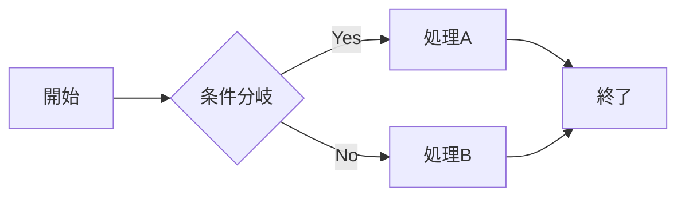
````

**表示例:**


### シーケンス図

````markdown
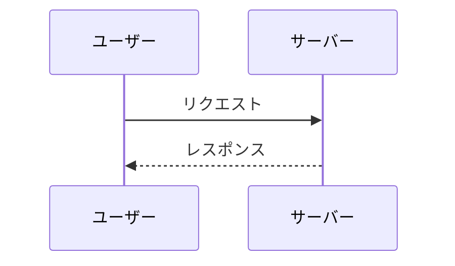
````

**表示例:**


### ガントチャート

````markdown
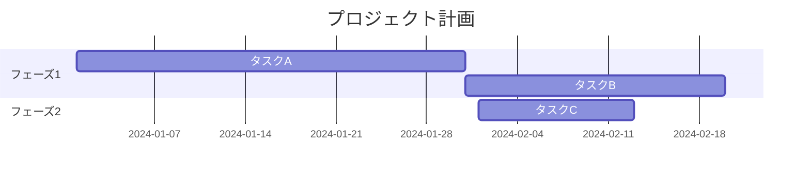
````

### クラス図

````markdown
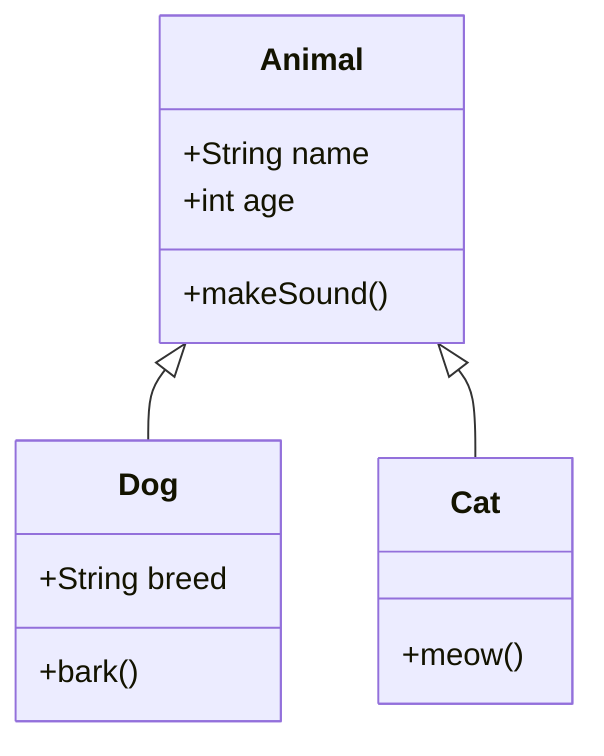
````

**表示例:**


### 状態遷移図

````markdown
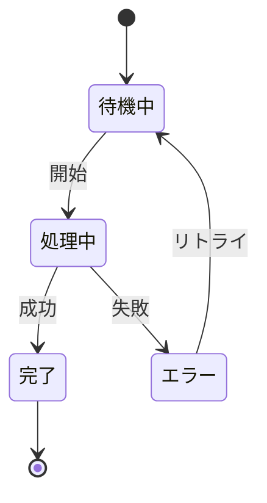
````

**表示例:**


### ER図（エンティティ関係図）

````markdown
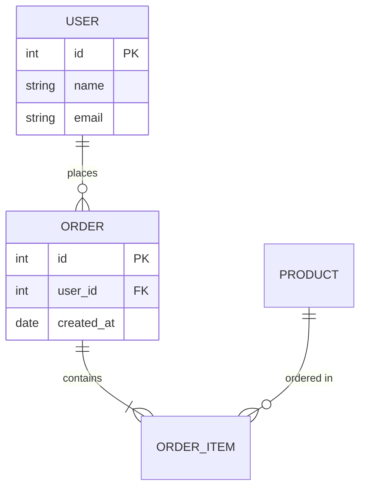
````

**表示例:**


### 円グラフ

````markdown
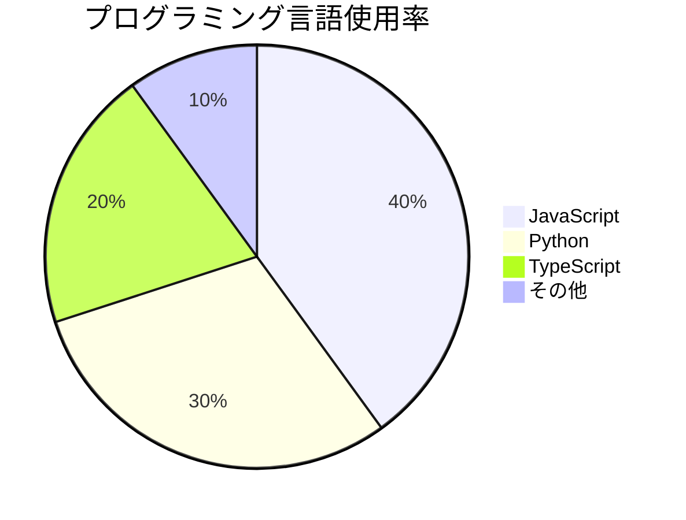
````

**表示例:**


### マインドマップ

````markdown
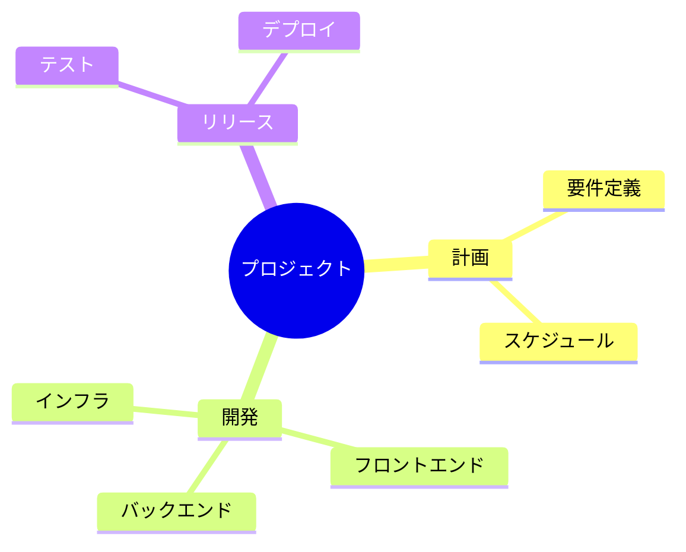
````

**表示例:**


### Gitグラフ

````markdown
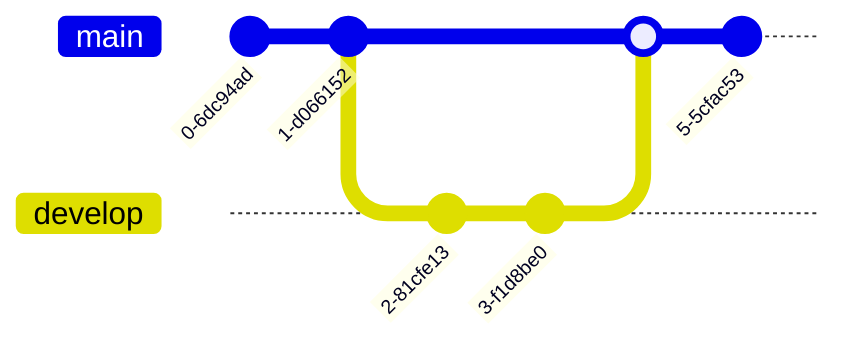
````

**表示例:**

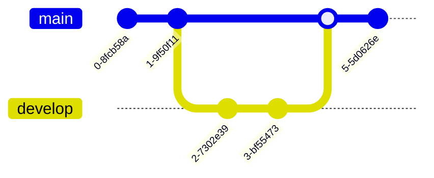

### タイムライン

````markdown
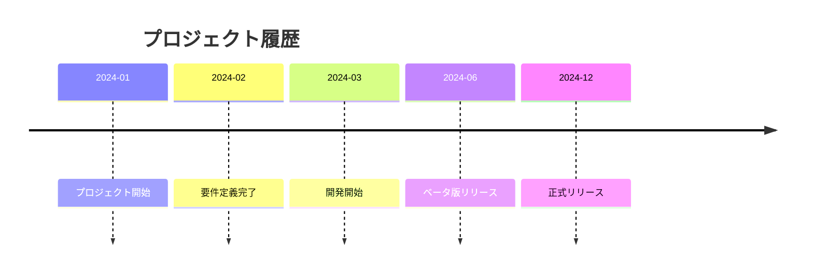
````

**表示例:**


### その他のリソース

詳細は [Mermaid公式ドキュメント](https://mermaid.js.org/) を参照してください。

**Live Editor:** [mermaid.live](https://mermaid.live/edit) でリアルタイムプレビュー可能

---

## 📊 表（テーブル）

```markdown
| 列1 | 列2 | 列3 |
| --- | --- | --- |
| A   | B   | C   |
| D   | E   | F   |
```

**表示例:**

| 列1 | 列2 | 列3 |
| --- | --- | --- |
| A   | B   | C   |
| D   | E   | F   |

**配置指定:**

```markdown
| 左寄せ | 中央 | 右寄せ |
| :----- | :--: | -----: |
| A      |  B   |      C |
```

---

## 💡 引用・補足

### 引用

```markdown
> 引用文
> 複数行にわたる引用
```

**表示例:**

> 引用文
> 複数行にわたる引用

### ネスト引用

```markdown
> 第1レベルの引用
>
> > 第2レベルの引用
```

---

## 📐 数式（KaTeX）

Quartzは数式表示に対応しています。

### インライン数式

```markdown
$E = mc^2$
```

**表示例:** $E = mc^2$

### ブロック数式

```markdown
$$
\int_{a}^{b} f(x) dx
$$
```

**表示例:**

$$
\int_{a}^{b} f(x) dx
$$

---

## 📌 脚注

```markdown
本文中に脚注を付ける[^1]

[^1]: 脚注の内容
```

**インライン脚注:**

```markdown
本文^[インラインの脚注内容]
```

---

## 🎨 その他の記法

### 水平線

```markdown
---
```

5つ以上のハイフンで水平線を作成。

---

### HTMLコメント

```markdown
<!-- これはコメントです（表示されません） -->
```

---

## 🚀 Quartz固有の機能

### Callout（アラート）

Obsidian/Quartz対応のCallout記法:

```markdown
> [!note]
> 通常のノート

> [!warning]
> 警告メッセージ

> [!info]
> 情報メッセージ

> [!tip]
> ヒント・Tips

> [!danger]
> 危険・エラー
```

**表示例:**

> [!note]
> これは通常のノートです。

> [!warning]
> これは警告メッセージです。

### 折りたたみ（Details）

```markdown
<details>
<summary>クリックして展開</summary>

折りたたまれた内容

</details>
```

---

## ✅ ベストプラクティス

### 見出しの使い方

- H1（`#`）は使わない（Frontmatterの`title`が自動表示される）
- H2（`##`）をメインセクションに
- H3（`###`）をサブセクションに
- H4（`####`）以降は使用を控える

### リンク

- サイト内リンクは Obsidian形式 `[[]]` を推奨
- 外部リンクは通常のMarkdown形式 `[]()`

### コードブロック

- 必ず言語を指定してシンタックスハイライトを有効化
- ファイル名を付けると可読性が向上

### 画像

- 代替テキストを必ず記述（アクセシビリティ）
- 画像は `/public/images/` に配置
- 大きな画像はサイズ指定で調整

---

## 📚 参考リンク

- [Quartz Documentation](https://quartz.jzhao.xyz/)
- [Obsidian Formatting Syntax](https://help.obsidian.md/Editing+and+formatting/Basic+formatting+syntax)
- [Markdown Guide](https://www.markdownguide.org/)
- [Zenn Markdown Guide](https://zenn.dev/zenn/articles/markdown-guide)

---

**関連ドキュメント:**

- [[CONTRIBUTING|コンテンツ作成ガイドライン]] - Frontmatterやタイトル重複などのサイト固有ルール
- [[Tech/setup-guide|Scrap Notes 構築手順]] - サイトのセットアップ方法
