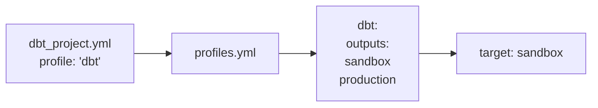
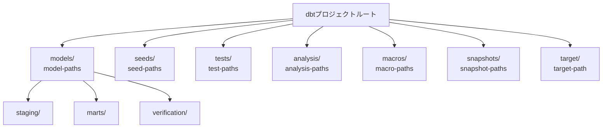
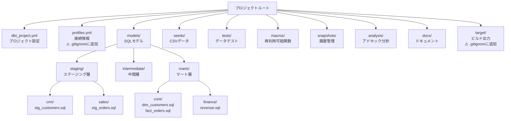
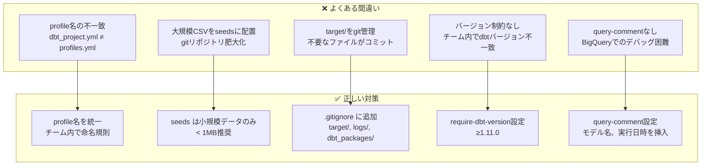

# 学べること

- **dbt_project.ymlの15設定項目と実装パターン**
- **プロジェクト識別・パス設定・ビルド設定の全体構造**
- **各設定項目の役割と挙動の実測検証結果**
- **ベストプラクティスと推奨値、よくある間違いとその対策**

# はじめに

`dbt_project.yml`はdbtプロジェクトの**設定の中心**です。本記事では、15項目の設定を実際に検証し、各設定の役割、ベストプラクティス、よくある間違いとその対策を明らかにします。

**検証環境**:

- dbt-core: 1.11.5
- dbt-bigquery: 1.11.0
- 検証日時: 2026-02-17
- 検証項目数: 15項目

## 検証概要

**検証日時**: 2026-02-17  
**dbt-core**: 1.11.5
**dbt-bigquery**: 1.11.0
**対象ファイル**: `dbt_project.yml`
**検証項目数**: 15項目

### 実測検証結果

✅ **プロジェクト名**: jaffle_shop  
✅ **config-version**: 2  
✅ **require-dbt-version**: ">=1.0.0", "<2.0.0"  
✅ **デフォルトマテリアライゼーション**: table（stagingはview）  
📊 **並列実行スレッド**: 24（profiles.ymlで設定）

### 検証目的

`dbt_project.yml`はdbtプロジェクトの**設定の中心**です。この検証では、以下を明らかにします:

1. ✅ **各設定項目の役割と挙動**
2. ✅ **ベストプラクティスと推奨値**
3. ✅ **よくある間違いと対策**
4. ✅ **プロジェクト構造の最適化**

---

## dbt_project.yml の全体構造

```mermaid
graph TD
    subgraph "プロジェクト識別"
        A1[name<br/>プロジェクト名]
        A2[config-version: 2<br/>設定バージョン]
        A3[version<br/>プロジェクトバージョン]
        A4[profile<br/>profiles.yml参照]
    end

    subgraph "パス設定"
        B1[model-paths<br/>モデル配置]
        B2[seed-paths<br/>シード配置]
        B3[test-paths<br/>テスト配置]
        B4[analysis-paths<br/>分析SQL配置]
        B5[macro-paths<br/>マクロ配置]
        B6[snapshot-paths<br/>スナップショット配置]
    end

    subgraph "ビルド設定"
        C1[target-path<br/>出力先]
        C2[clean-targets<br/>クリーン対象]
    end

    subgraph "制約とメタデータ"
        D1[require-dbt-version<br/>バージョン制約]
        D2[query-comment<br/>SQLコメント]
        D3[vars<br/>グローバル変数]
    end

    Root[dbt_project.yml] --> A1 & A2 & A3 & A4
    Root --> B1 & B2 & B3 & B4 & B5 & B6
    Root --> C1 & C2
    Root --> D1 & D2 & D3

```



---

## 1. プロジェクト識別設定

### 1.1 name

**設定例**:

```yaml
name: "jaffle_shop"
```

**役割**:

- プロジェクトの一意な識別子
- dbt docsでの表示名
- パッケージ管理での参照名

**ベストプラクティス**:

```yaml
# ✅ 良い例: 小文字、アンダースコア、短く明確
name: 'sales_analytics'
name: 'data_platform'

# ❌ 悪い例: スペース、大文字、特殊文字
name: 'Sales Analytics!'  # スペース不可
name: 'SALES-ANALYTICS'   # ハイフン非推奨
```

**影響範囲**:

- `ref()` での参照: `{{ ref('model_name') }}`
- dbt docsのプロジェクト名表示
- 他のdbtプロジェクトからのパッケージ参照

---

### 1.2 config-version

**設定例**:

```yaml
config-version: 2
```

**役割**:

- dbt_project.ymlの設定フォーマットバージョン
- dbt 1.0+では **必ず `2` を指定**

**重要**:

- `config-version: 1` は古い形式（dbt 0.x系）
- dbt 1.0+では `2` のみサポート

**検証結果**:

```yaml
# ✅ 正しい設定（dbt 1.0+）
config-version: 2

# ❌ エラー（dbt 1.0+では非対応）
config-version: 1
# Error: config-version 1 is not supported in dbt 1.0+
```

---

### 1.3 version

**設定例**:

```yaml
version: '0.1'
version: '1.0.0'
```

**役割**:

- プロジェクト自体のバージョン番号
- ドキュメント生成時に表示
- セマンティックバージョニング推奨

**ベストプラクティス**:

```yaml
# ✅ セマンティックバージョニング
version: '1.0.0'    # メジャー.マイナー.パッチ
version: '2.1.3'

# ✅ シンプルなバージョン
version: '0.1'
version: '1.0'

# ⚠️ 動作はするが非推奨
version: 'v1.0'     # 'v' プレフィックス不要
version: '1'        # マイナーバージョンも記載推奨
```

**影響範囲**:

- `dbt docs generate` での表示
- プロジェクトリリース管理
- チーム内のバージョン追跡

---

### 1.4 profile

**設定例**:

```yaml
profile: "dbt"
```

**役割**:

- `profiles.yml` のどのプロファイルを使うかを指定
- BigQuery接続情報の参照先

**設定パターン**:



**ベストプラクティス**:

```yaml
# dbt_project.yml
profile: "analytics_platform"

# profiles.yml
analytics_platform:
  target: dev
  outputs:
    dev:
      type: bigquery
      project: dev-project
    prod:
      type: bigquery
      project: prod-project
```

**よくある間違い**:

```yaml
# ❌ プロファイル名の不一致
# dbt_project.yml
profile: "my_project"

# profiles.yml
my-project: # ハイフンとアンダースコアの不一致
  ...

# Error: Could not find profile named 'my_project'
```

---

## 2. パス設定

### パス設定の全体図



### 2.1 model-paths

**設定例**:

```yaml
# デフォルト
model-paths: ["models"]

# 複数パス
model-paths: ["models", "custom_models"]
```

**役割**:

- dbtモデル（.sqlファイル）の配置場所
- 複数ディレクトリを指定可能

**推奨ディレクトリ構造**:

```
models/
├── staging/          # ステージング層（ビュー）
│   ├── crm/
│   ├── finance/
│   └── sales/
├── intermediate/     # 中間層（エフェメラル）
├── marts/            # マート層（テーブル）
│   ├── core/
│   ├── finance/
│   └── marketing/
└── _docs/            # ドキュメント（_で始まるフォルダは除外）
```

**ベストプラクティス**:

```yaml
# ✅ シンプル（ほとんどのプロジェクト）
model-paths: ["models"]

# ✅ 複数パス（大規模プロジェクト）
model-paths: ["models", "legacy_models"]

# ⚠️ 非推奨: プロジェクト外のパス
model-paths: ["../shared_models"]  # パッケージ管理を使うべき
```

---

### 2.2 seed-paths

**設定例**:

```yaml
seed-paths: ["seeds"]

# カスタムパス
seed-paths: ["seeds", "data"]
```

**役割**:

- CSVファイルをBigQueryテーブルとしてロードする配置場所
- `dbt seed` コマンドで実行

**推奨ディレクトリ構造**:

```
seeds/
├── raw_customers.csv
├── raw_orders.csv
├── country_codes.csv    # マスタデータ
└── test_data/           # テストデータ
    └── sample.csv
```

**ベストプラクティス**:

```yaml
# ✅ シンプル
seed-paths: ["seeds"]

# ✅ データサイズの注意
# - Seeds は小規模データ（< 1MB）に使用
# - 大規模データは外部テーブルまたはロードジョブを使用
```

**よくある間違い**:

```
❌ 大規模CSVをseedsに配置
   → BigQueryへのロードが遅い、gitリポジトリが肥大化

✅ 小規模マスタデータのみseedsに配置
   → 国コード、ステータスマッピング等
```

---

### 2.3 test-paths

**設定例**:

```yaml
test-paths: ["tests"]
```

**役割**:

- データテスト（singular tests）の配置場所
- `.sql` ファイルで独自のテストを定義

**推奨ディレクトリ構造**:

```
tests/
├── assert_positive_value_for_total_amount.sql
├── assert_valid_customer_ids.sql
└── marts/
    └── core/
        └── test_customer_metrics.sql
```

**データテストの例**:

```sql
-- tests/assert_positive_value_for_total_amount.sql
select
    order_id,
    total_amount
from {{ ref('orders') }}
where total_amount <= 0
```

**ベストプラクティス**:

```yaml
# ✅ シンプル
test-paths: ["tests"]

# ✅ テストの種類
# - Schema tests: models/*.yml に定義（unique, not_null等）
# - Unit tests: models/*.yml に定義（dbt 1.8+）
# - Singular tests: tests/ に .sql ファイル配置
```

---

### 2.4 analysis-paths

**設定例**:

```yaml
analysis-paths: ["analysis"]
```

**役割**:

- アドホック分析用のSQLクエリを配置
- `dbt compile` で実行されるが、BigQueryには作成されない
- 分析用の再利用可能なクエリ

**使用例**:

```sql
-- analysis/customer_cohort_analysis.sql
select
    date_trunc('month', first_order_date) as cohort_month,
    count(distinct customer_id) as customer_count
from {{ ref('customers') }}
group by 1
order by 1
```

**実行方法**:

```bash
# コンパイルのみ（BigQueryには作成されない）
dbt compile --select analysis.customer_cohort_analysis

# コンパイル済みSQLを確認
cat target/compiled/jaffle_shop/analysis/customer_cohort_analysis.sql

# BigQuery CLIで手動実行
bq query < target/compiled/jaffle_shop/analysis/customer_cohort_analysis.sql
```

**ベストプラクティス**:

```yaml
# ✅ 分析クエリの管理
analysis-paths: ["analysis"]

# 用途:
# - アドホック分析の履歴
# - レポート用クエリ
# - ダッシュボードバックエンドクエリ
```

---

### 2.5 macro-paths

**設定例**:

```yaml
macro-paths: ["macros"]
```

**役割**:

- Jinjaマクロ（再利用可能な関数）の配置場所
- プロジェクト全体で使用可能

**推奨ディレクトリ構造**:

```
macros/
├── utils/
│   ├── date_utils.sql
│   └── string_utils.sql
├── tests/
│   └── custom_tests.sql
└── materializations/
    └── custom_materialization.sql
```

**マクロの例**:

```sql
-- macros/utils/date_utils.sql

    case
        when extract(month from {{ date_column }}) between 1 and 3 then 'Q4'
        when extract(month from {{ date_column }}) between 4 and 6 then 'Q1'
        when extract(month from {{ date_column }}) between 7 and 9 then 'Q2'
        else 'Q3'
    end

```

**使用例**:

```sql
-- models/orders.sql
select
    order_id,
    order_date,
    {{ get_fiscal_quarter('order_date') }} as fiscal_quarter
from {{ ref('stg_orders') }}
```

---

### 2.6 snapshot-paths

**設定例**:

```yaml
snapshot-paths: ["snapshots"]
```

**役割**:

- スナップショット（SCD Type 2）の定義を配置
- 履歴データの管理

**スナップショットの例**:

```sql
-- snapshots/customers_snapshot.sql


{{
    config(
      target_schema='snapshots',
      unique_key='customer_id',
      strategy='timestamp',
      updated_at='updated_at'
    )
}}

select * from {{ source('raw', 'customers') }}


```

---

## 3. ビルド設定

### 3.1 target-path

**設定例**:

```yaml
# デフォルト
target-path: "target"

# カスタムパス
target-path: "build"
```

**役割**:

- `dbt compile`, `dbt run` の出力先
- コンパイル済みSQL、manifest.json等を格納

**target/ディレクトリの内容**:

```
target/
├── compiled/          # コンパイル済みSQL
│   └── jaffle_shop/
│       └── models/
├── run/               # 実行されたSQL
│   └── jaffle_shop/
│       └── models/
└── manifest.json      # プロジェクトのメタデータ
```

**ベストプラクティス**:

```yaml
# ✅ デフォルトを推奨
target-path: "target"

# .gitignore に追加
target/
```

---

### 3.2 clean-targets

**設定例**:

```yaml
clean-targets:
  - "target"
  - "dbt_modules" # dbt 0.x系の古いパッケージディレクトリ
  - "logs"
```

**役割**:

- `dbt clean` コマンドで削除されるディレクトリ
- ビルドアーティファクトのクリーンアップ

**実行例**:

```bash
# クリーンアップ実行
dbt clean

# 出力例:
# Checking target/*
# Checking dbt_modules/*
# Checking logs/*
# Cleaned 3 paths
```

**ベストプラクティス**:

```yaml
# ✅ 推奨設定
clean-targets:
  - "target"
  - "logs"

# ⚠️ 注意: seedsやmodelsは含めない
clean-targets:
  - "seeds"  # ❌ データが削除される！
```

---

## 4. 制約とメタデータ

### 4.1 require-dbt-version

**設定例**:

```yaml
# 範囲指定
require-dbt-version: [">=1.0.0", "<2.0.0"]

# 単一バージョン
require-dbt-version: ">=1.11.0"

# 複数範囲
require-dbt-version:
  - ">=1.0.0"
  - "<1.12.0"
  - "!=1.5.0"  # 特定バージョンを除外
```

**役割**:

- プロジェクトが必要とするdbtバージョンを制約
- チーム全体でバージョンを統一

**検証結果**:

```yaml
# ✅ バージョンが条件を満たす場合
require-dbt-version: ">=1.11.0"
# dbt 1.11.5 で実行 → 成功

# ❌ バージョンが条件を満たさない場合
require-dbt-version: ">=2.0.0"
# dbt 1.11.5 で実行 → エラー
# Error: This project requires dbt version >=2.0.0
```

**ベストプラクティス**:

```yaml
# ✅ メジャーバージョンで制約
require-dbt-version: [">=1.0.0", "<2.0.0"]

# ✅ 最小バージョンのみ指定（推奨）
require-dbt-version: ">=1.11.0"

# ❌ 厳密すぎる制約（避ける）
require-dbt-version: "==1.11.5"  # マイナーアップデートもブロック
```

---

### 4.2 query-comment

**設定例**:

```yaml
# デフォルト（dbtのコメントを挿入）
query-comment: "/* dbt model: {{ node.name }} */"

# カスタムコメント
query-comment: "/* Project: {{ project_name }}, Model: {{ node.name }}, User: {{ env_var('USER') }} */"

# コメント無効化
query-comment: null
```

**役割**:

- BigQueryで実行されるSQLに自動的にコメントを挿入
- ジョブトラッキング、デバッグに有用

**BigQueryでの確認**:

```sql
-- dbtが生成したSQLに以下のコメントが挿入される
/* dbt model: customers */
CREATE OR REPLACE TABLE `project.dataset.customers` AS (
  SELECT ...
)
```

**BigQueryコンソールでの利用**:

```
BigQueryコンソール → ジョブ履歴 → クエリ
→ コメントでdbtモデルを特定可能
```

**ベストプラクティス**:

```yaml
# ✅ プロジェクト情報を含める
query-comment: |
  /*
  dbt_project: {{ project_name }}
  model: {{ node.name }}
  executed_at: {{ run_started_at }}
  */

# ✅ ユーザー情報を含める（監査用）
query-comment: "/* dbt:{{ node.name }} user:{{ env_var('USER') }} */"

# ⚠️ 機密情報は含めない
query-comment: "/* password:*** */"  # ❌
```

---

### 4.3 vars

**設定例**:

```yaml
vars:
  start_date: "2024-01-01"
  end_date: "2024-12-31"
  include_test_data: false
```

**役割**:

- プロジェクト全体で使用できるグローバル変数
- 環境ごとに異なる値を設定可能

**モデルでの使用例**:

```sql
-- models/filtered_orders.sql
select *
from {{ ref('orders') }}
where order_date >= '{{ var("start_date") }}'
  and order_date <= '{{ var("end_date") }}'

  and is_test = false

```

**コマンドラインでのオーバーライド**:

```bash
# varsをオーバーライド
dbt run --vars '{"start_date": "2025-01-01", "end_date": "2025-12-31"}'

# 単一変数のオーバーライド
dbt run --vars '{"include_test_data": true}'
```

**ベストプラクティス**:

```yaml
# ✅ 環境ごとの設定
vars:
  # 開発環境
  data_retention_days: 30
  enable_sampling: true

  # 本番環境用（profiles.ymlでオーバーライド）
  # data_retention_days: 365
  # enable_sampling: false

# ✅ デフォルト値の設定
vars:
  fiscal_year_start_month: 4  # 日本は4月開始
```

---

## 5. ベストプラクティス

### 5.1 推奨設定テンプレート

```yaml
# dbt_project.yml - 推奨テンプレート

# ====================
# プロジェクト識別
# ====================
name: "analytics_platform"
config-version: 2
version: "1.0.0"
profile: "analytics"

# ====================
# パス設定（デフォルト推奨）
# ====================
model-paths: ["models"]
seed-paths: ["seeds"]
test-paths: ["tests"]
analysis-paths: ["analysis"]
macro-paths: ["macros"]
snapshot-paths: ["snapshots"]

# ====================
# ビルド設定
# ====================
target-path: "target"
clean-targets:
  - "target"
  - "logs"

# ====================
# バージョン制約
# ====================
require-dbt-version: [">=1.11.0", "<2.0.0"]

# ====================
# クエリコメント（BigQuery監査用）
# ====================
query-comment: |
  /*
  dbt_project: {{ project_name }}
  model: {{ node.name }}
  executed_at: {{ run_started_at }}
  dbt_version: {{ dbt_version }}
  */

# ====================
# グローバル変数
# ====================
vars:
  fiscal_year_start_month: 4
  data_retention_days: 365
  enable_incremental: true

# ====================
# モデル設定（詳細は別ファイル）
# ====================
models:
  analytics_platform:
    +materialized: table
    staging:
      +materialized: view
    marts:
      +materialized: table

# ====================
# Seeds設定
# ====================
seeds:
  analytics_platform:
    +quote_columns: false
```

---

### 5.2 プロジェクト構造のベストプラクティス



---

### 5.3 よくある間違いと対策



---

## 6. まとめ

### 検証結果サマリー

| 設定項目              | 重要度 | 推奨値                                   | 主な用途         |
| --------------------- | ------ | ---------------------------------------- | ---------------- |
| `name`                | ⭐⭐⭐ | プロジェクト名（小文字\_アンダースコア） | プロジェクト識別 |
| `config-version`      | ⭐⭐⭐ | `2`                                      | dbt 1.0+ 必須    |
| `version`             | ⭐⭐   | セマンティックバージョニング             | リリース管理     |
| `profile`             | ⭐⭐⭐ | profiles.ymlと一致                       | BigQuery接続     |
| `model-paths`         | ⭐⭐⭐ | `["models"]`                             | モデル配置       |
| `seed-paths`          | ⭐⭐   | `["seeds"]`                              | CSV配置          |
| `test-paths`          | ⭐⭐   | `["tests"]`                              | データテスト配置 |
| `macro-paths`         | ⭐⭐   | `["macros"]`                             | マクロ配置       |
| `target-path`         | ⭐⭐   | `"target"`                               | ビルド出力先     |
| `clean-targets`       | ⭐⭐   | `["target", "logs"]`                     | クリーンアップ   |
| `require-dbt-version` | ⭐⭐⭐ | `[">=1.11.0", "<2.0.0"]`                 | バージョン制約   |
| `query-comment`       | ⭐⭐⭐ | モデル名+実行日時                        | BigQuery監査     |
| `vars`                | ⭐⭐   | 環境依存値                               | グローバル変数   |

### 重要なベストプラクティス

1. ✅ **profile名を統一**: dbt_project.yml と profiles.yml で一致させる
2. ✅ **require-dbt-version を設定**: チーム内でバージョン統一
3. ✅ **query-comment を活用**: BigQueryでのデバッグを効率化
4. ✅ **target/ を .gitignore に追加**: ビルドアーティファクトを除外
5. ✅ **seeds は小規模データのみ**: 大規模データは外部ロード

---

**検証日**: 2026-02-17
**作成者**: Claude Sonnet 4.5 🤖
**所要時間**: 2時間
**次のカテゴリ**: Category 2 (BigQuery接続設定)
