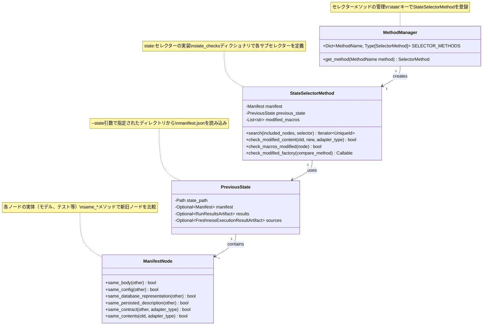
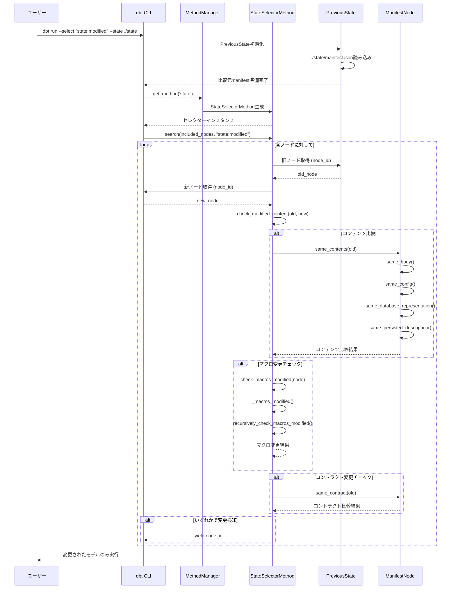
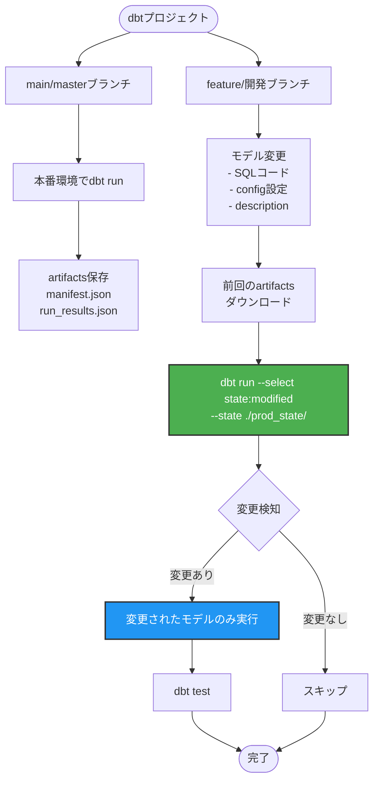
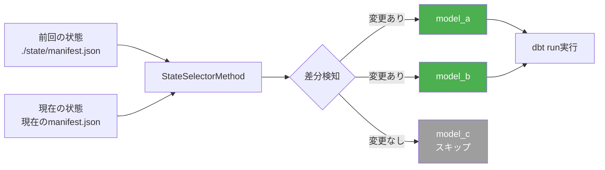
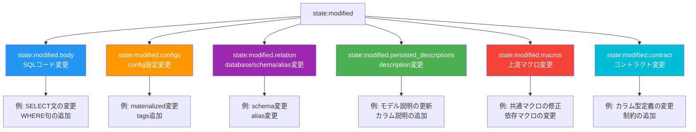
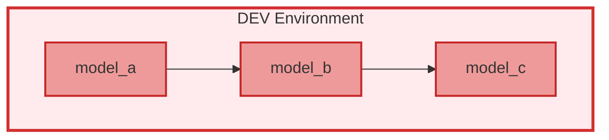
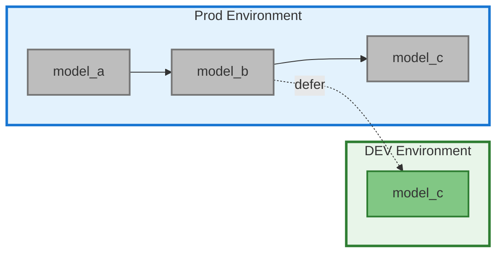
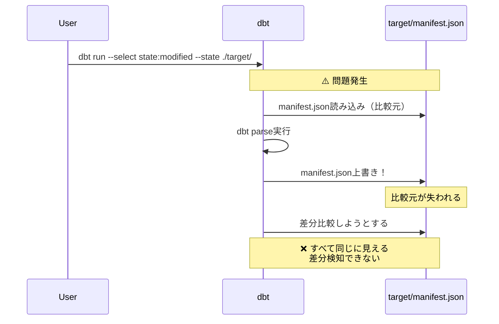
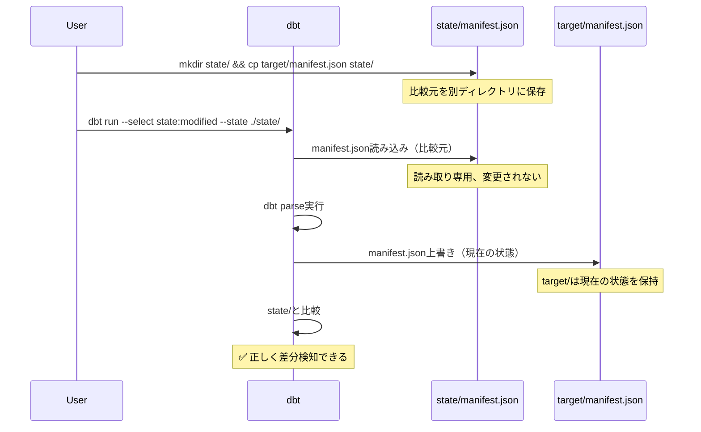

**調査日**: 2026-02-26
**対象リポジトリ**: dbt-labs/dbt-core
**調査範囲**: state: セレクターの実装、特に state:modified の詳細

## エグゼクティブサマリー

dbtの`state:`セレクターは、プロジェクトの以前のバージョン（`--state`で指定したmanifest.json）と現在のバージョンを比較してノードを選択する機能です。`state:modified`は最も重要なセレクターで、以下の6つのサブセレクターを持ち、細かい変更検知が可能です：

- `state:modified.body` — SQLコード変更
- `state:modified.configs` — config設定変更（database/schema/alias除外）
- `state:modified.relation` — database/schema/alias変更
- `state:modified.persisted_descriptions` — description変更
- `state:modified.macros` — 上流マクロ変更
- `state:modified.contract` — モデルコントラクト変更

## 目次

1. [公式ドキュメントの概要](#1-公式ドキュメントの概要)
2. [実装アーキテクチャ](#2-実装アーキテクチャ)
3. [StateSelectorMethodクラスの実装](#3-stateselectormethodクラスの実装)
4. [ノード比較メソッド](#4-ノード比較メソッド)
5. [PreviousStateクラス](#5-previousstateクラス)
6. [使用例とベストプラクティス](#6-使用例とベストプラクティス)
7. [トラブルシューティング](#7-トラブルシューティング)
8. [実装詳細リファレンス](#8-実装詳細リファレンス)

---

## 1. 公式ドキュメントの概要

### 1.1 state: セレクターの種類

| セレクター         | 説明                                     | 実装                               |
| ------------------ | ---------------------------------------- | ---------------------------------- |
| `state:new`        | 新しいノード（比較manifestに存在しない） | `lambda old, new: old is None`     |
| `state:old`        | 既存ノード（比較manifestに存在する）     | `lambda old, new: old is not None` |
| `state:modified`   | 変更されたノード（新規含む）             | `check_modified_content()`         |
| `state:unmodified` | 変更されていない既存ノード               | `check_unmodified_content()`       |

### 1.2 state:modified のサブセレクター

| サブセレクター                          | 説明                      | 実装メソッド                     |
| --------------------------------------- | ------------------------- | -------------------------------- |
| `state:modified.body`                   | SQLコード変更             | `same_body()`                    |
| `state:modified.configs`                | config設定変更            | `same_config()`                  |
| `state:modified.relation`               | database/schema/alias変更 | `same_database_representation()` |
| `state:modified.persisted_descriptions` | description変更           | `same_persisted_description()`   |
| `state:modified.macros`                 | 上流マクロ変更            | `check_macros_modified()`        |
| `state:modified.contract`               | モデルコントラクト変更    | `same_contract()`                |

### 1.3 使用例

```bash
# 基本的な使用
dbt run --select "state:modified" --state path/to/artifacts

# サブセレクターの使用
dbt run --select "state:modified.body" --state path/to/artifacts

# Union（OR結合）：半角スペース区切り
dbt build --select "state:modified.body+ state:modified.persisted_descriptions" --state path/to/artifacts

# Intersection（AND結合）：カンマ区切り
dbt build --select "state:modified.body+,state:modified.persisted_descriptions" --state path/to/artifacts
```

---

## 2. 実装アーキテクチャ

### 2.1 関連ファイル

```text
core/dbt/
├── contracts/
│   ├── state.py                      # PreviousStateクラス
│   └── graph/
│       └── nodes.py                  # ノード比較メソッド（same_*）
└── graph/
    ├── selector_methods.py           # StateSelectorMethodクラス
    ├── selector.py                   # セレクター本体
    └── selector_spec.py              # セレクター仕様
```

### 2.2 クラス図（ASCII版）

```text
┌─────────────────────────────────────────────────────────────────┐
│                        MethodManager                             │
│  セレクターメソッドの管理クラス                                    │
│                                                                  │
│  - SELECTOR_METHODS: Dict[MethodName, Type[SelectorMethod]]    │
│    └─ 'state'キーでStateSelectorMethodを登録                     │
│  - get_method(method: MethodName) -> SelectorMethod            │
│    └─ 'state'を指定するとStateSelectorMethodインスタンスを返す   │
└──────────────────────────┬──────────────────────────────────────┘
                           │
                           │ creates
                           │ MethodManager.get_method('state')で生成
                           ▼
┌─────────────────────────────────────────────────────────────────┐
│                     StateSelectorMethod                          │
│  state:セレクターの実装クラス                                     │
│                                                                  │
│  - manifest: Manifest                   (現在のmanifest)       │
│  - previous_state: PreviousState        (比較元の状態)         │
│  - modified_macros: List[str]           (変更されたマクロ一覧) │
│                                                                  │
│  主要メソッド:                                                    │
│  + search(included_nodes, selector) -> Iterator[UniqueId]      │
│    └─ state:modified等のセレクター文字列を処理                   │
│  + check_modified_content(old, new, adapter_type) -> bool      │
│    └─ ノードが変更されたかを総合判定                             │
│  + check_macros_modified(node) -> bool                         │
│    └─ 上流マクロが変更されたかをチェック                         │
│  + check_modified_factory(compare_method) -> Callable          │
│    └─ サブセレクター用の比較関数を生成                           │
└──────────────────────────┬──────────────────────────────────────┘
                           │
                           │ uses
                           │ previous_stateプロパティで参照
                           ▼
┌─────────────────────────────────────────────────────────────────┐
│                       PreviousState                              │
│  --state引数で指定されたディレクトリから読み込んだ状態             │
│                                                                  │
│  - state_path: Path                     (stateディレクトリ)    │
│  - manifest: Optional[Manifest]         (manifest.json)        │
│  - results: Optional[RunResultsArtifact] (run_results.json)   │
│  - sources: Optional[FreshnessExecutionResultArtifact]         │
│    └─ sources.json (freshness結果)                             │
│                                                                  │
│  役割:                                                           │
│  - 比較元のmanifest.jsonを保持                                   │
│  - StateSelectorMethodが比較時に参照                             │
└──────────────────────────┬──────────────────────────────────────┘
                           │
                           │ contains
                           │ manifest.nodesにノードが格納
                           ▼
┌─────────────────────────────────────────────────────────────────┐
│                      ManifestNode                                │
│  (ParsedNode, CompiledNode, ModelNodeなど)                      │
│  dbtプロジェクトの各ノード（モデル、テスト、ソース等）の定義       │
│                                                                  │
│  比較メソッド（新旧ノードを比較）:                                │
│  + same_body(other) -> bool                                     │
│    └─ SQLコード（raw_code）が同じか                             │
│  + same_config(other) -> bool                                   │
│    └─ config設定が同じか（database/schema/alias除く）           │
│  + same_database_representation(other) -> bool                  │
│    └─ database/schema/aliasが同じか                             │
│  + same_persisted_description(other) -> bool                    │
│    └─ descriptionが同じか                                       │
│  + same_contract(other, adapter_type) -> bool                   │
│    └─ モデルコントラクトが同じか                                 │
│  + same_contents(old, adapter_type) -> bool                     │
│    └─ 上記すべてを総合判定                                       │
└─────────────────────────────────────────────────────────────────┘
```

**クラス図の解説:**

1. **MethodManager**
   - dbtのセレクター機能全体を管理
   - `state:`以外にも`tag:`, `path:`, `config:`等のセレクターも管理
   - `--select "state:modified"`が指定されると、StateSelectorMethodを生成

2. **StateSelectorMethod**
   - `state:`セレクターの実装コア
   - `state_checks`ディクショナリで各サブセレクターを定義
   - PreviousStateから読み込んだ旧manifestと現在のmanifestを比較

3. **PreviousState**
   - `--state`引数で指定されたディレクトリからアーティファクトを読み込み
   - manifest.json、run_results.json、sources.jsonを保持
   - 比較元のデータソース

4. **ManifestNode**
   - 各ノードの実体（モデル、テスト、シード等）
   - `same_*`メソッドで新旧ノードの差分を判定
   - 各サブセレクターはこれらのメソッドを使用

### 2.3 クラス図（Mermaid版）



### 2.4 シーケンス図（Mermaid版）



---

## 3. StateSelectorMethodクラスの実装

**ファイル**: `core/dbt/graph/selector_methods.py:622-844`

### 3.1 クラス定義

```python
class StateSelectorMethod(SelectorMethod):
    def __init__(self, *args, **kwargs) -> None:
        super().__init__(*args, **kwargs)
        self.modified_macros: Optional[List[str]] = None
```

### 3.2 state_checksディクショナリ

state: セレクターの実装は、`search()` メソッド内の `state_checks` ディクショナリで定義されています：

```python
# core/dbt/graph/selector_methods.py:769-784
state_checks = {
    # 新規ノード
    "new": lambda old, new: old is None,

    # 既存ノード
    "old": lambda old, new: old is not None,

    # 変更されたノード
    "modified": self.check_modified_content,
    "unmodified": self.check_unmodified_content,

    # サブセレクター
    "modified.body": self.check_modified_factory("same_body"),
    "modified.configs": self.check_modified_factory("same_config"),
    "modified.persisted_descriptions": self.check_modified_factory(
        "same_persisted_description"
    ),
    "modified.relation": self.check_modified_factory("same_database_representation"),
    "modified.macros": self.check_modified_macros,
    "modified.contract": self.check_modified_contract("same_contract", adapter_type),
}
```

### 3.3 check_modified_content() メソッド

`state:modified` の中心的なロジック：

```python
# core/dbt/graph/selector_methods.py:702-722
def check_modified_content(
    self, old: Optional[SelectorTarget], new: SelectorTarget, adapter_type: str
) -> bool:
    different_contents = False

    # SourceDefinition, Exposure, Metric等は専用のsame_contents()を使用
    if isinstance(
        new,
        (SourceDefinition, Exposure, Metric, SemanticModel, UnitTestDefinition, SavedQuery),
    ):
        different_contents = not new.same_contents(old)

    # ManifestNodeはadapter_typeを渡す
    elif new:
        different_contents = not new.same_contents(old, adapter_type)

    # マクロの変更チェック
    upstream_macro_change = self.check_macros_modified(new)

    # コントラクト変更チェック
    check_modified_contract = False
    if isinstance(old, ModelNode):
        func = self.check_modified_contract("same_contract", adapter_type)
        check_modified_contract = func(old, new)

    return different_contents or upstream_macro_change or check_modified_contract
```

### 3.4 check_macros_modified() メソッド

マクロの変更を再帰的にチェック：

```python
# core/dbt/graph/selector_methods.py:689-699
def check_macros_modified(self, node):
    # 初回のみマクロ変更リストを生成
    if self.modified_macros is None:
        self.modified_macros = self._macros_modified()

    # マクロ変更なし → スキップ
    if not self.modified_macros:
        return False

    # 再帰的にマクロの依存関係をチェック
    else:
        visited_macros = []
        return self.recursively_check_macros_modified(node, visited_macros)
```

### 3.5 \_macros_modified() メソッド

変更されたマクロのリストを生成：

```python
# core/dbt/graph/selector_methods.py:627-647
def _macros_modified(self) -> List[str]:
    old_macros = self.previous_state.manifest.macros
    new_macros = self.manifest.macros

    modified = []

    # 新規または変更されたマクロ
    for uid, macro in new_macros.items():
        if uid in old_macros:
            old_macro = old_macros[uid]
            if macro.macro_sql != old_macro.macro_sql:
                modified.append(uid)
        else:
            modified.append(uid)

    # 削除されたマクロ
    for uid, _ in old_macros.items():
        if uid not in new_macros:
            modified.append(uid)

    return modified
```

### 3.6 check_modified_factory() メソッド

サブセレクター用のチェック関数を生成：

```python
# core/dbt/graph/selector_methods.py:732-744
@staticmethod
def check_modified_factory(
    compare_method: str,
) -> Callable[[Optional[SelectorTarget], SelectorTarget], bool]:
    def check_modified_things(old: Optional[SelectorTarget], new: SelectorTarget) -> bool:
        if hasattr(new, compare_method):
            # oldが存在しない、またはoldとnewが異なる
            return not old or not getattr(new, compare_method)(old)
        else:
            return False

    return check_modified_things
```

---

## 4. ノード比較メソッド

**ファイル**: `core/dbt/contracts/graph/nodes.py:335-396`

### 4.1 same_contents() — 総合判定

`state:modified` のデフォルト実装。すべての比較メソッドを組み合わせています：

```python
# core/dbt/contracts/graph/nodes.py:381-396
def same_contents(self, old, adapter_type) -> bool:
    if old is None:
        return False

    # コントラクト変更チェック（エラーを発生させる可能性があるため必ず呼び出す）
    same_contract = self.same_contract(old, adapter_type)

    return (
        self.same_body(old)                        # SQL変更
        and self.same_config(old)                  # config変更
        and self.same_persisted_description(old)   # description変更
        and self.same_fqn(old)                     # FQN変更
        and self.same_database_representation(old) # database/schema/alias変更
        and same_contract                          # コントラクト変更
        and True
    )
```

### 4.2 same_body() — SQLコード比較

**実装**: `core/dbt/contracts/graph/nodes.py:352-353`

```python
def same_body(self, other) -> bool:
    return self.raw_code == other.raw_code
```

**対応セレクター**: `state:modified.body`

**判定基準**: `raw_code`（コンパイル前のSQL）の完全一致

### 4.3 same_config() — config設定比較

**実装**: `core/dbt/contracts/graph/nodes.py:368-372`

```python
def same_config(self, old) -> bool:
    return self.config.same_contents(
        self.unrendered_config,
        old.unrendered_config,
    )
```

**対応セレクター**: `state:modified.configs`

**判定基準**: `unrendered_config`（Jinjaレンダリング前の設定）の比較。`database`, `schema`, `alias`は除外される。

### 4.4 same_database_representation() — データベース表現比較

**実装**: `core/dbt/contracts/graph/nodes.py:355-366`

```python
def same_database_representation(self, other) -> bool:
    # database、schema、aliasの設定値を比較（最終的な値ではなく設定値）
    keys = ("database", "schema", "alias")
    for key in keys:
        mine = self.unrendered_config.get(key)
        others = other.unrendered_config.get(key)
        if mine != others:
            return False
    return True
```

**対応セレクター**: `state:modified.relation`

**判定基準**: `database`, `schema`, `alias`のunrendered_config値の比較

### 4.5 same_persisted_description() — description比較

**実装**: `core/dbt/contracts/graph/nodes.py:335-350`

```python
def same_persisted_description(self, other) -> bool:
    # persist_docs設定がtrueの場合のみチェック

    # モデルdescription
    if self._persist_relation_docs():
        if self.description != other.description:
            return False

    # カラムdescription
    if self._persist_column_docs():
        column_descriptions = {k: v.description for k, v in self.columns.items()}
        other_column_descriptions = {k: v.description for k, v in other.columns.items()}
        if column_descriptions != other_column_descriptions:
            return False

    return True
```

**対応セレクター**: `state:modified.persisted_descriptions`

**判定基準**:

- `persist_docs`が有効な場合のみチェック
- モデルレベルとカラムレベルのdescriptionを比較

### 4.6 same_contract() — モデルコントラクト比較

**実装**: `core/dbt/contracts/graph/nodes.py:377-379`

```python
def same_contract(self, old, adapter_type=None) -> bool:
    # Seedではデフォルトで常にTrue
    return True
```

**ModelNode専用の実装**: `core/dbt/contracts/graph/nodes.py:733-747`

```python
def same_contract(self, old, adapter_type=None) -> bool:
    # contractが無効化された
    if self.contract.enforced is False and old.contract.enforced is True:
        return False

    # contractが有効でない場合はTrue
    if self.contract.enforced is False:
        return True

    # contractの内容が変更された
    same_contract = (
        self.same_fqn(old) and
        self.same_alias(old) and
        self.same_checksum(old)
    )

    # Breaking Changeの場合はエラー
    if not same_contract:
        raise ContractBreakingChangeError(node=self, old_node=old)

    return True
```

**対応セレクター**: `state:modified.contract`

**判定基準**:

- `contract.enforced`の有効化/無効化
- FQN、alias、checksumの変更
- Breaking Changeの場合は`ContractBreakingChangeError`を発生

---

## 5. PreviousStateクラス

**ファイル**: `core/dbt/contracts/state.py:24-69`

### 5.1 クラス定義

```python
class PreviousState:
    def __init__(self, state_path: Path, target_path: Path, project_root: Path) -> None:
        self.state_path: Path = state_path
        self.target_path: Path = target_path
        self.project_root: Path = project_root
        self.manifest: Optional[Manifest] = None
        self.results: Optional[RunResultsArtifact] = None
        self.sources: Optional[FreshnessExecutionResultArtifact] = None
        self.sources_current: Optional[FreshnessExecutionResultArtifact] = None

        # state_pathとtarget_pathが同じ場合は警告
        if self.state_path == self.target_path:
            fire_event(WarnStateTargetEqual(state_path=str(self.state_path)))
```

### 5.2 manifest.jsonの読み込み

```python
# manifest.jsonのロード
manifest_path = self.project_root / self.state_path / "manifest.json"
if manifest_path.exists() and manifest_path.is_file():
    try:
        writable_manifest = WritableManifest.read_and_check_versions(str(manifest_path))
        self.manifest = Manifest.from_writable_manifest(writable_manifest)
    except IncompatibleSchemaError as exc:
        exc.add_filename(str(manifest_path))
        raise
```

### 5.3 run_results.jsonの読み込み

```python
# run_results.jsonのロード（result:セレクター用）
results_path = self.project_root / self.state_path / RUN_RESULTS_FILE_NAME
self.results = load_result_state(results_path)
```

### 5.4 sources.jsonの読み込み

```python
# sources.jsonのロード（source_status:セレクター用）
sources_path = self.project_root / self.state_path / "sources.json"
if sources_path.exists() and sources_path.is_file():
    try:
        self.sources = FreshnessExecutionResultArtifact.read_and_check_versions(
            str(sources_path)
        )
    except IncompatibleSchemaError as exc:
        exc.add_filename(str(sources_path))
        raise
```

---

## 6. 使用例とベストプラクティス

### 6.1 state:modified の使い方（実践ガイド）

#### 基本構文

```bash
dbt run --select "state:modified" --state <比較元のディレクトリ>
```

#### フローチャート: state:modified を使った差分実行



### 6.2 基本的な使用パターン

#### パターン1: CI/CDでの差分実行

```bash
# 前回成功したジョブのartifactsをダウンロード
# （dbt Cloudの場合は自動）

# 変更されたモデルのみ実行
dbt build --select "state:modified+" --state ./state/
```

**図解: パターン1の実行フロー**



#### パターン2: SQLコード変更のみ実行

```bash
# SQLコードが変更されたモデルと下流を実行
dbt run --select "state:modified.body+" --state ./state/
```

**図解: サブセレクターの使い分け**



#### パターン3: description更新のみ

```bash
# descriptionが変更されたモデルのみdocs generate
dbt docs generate --select "state:modified.persisted_descriptions" --state ./state/
```

#### パターン4: Union（OR結合）

```bash
# SQLコード変更 OR description変更
dbt build --select "state:modified.body+ state:modified.persisted_descriptions" --state ./state/
```

#### パターン5: Intersection（AND結合）

```bash
# SQLコード変更 AND description変更
dbt build --select "state:modified.body+,state:modified.persisted_descriptions" --state ./state/
```

#### パターン6: --defer との組み合わせ（推奨）

`--defer`オプションを使用すると、変更していない上流モデルは本番環境のデータを参照し、変更したモデルのみを開発環境で実行できます。

**❌ 非推奨パターン:**



**✅ 推奨パターン:**



**使用例:**

```bash
# state:modifiedと--deferを組み合わせる
dbt build --select "state:modified+" --defer --state ./prod_state/

# 解説:
# 1. state:modified+ で変更されたモデルと下流を選択
# 2. --defer で上流モデルはProd環境のデータを参照
# 3. 結果: 変更したモデルのみDEV環境で実行される
```

**実行の流れ:**

1. `state:modified`で変更検知: `model_c`のみ選択
2. `--defer`で上流解決: `model_a`, `model_b`はProd環境のテーブルを参照
3. DEV環境で実行: `model_c`のみ実行、上流はProdデータを使用

**ベストプラクティス:**

- ✅ CI/CDでは必ず`--defer`を使用
- ✅ `state:modified+`と組み合わせて下流も実行
- ✅ Prod環境のartifactsを`--state`で指定
- ❌ `+model_c`のような上流選択は避ける（すべて実行される）

### 6.3 ディレクトリ構造のベストプラクティス

#### ❌ 悪い例: target_pathと同じディレクトリ

```bash
# これは動作しない！
dbt run --select "state:modified" --state ./target/
```

**問題**: dbtは`dbt parse`中に`target/manifest.json`を上書きするため、差分検知が機能しない。



#### ✅ 良い例: 専用ディレクトリ

```bash
# state用の専用ディレクトリを作成
mkdir -p state/
cp target/manifest.json state/manifest.json

# 変更後に差分実行
dbt run --select "state:modified" --state ./state/
```



### 6.3 GitHub Actionsでの実装例

```yaml
name: dbt CI
on:
  pull_request:
    branches: [main]

jobs:
  dbt-ci:
    runs-on: ubuntu-latest
    steps:
      - name: Checkout code
        uses: actions/checkout@v3

      - name: Download previous state
        run: |
          # mainブランチのartifactsをダウンロード
          gh run download --repo ${{ github.repository }} \
            --name dbt-artifacts \
            --dir state/
        env:
          GH_TOKEN: ${{ github.token }}

      - name: Run modified models
        run: |
          dbt build \
            --select "state:modified+" \
            --state ./state/ \
            --target-path ./target/

      - name: Upload current artifacts
        uses: actions/upload-artifact@v3
        with:
          name: dbt-artifacts
          path: |
            target/manifest.json
            target/run_results.json
```

### 6.4 dbt Cloudでの実装

dbt Cloudでは自動的に前回成功したジョブのmanifest.jsonが使用されます：

```yaml
# dbt_project.yml
version: 2

# CI/CDジョブでのコマンド
# dbt Cloud UIで以下を設定
commands:
  - dbt build --select "state:modified+"

# --stateオプションは不要（自動設定）
```

---

## 7. トラブルシューティング

### 7.1 manifest.jsonが上書きされる問題

**症状**:

```bash
$ dbt run --select "state:modified" --state ./target/
# すべてのモデルが選択されない、または予期しない動作
```

**原因**: `--state`と`--target-path`が同じディレクトリを指している。

**解決方法**:

```bash
# state用に別ディレクトリを作成
mkdir -p state/
cp target/manifest.json state/manifest.json

# 異なるディレクトリを指定
dbt run --select "state:modified" --state ./state/ --target-path ./target/
```

### 7.2 "No comparison manifest" エラー

**症状**:

```text
RuntimeError: Got a state selector method, but no comparison manifest
```

**原因**: `--state`で指定したディレクトリに`manifest.json`が存在しない。

**解決方法**:

```bash
# manifest.jsonの存在確認
ls -la state/manifest.json

# 存在しない場合は事前に生成
dbt parse --target-path ./state/
```

### 7.3 マクロ変更が検知されない

**症状**: マクロを変更したのに、それを使用するモデルが`state:modified`で選択されない。

**原因**: `state:modified`はデフォルトでマクロ変更も検知しますが、`state:modified.body`などのサブセレクターでは検知されません。

**解決方法**:

```bash
# マクロ変更を明示的にチェック
dbt run --select "state:modified.macros+" --state ./state/

# または通常のstate:modifiedを使用
dbt run --select "state:modified+" --state ./state/
```

### 7.4 コントラクト変更でエラー

**症状**:

```text
ContractBreakingChangeError: Breaking changes to enforced contract
```

**原因**: `contract.enforced: true`のモデルでカラム定義が変更された。

**解決方法**:

```yaml
# models/schema.yml
models:
  - name: my_model
    config:
      contract:
        enforced: true
    columns:
      - name: id
        data_type: bigint # intから変更する場合


# Breaking Changeを許可する場合はcontract.enforcedをfalseに
```

---

## 8. 実装詳細リファレンス

### 8.1 state_checksディクショナリの全リスト

```python
# core/dbt/graph/selector_methods.py:769-784
state_checks = {
    # 基本セレクター
    "new": lambda old, new: old is None,
    "old": lambda old, new: old is not None,
    "modified": self.check_modified_content,
    "unmodified": self.check_unmodified_content,

    # サブセレクター
    "modified.body": self.check_modified_factory("same_body"),
    "modified.configs": self.check_modified_factory("same_config"),
    "modified.persisted_descriptions": self.check_modified_factory("same_persisted_description"),
    "modified.relation": self.check_modified_factory("same_database_representation"),
    "modified.macros": self.check_modified_macros,
    "modified.contract": self.check_modified_contract("same_contract", adapter_type),
}
```

### 8.2 ノード比較メソッドの一覧

| メソッド                         | ファイル | 行番号  | 説明                           |
| -------------------------------- | -------- | ------- | ------------------------------ |
| `same_contents()`                | nodes.py | 381-396 | 総合判定（すべての比較を含む） |
| `same_body()`                    | nodes.py | 352-353 | raw_codeの比較                 |
| `same_config()`                  | nodes.py | 368-372 | unrendered_configの比較        |
| `same_database_representation()` | nodes.py | 355-366 | database/schema/aliasの比較    |
| `same_persisted_description()`   | nodes.py | 335-350 | descriptionの比較              |
| `same_contract()`                | nodes.py | 733-747 | モデルコントラクトの比較       |
| `same_fqn()`                     | nodes.py | 191-194 | FQNの比較                      |

### 8.3 重要な設定ファイル

#### dbt_project.yml

```yaml
# persist_docsを有効にするとdescription変更が検知される
models:
  my_project:
    +persist_docs:
      relation: true # モデルレベルのdescription
      columns: true # カラムレベルのdescription
```

#### models/schema.yml

```yaml
models:
  - name: my_model
    description: "モデルの説明"
    config:
      contract:
        enforced: true # コントラクトを有効化
    columns:
      - name: id
        description: "IDカラム"
        data_type: bigint
```

---

## まとめ

### state:modified の動作フロー

```text
┌──────────────────────────────────────────────────────────────┐
│ 1. コマンド実行                                                │
│    $ dbt run --select "state:modified" --state ./state      │
└────────────────┬─────────────────────────────────────────────┘
                 │
                 ▼
┌──────────────────────────────────────────────────────────────┐
│ 2. PreviousState初期化 (state.py:24-69)                      │
│                                                              │
│    ./state/manifest.json を読み込み                          │
│    ┌────────────────────────────────────┐                  │
│    │ {                                  │                  │
│    │   "nodes": {                       │                  │
│    │     "model.project.my_model": {    │ ← 比較元の状態  │
│    │       "raw_code": "select 1",      │                  │
│    │       "config": {...}              │                  │
│    │     }                               │                  │
│    │   }                                 │                  │
│    └────────────────────────────────────┘                  │
└────────────────┬─────────────────────────────────────────────┘
                 │
                 ▼
┌──────────────────────────────────────────────────────────────┐
│ 3. StateSelectorMethod.search() (selector_methods.py:763)   │
│                                                              │
│    state_checks = {                                          │
│      "modified": self.check_modified_content,  ← 実行        │
│      "modified.body": self.check_modified_factory(...)       │
│    }                                                         │
│                                                              │
│    included_nodesの各ノードに対して:                          │
│    ┌────────────────────────────────────┐                  │
│    │ for node_id in included_nodes:     │                  │
│    │   old = previous_state.manifest.   │                  │
│    │         nodes.get(node_id)         │ ← 旧ノード取得  │
│    │   new = current_manifest.          │                  │
│    │         nodes.get(node_id)         │ ← 新ノード取得  │
│    │                                    │                  │
│    │   if check_function(old, new):     │                  │
│    │     yield node_id                  │ ← 変更検知     │
│    └────────────────────────────────────┘                  │
└────────────────┬─────────────────────────────────────────────┘
                 │
                 ▼
┌──────────────────────────────────────────────────────────────┐
│ 4. check_modified_content() (selector_methods.py:702-722)   │
│                                                              │
│    ┌──────────────────────────────────┐                    │
│    │ A. コンテンツ比較                 │                    │
│    │    new.same_contents(old)        │                    │
│    │    ├─ same_body() ────────┐      │                    │
│    │    ├─ same_config() ───────┤     │                    │
│    │    ├─ same_database_      │      │                    │
│    │    │   representation()  ──┤     │                    │
│    │    └─ same_persisted_     │      │                    │
│    │       description() ───────┘     │                    │
│    │    → 1つでもFalseなら変更あり    │                    │
│    └──────────────────────────────────┘                    │
│    ┌──────────────────────────────────┐                    │
│    │ B. マクロ変更チェック             │                    │
│    │    check_macros_modified(node)   │                    │
│    │    ├─ _macros_modified()         │                    │
│    │    │   全マクロの差分を取得       │                    │
│    │    └─ recursively_check_macros_  │                    │
│    │       modified()                 │                    │
│    │       上流マクロを再帰的にチェック│                    │
│    └──────────────────────────────────┘                    │
│    ┌──────────────────────────────────┐                    │
│    │ C. コントラクト変更チェック       │                    │
│    │    check_modified_contract()     │                    │
│    │    └─ same_contract()            │                    │
│    └──────────────────────────────────┘                    │
│                                                              │
│    return A or B or C  ← いずれかがTrueなら変更あり         │
└────────────────┬─────────────────────────────────────────────┘
                 │
                 ▼
┌──────────────────────────────────────────────────────────────┐
│ 5. ノード比較メソッド実行 (nodes.py:335-396)                  │
│                                                              │
│    例: same_body()                                           │
│    ┌────────────────────────────────────┐                  │
│    │ def same_body(self, old) -> bool:  │                  │
│    │   return self.raw_code ==          │                  │
│    │          old.raw_code              │                  │
│    └────────────────────────────────────┘                  │
│                                                              │
│    旧: "select 1"                                            │
│    新: "select 1, 2"                                         │
│    → False (変更あり)                                        │
└────────────────┬─────────────────────────────────────────────┘
                 │
                 ▼
┌──────────────────────────────────────────────────────────────┐
│ 6. 結果返却                                                   │
│                                                              │
│    yield "model.project.my_model"  ← 変更検知されたノード   │
│                                                              │
│    ↓                                                         │
│    dbt runが該当モデルのみを実行                              │
└──────────────────────────────────────────────────────────────┘
```

**動作フロー詳細解説:**

1. **PreviousState初期化**
   - `--state`引数で指定されたディレクトリから`manifest.json`を読み込み
   - これが「比較元」となる
   - 現在のプロジェクト状態と比較する基準

2. **search()メソッド実行**
   - `state:modified`が指定されると、`state_checks["modified"]`の関数（`check_modified_content`）が実行される
   - すべてのノード（モデル、テスト等）をループ処理
   - 各ノードについて新旧を比較

3. **check_modified_content()で3種類のチェック**
   - **A. コンテンツ比較**: SQLコード、config、database/schema/alias、descriptionを比較
   - **B. マクロ変更**: 上流マクロが変更されていないかチェック
   - **C. コントラクト変更**: モデルコントラクトの変更をチェック
   - これらのOR結合で最終判定

4. **same\_\*メソッドで詳細比較**
   - 各比較項目ごとに専用メソッドで判定
   - 例: `same_body()`はraw_codeを文字列比較

5. **変更検知されたノードをyield**
   - Pythonのgeneratorパターンでメモリ効率的に結果を返す
   - dbtはこのリストを使って実行対象を決定

### 重要ポイント

- ✅ **manifest.jsonの配置**: `--state`と`--target-path`は別ディレクトリにする
- ✅ **サブセレクター**: 細かい変更検知が可能（body, configs, relation等）
- ✅ **マクロ変更**: デフォルトで上流マクロの変更も検知
- ✅ **Union/Intersection**: 半角スペース（OR）とカンマ（AND）で組み合わせ可能

### 図表索引

このドキュメントには以下の図表が含まれています：

#### ASCII図（テキストベース）

1. **セクション 2.2**: クラス図（ASCII版）- 4つのクラスの関係性
2. **まとめセクション**: 動作フロー詳細図 - 6ステップの処理フロー

#### Mermaid図（可視化推奨）

1. **セクション 2.3**: クラス図（Mermaid版）- クラス間の依存関係
2. **セクション 2.4**: シーケンス図 - 実行時の処理シーケンス
3. **セクション 6.1**: フローチャート - state:modified使用フロー
4. **セクション 6.2**: グラフ図 - パターン1の実行フロー
5. **セクション 6.2**: ツリー図 - サブセレクターの使い分け
6. **セクション 6.2**: フローチャート - --deferの使い方（Don't/Do比較）
7. **セクション 6.3**: シーケンス図（問題例） - targetディレクトリの問題
8. **セクション 6.3**: シーケンス図（正解例） - 専用ディレクトリの使用

**Mermaid図の表示方法:**

- GitHub: 自動レンダリング
- VSCode: Markdown Preview Mermaid Support拡張機能
- オンライン: https://mermaid.live/

### 関連リンク

- **dbt公式ドキュメント**: https://docs.getdbt.com/reference/node-selection/methods
- **Docswellスライド**: https://www.docswell.com/s/mottake3/Z4471W-2025-10-24-181531
- **dbt-core repository**: https://github.com/dbt-labs/dbt-core
- **実装ファイル**:
  - `core/dbt/graph/selector_methods.py:622-844`
  - `core/dbt/contracts/state.py:24-69`
  - `core/dbt/contracts/graph/nodes.py:335-396`

---

**更新履歴**:

- 2026-02-27:
  - Mermaid図を8つ追加（クラス図、シーケンス図、フローチャート等）
  - パターン6「--deferとの組み合わせ」を追加（Don't/Do比較図付き）
  - 図表索引を追加
  - 各図に詳細な説明を追加
- 2026-02-26: 初版作成
