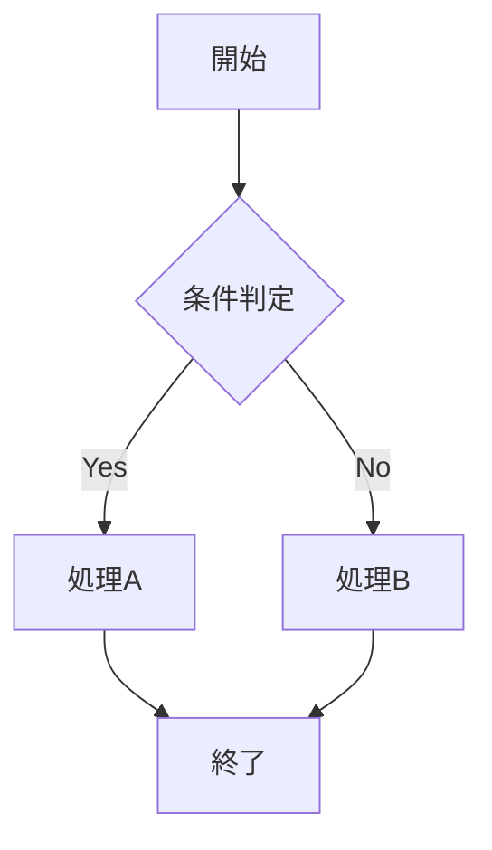
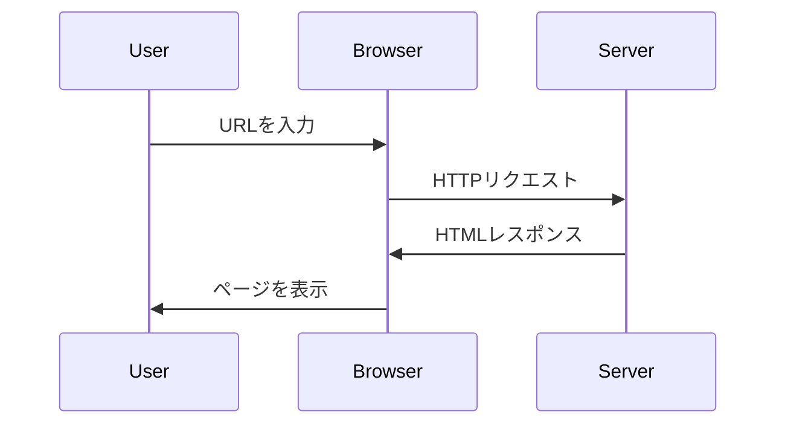
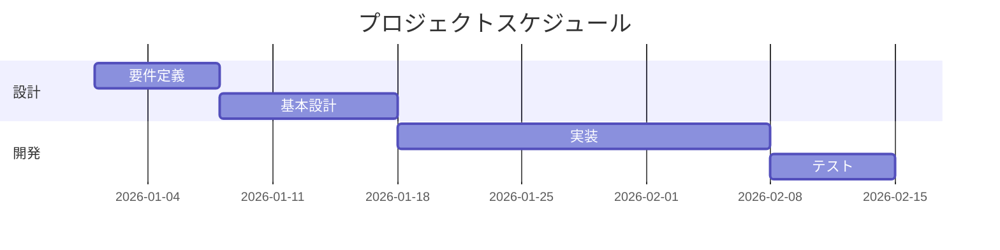
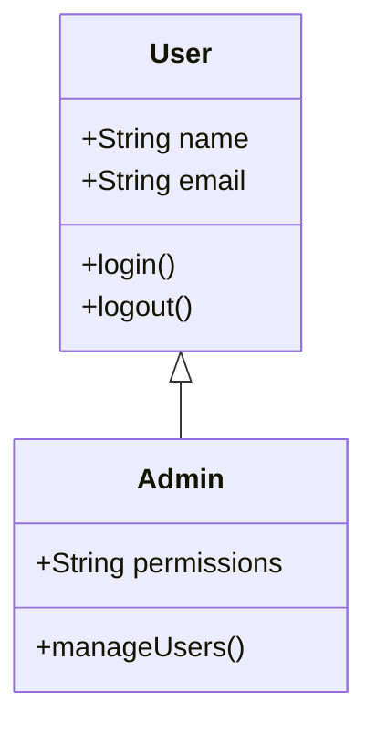

Zennのマークダウンガイドを参考にしたシンタックステストページです。

## コードブロック

### JavaScript

```javascript
const great = () => {
  console.log("Awesome")
}
```

### TypeScript

```typescript
const config: QuartzConfig = {
  configuration: {
    pageTitle: "Scrap Notes",
    locale: "ja-JP",
    baseUrl: "1210yuichi0.github.io",
  },
}
```

### Python

```python
def hello_world():
    print("Hello, World!")
    return True
```

### Bash

```bash
# GitHubでリポジトリ作成
cd ~/.ssh
ssh-keygen -t rsa -C "my_key" -f github_private
```

### YAML

```yaml
name: Deploy Quartz site to GitHub Pages

on:
  push:
    branches:
      - main

permissions:
  contents: read
  pages: write
  id-token: write
```

### JSON

```json
{
  "name": "quartz",
  "version": "4.5.2",
  "description": "Static site generator",
  "main": "index.js"
}
```

### Go

```go
package main

import "fmt"

func main() {
    fmt.Println("Hello, World!")
}
```

### Rust

```rust
fn main() {
    println!("Hello, World!");
}
```

## インラインコード

これは`インラインコード`の例です。

## diff のシンタックスハイライト

```diff
  const foo = bar.baz([1, 2, 3])
- let foo = bar.baz([1, 2, 3]);
+ const foo = bar.baz([1, 2, 3])
```

## テキスト装飾

**太字テキスト**

_イタリック_

~~取り消し線~~

## リンク

[Zenn マークダウンガイド](https://zenn.dev/zenn/articles/markdown-guide)

## リスト

- 項目1
- 項目2
  - ネストされた項目
  - ネストされた項目2
- 項目3

## 番号付きリスト

1. 最初
2. 次
3. 最後

## 引用

> これは引用テキストです。
> 複数行にわたる引用も可能です。

## テーブル

| 言語       | 拡張子 | 用途         |
| ---------- | ------ | ------------ |
| JavaScript | .js    | Web開発      |
| Python     | .py    | データ分析   |
| Go         | .go    | バックエンド |
| Rust       | .rs    | システム     |

## Mermaid 図

### フローチャート



### シーケンス図



### ガントチャート



### クラス図



## YouTube埋め込み

YouTubeのURLを貼り付けるだけで自動的に埋め込まれます。

https://www.youtube.com/watch?v=dQw4w9WgXcQ
